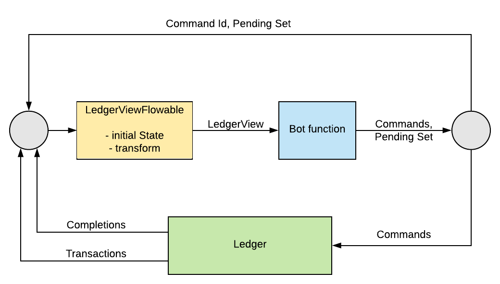

.. Copyright (c) 2019 Digital Asset (Switzerland) GmbH and/or its affiliates. All rights reserved.
.. SPDX-License-Identifier: Apache-2.0

Application architecture guide
#########################################

This document is a guide to building applications that interact with a DA ledger deployment (the 'ledger'). It:

- describes the characteristics of the ledger API, how this affects the way an application is built (the 'application architecture'), and why it is important to understand this when building applications
- describes the resources in the SDK to help with this task
- gives some guidelines to help you build correct, performant, and maintainable applications using all of the supported languages

Categories of application
*************************

Applications that interact with the ledger normally fall into four categories:

.. list-table:: Categories of application
   :header-rows: 1

   * - Category
     - Receives transactions?
     - Sends commands?
     - Example
   * - Source
     - No
     - Yes
     - An injector that reads new contracts from a file and injects them into the system.
   * - Sink
     - Yes
     - No
     - A reader that pipes data from the ledger into an SQL database.
   * - Automation
     - Yes
     - Yes, responding to transactions
     - Automatic trade registration.
   * - Interactive
     - Yes (and displays to user)
     - Yes, based on user input
     - DA’s :doc:`Navigator </tools/navigator/index>`, which lets you see and interact with the ledger

Additionally, applications can be written in two different styles:

-  Event-driven - applications base their actions on individual ledger events only.
-  State-driven - applications base their actions on some model of all contracts active on the ledger.

Event-driven applications
=========================

**Event-driven** applications react to events on the the ledger and generate commands and other outputs on a per-event basis. They do not require access to ledger state beyond the event they are reacting to.

Examples are sink applications that read the ledger and dump events to an external store (e.g. an external (reporting) database)

State-driven applications
=========================

**State-driven** applications build up a real-time view of the ledger state by reading events and recording contract create and archive events. They then generate commands based on a given state, not just single events.

Examples of these are automation and interactive applications that let a user or code react to complex state on the ledger e.g the DA Navigator tool.

Which approach to take
======================

For all except the simplest applications, we generally recommend the state-driven approach. State-driven applications are easier to reason about when determining correctness, so this makes design and implementation easier.

In practice, most applications are actually a mixture of the two styles, with one predominating. It is easier to add some event handling to a state-driven application, so it is better to start with that style.

Structuring an application
**************************

Although applications that communicate with the ledger have many purposes, they generally have some common features, usually related to their style: event-driven or state-driven. This section describes these commonalities, and the major functions of each of these styles.

In particular, all applications need to handle the asynchronous nature of the ledger API. The most important consequence of this is that applications must be multi-threaded. This is because of the asynchronous, separate streams of commands, transaction and completion events.

Although you can choose to do this in several ways, from bare threads (such as a Java Thread) through thread libraries, generally the most effective way of handling this is by adopting a reactive architecture, often using a library such as `RxJava <https://github.com/ReactiveX/RxJava>`__.

All the language bindings support this reactive pattern as a fundamental requirement.

.. _event-driven-applications-1:

Structuring event-driven applications
=====================================

Event-driven applications read a stream of transaction events from the ledger, and convert them to some other representation. This may be a record on a database, some update of a UI, or a differently formatted message that is sent to an upstream process. It may also be a command that transforms the ledger.

The critical thing here is that each event is processed in isolation - the application does not need to keep any application-related state between each event. It is this that differentiates it from a state-driven application.

To do this, the application should:

1. Create a connection to the Transaction Service, and instantiate a stream handler to handle the new event stream. By default, this will read events from the beginning of the ledger. This is usually not what is wanted, as it may replay already processed transactions. In this case, the application can request the stream from the current ledger end. This will, however, cause any events between the last read point and the current ledger end to be missed. If the application must start reading from the point it last stopped, it must record that point and explicitly restart the event stream from there.

2. Optionally, create a connection to the Command Submission Service to send any required commands back to the ledger.

3. Act on the content of events (type, content) to perform any action required by the application e.g writing a database record or generating and submitting a command.

.. _state-driven-applications-1:

Structuring state-driven applications
=====================================

State-driven applications read a stream of events from the ledger, examine them and build up an application-specific view of the ledger state based on the events type and content. This involves storing some representation of existing contracts on a Create event, and removing them on an Archive event. To be able to remove contract reference, they must be indexed by :ref:`contractId <com.digitalasset.ledger.api.v1.CreatedEvent.contract_id>`.

This is the most basic kind of update, but other types are also possible. For example, counting the number of a certain type of contract, and establishing relationships between contracts based on business-level keys.

The core of the application is then to write an algorithm that examines the overall state, and generates a set of commands to transform the ledger, based on that state.

If the result of this algorithm depends purely on the current ledger state (and not, for instance, on the event history), you should consider this as a pure function between ledger state and command set, and structure the design of an application accordingly. This is highlighted in the `language bindings <#application-libraries>`__.

To do this, the application should:

1. Obtain the initial state of the ledger by using the Active Contracts service, processing each event received to create an initial application state.

2. Create a connection to the Transaction Service to receive new events from that initial state, and instantiate a stream handler to process them.

3. Create a connection to the Command Submission Service to send commands.

4. Create a connection to the Command Completion Service, and set up a stream handler to handle completions.

5. Read the event stream and process each event to update it's view of the ledger state. 

   To make accessing and examining this state easier, this often involves turning the generic description of create contracts into instances of structures (such as class instances that are more appropriate for the language being used. This also allows the application to ignore contract data it does not need.

6. Examine the state at regular intervals (often after receiving and processing each transaction event) and send commands back to the ledger on significant changes.

7. Maintain a record of **pending contracts**: contracts that will be archived by these commands, but whose completion has not been received.

   Because of the asynchronous nature of the API, these contracts will not exist on the ledger at some point after the command has been submitted, but will exist in the application state until the corresponding archive event has been received. Until that happens, the application must ensure that these **pending contracts** are not considered part of the application state, even though their archives have not yet been received. Processing and maintaining this pending set is a crucial part of a state-driven application.

8. Examine command completions, and handle any command errors. As well as application defined needs (such as command re-submission and de-duplications), this must also include handling command errors as described `Common tasks <#common-tasks>`__, and also consider the pending set. Exercise commands that fail mean that contracts that are marked as pending will now not be archived (the application will not receive any archive events for them) and must be returned to the application state.

Common tasks
============

Both styles of applications will take the following steps:

-  Define an **applicationId** - this identifies the application to the ledger server.
-  Connect to the ledger (including handling authentication). This creates a client interface object that allows creation of the stream connection described in `Structuring an application <#structuring-an-application>`__.
-  Handle execution errors. Because these are received asynchronously, the application will need to keep a record of commands in flight - those send but not yet indicated complete (via an event). Correlate commands and completions via an application-defined :ref:`commandId <com.digitalasset.ledger.api.v1.Commands.command_id>`. Categorize different sets of commands with a :ref:`workflowId <com.digitalasset.ledger.api.v1.Commands.workflow_id>`.
- Handle lost commands. The ledger server does not guarantee that all commands submitted to it will be executed. This means that a command submission will not result in a corresponding completion, and some other mechanism must be employed to detect this. This is done using the values of Ledger Effective Time (LET) and Maximum Record Time (MRT). The server does guarantee that if a command is executed, it will be executed within a time window between the LET and MRT specified in the command submission. Since the value of the ledger time at which a command is executed is returned with every completion, reception of a completion with an record time that is greater than the MRT of any pending command guarantees that the pending command will not be executed, and can be considered lost.
-  Have a policy regarding command resubmission. In what situations should failing commands be re-submitted? Duplicate commands must be avoided in some situations - what state must be kept to implement this?
-  Access auxiliary services such as the time service and package service. The `time service <#time-service>`__ will be used to determine Ledger Effective Time value for command submission, and the package service will be used to determine packageId, used in creating a connection, as well as metadata that allows creation events to be turned in to application domain objects.

Application libraries
*********************

We provide several libraries and tools that support the task of building applications. Some of this is provided by the API (e.g. the Active Contracts Service), but mostly is provided by several language binding libraries.

Java
====

The Java API bindings have three levels:

-  A low-level Data Layer, including Java classes generated from the gRPC protocol definition files and thin layer of support classes. These provide a builder pattern for constructing protocol items, and blocking and non-blocking interfaces for sending and receiving requests and responses.
-  A Reactive Streams interface, exposing all API endpoints as `RxJava <https://github.com/ReactiveX/RxJava>`__ `Flowables <http://reactivex.io/RxJava/javadoc/io/reactivex/Flowable.html>`__.
-  A Reactive Components API that uses the above to provide high-level facilities for building state-driven applications.

For more information on these, see the documentation: a :doc:`tutorial/description </app-dev/bindings-java/index>` and the `JavaDoc reference </app-dev/bindings-java/javadocs/index.html>`__.

This API allows a Java application to accomplish all the steps detailed in `Application Structure <#structuring-an-application>`__. In particular, the `Bot <../../app-dev/bindings-java/javadocs/com/daml/ledger/rxjava/components/Bot.html>`__ abstraction fully supports building of state-driven applications. This is described further in `Architectural Guidance <#architecture-guidance>`__, below.

Scala
=====

The Java libraries above are compatible with Scala and can be used directly.

..  Javascript
    ==========

    The Javascript bindings provide a callback interface to the Ledger API, similar to the low-level Java bindings. These allow connection to the API and provided access to a similar set of services.

    Events are received using a callback approach, by creating a transaction event service and registering callback that will be called when events arrive. Commands can be sent by creating a Command or Command Submission service endpoint, and calling functions on them with Javascript objects as the required command and arguments.

    All other services are similar to the low-level Java bindings, with data items also as Javascript objects.

    Full details can be seen in the :doc:`Javascript Bindings Tutorial </app-dev/bindings-js/index>` and the `Javascript API Reference documentation </app-dev/bindings-js/static/>`__

gRPC
====

We provides the full details of the gRPC service and protocol definitions. These can be compiled to a variety of target languages using the open-source `protobuf and gRPC tools <https://grpc.io/docs/>`__. This allows an application to attach to an interface at the same level as the provided Data Layer Java bindings.

Architecture guidance
*********************

This section presents some suggestions and guidance for building successful applications.

Use a reactive architecture and libraries
=========================================

In general, you should consider using a reactive architecture for your application. This has a number of advantages:

-  It matches well to the streaming nature of the ledger API.
-  It will handle all the multi-threading issues, providing you with sequential model to implement your application code.
-  It allows for several implementation strategies that are inherently scalable e.g RxJava, Akka Streams/Actors, RxJS, RxPy etc.

Prefer a state-driven approach
==============================

For all but the simplest applications, the state-driven approach has several advantages:

-  It's easier to add direct event handling to state-driven applications than the reverse.
-  Most applications have to keep some state.
-  DigitalAsset language bindings directly support the pattern, and provide libraries that handle many of the required tasks.

Consider a state-driven application as a function of state to commands
======================================================================

As far as possible, aim to encode the core application as a function between application state and generated commands. This helps because:

-  It separates the application into separate stages of event transformation, state update and command generation.
-  The command generation is the core of the application - implementing as a pure function makes it easy to reason about, and thus reduces bugs and fosters correctness.
-  Doing this will also require that the application is structured so that the state examined by that function is stable - that is, not subject to an update while the function is running. This is one of the things that makes the function, and hence the application, easier to reason about.

The Java Reactive Components library provides an abstraction and framework that directly supports this. It provides a `Bot <../../packages/bindings-java/static/com/daml/ledger/rxjava/components/Bot.html>`__ abstraction that handles much of work of doing this, and allows the command generation function to be represented as an actual Java function, and wired into the framework, along with a transform function that allows the state objects to be Java classes that better represent the underlying contracts.

This allows you to reduce the work of building and application to the tasks of:

-  defining the Bot function.
-  defining the event transformation.
-  defining setup tasks such as disposing of command failure, connecting to the ledger and obtaining ledger- and package- IDs.

The framework handles much of the work of building a state-driven application. It handles the streams of events and completions, transforming events into domain objects (via the provided event transform function) and storing them in a `LedgerView <../../app-dev/bindings-java/javadocs/com/daml/ledger/rxjava/components/LedgerViewFlowable.LedgerView.html>`__ object. This is then passed to the Bot function (provided by the application), which generates a set of commands and a pending set. The commands are sent back to the ledger, and the pending set, along with the commandId that identifies it, is held by the framework (`LedgerViewFlowable <../../app-dev/bindings-java/javadocs/com/daml/ledger/rxjava/components/LedgerViewFlowable.html>`__). This allows it to handle all command completion events.

|image0|

Full details of the framework are available in the links described in the `Java library <#java>`__ above.

Commonly used types
*******************

Primitive and structured types (records, variants and lists) appearing in the contract constructors and choice arguments are compatible with the types defined in the current version of DAML-LF (v1). They appear in the submitted commands and in the event streams.

There are some identifier fields that are represented as strings in the protobuf messages. They are opaque: you shouldn't interpret them in client code, except by comparing them for equality. They include:

-  Transaction IDs
-  Event IDs
-  Contract IDs
-  Package IDs (part of template identifiers)

There are some other identifiers that are determined by your client code. These aren't interpreted by the server, and are transparently passed to the responses. They include:

- Command IDs: used to uniquely identify a command and to match it against its response.
- Application ID: used to uniquely identify client process talking to the server. You could use a combination of command ID and application ID for deduplication.
-  Workflow IDs: identify chains of transactions. You can use these to correlate transactions sent across time spans and by different parties.

