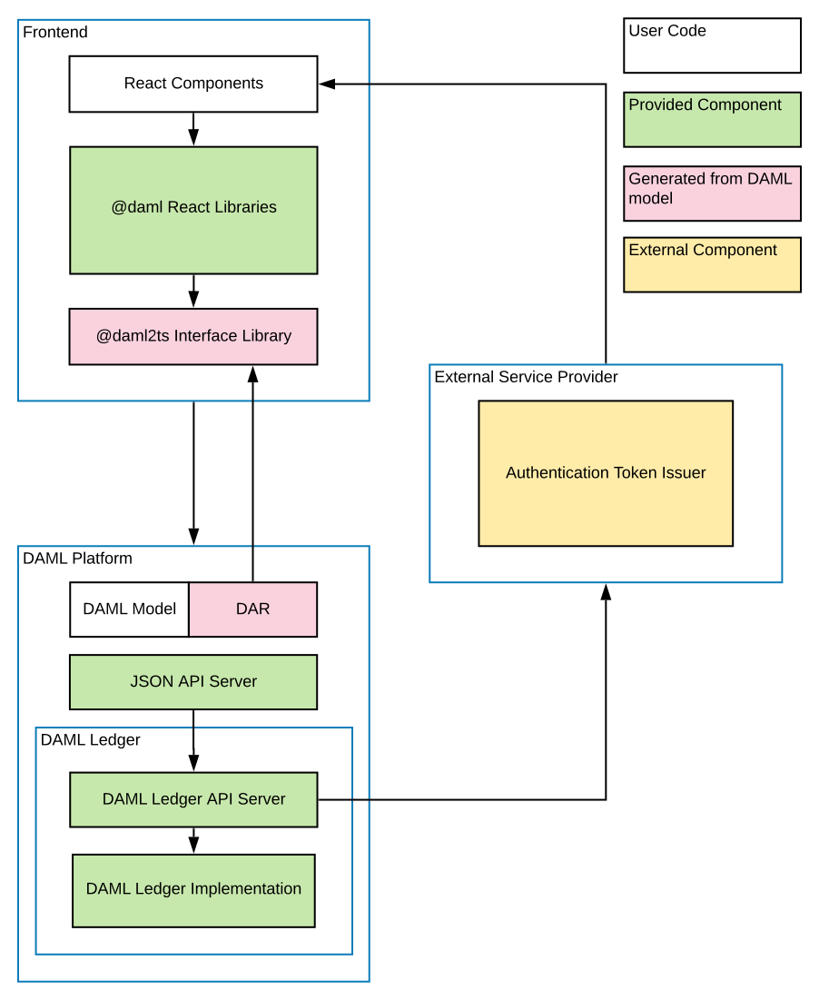
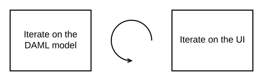

.. Copyright (c) 2023 Digital Asset (Switzerland) GmbH and/or its affiliates. All rights reserved.
.. SPDX-License-Identifier: Apache-2.0

.. _recommended-architecture:

Daml Application Architecture
#############################

This section describes our recommended design of a full-stack Daml application.

The above image shows the recommended architecture. Here there are four types of building blocks that go into our application: user code, Daml components, generated code from Daml, and external components. In the recommended architecture the Daml model determines the DAR files that underpin both the front-end and back-end. The front-end includes user code such as a React Web Frontend, Daml React libraries or other integration libraries, and generated code from the DAR files. The back-end consists of Daml integration components (e.g. JSON API) and a participant node; the participant node communicates with an external token issuer. The Daml network, meanwhile, includes Daml drivers paired with external synchronization technologies.

Of course there are many ways that the architecture and technology
stack can be changed to fit your needs, which we'll mention in the corresponding sections.

To get started quickly with the recommended application architecture, generate a new project using the ``create-daml-app`` template:

.. code-block:: bash

  daml new --template=create-daml-app my-project-name

``create-daml-app`` is a small, but fully functional demo application implementing the recommended
architecture, providing you with an excellent starting point for your own application. It showcases

- using Daml React libraries
- quick iteration against the :ref:`Daml Sandbox <sandbox-manual>`.
- authorization
- deploying your application in the cloud as a Docker container

Backend
*******
The backend for your application can be any Daml ledger implementation running your DAR
(:ref:`Daml Archive <dar-file-dalf-file>`) file.

We recommend using the :ref:`Daml JSON API <json-api>` as an interface to your frontend. It is
served by the HTTP JSON API server connected to the ledger API server. It provides simple HTTP
endpoints to interact with the ledger via GET/POST requests. However, if you prefer, you can also
use the :ref:`gRPC Ledger API <grpc>` directly.

When you use the ``create-daml-app`` template application, you can start a Daml Sandbox together
with a JSON API server by running the following command in the root of the project.

.. code-block:: bash

  daml start --start-navigator=no

Daml Sandbox exposes the same Daml Ledger API a Participant Node would
expose without requiring a fully-fledged Daml network to back the application. Once your
application matures and becomes ready for production, the ``daml deploy`` command helps you deploy
your frontend and Daml artifacts of your project to a production Daml network.

Frontend
********

We recommended building your frontend with the `React <https://reactjs.org>`_ framework. However,
you can choose virtually any language for your frontend and interact with the ledger via
:ref:`HTTP JSON <json-api>` endpoints. In addition, we provide support libraries for
:ref:`Java <java-bindings>` and you can also interact with the :ref:`gRPC Ledger API <grpc>` directly.

We provide two libraries to build your React frontend for a Daml application.

+--------------------------------------------------------------+--------------------------------------------------------------------------+
| Name                                                         | Summary                                                                  |
+==============================================================+==========================================================================+
| `@daml/react <https://www.npmjs.com/package/@daml/react>`_   | React hooks to query/create/exercise Daml contracts                      |
+--------------------------------------------------------------+--------------------------------------------------------------------------+
| `@daml/ledger <https://www.npmjs.com/package/@daml/ledger>`_ | Daml ledger object to connect and directly submit commands to the ledger |
+--------------------------------------------------------------+--------------------------------------------------------------------------+

You can install any of these libraries by running ``npm install <library>`` in the ``ui`` directory of
your project, e.g. ``npm install @daml/react``. Please explore the ``create-daml-app`` example project
to see the usage of these libraries.

To make your life easy when interacting with the ledger, the Daml assistant can generate JavaScript
libraries with TypeScript typings from the data types declared in the deployed DAR.

.. code-block:: bash

  daml codegen js .daml/dist/<your-project-name.dar> -o ui/daml.js

This command will generate a JavaScript library for each DALF in your DAR, containing metadata about
types and templates in the DALF and TypeScript typings them. In ``create-daml-app``, ``ui/package.json`` refers to these
libraries via the ``"create-daml-app": "file:../daml.js/create-daml-app-0.1.0"`` entry in the
``dependencies`` field.

If you choose a different JavaScript based frontend framework, the packages ``@daml/ledger``,
``@daml/types`` and the generated ``daml.js`` libraries provide you with the necessary code to
connect and issue commands against your ledger.

Authorization
*************

When you deploy your application to a production ledger, you need to authenticate the identities of
your users.

Daml ledgers support a unified interface for authorization of commands. Some Daml ledgers, like for
example https://hub.daml.com, offer integrated authentication and authorization, but you can also
use an external service provider like https://auth0.com. The Daml react libraries support interfacing
with a Daml ledger that validates authorization of incoming requests. Simply initialize your
``DamlLedger`` object with the token obtained by the respective token issuer. How authorization works and the
form of the required tokens is described in the :ref:`Authorization <authorization>` section.

Developer Workflow
******************

The SDK enables a local development environment with fast iteration cycles:

1. The integrated VSCode IDE (``daml studio``) runs your Scripts on any change to your Daml models. See :ref:`Daml Script <testing-using-script>`.
#. ``daml start`` will build all of your Daml code, generate the JavaScript bindings, and start the required "backend" processes (sandbox and HTTP JSON API). It will also allow you to press ``r`` (followed by Enter on Windows) to rebuild your code, regenerate the JavaScript bindings and upload the new code to the running ledger.
#. ``npm start`` will watch your JavaScript source files for change and recompile them immediately when they are saved.

Together, these features can provide you with very tight feedback loops while developing your Daml application, all the way from your Daml contracts up to your web UI. A typical Daml developer workflow is to

  1. Make a small change to your Daml data model
  #. Optionally test your Daml code with :ref:`Daml Script <testing-using-script>`
  #. Edit your React components to be aligned with changes made in Daml code
  #. Extend the UI to make use of the newly introduced feature
  #. Make further changes either to your Daml and/or React code until you're happy with what you've developed

See :doc:`Your First Feature </getting-started/first-feature>` for a more detailed walkthrough of these steps.

Command Deduplication
=====================

The interaction of a Daml application with the ledger is inherently asynchronous: applications send commands to the ledger, and some time later they see the effect of that command on the ledger.

There are several things that can fail during this time window: the application can crash, the participant node can crash, messages can be lost on the network, or the ledger may be just slow to respond due to a high load.

If you want to make sure that a command is not executed twice, your application needs to robustly handle all failure scenarios.
Daml ledgers provide a mechanism for :doc:`command deduplication <command-deduplication>` to help deal with this problem.

For each command the application provides a command ID and an optional parameter that specifies the deduplication period.
If the latter parameter is not specified in the command submission itself, the ledger will use the configured maximum deduplication duration.
The ledger will then guarantee that commands with the same :ref:`change ID <change-id>` will generate a rejection within the effective deduplication period.

For details on how to use command deduplication, see the :doc:`Command Deduplication Guide <command-deduplication>`.

.. _dealing-with-failures:

Deal With Failures
==================

.. _crash-recovery:

Crash Recovery
--------------

In order to restart your application from a previously known ledger state,
your application must keep track of the last ledger offset received
from the :ref:`transaction service <transaction-service>` or the
:ref:`command completion service <command-completion-service>`.

By persisting this offset alongside the relevant state as part of a single,
atomic operation, your application can resume from where it left off.

.. _failing-over-between-ledger-api-endpoints:

Fail Over Between Ledger API Endpoints
--------------------------------------

Some Daml Ledgers support exposing multiple eventually consistent Ledger API
endpoints where command deduplication works across these Ledger API endpoints.
For example, these endpoints might be hosted by separate Ledger API servers
that replicate the same data and host the same parties. Contact your ledger
operator to find out whether this applies to your ledger.

Below we describe how you can build your application such that it can switch
between such eventually consistent Ledger API endpoints to tolerate server
failures. You can do this using the following two steps.

First, your application must keep track of the ledger offset as described in the
:ref:`paragraph about crash recovery <crash-recovery>`. When switching to a new
Ledger API endpoint, it must resume consumption of the transaction (tree)
and/or the command completion streams starting from this last received
offset.

Second, your application must retry on ``OUT_OF_RANGE`` errors (see
`gRPC status codes <https://grpc.github.io/grpc/core/md_doc_statuscodes.html>`_)
received from a stream subscription -- using an appropriate backoff strategy
to avoid overloading the server. Such errors can be raised because of eventual
consistency. The Ledger API endpoint that the application is newly subscribing
to might be behind the endpoint that it subscribed to before the switch, and
needs time to catch up. Thanks to eventual consistency this is guaranteed to
happen at some point in the future.

Once the application successfully subscribes to its required streams on the
new endpoint, it will resume normal operation.

.. _dealing-with-time:

Deal With Time
==============

The Daml language contains a function :ref:`getTime <daml-ref-gettime>` which returns a rough estimate of “current time” called *Ledger Time*. The notion of time comes with a lot of problems in a distributed setting: different participants might run different clocks, there may be latencies due to calculation and network, clocks may drift against each other over time, etc.

In order to provide a useful notion of time in Daml without incurring severe performance or liveness penalties, Daml has two notions of time: *Ledger Time* and *Record Time*:

- As part of command interpretation, each transaction is automatically assigned a *Ledger Time* by the participant server.
- All calls to ``getTime`` within a transaction return the *Ledger Time* assigned to that transaction.
- *Ledger Time* is chosen (and validated) to respect Causal Monotonicity: The Create action on a contract *c* always precedes all other actions on *c* in Ledger Time.
- As part of the commit/synchronization protocol of the underlying infrastructure, every transaction is assigned a *Record Time*, which can be thought of as the infrastructures "system time". It's the best available notion of "real time", but the only guarantees on it are the guarantees the underlying infrastructure can give. It is also not known at interpretation time.
- *Ledger Time* is kept close to "real time" by bounding it against *Record Time*. Transactions where *Ledger* and *Record Time* are too far apart are rejected.

Some commands might take a long time to process, and by the time the resulting transaction is about to be committed to the ledger, it might violate the condition that *Ledger Time* should  be reasonably close to *Record Time* (even when considering the ledger's tolerance interval). To avoid such problems, applications can set the optional parameters :ref:`min_ledger_time_abs <com.daml.ledger.api.v1.Commands.min_ledger_time_abs>` or :ref:`min_ledger_time_rel <com.daml.ledger.api.v1.Commands.min_ledger_time_rel>` that specify (in absolute or relative terms) the minimal *Ledger Time* for the transaction. The ledger will then process the command, but wait with committing the resulting transaction until *Ledger Time* fits within the ledger's tolerance interval.

How is this used in practice?

- Be aware that ``getTime`` is only reasonably close to real time, and not completely monotonic. Avoid Daml workflows that rely on very accurate time measurements or high frequency time changes.
- Set ``min_ledger_time_abs`` or ``min_ledger_time_rel`` if the duration of command interpretation and transmission is likely to take a long time relative to the tolerance interval set by the ledger.
- In some corner cases, the participant node may be unable to determine a suitable Ledger Time by itself. If you get an error that no Ledger Time could be found, check whether you have contention on any contract referenced by your command or whether the referenced contracts are sensitive to small changes of ``getTime``.

For more details, see :ref:`Background concepts - time <time>`.
