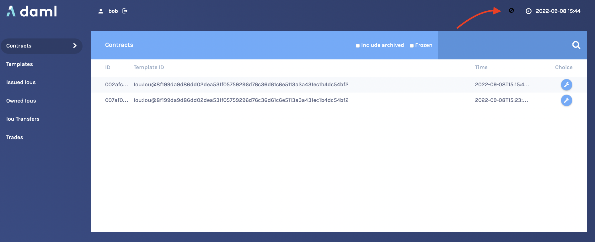
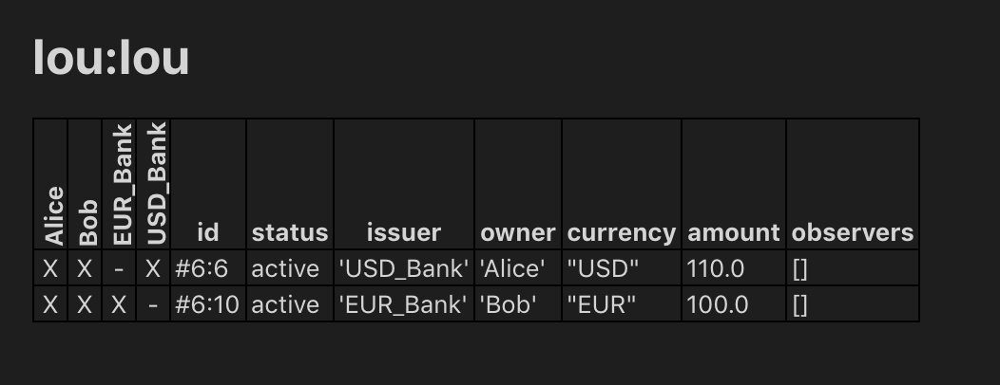

.. Copyright (c) 2022 Digital Asset (Switzerland) GmbH and/or its affiliates. All rights reserved.
.. SPDX-License-Identifier: Apache-2.0

.. _quickstart:

Daml IOU Quickstart Tutorial
############################

In this guide, you will learn about developer tools and Daml applications by:

- developing a simple ledger application for issuing, managing, transferring and trading IOUs ("I Owe You!")
- developing an integration layer that exposes some of the functionality via custom REST services

Prerequisites:

- You understand what an IOU is. If you are not sure, read the :ref:`IOU tutorial overview<tutorials-iou-overview>`.
- You have installed the SDK. See :doc:`installation </getting-started/installation>`.

.. _quickstart-download:

Download the Quickstart Application
***********************************

You can get the quickstart application using the Daml assistant (``daml``):

#. Run ``daml new quickstart --template quickstart-java``

   This creates the ``quickstart-java`` application into a new folder called ``quickstart``.
#. Run ``cd quickstart`` to change into the new directory.

Folder Structure
================

The project contains the following files:

.. code-block:: none

  .
  ├── daml
  │   ├── Iou.daml
  │   ├── IouTrade.daml
  │   ├── Main.daml
  │   └── Tests
  │       ├── Iou.daml
  │       └── Trade.daml
  ├── daml.yaml
  ├── frontend-config.js
  ├── pom.xml
  └── src
      └── main
          ├── java
          │   └── com
          │       └── daml
          │           └── quickstart
          │               └── iou
          │                   └── IouMain.java
          └── resources
              └── logback.xml

- ``daml.yaml`` is a Daml project config file used by the SDK to find out how to build the Daml project and how to run it.
- ``daml`` contains the :ref:`Daml code <quickstart-daml>` specifying the contract model for the ledger.
- ``daml/Tests`` contains :ref:`test scripts <quickstart-scripts>` for the Daml model.
- ``frontend-config.js`` is a configuration file for the :ref:`Navigator <quickstart-navigator>` frontend.
- ``pom.xml`` and ``src/main/java`` constitute a :ref:`Java application <quickstart-application>` that provides REST services to interact with the ledger.

You will explore these in more detail through the rest of this guide.

.. _tutorials-iou-overview:

Understand IOUs
***************

To run through this guide, you will need to understand what an IOU is. This section describes the properties of an IOU like a bank bill that make it useful as a representation and transfer of value.

A bank bill represents a contract between the owner of the bill and its issuer, the central bank. Historically, it is a bearer instrument - it gives anyone who holds it the right to demand a fixed amount of material value, often gold, from the issuer in exchange for the note.

To do this, the note must have certain properties. In particular, the British pound note shown below illustrates the key elements that are needed to describe money in Daml:

**1) The Legal Agreement**

For a long time, money was backed by physical gold or silver stored in a central bank. The British pound note, for example, represented a promise by the central bank to provide a certain amount of gold or silver in exchange for the note. This historical artifact is still represented by the following statement::

  I promise to pay the bearer on demand the sum of five pounds.

The true value of the note comes from the fact that it physically represents a bearer right that is matched by an obligation on the issuer.

**2) The Signature of the Counterparty**

The value of a right described in a legal agreement is based on a matching obligation for a counterparty. The British pound note would be worthless if the central bank, as the issuer, did not recognize its obligation to provide a certain amount of gold or silver in exchange for the note. The chief cashier confirms this obligation by signing the note as a delegate for the Bank of England. In general, determining the parties that are involved in a contract is key to understanding its true value.

**3) The Security Token**

Another feature of the pound note is the security token embedded within the physical paper. It allows the note to be authenticated with limited effort by holding it against a light source. Even a third party can verify the note without requiring explicit confirmation from the issuer that it still acknowledges the associated obligations.

**4) The Unique Identifier**

Every note has a unique registration number that allows the issuer to track their obligations and detect duplicate bills. Once the issuer has fulfilled the obligations associated with a particular note, duplicates with the same identifier automatically become invalid.

**5) The Distribution Mechanism**

The note itself is printed on paper, and its legal owner is the person holding it. The physical form of the note allows the rights associated with it to be transferred to other parties that are not explicitly mentioned in the contract.

.. _quickstart-start:

Run the Application Using Prototyping Tools
*******************************************

In this section, you will run the quickstart application and get introduced to the main tools for prototyping Daml:

#. To compile the Daml model, run ``daml build``

   This creates a :ref:`DAR file <dar-file-dalf-file>` (DAR is just the format that Daml compiles to) called ``.daml/dist/quickstart-0.0.1.dar``. The output should look like this:

   .. code-block:: none

      2022-09-08 14:33:41.65 [INFO]  [build]
      Compiling quickstart to a DAR.

      2022-09-08 14:33:42.90 [INFO]  [build]
      Created .daml/dist/quickstart-0.0.1.dar

   .. _quickstart-sandbox:

#. To run the :doc:`sandbox </tools/sandbox>` (a lightweight local version of the ledger), run::

     daml sandbox --port 6865

#. In a separate terminal run the following:

- Upload the DAR file::

    daml ledger upload-dar --host localhost --port 6865 .daml/dist/quickstart-0.0.1.dar

- Run the init script::

    daml script --ledger-host localhost --ledger-port 6865 --dar .daml/dist/quickstart-0.0.1.dar --script-name Main:initialize --output-file output.json

.. _quickstart-navigator:

- Start the :doc:`Navigator </tools/navigator/index>`, a browser-based ledger front-end, by running::

    daml navigator server localhost 6865 --port 7500

  The Navigator automatically connects to the sandbox. You can access it on port ``7500``.

.. _quickstart-work:

Try the Application
*******************

Now everything is running, you can try out the quickstart application:

#. Go to `http://localhost:7500/ <http://localhost:7500/>`_. This is the :doc:`Navigator </tools/navigator/index>`, which you launched :ref:`earlier <quickstart-navigator>`.
#. On the login screen, select ``alice`` from the dropdown. This logs you in as ``alice``.

   This takes you to the contracts view:

   .. figure:: quickstart/images/contracts.png
      :alt: The Contracts view in the Navigator, showing one existing contract.

   This is showing you what contracts are currently active on the sandbox ledger and visible to ``alice``. You can see that there is a single such contract, in our case with Id ``002eb5...``, created from a *template* called ``Iou:Iou@8f199da...``.

   Your contract ID will vary. The actual value doesn't matter. We'll refer to this contract as ``002eb5`` in the rest of this document, and you'll need to substitute your own value mentally.

#. On the left-hand side, you can see what the pages the Navigator contains:

   - Contracts
   - Templates
   - Issued Ious
   - Owned Ious
   - Iou Transfers
   - Trades

   **Contracts** and **Templates** are standard views, available in any application. The others are created just for this application, specified in the ``frontend-config.js`` file.

   For information on creating custom Navigator views, see :ref:`navigator-custom-views`.

#. Click **Templates** to open the Templates page.

   This displays all available *contract templates*. Instances of contracts (or just *contracts*) are created from these templates. The names of the templates are of the format `module:template@hash`. Including the hash disambiguates templates, even when identical module and template names are used between packages.

   On the far right, you see the number of *contracts* that you can see for each template, if any, or ``-`` for "no contract".

#. Try creating a contract from a template. Issue an Iou to yourself by clicking on the ``Iou:Iou@8f199...`` row, filling it out as shown below (use the provided auto-complete feature for the ``Party`` values in ``issuer`` and ``owner``) and clicking **Submit**.

   .. figure:: quickstart/images/createIou.png
      :alt: Fill out the form by entering Alice as the Issuer and as the Owner, AliceCoin as the Currency, and 1.0 as the Amount.

#. On the left-hand side, click **Issued Ious** to go to that page. You can see the Iou you just issued yourself.
#. Now, try transferring this Iou to someone else. Click on your Iou, select ``Iou_Transfer``, select ``Bob::...`` as the new owner and hit **Submit**.
#. Go to the **Owned Ious** page.

   The screen shows the same contract ``002eb5`` that you already saw on the *Contracts* page. It is an Iou for €100, issued by ``EUR_Bank::...``.
#. Go to the **Iou Transfers** page. It shows the transfer of your recently issued Iou to Bob, but Bob has not accepted the transfer, so it is not settled.

   This is an important part of Daml: nobody can be forced into owning an *Iou*, or indeed agreeing to any other contract. They must explicitly consent.

   You could cancel the transfer by using the ``IouTransfer_Cancel`` choice within it, but for this walk-through, leave it alone for the time being.
#. Try asking *Bob* to exchange your €100 for $110. To do so, you first have to show your Iou to *Bob* so that he can verify the settlement transaction, should he accept the proposal.

   Go back to **Owned Ious**, open the Iou for €100 and click on the button ``Iou_AddObserver``. Select ``Bob::...`` as the ``newObserver``.

   Contracts in Daml are immutable, meaning they cannot be changed, only created and archived. If you head back to the **Owned Ious** screen, you can see that the Iou now has a new Contract ID. In our case, it's ``00018fe...``.
#. To propose the trade, go to the **Templates** screen. Click on the ``IouTrade:IouTrade@...`` template, fill in the form as shown below and submit the transaction. Remember to use the dropdown for the values of ``buyer``, ``seller``, ``baseIouCid``, ``baseIssuer``, and ``quoteIssuer``.

   .. figure:: quickstart/images/tradeProp.png
      :alt: Fill out the form; use the provided dropdown to select Alice as the buyer, Bob as the seller, the new contract we just created as the baseIouCid, and EUR_Bank as the baseIssuer; enter EUR as the baseCurrency, 100.00 as the baseAmount; select USD_Bank from the dropdown as the quote_Issuer; enter USD as the quoteCurrency, and 110.0 as the quoteAmount.

#. Go to the **Trades** page. It shows the just-proposed trade.
#. You are now going to switch user to Bob, so you can accept the trades you have just proposed. Start by clicking on the logout button next to the username, at the top of the screen. On the login page, select ``bob`` from the dropdown.
#. First, accept the transfer of the *AliceCoin*. Go to the **Iou Transfers** page, click on the row of the transfer, and click ``IouTransfer_Accept``, then **Submit**.
#. Go to the **Owned Ious** page. It now shows the *AliceCoin*.

   It also shows an *Iou* for $110 issued by ``USD_Bank::...``. This matches the trade proposal you made earlier as Alice. Remember the first few characters of its Contract ID (in our case ``0086c84``).

   .. figure:: quickstart/images/bobOwnedIous.png
      :alt: List of Owned Ious for Bob at this point. Includes Bob's $110 from USD_Bank.

#. Settle the trade. Go to the **Trades** page, and click on the row of the proposal. Accept the trade by clicking ``IouTrade_Accept``. In the popup, select the Contract ID you just noted from the dropdown as the ``quoteIouCid``, then click **Submit**.

   The two legs of the transfer are now settled atomically in a single transaction. The trade either fails or succeeds as a whole.
#. Privacy is an important feature of Daml. You can check that Alice and Bob's privacy relative to the Banks was preserved.

   To do this, log out, then log in as ``us``, which maps to ``USD_Bank::...``.

   On the **Contracts** page, select **Include archived**. The page now shows all the contracts that ``USD_Bank::...`` has ever known about.

   There are just five contracts:

   * Three contracts created on startup:

     1. A self-issued *Iou* for $110.
     2. The *IouTransfer* to transfer that *Iou* to Bob
     3. The resulting *Iou* owned by Bob.

   * The transfer of Bob’s *Iou* to Alice that happened as part of the trade.
     Note that this is a transient contract that got archived in the same transaction
     it got created in.
   * The new $110 *Iou* owned by Alice. This is the only active contract.

   Importantly, ``USD_Bank::...`` does not know anything about the trade or the EUR-leg. It has no idea what was exchanged for those $110, or indeed if anything was exchanged at all. For more information on privacy, refer to the :ref:`da-ledgers`.

   .. note::

     ``USD_Bank::...`` does know about an intermediate *IouTransfer* contract that was created and consumed as part of the atomic settlement in the previous step. Since that contract was never active on the ledger, it is not shown in Navigator. You will see how to view a complete transaction graph, including who knows what, in :ref:`quickstart-scripts` below.

.. _quickstart-daml:

Get Started with Daml
*********************

The *contract model* specifies the possible contracts, as well as the allowed transactions on the ledger, and is written in Daml.

The core concept in Daml is a *contract template* - you used them earlier to create contracts. Contract templates specify:

- a type of contract that may exist on the ledger, including a corresponding data type
- the *signatories*, who need to agree to the *creation* of a contract of that type
- the *rights* or *choices* given to parties by a contract of that type
- constraints or conditions on the data on a contract
- additional parties, called observers, who can see the contract

For more information about Daml Ledgers, consult :ref:`da-ledgers` for an in-depth technical description.

Develop with Daml Studio
========================

Take a look at the Daml that specifies the contract model in the quickstart application. The core template is ``Iou``.

#. Open :doc:`Daml Studio </daml/daml-studio>`, a Daml IDE based on VS Code, by running ``daml studio`` from the root of your project.
#. Using the explorer on the left, open ``daml/Iou.daml``.

The first (uncommented, non-empty) line specifies the module name:

.. literalinclude:: quickstart/template-root/daml/Iou.daml
  :language: daml
  :start-after: -- BEGIN_IOU_MODULE_NAME
  :end-before: -- END_IOU_MODULE_NAME

Next, a template called `Iou` is declared together with its datatype. This template has five fields:

.. literalinclude:: quickstart/template-root/daml/Iou.daml
  :language: daml
  :start-after: -- BEGIN_IOU_TEMPLATE_DATATYPE
  :end-before: -- END_IOU_TEMPLATE_DATATYPE

Conditions for the creation of a contract are specified using the `ensure` and `signatory` keywords:

.. literalinclude:: quickstart/template-root/daml/Iou.daml
  :language: daml
  :start-after: -- BEGIN_IOU_TEMPLATE_CONDITIONS
  :end-before: -- END_IOU_TEMPLATE_CONDITIONS

In this case, there are two conditions:

- An ``Iou`` can only be created if it is authorized by both ``issuer`` and ``owner``.
- The ``amount`` needs to be positive.

Earlier, as Alice, you authorized the creation of an ``Iou``. The ``amount`` was ``1.0``, and Alice was both ``issuer`` and ``owner``, so both conditions were satisfied, and you could successfully create the contract.

To see this in action, go back to the Navigator and try to create the same ``Iou`` again, but with Bob as ``owner`` (with Alice as issuer). It will not work. Note that the Navigator shows success an failures as a small icon in the top right, as highlighted here (it would be a small "v" for success):

Observers are specified using the ``observer`` keyword:

.. literalinclude:: quickstart/template-root/daml/Iou.daml
  :language: daml
  :start-after: -- BEGIN_IOU_TEMPLATE_OBSERVERS
  :end-before: -- END_IOU_TEMPLATE_OBSERVERS

Here, ``observer`` is the keyword and ``observers`` refers to the field of the template.

Next, the *rights* or *choices* are defined, in this case with ``owner`` as the ``controller``:

.. literalinclude:: quickstart/template-root/daml/Iou.daml
  :language: daml
  :start-after: -- BEGIN_IOU_TEMPLATE_SPLIT
  :end-before: -- END_IOU_TEMPLATE_SPLIT

.. literalinclude:: quickstart/template-root/daml/Iou.daml
  :language: daml
  :start-after: -- BEGIN_IOU_TEMPLATE_MERGE
  :end-before: -- END_IOU_TEMPLATE_MERGE

.. literalinclude:: quickstart/template-root/daml/Iou.daml
  :language: daml
  :start-after: -- BEGIN_IOU_TEMPLATE_TRANSFER
  :end-before: -- END_IOU_TEMPLATE_TRANSFER

.. literalinclude:: quickstart/template-root/daml/Iou.daml
  :language: daml
  :start-after: -- BEGIN_IOU_TEMPLATE_OBSERVER_CHOICES
  :end-before: -- END_IOU_TEMPLATE_OBSERVER_CHOICES

Thus, ``owner`` has the right to:

- Split the Iou.
- Merge it with another one differing only on ``amount``.
- Initiate a transfer.
- Add and remove observers.

The  ``Iou_Transfer`` choice above takes a parameter called ``newOwner`` and creates a new ``IouTransfer`` contract and returns its ``ContractId``. It is important to know that, by default, choices *consume* the contract on which they are exercised. Consuming, or archiving, makes the contract no longer active. So the ``IouTransfer`` replaces the ``Iou``.

A more interesting choice is ``IouTrade_Accept``. To look at it, open ``IouTrade.daml``.

.. literalinclude:: quickstart/template-root/daml/IouTrade.daml
  :language: daml
  :start-after: -- BEGIN_IOU_COMPOSITE_CHOICE
  :end-before: -- END_IOU_COMPOSITE_CHOICE

This choice uses the ``===`` operator from the :doc:`Daml Standard Library </daml/stdlib/index>` to check pre-conditions. The standard library is imported using ``import DA.Assert`` at the top of the module.

Then, it *composes* the ``Iou_Transfer`` and ``IouTransfer_Accept`` choices to build one big transaction. In this transaction, ``buyer`` and ``seller`` exchange their Ious atomically, without disclosing the entire transaction to all parties involved.

The *Issuers* of the two Ious, which are involved in the transaction because they are signatories on the ``Iou`` and ``IouTransfer`` contracts, only get to see the sub-transactions that concern them, as we saw earlier.

For a deeper introduction to Daml, consult the :doc:`Daml Reference </daml/reference/index>`.

.. _quickstart-scripts:

Test Using Daml Script
======================

You can check the correct authorization and privacy of a contract model using *scripts*: tests that are written in Daml.

Scripts are a linear sequence of transactions that is evaluated using the same consistency, conformance and authorization rules as it would be on the full ledger server or the sandbox ledger. They are integrated into Daml Studio, which can show you the resulting transaction graph, making them a powerful tool to test and troubleshoot the contract model.

To take a look at the scripts in the quickstart application, open ``daml/Tests/Trade.daml`` in Daml Studio.

A script test is defined with ``trade_test = script do``. The ``submit`` function takes a submitting party and a transaction, which is specified the same way as in contract choices.

The following block, for example, issues an ``Iou`` and transfers it to Alice:

.. literalinclude:: quickstart/template-root/daml/Tests/Trade.daml
  :language: daml
  :start-after: -- BEGIN_SCRIPT
  :end-before: -- END_SCRIPT

Compare the script with the ``initialize`` script in ``daml/Main.daml``. You will see that the script you used to initialize the sandbox is an initial segment of the ``trade_test`` script. The latter adds transactions to perform the trade you performed through Navigator, and a couple of transactions in which expectations are verified.

After a short time, the text *Script results* should appear above the test. Click on it (in ``daml/Tests/Trade.daml``) to open the visualization of the resulting ledger state.

Each row shows a contract on the ledger. The last four columns show which parties know of which contracts. The remaining columns show the data on the contracts. You can see past contracts by checking the **Show archived** box at the top. Click the adjacent **Show transaction view** button to switch to a view of the entire transaction tree.

In the transaction view, transaction ``6`` is of particular interest, as it shows how the Ious are exchanged atomically in one transaction. The lines starting ``disclosed to (since)`` show that the Banks do indeed not know anything they should not:

.. code-block:: none

  TX 6 1970-01-01T00:00:00Z (Tests.Trade:71:14)
  #6:0
  │   disclosed to (since): 'Alice' (6), 'Bob' (6)
  └─> 'Bob' exercises IouTrade_Accept on #5:0 (IouTrade:IouTrade)
            with
              quoteIouCid = #3:1
      children:
      #6:1
      │   disclosed to (since): 'Alice' (6), 'Bob' (6), 'EUR_Bank' (6)
      └─> fetch #4:1 (Iou:Iou)

      #6:2
      │   disclosed to (since): 'Alice' (6), 'Bob' (6), 'USD_Bank' (6)
      └─> fetch #3:1 (Iou:Iou)

      #6:3
      │   disclosed to (since): 'Alice' (6), 'Bob' (6), 'USD_Bank' (6)
      └─> 'Bob' exercises Iou_Transfer on #3:1 (Iou:Iou)
                with
                  newOwner = 'Alice'
          children:
          #6:4
          │   consumed by: #6:5
          │   referenced by #6:5
          │   disclosed to (since): 'Alice' (6), 'Bob' (6), 'USD_Bank' (6)
          └─> create Iou:IouTransfer
              with
                iou =
                  (Iou:Iou with
                     issuer = 'USD_Bank';
                     owner = 'Bob';
                     currency = "USD";
                     amount = 110.0000000000;
                     observers = []);
                newOwner = 'Alice'

      #6:5
      │   disclosed to (since): 'Alice' (6), 'Bob' (6), 'USD_Bank' (6)
      └─> 'Alice' exercises IouTransfer_Accept on #6:4 (Iou:IouTransfer)
          children:
          #6:6
          │   disclosed to (since): 'Alice' (6), 'Bob' (6), 'USD_Bank' (6)
          └─> create Iou:Iou
              with
                issuer = 'USD_Bank';
                owner = 'Alice';
                currency = "USD";
                amount = 110.0000000000;
                observers = []

      #6:7
      │   disclosed to (since): 'Alice' (6), 'Bob' (6), 'EUR_Bank' (6)
      └─> 'Alice' exercises Iou_Transfer on #4:1 (Iou:Iou)
                  with
                    newOwner = 'Bob'
          children:
          #6:8
          │   consumed by: #6:9
          │   referenced by #6:9
          │   disclosed to (since): 'Alice' (6), 'Bob' (6), 'EUR_Bank' (6)
          └─> create Iou:IouTransfer
              with
                iou =
                  (Iou:Iou with
                     issuer = 'EUR_Bank';
                     owner = 'Alice';
                     currency = "EUR";
                     amount = 100.0000000000;
                     observers = ['Bob']);
                newOwner = 'Bob'

      #6:9
      │   disclosed to (since): 'Alice' (6), 'Bob' (6), 'EUR_Bank' (6)
      └─> 'Bob' exercises IouTransfer_Accept on #6:8 (Iou:IouTransfer)
          children:
          #6:10
          │   disclosed to (since): 'Alice' (6), 'Bob' (6), 'EUR_Bank' (6)
          └─> create Iou:Iou
              with
                issuer = 'EUR_Bank';
                owner = 'Bob';
                currency = "EUR";
                amount = 100.0000000000;
                observers = []

The ``submit`` function used in this script tries to perform a transaction and fails if any of the ledger integrity rules are violated. There is also a ``submitMustFail`` function, which checks that certain transactions are not possible. This is used in ``daml/Tests/Iou.daml``, for example, to confirm that the ledger model prevents double spends.

..  Interact With the Ledger Through the Command Line
    *************************************************

    All interaction with a Daml ledger, be it sandbox or any other implementation, happens via the :doc:`Ledger API </app-dev/ledger-api>`. It is based on `gRPC <https://grpc.io/>`_.

    The Navigator uses this API, as will any :ref:`custom integration <quickstart-application>`.

    This section show a way to fetch data and submit commands via a command-line interface.

    _quickstart-api:

    Not for this release
    Connect to the raw API with grpCurl
    ===================================

.. _quickstart-application:

Integrate With the Ledger
*************************

A distributed ledger only forms the core of a full Daml application.

To build automations and integrations around the ledger, Daml has :doc:`language bindings </app-dev/bindings-java/index>` for the Ledger API in several programming languages.

To compile the Java integration for the quickstart application, we first need to run the Java codegen on the DAR we built before::

    daml codegen java

Once the code has been generated (into ``target/generated-sources`` per the instructions in ``daml.yaml``), we can compile it using::

    mvn compile

Now, start the Java integration with::

    mvn exec:java@run-quickstart -Dparty=$(cat output.json | sed 's/\[\"//' | sed 's/".*//')

Note that this step requires that the sandbox started :ref:`earlier <quickstart-sandbox>` is still running. If it is not, you'll have to run the ``daml sandbox`` and ``daml script``  commands again to get an ``output.json`` in sync with the new state of the sandbox (party names can change with each sandbox restart).

The application provides REST services on port ``8080`` to perform basic operations on behalf on ``Alice``. For example, check that::

    curl http://localhost:8080/iou

returns, for a newly-created sandbox (where you have just run the init script to get the ``output.json`` file), something like::

    {"0":{"issuer":"EUR_Bank::NAMESPACE","owner":"Alice::NAMESPACE","currency":"EUR","amount":100.0000000000,"observers":[]}}

If you still have the same sandbox running against which you have run the Navigator steps above, the output might look more like::

    {"0":{"issuer":"Alice::NAMESPACE","owner":"Bob::NAMESPACE","currency":"AliceCoin","amount":1.0000000000,"observers":[]},"1":{"issuer":"USD_Bank::NAMESPACE","owner":"Alice::NAMESPACE","currency":"USD","amount":110.0000000000,"observers":[]}}

To start the same application on another port, use the command-line parameter ``-Drestport=PORT``. To start it for another party,  use  ``-Dparty=PARTY``. For example, to start the application for Bob on ``8081``, run::

    mvn exec:java@run-quickstart -Drestport=8081 -Dparty=Bob$(cat output.json | sed 's/\[\"//' | sed 's/".*//')

The following REST services are included:

- ``GET`` on ``http://localhost:8080/iou`` lists all active Ious, and their Ids.

  Note that the Ids exposed by the REST API are not the ledger contract Ids, but integers. You can open the address in your browser or run ``curl -X GET http://localhost:8080/iou``.
- ``GET`` on ``http://localhost:8080/iou/ID`` returns the Iou with Id ``ID``.

  For example, to get the content of the Iou with Id 0, run:

  ``curl -X GET http://localhost:8080/iou/0``
- ``PUT`` on ``http://localhost:8080/iou`` creates a new Iou on the ledger.

  To create another *AliceCoin*, run::

      curl -X PUT -d '{"issuer":"Alice::NAMESPACE","owner":"Alice::NAMESPACE","currency":"AliceCoin","amount":1.0,"observers":[]}' http://localhost:8080/iou

  Note that you have to replace ``NAMESPACE`` with the real namespace assigned by the sandbox; you can find it in ``output.json``::

      ns=$(cat output.json | sed 's/\[\"Alice:://' | sed 's/".*//'); curl -X PUT -d "$(printf '{"issuer":"Alice::%s","owner":"Alice::%s","currency":"AliceCoin","amount":1.0,"observers":[]}' $ns $ns)" http://localhost:8080/iou

- ``POST`` on ``http://localhost:8080/iou/ID/transfer`` transfers the Iou with Id ``ID``.

  Check the index of your new *AliceCoin* by listing all active Ious. If you have just run the init script, it will be ``0``; if you have run the Navigator section, it will likely be ``2``. Once you have the index, you can run::

    ns=$(cat output.json | sed 's/\[\"Alice:://' | sed 's/".*//'); curl -X POST -d "{\"newOwner\":\"Bob::${ns}\"}" http://localhost:8080/iou/0/transfer

  to transfer it to Bob. If it's not ``0``, just replace the ``0`` in ``iou/0`` in the above command.

The automation is based on the :doc:`Java bindings </app-dev/bindings-java/index>` and the output of the :doc:`Java code generator </app-dev/bindings-java/codegen>`, which are included as a Maven dependency and Maven plugin respectively in the ``pom.xml`` file created by the template:

.. literalinclude:: quickstart/template-root/pom.xml
  :language: xml
  :lines: 22-32

It consists of the application in file ``IouMain.java``. It uses the class ``Iou`` from ``Iou.java``, which is generated from the Daml model with the Java code generator. The ``Iou`` class provides better serialization and de-serialization to JSON via `gson <https://github.com/google/gson>`_. Looking at ``src/main/java/com/daml/quickstart/iou/IouMain.java``:

#. A connection to the ledger is established using a ``DamlLedgerClient`` object.

   .. literalinclude:: quickstart/template-root/src/main/java/com/daml/quickstart/iou/IouMain.java
      :language: java
      :lines: 42-47
      :dedent: 4

#. An in-memory contract store is initialized. This is intended to provide a live view of all active contracts, with mappings between ledger and external Ids.

   .. literalinclude:: quickstart/template-root/src/main/java/com/daml/quickstart/iou/IouMain.java
      :language: java
      :lines: 55-57
      :dedent: 4

#. The Active Contracts Service (ACS) is used to quickly build up the contract store to a recent state.

   .. literalinclude:: quickstart/template-root/src/main/java/com/daml/quickstart/iou/IouMain.java
      :language: java
      :lines: 61-77
      :dedent: 4

   ``blockingForEach`` is used to ensure that the contract store is consistent with the ledger state at the latest offset observed by the client.

#. The Transaction Service is wired up to update the contract store on occurrences of ``ArchiveEvent`` and ``CreateEvent`` for Ious. Since ``getTransactions`` is called without end offset, it will stream transactions indefinitely, until the application is terminated.

   .. literalinclude:: quickstart/template-root/src/main/java/com/daml/quickstart/iou/IouMain.java
      :language: java
      :lines: 79-100
      :dedent: 4

#. Commands are submitted via the Command Submission Service.

   .. literalinclude:: quickstart/template-root/src/main/java/com/daml/quickstart/iou/IouMain.java
      :language: java
      :lines: 140-153
      :dedent: 2

   You can find examples of ``ExerciseCommand`` and ``CreateCommand`` instantiation in the bodies of the ``transfer`` and ``iou`` endpoints, respectively.

   .. literalinclude:: quickstart/template-root/src/main/java/com/daml/quickstart/iou/IouMain.java
      :caption: ExerciseCommand
      :language: java
      :lines: 123-125
      :dedent: 10

   .. literalinclude:: quickstart/template-root/src/main/java/com/daml/quickstart/iou/IouMain.java
      :caption: CreateCommand
      :language: java
      :lines: 112-113
      :dedent: 10

The rest of the application sets up the REST services using `Spark Java <http://sparkjava.com/>`_, and does dynamic package Id detection using the Package Service. The latter is useful during development when package Ids change frequently.

For a discussion of ledger application design and architecture, take a look at :doc:`Application Architecture Guide </app-dev/app-arch>`.

Next Steps
**********

Great - you've completed the quickstart guide!

Some steps you could take next include:

- Explore `examples <https://daml.com/examples>`_ for guidance and inspiration.
- :doc:`Learn Daml </daml/intro/0_Intro>`.
- :doc:`Language reference </daml/reference/index>`.
- Learn more about :doc:`application development </app-dev/app-arch>`.
- Learn about the :doc:`conceptual models </concepts/ledger-model/index>` behind Daml.
