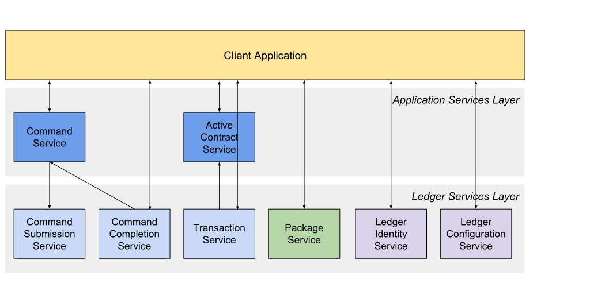

.. Copyright (c) 2019 Digital Asset (Switzerland) GmbH and/or its affiliates. All rights reserved.
.. SPDX-License-Identifier: Apache-2.0

.. _ledger-api-introduction:

Ledger API
##########

A DAML Ledger provides an API to receive data from and send data to the
ledger, subsequently called *Ledger API*. The API is separated into a
small number of services that cover various aspects of the ledger, e.g.
reading transactions or submitting commands. The Ledger API is defined
using Google `Protocol Buffers <https://developers.google.com/protocol-buffers/docs/proto3>`__
and `gRPC <https://grpc.io>`__.

.. toctree::
  :maxdepth: 2
  :titlesonly:

  proto-docs
  daml-to-ledger-api

gRPC
****

gRPC is an RPC framework that uses Google Protocol Buffers to define
services. A service is comprised of methods with a request message and a
response message. Requests and responses can also be streams.

The reasons for adopting gRPC as the basis for the Ledger API were
manifold:

-  It is an open-source interoperability mechanism with multitude of language mappings
-  It does not tie the users to a specific technology stack
-  It is backed up by the giants of the industry with vast adoption examples and vivid community of contributors
-  It uses binary representation for wire transfer which has been designed for scalability and high performance
-  It has been designed with simplicity in mind, a departure from the likes of CORBA, DCOM, RMI and other RPCs
-  It enables modelling flexibility beyond the rigid set of verbs offered by HTTP and its request-response architecture
-  It supports both uni- as well as bidirectional streaming
-  It is built on top of HTTP2 and thus understood by off-the-shelf infrastructure components such as firewalls, load balancers, proxies etc.
-  It provides secure connections in the form of SSL/TLS as well as pluggable authentication mechanisms
-  It simplifies SDK deployment. In order to be productive, clients just need to compile source files to generate the stubs for their target language and copy sample code (if provided)

For more information consult the `gRPC website <https://grpc.io/docs/guides/index.html>`__.

Getting started
***************

The complete specification in form of protobuf files
can be added to an existing SDK project by running
``da project add ledger-api-protos``. While gRPC is available for
a wide range of programming languages, the DAML SDK provides
pre-compiled client bindings for the Ledger API for Java. If
you are using a different programming language, please see the
`Quickstart <https://grpc.io/docs/quickstart/>`__
and `Tutorials <https://grpc.io/docs/tutorials/>`__
section in the official gRPC documentation.

Example project - Ping Pong
===========================

The SDK provides an example project demonstrating the use of the Ledger API.
Read :ref:`setup-maven-project` to configure your machine to use the examples.

To get the example project:

1. Clone the `example project from GitHub <https://github.com/digital-asset/ex-java-bindings>`__. 

2. Follow the `setup instructions in the README <https://github.com/digital-asset/ex-java-bindings/blob/master/README.rst#setting-up-the-example-projects>`__. Use ``examples.pingpong.grpc.PingPongGrpcMain`` as the main class.

The DAML model contains two contract templates ``Ping`` and ``Pong`` to showcase how two parties
can interact via the ledger. Party ``Alice`` creates a ``Ping`` contract
with Party ``Bob`` as the ``receiver``, who will exercise the ``RespondPong`` choice on that contract.
The execution of the choice results in a ``Pong`` contract being created with ``Alice`` as the ``receiver``,
who can choose to exercise the ``RespondPing`` choice on that contract. This creates another ``Ping`` contract,
effectively starting a new ping pong cycle, until this has happened a number of times, as defined within
the DAML model.

The entry point for the Java code is the main class ``src/main/java/examples/pingpong/grpc/PingPongGrpcMain.java``.
It shows how to connect to and interact with the DML Ledger via the gRPC API.
The code is augmented with comments that describe the various parts of the code.
Each party will connect to the ledger, subscribe to the transaction stream, and send initial ``Ping`` contracts.
The application prints statements similar to the ones shown below.

.. code-block:: text

    Bob is exercising RespondPong on #1:0 in workflow Ping-Alice-1 at count 0
    Alice is exercising RespondPing on #344:1 in workflow Ping-Alice-7 at count 9

The first line shows that ``Bob`` is exercising the ``RespondPong`` choice on the contract
with ID ``#1:0`` for the workflow ``Ping-Alice-1``. Count ``0`` means that this is the
first choice after the initial ``Ping`` contract. The workflow ID  ``Ping-Alice-1`` conveys
that this is the workflow triggered by the second initial ``Ping`` contract that was created by ``Alice``.
The second line is analoguous to the first one.

Note that the Ping Pong example subscribes to transactions for a single party, as different parties typically live on
different participant nodes. However, if you have multiple parties registered on the same node, or are running an
application against the Sandbox, you can subscribe to transactions for multiple parties in a single subscription by putting
multiple entries into the ``filters_by_party`` field of the ``TransactionFilter`` message. Subscribing to transactions for an unknown
party will result in an error.

Service layers
**************

The Ledger API defines two layers of services. Ledger Services make up
the core functionality that is needed to interact with the ledger, while
the Application Services provide higher level components that aid
developers in building robust applications. See the following chart for
an overview:

Consult the :doc:`proto-docs` for
more information on the services and their respective RPC methods.

Ledger services
===============

Services defined in this layer provide the basic functionality to work
with the ledger.

+-----------------------------------+-----------------------------------+
| **Ledger Administration**                                             |
+-----------------------------------+-----------------------------------+
| Ledger Identity Service           | To retrieve the Ledger ID of the  |
|                                   | ledger the application is         |
|                                   | connected to.                     |
+-----------------------------------+-----------------------------------+
| Ledger Configuration Service      | To retrieve some dynamic          |
|                                   | properties of the ledger, like    |
|                                   | minimum and maximum TTL for       |
|                                   | commands.                         |
+-----------------------------------+-----------------------------------+
| **Ledger Metadata Exchange**                                          |
+-----------------------------------+-----------------------------------+
| Package Service                   | To query the DAML packages        |
|                                   | deployed to the ledger.           |
+-----------------------------------+-----------------------------------+
| **Ledger Data Exchange**                                              |
+-----------------------------------+-----------------------------------+
| Command Submission Service        | To submit commands to the ledger. |
+-----------------------------------+-----------------------------------+
| Command Completion Service        | To track the status of submitted  |
|                                   | commands.                         |
+-----------------------------------+-----------------------------------+
| Transaction Service               | To retrieve transactions of       |
|                                   | events from the ledger.           |
+-----------------------------------+-----------------------------------+

Application services
====================

These services provide high level functionality that is common to many
applications.

+-----------------------------------+-----------------------------------+
| **Ledger Data Exchange**                                              |
+-----------------------------------+-----------------------------------+
| Command Service                   | Combines command submission and   |
|                                   | command completion into a single  |
|                                   | service.                          |
+-----------------------------------+-----------------------------------+
| Active Contract Service           | To quickly bootstrap an           |
|                                   | application with active           |
|                                   | contracts. It eliminates the      |
|                                   | necessity to read from the        |
|                                   | beginning of the ledger and to    |
|                                   | process create events for         |
|                                   | contracts that have already been  |
|                                   | archived.                         |
+-----------------------------------+-----------------------------------+

Transaction and transaction trees
*********************************

`TransactionService` offers several different subscriptions.
The most commonly used is the `GetTransactions` service demonstrated
in the example above. If you need more details,
you can use `GetTransactionTrees` instead,
which returns transactions as flattened trees, represented as a map of event ids to events
and a list of root event ids.

DAML-LF
*******

DAML templates, statements and expressions are compiled into a machine
readable format called DAML-Ledger Fragment, abbreviated as DAML-LF. It
is a canonical representation interpreted by the DAML engine. A good
analogy for the relationship between the surface DAML syntax and DAML-LF
format is that between Java and JVM bytecode.

DAML-LF content appears in the package service interactions. It is
represented as opaque blobs that require a secondary decoding phase.
Doing it this way allows employing separate versioning pace for DAML-LF
and also opens up the possibility for multiple DAML-LF versions to be
supported by a single Ledger API protocol version.

Commonly used types
*******************

Ledger API uses a number of identifier fields that are represented as
strings in the .proto files. They are opaque and shouldn’t be
interpreted by the client code. This includes

-  Transaction ids
-  Event ids
-  Contract ids
-  Package ids (part of template identifiers)

Complementary to that, there are identifiers that are determined by the
client code that won’t be interpreted by the server and will be
transparently passed to the responses. This includes

-  Command ids
    used to uniquely identify a command and to match it against its response
-  Application id
    used to uniquely identify client process talking to the server. A combination of command-id and application-id might be used for deduplication
-  Workflow id
    used to identify chains of transactions. This can be used to correlate transactions sent across longer time span and by different parties.

Primitive and structured types (records, variants and lists) appearing
in the contract constructors and choice arguments are compatible with
the types defined in the current version of DAML-LF (v1). They appear in
the submitted commands and in the event streams.

Error handling
**************

See the `gRPC documentation <https://github.com/grpc/grpc/blob/600272c826b48420084c2ff76dfb0d34324ec296/doc/statuscodes.md>`__ for the standard error codes that the server or the client might return.

For submitted commands, the client should interpret response codes in the following way:

ABORTED
   The platform failed to record the result of the command due to a transient server side error or a time constraint violation. The client is free to retry the submission with updated Ledger Effective Time (LET) and Maximum Record Time (MRT) values.
INVALID_ARGUMENT
   The submission failed because of a client error. The platform will definitely reject resubmissions of the same command even with updated LET and MRT values.
OK, INTERNAL, UNKNOWN (when returned by the Command Submission Service)
   Client should assume that the command was accepted, and wait for the resulting completion or a timeout from the Command Completion Service.
OK (when returned by the Command Service)
   Client can be sure that the command was successful.
INTERNAL, UNKNOWN (when returned by the Command Service)
   Client should resubmit the command with the same command_id.

Verbosity
*********

The API works in a non-verbose mode by default, which means that some identifiers are omitted:

- Record Ids
- Record Field Labels
- Variant Ids

You can explicitly enable verbosity in requests related to Transactions by setting the ``verbose`` field in message
``GetTransactionsRequest`` or ``GetActiveContractsRequest`` to ``true``, which will result in responses containing the above mentioned identifiers.

Limitations
***********

At the moment the platform does not impose any limits on the communication
over the Ledger API and all requests are serviced on a best effort
basis. It is very likely to change in a short perspective and will
involve one or more of the following

-  Maximum size of inbound gRPC messages (defined globally, per-service, or per-rpc).
-  Maximum number of commands packed together in a composite request.
-  Maximum number of resulting events in a transaction.

Versioning
**********

On the specification level, Ledger API uses standard protobuf versioning
approach. At the moment, all the definitions are grouped into a version 1
(v1) namespace. Minor changes involving additions and removals of the
fields are backwards compatible and work seamlessly across clients and
servers running different variants of the protocol. Major future
alterations that will involve reshaping the constituent records, their
nesting, and modifications of the field types will amount to a breaking
change and will require issuing a completely new protocol version,
separated into a new namespace, likely v2.

On the deployment level, software packages containing Ledger API are
versioned using `semantic versioning <https://semver.org>`__.
This enables first-glance discovery of any alterations compared to previous versions.

Authentication
**************

Connecting to the The DAML PaaS requires client authentication using
certificates. Please refer to the DAML PaaS documentation for further
information on this topic. Client authentication is not required for the
sandbox.
