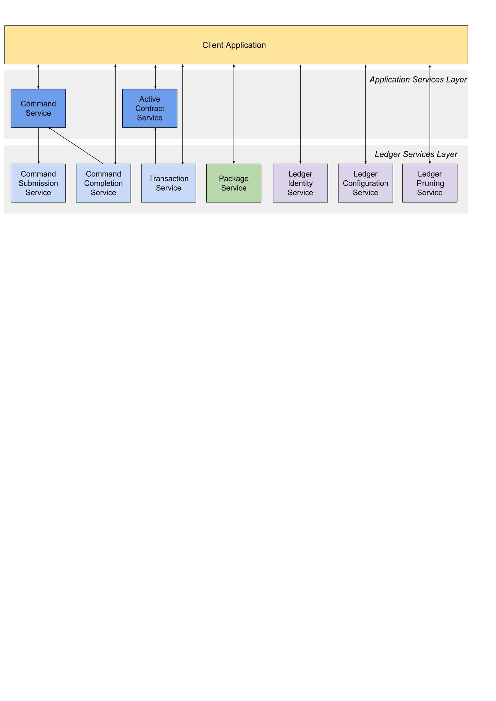

.. Copyright (c) 2021 Digital Asset (Switzerland) GmbH and/or its affiliates. All rights reserved.
.. SPDX-License-Identifier: Apache-2.0

.. _ledger-api-services:
   
The Ledger API services
#######################

The Ledger API is structured as a set of services. The core services are implemented using `gRPC <https://grpc.io/>`__ and `Protobuf <https://developers.google.com/protocol-buffers/>`__, but most applications access this API through the mediation of the language bindings.

This page gives more detail about each of the services in the API, and will be relevant whichever way you're accessing it.

If you want to read low-level detail about each service, see the :doc:`protobuf documentation of the API </app-dev/grpc/proto-docs>`.

Overview
********

The API is structured as two separate data streams:

-  A stream of **commands** TO the ledger that allow an application to submit transactions and change state.
-  A stream of **transactions** and corresponding **events** FROM the ledger that indicate all state changes that have taken place on the ledger.

Commands are the only way an application can cause the state of the ledger to change, and events are the only mechanism to read those changes.

For an application, the most important consequence of these architectural decisions and implementation is that the ledger API is asynchronous. This means:

-  The outcome of commands is only known some time after they are submitted.
-  The application must deal with successful and erroneous command completions separately from command submission.
-  Ledger state changes are indicated by events received asynchronously from the command submissions that cause them.

The need to handle these issues is a major determinant of application architecture. Understanding the consequences of the API characteristics is important for a successful application design.

For more help understanding these issues so you can build correct, performant and maintainable applications, read the :doc:`application architecture guide </app-dev/app-arch>`.

Glossary
========

- The ledger is a list of ``transactions``. The transaction service returns these.
- A ``transaction`` is a tree of ``actions``, also called ``events``, which are of type ``create``, ``exercise`` or ``archive``. The transaction service can return the whole tree, or a flattened list.
- A ``submission`` is a proposed transaction, consisting of a list of ``commands``, which correspond to the top-level ``actions`` in that transaction.
- A ``completion`` indicates the success or failure of a ``submission``.

.. _ledger-api-submission-services:
  
Submitting commands to the ledger
*********************************

.. _command-submission-service:

Command submission service
==========================

Use the **command submission service** to submit commands to the ledger. Commands either create a new contract, or exercise a choice on an existing contract.

A call to the command submission service will return as soon as the ledger server has parsed the command, and has either accepted or rejected it. This does not mean the command has been executed, only that the server has looked at the command and decided that its format is acceptable, or has rejected it for syntactic or content reasons.

The on-ledger effect of the command execution will be reported via the `transaction service <#transaction-service>`__, described below. The completion status of the command is reported via the `command completion service <#command-completion-service>`__. Your application should receive completions, correlate them with command submission, and handle errors and failed commands. Alternatively, you can use the `command service <#command-service>`__, which conveniently wraps the command submission and completion services.

Each intended ledger change is identified by the **change ID**: the triplet of the submitting :ref:`party <com.daml.ledger.api.v1.Commands.party>`, :ref:`application ID <com.daml.ledger.api.v1.Commands.application_id>` and :ref:`command ID <com.daml.ledger.api.v1.Commands.command_id>`.

Commands can be labeled with application-specific IDs, all of which are returned in completion events:

- A :ref:`commandId <com.daml.ledger.api.v1.Commands.command_id>`, returned to the submitting application only. It is generally used to implement this correlation between commands and completions. 
- A :ref:`submissionId <com.daml.ledger.api.v1.Commands.submission_id>`, returned to the submitting application only. It may be used to correlate specific submissions to specific completions.
- A :ref:`workflowId <com.daml.ledger.api.v1.Commands.workflow_id>`, returned as part of the resulting transaction to all applications receiving it. It can be used to track workflows between parties, consisting of several transactions.

For full details, see :ref:`the proto documentation for the service <com.daml.ledger.api.v1.CommandSubmissionService>`.

.. _command-submission-service-deduplication:

Command deduplication
---------------------

The command submission service deduplicates submitted commands based on their change ID:

- Applications can provide a :ref:`deduplication duration <com.daml.ledger.api.v1.Commands.deduplication_duration>` for each command. If this parameter is not set, the default maximum deduplication period is used.
- A command submission is considered a duplicate submission if the ledger server receives the command within the deduplication period of a previous command with the same application ID and command ID from the same submitting party.
- Duplicate command submissions will be ignored until either the deduplication period of the original command has passed or the original submission was rejected (i.e. the command failed and resulted in a rejected transaction), whichever comes first.
- Command deduplication is only *guaranteed* to work if all commands are submitted to the same participant. Ledgers are free to perform additional command deduplication across participants. Consult the respective ledger's manual for more details.
- A command submission will return:

  - The result of the submission (``Empty`` or a gRPC error), if the command was submitted outside of the deduplication period of a previous command with the same change ID on the same participant.
  - The status error ``ALREADY_EXISTS``, if the command was discarded by the ledger server because it was sent within the deduplication period of a previous command with the same change ID.

- If the ledger provides additional command deduplication across participants, the initial command submission might be successful, but ultimately the command can be rejected if the deduplication check fails on the ledger.

For details on how to use command deduplication, see the :ref:`Application Architecture Guide <command-deduplication>`.

.. _command-completion-service:

Command completion service
==========================

Use the **command completion service** to find out the completion status of commands you have submitted.

Completions contain the ``commandId`` of the completed command, and the completion status of the command. This status indicates failure or success, and your application should use it to update what it knows about commands in flight, and implement any application-specific error recovery.

For full details, see :ref:`the proto documentation for the service <com.daml.ledger.api.v1.CommandCompletionService>`.

.. _command-service:

Command service
===============

Use the **command service** when you want to submit a command and wait for it to be executed. This service is similar to the command submission service, but also receives completions and waits until it knows whether or not the submitted command has completed. It returns the completion status of the command execution.

You can use either the command or command submission services to submit commands to effect a ledger change. The command service is useful for simple applications, as it handles a basic form of coordination between command submission and completion, correlating submissions with completions, and returning a success or failure status. This allow simple applications to be completely stateless, and alleviates the need for them to track command submissions.

For full details, see :ref:`the proto documentation for the service <com.daml.ledger.api.v1.CommandService>`.

Reading from the ledger
***********************

.. _transaction-service:

Transaction service
===================

Use the **transaction service** to listen to changes in the ledger state, reported via a stream of transactions.

Transactions detail the changes on the ledger, and contains all the events (create, exercise, archive of contracts) that had an effect in that transaction.

Transactions contain a :ref:`transactionId <com.daml.ledger.api.v1.Transaction.transaction_id>` (assigned by the server), the ``workflowId``, the ``commandId``, and the events in the transaction.

Subscribe to the transaction service to read events from an arbitrary point on the ledger. This arbitrary point is specified by the ledger offset. This is important when starting or restarting and application, and to work in conjunction with the `active contracts service <#active-contract-service>`__.

For full details, see :ref:`the proto documentation for the service <com.daml.ledger.api.v1.TransactionService>`.

Transaction and transaction trees
---------------------------------

``TransactionService`` offers several different subscriptions. The most commonly used is ``GetTransactions``. If you need more details, you can use ``GetTransactionTrees`` instead, which returns transactions as flattened trees, represented as a map of event IDs to events and a list of root event IDs.

.. _verbosity:

Verbosity
---------

The service works in a non-verbose mode by default, which means that some identifiers are omitted:

- Record IDs
- Record field labels
- Variant IDs

You can get these included in requests related to Transactions by setting the ``verbose`` field in message ``GetTransactionsRequest`` or ``GetActiveContractsRequest`` to ``true``.

.. _active-contract-service:

Active contracts service
========================

Use the **active contracts service** to obtain a party-specific view of all contracts currently active on the ledger.

The active contracts service returns the current contract set as a set of created events that would re-create the state being reported. Each created event has a ledger offset where it occurs. You can infer the ledger offset of the contract set from the ledger offset of the last event you receive.

This is most important at application start, if the application needs to synchronize its initial state with a known view of the ledger. Without this service, the only way to do this would be to read the Transaction Stream from the beginning of the ledger, which can be prohibitively expensive with a large ledger.

For full details, see :ref:`the proto documentation for the service <com.daml.ledger.api.v1.ActiveContractsService>`.

Verbosity
---------

See :ref:`verbosity` above.

.. note::

  The RPCs exposed as part of the transaction and active contracts services make use of offsets.

  An offset is an opaque string of bytes assigned by the participant to each transaction as they are received from the ledger.
  Two offsets returned by the same participant are guaranteed to be lexicographically ordered: while interacting with a single participant, the offset of two transactions can be compared to tell which was committed earlier.
  The state of a ledger (i.e. the set of active contracts) as exposed by the Ledger API is valid at a specific offset, which is why the last message your application receives when calling the ``ActiveContractsService`` is precisely that offset.
  In this way, the client can keep track of the relevant state without needing to invoke the ``ActiveContractsService`` again, by starting to read transactions from the given offset.

  Offsets are also useful to perform crash recovery and failover as documented more in depth in the :ref:`application architecture <dealing-with-failures>` page.

  You can read more about offsets in the `protobuf documentation of the API <../app-dev/grpc/proto-docs.html#ledgeroffset>`__.

.. _ledger-api-utility-services:

Utility services
****************

.. _party-service:

Party management service
========================

Use the **party management service** to allocate parties on the ledger and retrieve information about allocated parties.

Allocating parties is necessary to interact with the ledger. For more information, refer to the pages on :doc:`Identity Management</concepts/identity-and-package-management>` and :ref:`the API reference documentation <com.daml.ledger.api.v1.admin.PartyManagementService>`.

.. _package-service:

Package service
===============

Use the **package service** to obtain information about Daml packages available on the ledger.

This is useful for obtaining type and metadata information that allow you to interpret event data in a more useful way.

For full details, see :ref:`the proto documentation for the service <com.daml.ledger.api.v1.PackageService>`.

.. _ledger-identity-service:

Ledger identity service
=======================

Use the **ledger identity service** to get the identity string of the ledger that your application is connected to.

You need to include this identity string when submitting commands. Commands with an incorrect identity string are rejected.

For full details, see :ref:`the proto documentation for the service <com.daml.ledger.api.v1.LedgerIdentityService>`.

.. _ledger-configuration-service:

Ledger configuration service
============================

Use the **ledger configuration service** to subscribe to changes in ledger configuration.

This configuration includes the maximum command deduplication time (see `Command Deduplication <#command-submission-service-deduplication>`__ for details).

For full details, see :ref:`the proto documentation for the service <com.daml.ledger.api.v1.LedgerConfigurationService>`.

.. _version-service:

Version service
============================

Use the **version service** to retrieve information about the Ledger API version.

For full details, see :ref:`the proto documentation for the service <com.daml.ledger.api.v1.VersionService>`.

.. _ledger-api-testing-services:

Pruning service
============================

Use the **pruning service** to prune archived contracts and transactions before or at a given offset.

For full details, see :ref:`the proto documentation for the service <com.daml.ledger.api.v1.admin.ParticipantPruningService>`.

.. _pruning-service:

Testing services
****************

**These are only for use for testing with the Sandbox, not for on production ledgers.**

.. _time-service:

Time service
============

Use the **time service** to obtain the time as known by the ledger server.

For full details, see :ref:`the proto documentation for the service <com.daml.ledger.api.v1.testing.TimeService>`.

.. _reset-service:

Reset service
=============

Use the **reset service** to reset the ledger state, as a quicker alternative to restarting the whole ledger application.

This resets all state in the ledger, *including the ledger ID*, so clients will have to re-fetch the ledger ID from the identity service after hitting this endpoint.

For full details, see :ref:`the proto documentation for the service <com.daml.ledger.api.v1.testing.ResetService>`.

Services diagram
****************

