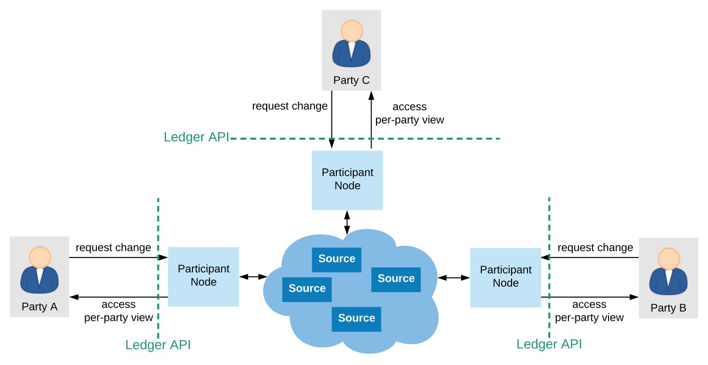
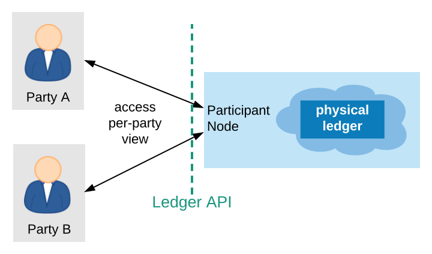

.. Copyright (c) 2020 The DAML Authors. All rights reserved.
.. SPDX-License-Identifier: Apache-2.0

.. _connecting-ledger-model:

Connecting the Ledger Model and the Ledger API
##############################################

This document connects the :ref:`DA ledger model <da-ledgers>` with the :ref:`ledger API services <ledger-api-services>` of the DAML platform.
It explains how the ledger model captures the ledger API services of the DAML platform and what :ref:`guarantees <ledger-api-guarantees>` different :ref:`DAML ledger topologies <daml-ledger-topologies>` provide.
The current version covers the following ledger API services:

* :ref:`transaction service <transaction-service>`
* :ref:`active contract service <active-contract-service>`

It does not yet cover :ref:`submission services <ledger-api-submission-services>`, :ref:`utility services <ledger-api-utility-services>`, and :ref:`testing services <ledger-api-testing-services>`.

The presentation assumes that you are familiar with the following concepts:

* The :ref:`DA ledger model <da-ledgers>`
  
* The :ref:`ledger API services <ledger-api-services>`

* The :ref:`DAML ledger topologies <daml-ledger-topologies>`

   
Multiple domains for the virtual shared ledger
**********************************************

In the DA ledger model, the virtual shared ledger consists of a :ref:`sequence of commits <ledger-structure>`.
Parties can request changes to and access their view of the virtual shared ledger, i.e. the sequence of :ref:`projected commits <da-model-projections>`.

Access happens through the ledger API services of participant nodes.
Participant nodes provide these services by connecting to one or several domains, depending on the :ref:`topology <daml-ledger-topologies>`.
The following picture illustrates this setup.

The components in this diagram are the following:

* There is a set of **domains** for the virtual shared ledger.
  Each domain contributes commits to the virtual shared ledger.

* There is a set of **participants**.
  Each participant is connected to a subset of the **domains**.

* Participant nodes host parties on a subset of the domains they are connected to.
  A participant node's ledger API services provide a party with projected commits from the domains on which it hosts the party.

Examples
========

In :ref:`global state topologies <global-state-topologies>`, at least one system contains a physical copy of the entire virtual shared ledger.
Accordingly, these topologies need only one domain for the virtual shared ledger, namely such a system.
In a :ref:`fully centralized ledger <fully-centralized-ledger>`, there is by definition only one such system.
Accordingly, this system is the single domain for the virtual shared ledger.
So the participant node contains the physical ledger.

A single domain also suffices for :ref:`horizontally scaled <scaling-daml-ledgers>` and :ref:`replicated setups <daml-ledger-replication>`.
Replication and concensus ensures that all writer nodes agree on the contents of the virtual shared ledger.
Conceptually, they form a single domain even though participants may connect only to a subset of the writer nodes.

Multiple domains appear with interoperability in :ref:`partitioned ledger topologies <partitioned-topologies>`.
Interoperability makes it possible that an atomic transaction uses the output contracts of transactions that have been recorded to different deployed ledgers.
For example, when an organization initially deploys two workflows to two ledgers, it can later compose those workflows into a larger workflow that spans the deployed ledger.
In this setup, each deployed ledger constitutes a domain for the virtual shared ledger.
Multiple domains can also be used to improve horizontal scaling of the atomic commit protocol.
Participants participate only in the commit protocols of the domains they are connected to and the commit protocols of different domains can often run in parallel.
The next diagram shows a such situation where party `A` is hosted on two participant nodes `P1` and `P2` and party `B` is hosted on `P3`.
The virtual shared ledger is fed from three domains.
The arrows indicate that `P1` hosts `A` on domains 1 and 3 and `P2` on domains 1 and 2 and `P3` hosts `B` on all three.

.. figure:: ./images/multiple-domains.svg
   :align: center
   :name: multiple-domains

   Virtual shared ledger topology with three domains

A view on the virtual shared ledger
***********************************

When a participant hosts a party only on a subset of the domains for the vitual shared ledger,
then the participant's transaction and active contract services are derived only from commits from those domains.
A participant therefore provides each hosted party with a **view** on their projection of the virtual shared ledger.
The view consists of all the commits that originate from the domains on which the participants hosts the party.
This view determines what the party will see on the participant's transaction service and the active contract service.
In practice, the participant assembles the commits from the different domains into the party's view.
In the following, we assume that the virtual shared ledger annotates all commits with the originating domain.

In the :ref:`above example <multiple-domains>`, when a transaction creates a contract with stakeholder `A` on domain 2, then this transaction is in `P2`\ 's view for `A`, but not in `P1`\ 's.
Accordingly, `P2` outputs the transaction and the create event on `A`\ 's event stream and reports the contract as active.
In contrast, `P1` will neither output the event nor report the contract as active, as `P1` is not connected to domain 2.

Contracts entering and leaving a view
=====================================

For interoperability, it is important that a transaction can use a contract whose creation comes from a different domain.
In the :ref:`above example <multiple-domains>`, one transaction can create a contract with stakeholder `A` on domain 1 and another archives the contract on domain 2.
Then participant `P1` outputs the ``CreatedEvent``, but not the ``ArchiveEvent`` on the transaction service.
Conversely, when one transaction creates a contract with stakeholder `A` on domain 3 and another archives the contract on domain 1, then `P2` outputs the ``ArchivedEvent``, but not the ``CreateEvent``.

To keep the transaction stream consistent, `P1` additionally outputs a ``LeftViewEvent`` on `A`\ 's transaction stream.
This event signals that the participant no longer outputs events concerning this contract; in particular not when the contract is archived.
The contract is no longer reported in the active contract service and cannot be used by command submissions.

Conversely, `P2` outputs an ``EnteredViewEvent``\ s some time before the ``ArchivedEvent`` on the transaction stream.
This event signals that the participant starts outputting events concerning this contract.
The contract is reported in the active contract service and can be used by command submission.
The ``EnteredViewEvent`` contains all the information in a ``CreatedEvent``;
the only difference is that ``EnteredViewEvent``\ s may occur several times whereas there should be only at most one ``CreatedEvent`` for each contract.

These events are generated when the underlying commit protocol synchronizes between the different domains.
This may happen as part of command submission or for other reasons, e.g., load balancing.
It is guaranteed that the ``EnteredViewEvent`` precedes contract usage, subject to the trust assumptions of the underlying ledger.

A contract may enter and leave the view of a participant several times.
For example, suppose that party `B` submits the following commands and their commits end up on the given domains.

#. Create a contract `c` with stakeholders `A` and `B` on domain 2
#. Exercise a non-consuming choice `ch1` on `c` on domain 1.
#. Exercise a non-consuming choice `ch2` on `c` on domain 2.
#. Exercise a consuming choice on `c` on domain 1.

Then, the transaction tree stream that `P1` provides for `A` contains five events around contract `c`: ``EnteredViewEvent``, ``ExercisedEvent``, ``LeftViewEvent``, ``EnteredViewEvent``, ``ArchivedEvent``.
These five events can be grouped into between two or five transactions.
For example, the first three and the last two could be batched into one transaction each.
However, `P1` cannot combine the ``LeftViewEvent`` with the subsequent ``EnteredViewEvent`` and `P1` must not elide them either.
This is because their presence indicates that `P1`\ 's view may miss some events in between; in this example, exercising the choice `ch2`.

The flat transaction stream by `P1` shows omits the non-consuming exercise choices.
It nevertheless contains the three view change events ``EnteredViewEvent``, ``LeftViewEvent``, and ``EnteredViewEvent`` before the ``ArchivedEvent``.
This is because the participant cannot know at the ``LeftViewEvent`` that there will be another ``EnteredViewEvent``.

In contrast, `P2` need not output the ``EnteredViewEvent``\ s and ``LeftViewEvent``\ s at all in this example because `P2` hosts `A` on both domains.

Relaxing the total ordering
***************************

The virtual shared ledger and the transaction service put all transactions into a linear sequence.
However, when two transactions are committed on different domains, there is no pre-determined order between them.
Establishing such an order would incur additional synchronization, which hinders scalability.
Different participants can therefore output events in different orders if these events do not causally depend on each other from the party's perspective.
This section defines :ref:`causality <ledger-causality-party>` and illustrates the allowed and disallowed reorderings of commits by :ref:`examples <ledger-causality-examples>`.

.. _ledger-causality-party:

Causality
=========

Causality is defined on the commits in a party's projection of the virtual shared ledger.

Definition »synchronizes with«
  An action `act`\ :sub:`1` **synchronizes with** an action `act`\ :sub:`2` for party `A` if one of the following holds:

  * **Create-use:**
    `act`\ :sub:`1` creates the contract `c` and `act`\ :sub:`2` uses the contract, i.e., `act`\ :sub:`2` is a **Fetch** or an **Exercise** on `c` and `A` is a stakeholder of `c` and an informee of `act`\ :sub:`2`.
 
  * **Use-use:**
    `act`\ :sub:`1` and `act`\ :sub:`2` both use a contract `c` and `A` is a stakeholder of `c` and an informee of both actions.

  * **Contract keys**:
    `act`\ :sub:`1` and `act`\ :sub:`2` both are actions on a key `k` and `A` is a maintainer of `k`.

Definition »causal order«
  A commit `C`\ :sub:`2` **causally depends on** another commit `C`\ :sub:`1` for party `A` if all of the following holds:
  * `C`\ :sub:`1` precedes `C`\ :sub:`2` on the virtual shared ledger.
  * They contain actions `act`\ :sub:`2` and `act`\ :sub:`1` such that `act`\ :sub:`1` synchronizes with `act`\ :sub:`2` for party `A`.
  
  A commit `C`\ :sub:`1` is **causally ordered** before `C`\ :sub:`2` for `A` if `C`\ :sub:`2` causally depends on `C`\ :sub:`1` for `A` or if there is another commit `C'` in `A`\ 's projection such that `C`\ :sub:`1` is causally ordered before `C'` for `A` and `C'` is causally ordered before `C`\ :sub:`2` for `A`.

.. note::
   The synchronizes with relationship is not symmetric.
   If `act`\ :sub:`1` uses a contract and `act`\ :sub:`2` creates it, then `act`\ :sub:`1` does not synchronize with `act` :sub:`2`.
   This is in line with how the concept is used in programming languages: writes to a memory location synchronize with reads, but reads do not synchronize with writes.
   This asymmetry does not matter for the causal ordering in a consistent ledger as **Create**\ s precede usages on such a ledger.
  
.. _ledger-api-guarantees:
  
Ledger API ordering guarantees
==============================

Subject to the trust assumptions of the deployed ledger,
if a party `A` is hosted on participant,
the participant's transaction service output satisfy the following guarantees:

#. The transaction trees on the transaction tree stream are precisely those that are in the participant's view for `A`.
   This excludes ``LeftViewEvent``\ s and ``EnteredViewEvent``\ s because they are not part of the virtual shared ledger.
#. The flat transaction stream contains precisely the ``CreatedEvent``\ s and ``ArchivedEvent``\ s that are in the participant's view of the virtual shared ledger and which act on contracts where `A` is a stakeholder.
#. If `C`\ :sub:`1` is causally ordered before `C`\ :sub:`2` in `A`\ 's projection of the virtual shared ledger, then the events from `C`\ :sub:`1` precede the events from `C`\ :sub:`2` in either stream for `A`.

Similarly, the active contract service provides the set of contracts that are active at the returned offset according to the transaction service output.
That is, the effects of all events from the transaction event stream are taken into account in the provided set of contracts.
In particular, an application can process all subsequent events from the flat transaction stream or the transaction tree stream without having to take events before the snapshot into account.

Ledger implementations typically provide stronger ordering guarantees.
Global state topologies tend to ensure that all participants output all events in the same order, not only causally ordered one.

.. _ledger-causality-examples:

Examples
========

This section illustrates the :ref:`ledger API ordering guarantees <ledger-api-guarantees>` by example.
The examples use the paint counteroffer workflow from the DA ledger model's :ref:`privacy section <da-model-privacy>`.
Recall that :ref:`the party projections <da-paint-counteroffer-example>` are as follows:

.. https://www.lucidchart.com/documents/edit/c4df0455-13ab-415f-b457-f5654c2684be
.. image:: ./ledger-model/images/divulgence-for-disclosure-counteroffer.svg
   :align: center
   :width: 100%

#. *When two parties are stakeholders on the same contract,
   then they see creation and archival in the same order.*
   
   In the example, the creation of the `CounterOffer A P Bank` synchronizes with the painter exercising the consuming choice on the `CounterOffer` for both Alice and the painter by the **create-use** rule, since they both are stakeholders on the contract.
   Accordingly, Alice will see the creation before the archival on her transaction stream and so will the painter.
   This does not depend on whether they are hosted on the same participant or whether the **Create** comes from the same domain as the **Exercise**.

#. *Actions within a commit cannot be reordered.*
   
   The **Create** of the Iou by the Bank synchronizes with the **Fetch** of the `Iou` in Alice's commit by the **create-use** rule.
   Alice will therefore see the creation of the `Iou` before the creation of the `CounterOffer`,
   because the `CounterOffer` is created in the same commit as the **Fetch** of the `Iou`.
   
#. *Out-of-band causality is not respected.*

   From now on, we consider the workflow where Alice splits up her commit into two as follows:

   .. image:: ./images/counteroffer-split-commit.svg
      :align: center
      :width: 100%
   
   Alice can specify in the `CounterOffer` the Iou that she wants to pay the painter with.
   In an deployed implementation, Alice's application first observes the created `Iou` contract via the transaction service or active contract service before she requests to create the `CounterOffer`.
   Such application logic does not induce a causal ordering between commits.
   So the creation of the `CounterOffer` is not causally ordered w.r.t. the creation of the `Iou`.
   
   If Alice is hosted on several participants, the participants can therefore output the two creations in either order.
   This can happen when the two commits come from different domains in a partitioned ledger topology.

   The rationale for this behaviour is that Alice could have learnt about the contract ID out of band or made it up.
   The participants therefore cannot know whether there will be a **Create** event for the contract ever.
   So if participants delayed outputting the **Create** action for the `CounterOffer` until a **Create** event for the `Iou` contract was published, this delay might last forever and liveness is lost.
   Causality therefore does not capture data flow through applications.
   
#. *Divulged actions do not induce causal order.*

   The painter witnesses the fetching of Alice's `Iou` when the `ShowIou` contract is archived.
   The painter also witnesses archival of the `Iou` when Alice exercises the transfer choice as a consequence of the painter accepting the `CounterOffer`.
   However, the **use-use** rule does not apply as the painter is not a stakeholder of the `Iou`.
   Consider a setup where the painter is hosted several participants on several domains.
   He sees the divulged `Iou` and the created `CounterOffer` through one participant's transaction tree stream, but they originate from different domains.
   His subsequent exercise of the `Accept` choice may end up on the same domain as the `CounterOffer`.

   As in the previous example, the other participant that hosts the painter does not know about the dependence of the two commits.
   The accepting transaction essentially divulges the `Iou` contract again.
   Accordingly, this participant may output the accepting transaction *before* the `ShowIou` contract.
   In this case, the archival of the `Iou` comes before the **Fetch** of the same `Iou` on the transaction stream.
   
   Even though this may seem unexpected, it is in line with stakeholder-based ledgers:
   Since the painter is not a stakeholder of the `Iou` contract, he should not care about the archivals or creates of the contract.
   In fact, the divulged `Iou` contract does not show up in the painter's active contract service or in the flat transaction stream.
   Such witnessed events are included in the transaction tree stream as a convenience:
   They relieve the painter from computing the consequences of the choice and enable him to check that the action conforms to the model.

   By a similar argument, being an actor of an **Exercise** action induces causal order with respect to other uses of the contract only if the actor is a contract stakeholder.
   This is because non-stakeholder actors of an **Exercise** action authorize the action, but they have no say in whether the contract is active; this is the signatories' job.
   
#. *Causality depends on the party.*

   By the previous example, for the painter, fetching the `Iou` is not causally ordered before transferring the `Iou`.
   For Alice, however, the **Fetch** is causally ordered before the **Exercise** by the **use-use** rule
   because Alice is a stakeholder on the `Iou` contract.
   This shows that causal ordering depends on the party.
   Even if both Alice and the painter are hosted on the same participant,
   the acceptance transaction can precede the `ShowIou` transaction in `Bob`\ 's transaction stream.
 
