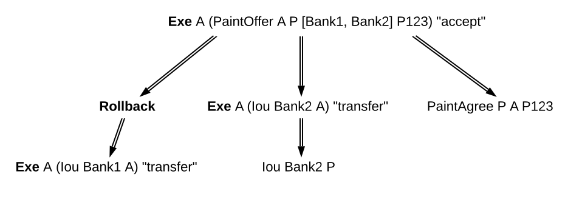
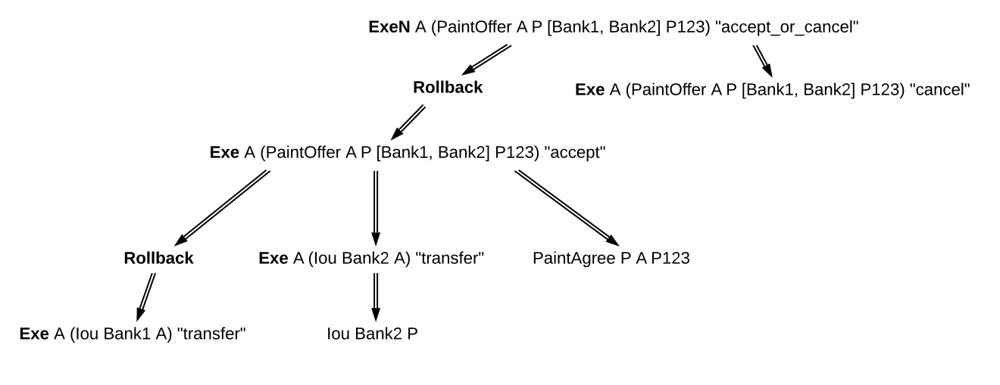
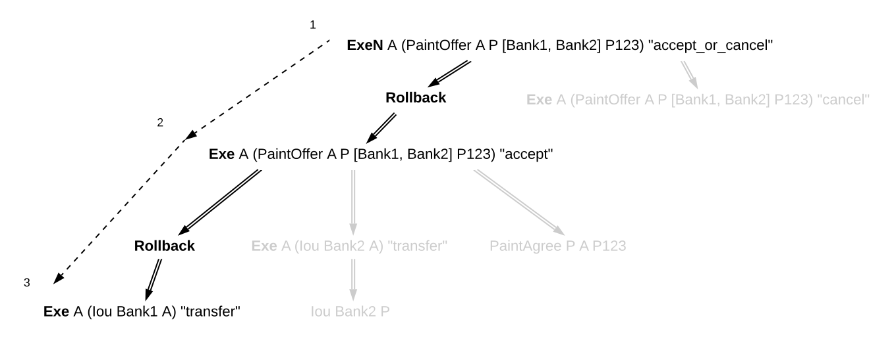
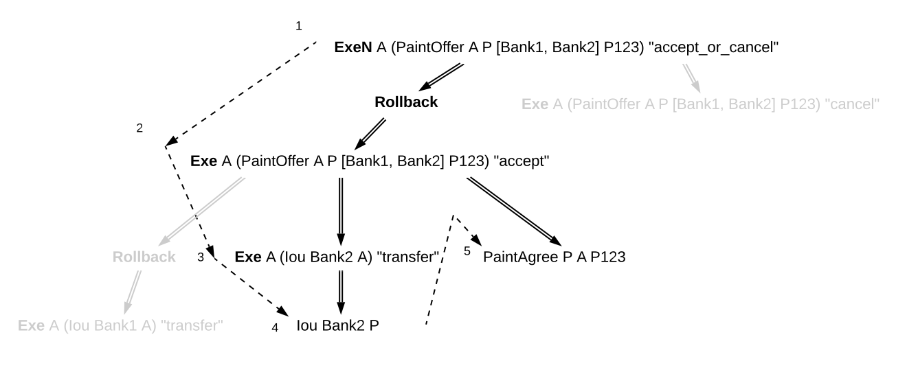
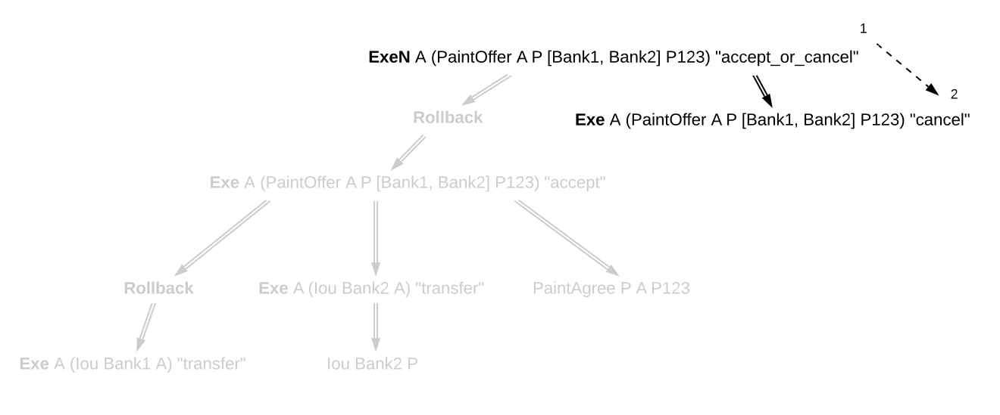
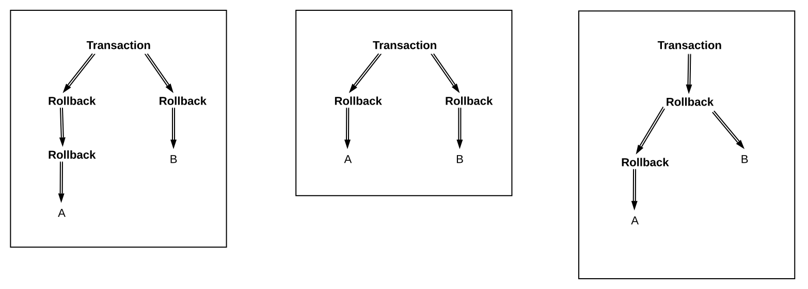
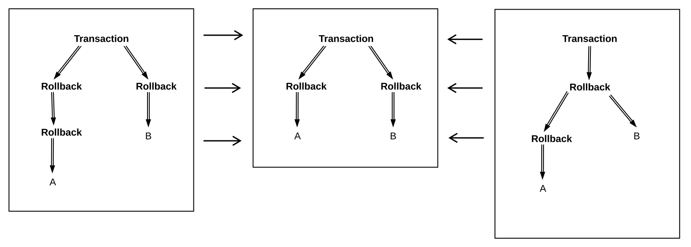
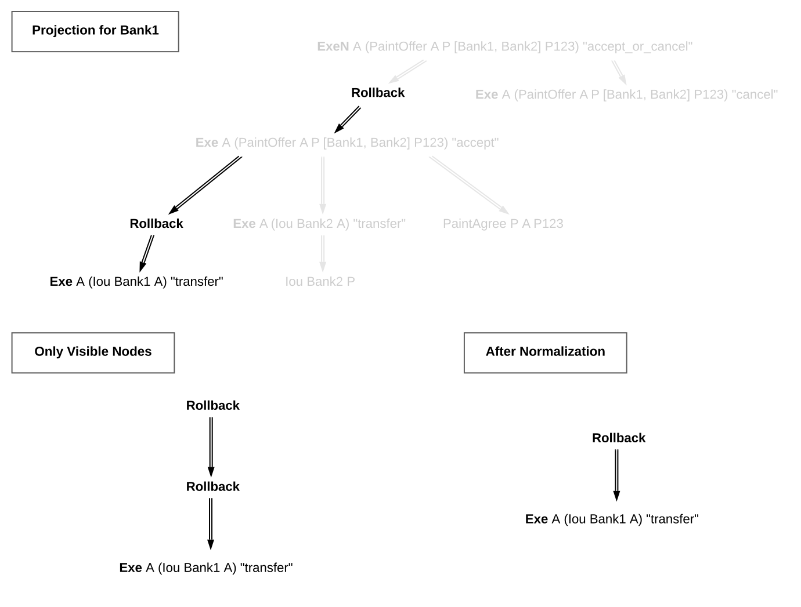
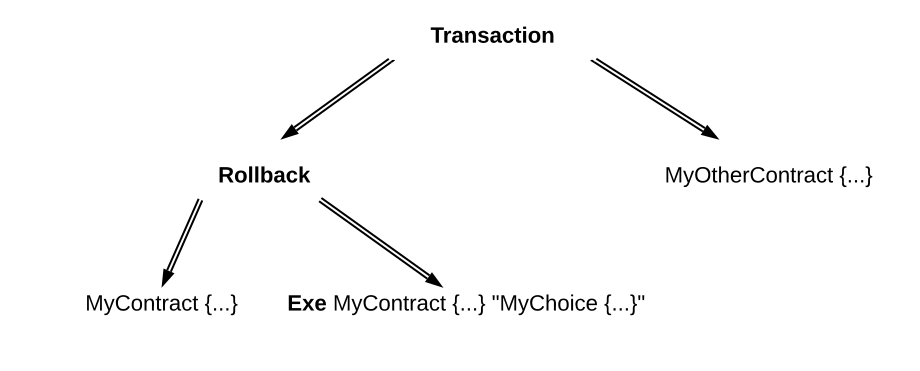

.. Copyright (c) 2022 Digital Asset (Switzerland) GmbH and/or its affiliates. All rights reserved.
.. SPDX-License-Identifier: Apache-2.0

.. _da-model-exceptions:

Exceptions
##########

The introduction of exceptions, a new Daml feature, has many implications
for the ledger model. This page describes the changes to the ledger model
introduced as part of this new feature.

..
   SF: Once the dust settles on exceptions, these changes should be
   incorporated into the rest of the ledger model.

Structure
*********

Under the new feature, Daml programs can raise and catch exceptions.
When an exception is caught in a `catch` block, the subtransaction
starting at the corresponding `try` block is rolled back.

To support this in our ledger model, we need to modify the transaction
structure to indicate which subtransactions were rolled back. We do this
by introducing **rollback nodes** in the transaction. Each rollback node
contains a rolled back subtransaction. Rollback nodes are not considered
ledger actions.

Therefore we define transactions as a list of **nodes**, where
each node is either a ledger action or a rollback node. This is reflected
in the updated EBNF grammar for the transaction structure:

.. code-block:: none

   Transaction  ::= Node*
   Node         ::= Action | Rollback
   Rollback     ::= 'Rollback' Transaction
   Action       ::= 'Create' contract
                  | 'Exercise' party* contract Kind Transaction
                  | 'Fetch' party* contract
                  | 'NoSuchKey' key
   Kind         ::= 'Consuming' | 'NonConsuming'

Note that `Action` and `Kind` have the same definition as before, but
since `Transaction` may now contain rollback nodes, this means that an
`Exercise` action may have a rollback node as one of its consequences.

For example, the following transaction contains a rollback node inside
an exercise. It represents a paint offer involving multiple banks.
The painter P is offering to paint A's house as long as they receive
an Iou from Bank1 or, failing that, from Bank2. When A accepts, they
confirm that transfer of an Iou via Bank1 has failed for some reason,
so they roll it back and proceed with a transfer via Bank2:

.. https://lucid.app/lucidchart/fb34c83b-8db7-4063-83f1-38e796225fe4/edit

Note also that rollback nodes may be nested, which represents a situation
where multiple exceptions are raised and caught within the same transaction.

For example, the following transaction contains the previous one under a
rollback node. It represents a case where the "accept" has failed at the last
moment, for some reason, and a "cancel" exercise has been issued in response.

.. https://lucid.app/lucidchart/8f18f7be-89b8-42f9-93a2-b995a5030a9e/edit

Consistency
***********

In the previous section on :ref:`consistency <da-model-consistency>`,
we defined a "before-after" relation on ledger actions. This notion needs
to be revised in the presence of rollback nodes. It is no longer enough to
perform a preorder traversal of the transaction tree, because the actions under a
rollback node cannot affect actions that appear later in the transaction tree.

For example, a contract may be consumed by an exercise under a rollback node,
and immediately again after the rollback node. This is allowed because the
exercise was rolled back, and this does not represent a "double spend" of
the same contract. You can see this in the nested example above, where
the PaintOffer contract is consumed by an "agree" exercise, which is rolled
back, and then by a "cancel" exercise.

So, we now define the "before-after" relation as a partial order, rather than a
total order, on all the actions of a transaction. This relation is defined
as follows: `act1` comes before `act2` (equivalently, `act2` comes after `act1`)
if and only if `act1` appears before `act2` in a preorder traversal of the
transaction tree, and any rollback nodes that are ancestors of `act1` are
also ancestors of `act2`.

With this modified "before-after" relation, the notion of internal consistency
remains the same. Meaning that, for example, for any contract `c`, we still
forbid the creation of `c` coming after any action on `c`, and we forbid any
action on `c` coming after a consuming exercise on `c`.

In the example above,  neither consuming exercise comes "after" the other.
They are part of separate "continuities", so they don't introduce inconsistency.
Here are three continuities implied by the "before-after" relation. The first:

The second:

.. https://lucid.app/lucidchart/f1f92199-ae41-4de2-b1bf-0925d3ab89c9/edit

And the third:

.. https://lucid.app/lucidchart/77d97798-8651-41dc-bb8b-abecf05f81bb/edit

As you can see, in each of these continuities, no contract was consumed twice.

Transaction Normalization
*************************

The same "before-after" relation can be represented in more than one way using
rollback nodes. For example, the following three transactions have the same
"before-after" relation among their ledger actions (`act1`, `act2`, and `act3`):

.. https://lucid.app/lucidchart/3aa5922f-ec30-4896-8bbc-56703549c7e5/edit

Because of this, these three transactions are equivalent.
More generally, two transactions are equivalent if:

- The transactions are the same when you ignore all rollback nodes. That is,
  if you remove every rollback node and absorb its children into its parent,
  then two transactions are the same. Equivalently, the transactions have
  the same ledger actions with the same preorder traversal and subaction relation.

- The transactions have the same "before-after" relation between their actions.

- The transactions have the same set of "rollback children".
  A "rollback child" is an action whose direct parent is a rollback node.

For all three transactions above, the "transaction tree ignoring rollbacks"
consists only of top-level actions (`act1`, `act2`, and `act3`), the
"before-after" relation only says that `act2` comes before `act3`,
and all three actions are rollback children. Thus all three transactions
are equivalent.

**Transaction normalization** is the process by which equivalent transactions
are converted into the same transaction. In the case above, all three
transactions become the transaction in the middle when normalized.

.. https://lucid.app/lucidchart/8a5a09a1-5473-4abf-a72a-57bf03b56794/edit

To normalize a transaction, we apply three rules repeatedly across the whole transaction:

1. If a rollback node is empty, we drop it.

2. If a rollback node starts with another rollback node, for instance:

   .. code-block:: none

     'Rollback' [ 'Rollback' tx , node1, ..., nodeN ]

   Then we re-associate the rollback nodes, bringing the inner rollback node out:

   .. code-block:: none

     'Rollback' tx, 'Rollback' [ node1, ..., nodeN ]

3. If a rollback node ends with another rollback node, for instance:

   .. code-block:: none

     'Rollback' [ node1, ..., nodeN, 'Rollback' [ node1', ..., nodeM' ] ]

   Then we flatten the inner rollback node into its parent:

   .. code-block:: none

     'Rollback' [ node1, ..., nodeN, node1', ..., nodeM' ]

In the example above, using rule 3 we can turn the left transaction into the middle
transaction, and using rule 2 we can turn the right transaction into the middle
transaction. None of these rules apply to the middle transaction, so it is already
normalized.

In the end, a normalized transaction cannot contain any rollback node that starts
or ends with another rollback node, nor may it contain any empty rollback nodes.
The normalization process minimizes the number of rollback nodes and their depth
needed to represent the transaction.

To reduce the potential for information leaks, the ledger model must only
contain normalized transactions. This also applies to projected transactions.
An unnormalized transaction is always invalid.

Authorization
*************

Since they are not ledger actions, rollback nodes do not have authorizers
directly. Instead, a ledger is well-authorized exactly when the same ledger
with rollback nodes removed (that is, replacing the rollback nodes with
their children) is well-authorized, according to
:ref:`the old definition <da-ledgers-authorization-rules>`.

This is captured in the following rules:

- When a rollback node is authorized by `p`, then all of its children are
  authorized by `p`. In particular:

  - Top-level rollback nodes share the authorization of the requestors of
    the commit with all of its children.

  - Rollback nodes that are a consequence of an exercise action `act` on a
    contract `c` share the authorization of the signatories of `c` and the
    actors of `act` with all of its children.

  - A nested rollback node shares the authorization it got from its parent
    with all of its children.

- The required authorizers of a rollback node are the union of all
  the required authorizers of its children.

Privacy
*******

Rollback nodes also have an interesting effect on the notion of privacy in
the ledger model. When projecting a transaction for a party `p`, it's
necessary to preserve some of the rollback structure of the transaction,
even if `p` does not have the right to observe every action under it. For
example, we need `p` to be able to verify that a rolled back exercise
(to which they are an informee) is conformant, but we also need `p` to
know that the exercise was rolled back.

We adjust the definition of projection as follows:

1. For a ledger action, the projection for `p` is the same as it was before.
   That is, if `p` is an informee of the action, then the entire subtree is
   preserved. Otherwise the action is dropped, and the action's consequences
   are projected for `p`.

2. For a rollback node, the projection for `p` consists of the projection
   for `p` of its children, wrapped up in a new rollback node. In other
   words, projection happens under the rollback node, but the node is
   preserved.

After applying this process, the transaction must be normalized.

Consider the deeply nested example from before. To calculate the projection
for Bank1, we note that the only visible action is the bottom left exercise.
Removing the actions that Bank1 isn't an informee of, this results in a
transaction containing a rollback node, containing a rollback node, containing
an exercise. After normalization, this becomes a simple rollback node
containing an exercise. See below:

.. https://lucid.app/lucidchart/1714e8d2-0c2d-4bbf-9b48-2266b2cd6c9d/edit

The privacy section of the ledger model makes a point of saying that a
contract model should be **subaction-closed** to support projections. But
this requirement is not necessarily true once we introduce rollbacks.
Rollback nodes may contain actions that are not valid as standalone actions,
since they may have been interrupted prematurely by an exception.

Instead, we require that the contract model be **projection-closed**, i.e.
closed under projections for any party 'p'. This is a weaker requirement
that matches what we actually need.

Relation to Daml Exceptions
***************************

Rollback nodes are created when an exception is thrown and caught within
the same transaction. In particular, any exception that is caught within
a try-catch will generate a rollback node if there are any ledger actions
to roll back. For example:

.. code-block:: daml

   try do
     cid <- create MyContract { ... }
     exercise cid MyChoice { ... }
     throw MyException
   catch
     MyException ->
       create MyOtherContract { ... }

This Daml code will try to create a contract, and exercise a choice on this
contract, before throwing an exception. That exception is caught immediately,
and then another contract is created.

Thus a rollback node is created, to reset the ledger to the state it had
at the start of the "try" block. The rollback node contains the create and
exercise nodes. After the rollback node, another contract is created.
Thus the final transaction looks like this:

.. https://lucid.app/lucidchart/2d48d3db-bfcd-4936-b3f2-efe29470b2b6/edit

Note that rollback nodes are only created if an exception is *caught*. An
uncaught exception will result in an error, not a transaction.

After execution of the Daml code, the generated transaction is normalized.
