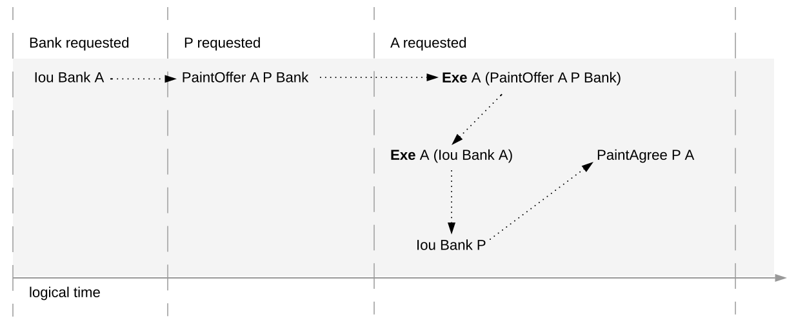
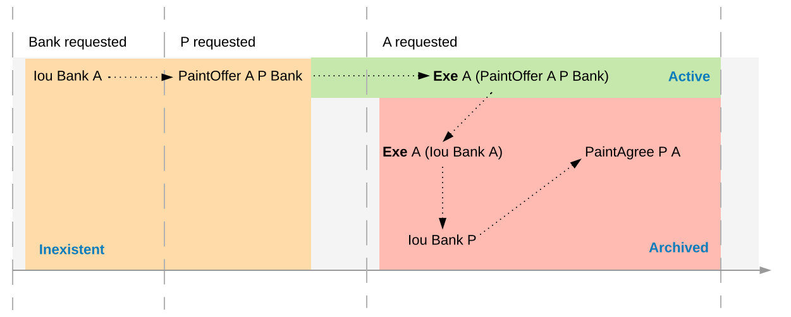
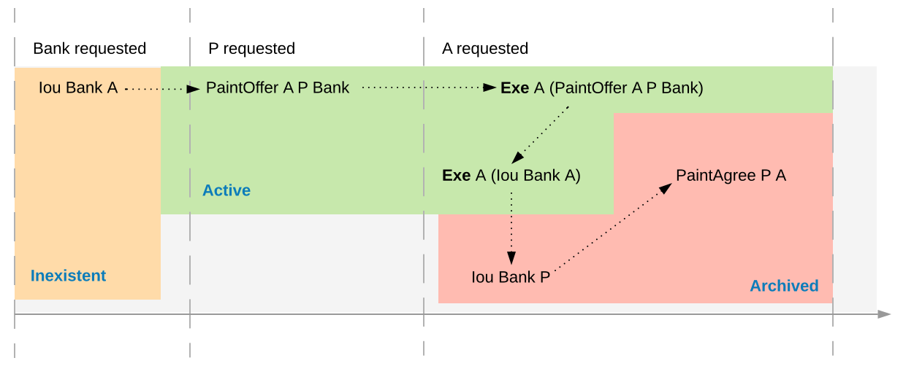
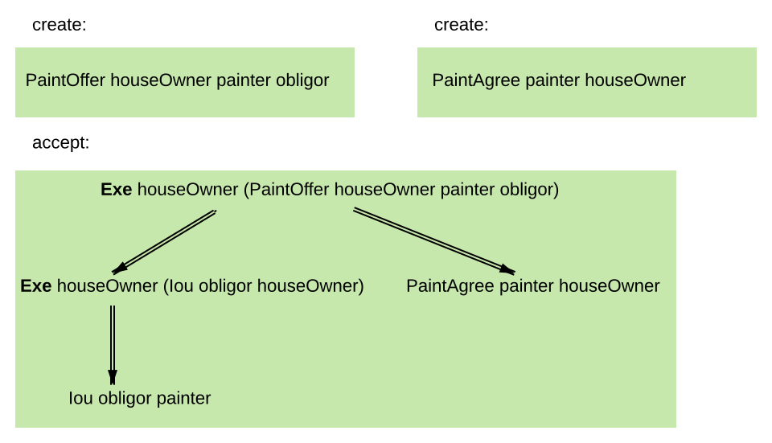
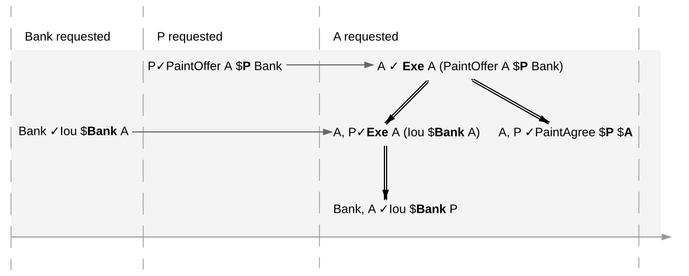
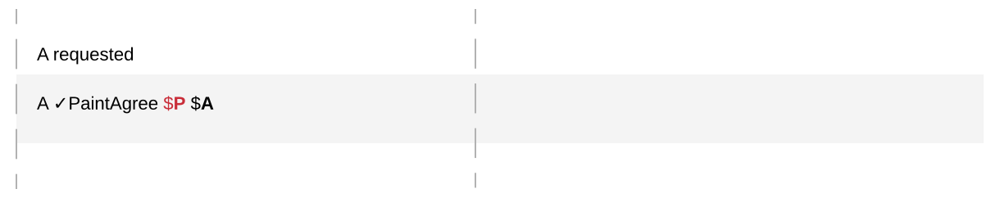

.. Copyright (c) 2019 Digital Asset (Switzerland) GmbH and/or its affiliates. All rights reserved.
.. SPDX-License-Identifier: Apache-2.0

.. _da-model-integrity:

Integrity
---------

This section addresses the question of who can request which
changes.

.. _da-model-validity:

Valid Ledgers
+++++++++++++

At the core is the concept of a *valid ledger*; changes
are permissible if adding the corresponding commit to the
ledger results in a valid ledger. **Valid ledgers** are
those that fulfill three conditions:

:ref:`da-model-consistency`
   Exercises on inactive contracts are not allowed, i.e.
   contracts that have not yet been created or have already been
   consumed by an exercise.
:ref:`da-model-conformance`
   Only a restricted set of actions is allowed on a given contract.
:ref:`da-model-authorization`
   The parties who may request a particular change are restricted.

Only the last of these conditions is dependent on the party (or
parties) requesting the change; the other two are general.


.. _da-model-consistency:

Consistency
+++++++++++

Intuitively, consistency requires contracts to be created before
they are used, and that they cannot be used once they are consumed.
To define this precisely, notions of "before" and "after" are needed.
These are given by putting all actions in a sequence. Technically, the
sequence is obtained by a pre-order traversal of the ledger's actions,
noting that these actions form an (ordered) forest. Intuitively, it is obtained
by always picking parent actions before their proper subactions, and otherwise
always picking the actions on the left before the actions on the right. The image
below depicts the resulting order on the paint offer example:

.. https://www.lucidchart.com/documents/edit/1ef6debb-b89a-4529-84b6-fc2c3e1857e8


In the image, an action `act` happens before action `act'` if there is
a (non-empty) path from `act` to `act'`.
Then, `act'` happens after `act`.
A ledger is **consistent for a contract c** if all of the following holds for all actions `act` on `c`:

#. either `act` is itself **Create c** or a **Create c** happens before `act`
#. `act` does not happen before any **Create c** action
#. `act` does not happen after any exercise consuming `c`.

A ledger is **consistent** if it is consistent for all contracts.

The consistency condition rules out the double spend example.
As the red path below indicates, the second exercise in the example happens after a consuming exercise on the same
contract, violating the consistency criteria.

.. https://www.lucidchart.com/documents/edit/c6113536-70f4-42a4-920d-3c9497f8f7c4
.. image:: ./images/consistency-banning-double-spends.svg
   :align: center
   :width: 100%

The above consistency requirement is too strong for actions and transactions
in isolation.
For example, the acceptance transaction from the paint offer example is not consistent, because `PaintOffer A P Bank`
and the `Iou Bank A` contracts are used without being created before:

.. image:: ./images/action-structure-paint-offer.svg
   :align: center
   :width: 60%

However, the transaction can still be appended to a ledger
that creates these contracts and yield a consistent ledger. Such
transactions are said to be internally consistent,
and contracts such as the `PaintOffer A P Bank` and `Iou Bank A` are called
input contracts of the transaction.
Dually, output contracts of a transactions are the contracts that a transactions creates and does not archive.

.. _def-internal-consistency:

Definition »internal consistency«
  A transaction is **internally consistent for a contract c** if the following holds for all of its subactions `act` on the contract `c`

  #. `act` does not happen before any **Create c** action
  #. `act` does not happen after any exercise consuming `c`.

  A transaction is **internally consistent** if it is internally
  consistent for all contracts `c`.

.. _def-input-contract:

Definition »input contract«
  For an internally consistent transaction,
  a contract `c` is an **input contract** of the transaction
  if the transaction contains an **Exercise** or a **Fetch** action on `c` but not a **Create c** action.

.. _def-output-contract:

Definition »output contract«
  For an internally consistent transaction,
  a contract `c` is an **output contract** of the transaction
  if the transaction contains a **Create c** action, but no a consuming **Exercise** action on `c`.

Note that
the input and output contracts are undefined for transactions that are not
internally consistent. The image below shows some examples of internally consistent
and inconsistent transactions.

.. figure:: ./images/internal-consistency-examples.svg
   :align: center
   :width: 100%

   The first two transactions violate the conditions of internally consistency.
   The first transaction creates the `Iou` after exercising it consumingly, violating both conditions.
   The second transaction contains a (non-consuming) exercise on the `Iou` after a consuming one, violating the second condition.
   The last transaction is internally consistent.

.. _def-contract-state:

In addition to the consistency notions, the before-after relation on actions can also be used to define the notion of
**contract state** at any point in a given transaction.
The contract state is changed by creating the contract and by exercising it consumingly.
At any point in a transaction, we can then define the latest state change in the obvious way.
Then, given a point in a transaction, the contract state of `c` is:

#. **active**, if the latest state change of `c` was a create;

#. **archived**, if the latest state change of `c` was a consuming exercise was;

#. **inexistent**, if `c` never changed state.

A ledger is consistent for `c` exactly if **Exercise** and **Fetch** actions on `c` happen only when `c` is active, and **Create**
actions only when `c` is inexistent.
The figures below visualize the state of different contracts at all points in the example ledger.

.. https://www.lucidchart.com/documents/edit/19226d95-e8ba-423a-8546-e5bae6bd3ab7


   Activeness of the `PaintOffer` contract

.. https://www.lucidchart.com/documents/edit/19226d95-e8ba-423a-8546-e5bae6bd3ab7


   Activeness of the `Iou Bank A` contract

The notion of order can be defined on all the different ledger structures: actions, transactions, lists of transactions,
and ledgers.
Thus, the notions of (internal) consistency, inputs and outputs, and contract state can also all be defined on all these
structures.
The **active contract set** of a ledger is the set of all contracts
that are active on the ledger. For the example above, it consists
of contracts `Iou Bank P` and `PaintAgree P A`.


.. _`da-model-conformance`:

Conformance
+++++++++++

The *conformance* condition constrains the actions that may occur on the
ledger. This is done by considering a **contract model** `M` (or a **model** for short),
which specifies the set of all possible actions. A ledger is **conformant to M**
(or conforms to M) if all top-level actions on the ledger are members of `M`.
Like consistency, the notion of conformance does not depend on the requesters of
a commit, so it can also be applied to transactions and lists of transactions.

For example, the set of allowed actions on IOU contracts could be
described as follows.

.. https://www.lucidchart.com/documents/edit/e181e9fc-634c-49e3-911e-a07b5da28bf8/0
.. image:: ./images/models-simple-iou.svg
   :align: center
   :width: 80%

The boxes in the image are templates in the sense that the contract
parameters in a box (such as
obligor or owner) can be instantiated by arbitrary values of the
appropriate type. To facilitate understanding, each box includes a label
describing the intuitive purpose of the corresponding set of actions.
As the image suggest, the transfer box imposes the
constraint that the bank must remain the same both in the exercised
IOU contract, and in the newly created IOU contract. However, the
owner can change arbitrarily. In contrast, in the settle actions, both
the bank and the owner must remain the same.
Furthermore, to be conformant, the actor of a transfer action must be the same as the owner of the contract.

Of course, the constraints on the relationship between the parameters can be
arbitrary complex, and cannot conveniently be reproduced in this
graphical representation. This is the role of DAML -- it
provides a much more convenient way of representing contract models.
The link between DAML and contract models is explained in more detail in a :ref:`later section <da-model-daml>`.

To see the conformance criterion in action, assume that
the contract model allows only the following actions on `PaintOffer`
and `MustPaint` contracts.

.. https://www.lucidchart.com/documents/edit/1ea6f551-c212-4620-9417-27784adccbcc


The problem with example where Alice changes the
offer's outcome to avoid transferring the money now
becomes apparent.

.. image:: ./images/non-conformant-action.svg
   :align: center

`A`'s commit is not conformant to the contract model, as the model does
not contain the top-level action she is trying to commit.

.. _`da-model-authorization`:

Authorization
+++++++++++++

The last criterion rules out the last two problematic examples,
:ref:`an obligation imposed on a painter
<obligation-imposed-on-painter>`, and :ref:`the painter stealing
Alice's money <painter-stealing-ious>`. The first of those is visualized below.

.. image:: ./images/invalid-obligation.svg
   :align: center
   :width: 100%

The reason why the example is intuitively impermissible is that
the `PaintAgree` contract is supposed to express that the painter has an
obligation to paint Alice's house, but he never agreed to that obligation.
On paper contracts, obligations are expressed in the body of the contract,
and imposed on the contract's *signatories*.

Signatories and Agreements
``````````````````````````

To capture these elements of real-world contracts, the **contract model**
additionally specifies, for each contract in the system:

#. a non-empty set of **signatories**, the parties bound by the
   contract, and

#. an optional **agreement text** associated with the contract,
   specifying the off-ledger, real-world obligations of the
   signatories.

In the example, the contract model specifies that

#. a `Iou obligor owner` contract has only the `obligor` as a signatory,
   and no agreement text.

#. a `MustPay obligor owner` contract has both the `obligor`
   and the `owner` as signatories, with an agreement text requiring
   the obligor to pay the owner a certain amount, off the ledger.

#. a `PaintOffer houseOwner painter obligor` contract has only the
   painter as the signatory, with no agreement text.

#. a `PaintAgree houseOwner painter` contract has both the
   house owner and the painter as signatories, with an agreement
   text requiring the painter to paint the house.

In the graphical representation below, signatories of a contract are indicated
with a dollar sign (as a mnemonic for an obligation) and use a bold
font. For example, annotating the paint offer acceptance action with
signatories yields the image below.

.. https://www.lucidchart.com/documents/edit/4a3fdcbc-e521-4fd8-a636-1035b4d65126/0


.. _da-ledgers-authorization-rules:

Authorization Rules
```````````````````

Signatories allow one to precisely state that the painter has an obligation.
The imposed obligation is intuitively invalid because the painter did not
agree to this obligation. In other words, the painter did not *authorize*
the creation of the obligation.

In a DA ledger, a party can **authorize** a subaction of a commit in
one of the two ways:

* Every top-level action of the commit is authorized by all requesters
  of the commit.

* Every consequence of an exercise action `act` on a contract `c` is
  authorized by all signatories of `c` and all actors of `act`.

The second authorization rule encodes the offer-acceptance pattern,
which is a prerequisite for contract formation in contract law. The
contract `c` is effectively an offer by its signatories who act as
offerers. The exercise is an acceptance of the offer by the actors who
are the offerees. The consequences of the exercise can be interpreted
as the contract body so the authorization rules of DA
ledgers closely model the rules for contract formation in contract
law.

.. _da-ledgers-def-well-authorized:

.. _da-ledgers-required-authorizers:

A commit is **well-authorized** if every subaction `act` of the commit is
authorized by at least all of the **required authorizers** of `act`, where:

#. the required authorizers of a **Create** action on a contract `c` are the
   signatories of `c`.

#. the required authorizers of an **Exercise** or a **Fetch** action are its actors.

We lift this notion to ledgers, whereby a ledger is well-authorized exactly when all of its commits are.


Examples
````````

An intuition for how the authorization definitions work is most easily
developed by looking at some examples. The main example, the
paint offer ledger, is intuitively legitimate. It should therefore
also be well-authorized according to our definitions,
which it is indeed.

In the visualizations below,
`Π ✓ act` denotes that the parties `Π` authorize the
action `act`. The resulting authorizations are shown below.

.. https://www.lucidchart.com/documents/edit/9df74ad9-b781-4974-bbb5-e67c7f03d196/0


In the first commit, the bank authorizes the creation of the IOU by
requesting that commit. As the bank is the sole signatory on the
IOU contract, this commit is well-authorized. Similarly, in the second
commit, the painter authorizes the creation of the paint offer contract,
and painter is the only signatory on that contract, making this commit
also well-authorized.

The third commit is more complicated. First, Alice authorizes
the exercise on the paint offer by requesting it. She is the only actor
on this exercise, so this complies with the authorization requirement.
Since the painter is the signatory of the paint offer, and Alice
the actor of the exercise, they jointly authorize all consequences
of the exercise. The first consequence is an exercise on the IOU, with
Alice as the actor; so this is permissible. The second
consequence is the creation of the paint agreement, which has Alice
and the painter as signatories. Since they both authorize this action,
this is also permissible. Finally, the creation of the new IOU (for P)
is a consequence of the exercise on the old one (for A). As the
old IOU was signed by the bank, and as Alice was the actor of
the exercise, the bank and Alice jointly authorize the
creation of the new IOU. Since the bank is the sole signatory of this
IOU, this action is also permissible. Thus, the entire third commit
is also well-authorized, and then so is the ledger.

Similarly, the intuitively problematic examples
are prohibitied by our authorization criterion. In the
first example, Alice forced the painter to paint her house. The
authorizations for the example are shown below.


.. https://www.lucidchart.com/documents/edit/6a05add2-7ec9-4a6a-bb9b-7103bf35390f


Alice authorizes the **Create** action on the `PaintAgree` contract by
requesting it. However, the painter is also a signatory on the
`PaintAgree` contract, but he did not authorize the **Create** action.
Thus, this ledger is indeed not well-authorized.

In the second example, the painter steals money from Alice.

.. https://www.lucidchart.com/documents/edit/e895410e-6e77-4686-9fc6-0286a064f420
.. image:: ./images/authorization-stealing-ious.svg
   :align: center

The bank authorizes the creation of the IOU by requesting this action.
Similarly, the painter authorizes the exercise that transfers the IOU
to him. However, the actor of this exercise is Alice, who has not
authorized the exercise. Thus, this ledger is not
well-authorized.

Valid Ledgers, Obligations, Offers and Rights
+++++++++++++++++++++++++++++++++++++++++++++

DA ledgers are designed to mimic real-world interactions between
parties, which are governed by contract law. The validity conditions
on the ledgers, and the information contained in contract models have
several subtle links to the concepts of the contract law that are
worth pointing out.

First, in addition to the explicit off-ledger obligations specified in
the agreement text, contracts also specify implicit **on-ledger
obligations**, which result from consequences of the exercises on
contracts. For example, the `PaintOffer` contains an on-ledger
obligation for `A` to transfer her IOU in case she accepts the offer. Agreement
texts are therefore only necessary to specify obligations that are not
already modeled as permissible actions on the ledger. For example,
`P`'s obligation to paint the house cannot be sensibly modeled on the
ledger, and must thus be specified by the agreement text.

Second, every contract on a DA ledger can simultaneously model both:

* a real-world offer, whose consequences (both on- and off-ledger)
  are specified by the **Exercise** actions on the contract allowed
  by the contract model, and

* a real-world contract "proper", specified through the contract's
  (optional) agreement text.

Third, in DA ledgers, as in the real world, one person's rights are
another person's obligations. For example, `A`'s right to accept the
`PaintOffer` is `P`'s obligation to paint her house in case she
accepts.
In DA ledgers, a party's rights according to a contract model are the exercise actions the party can perform according to the authorization and conformance rules.

Finally, validity conditions ensure three important properties of the DA
ledger model, that mimic the contract law.

#. **Obligations need consent**.
   DA ledgers follow the offer-acceptance pattern of the
   contract law, and thus ensures that all ledger contracts are
   formed voluntarily. For example, the following
   ledger is not valid.

   .. https://www.lucidchart.com/documents/edit/6a05add2-7ec9-4a6a-bb9b-7103bf35390f
   .. image:: ./images/authorization-invalid-obligation.svg
     :align: center
     :width: 100%

#. **Consent is needed to take away on-ledger rights**.
   As only **Exercise** actions consume contracts, the rights cannot be taken
   away from the actors; the contract model specifies exactly who the
   actors are, and the authorization rules require them to approve the
   contract consumption.

   In the examples, Alice had the right to transfer her IOUs;
   painter's attempt to take that right away from her, by performing
   a transfer himself, was not valid.

   .. https://www.lucidchart.com/documents/edit/e895410e-6e77-4686-9fc6-0286a064f420
   .. image:: ./images/authorization-stealing-ious.svg
     :align: center
     :width: 100%

   Parties can still **delegate** their rights to other parties. For
   example, assume that Alice, instead of accepting painter's offer,
   decides to make him a counteroffer instead. The painter can
   then accept this counteroffer, with the consequences as before:

   .. https://www.lucidchart.com/documents/edit/ba64b0d2-776a-4c94-a9be-b76948a76632
   .. image:: ./images/counteroffer-acceptance.svg
     :align: center
     :width: 60%
     :name: counteroffer-acceptance

   Here, by creating the `CounterOffer` contract, Alice delegates
   her right to transfer the IOU contract to the painter. In case of
   delegation, prior to submission, the requester must get informed about the contracts
   that are part of the requested transaction, but where the requester
   is not a signatory. In the example above, the
   painter must learn about the existence of the IOU for Alice before
   he can request the acceptance of the `CounterOffer`. The
   concepts of observers and divulgence, introduced in the next
   section, enable such scenarios.

#. **On-ledger obligations cannot be unilaterally escaped**. Once an
   obligation is recorded on a DA ledger, it can only be removed in
   accordance with the contract model. For example, assuming the IOU
   contract model shown earlier, if the ledger records the creation
   of a `MustPay` contract, the bank cannot later simply record an
   action that consumes this contract:

   .. https://www.lucidchart.com/documents/edit/521f4ec6-9152-447d-bda8-c0c636d7635f
   .. image:: ./images/validity-no-removal-of-obligations.svg
      :align: center
      :width: 100%

   That is, this ledger is invalid, as the action above is not
   conformant to the contract model.
