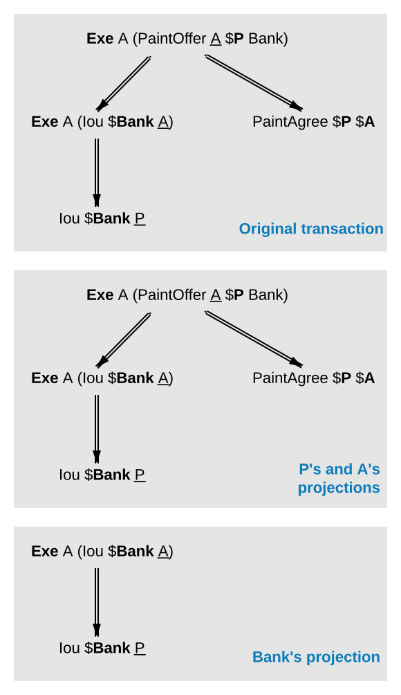
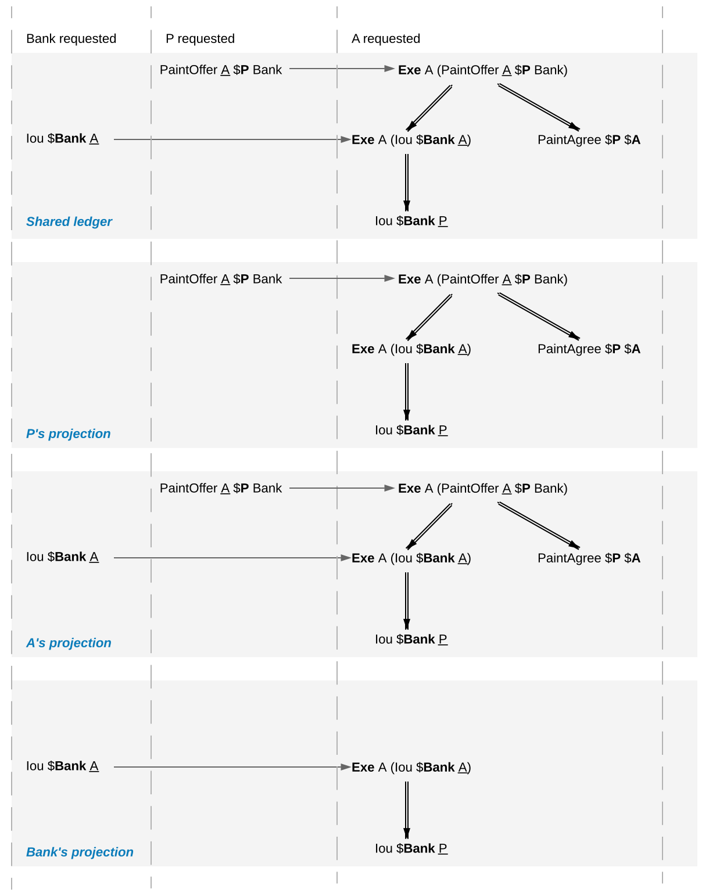
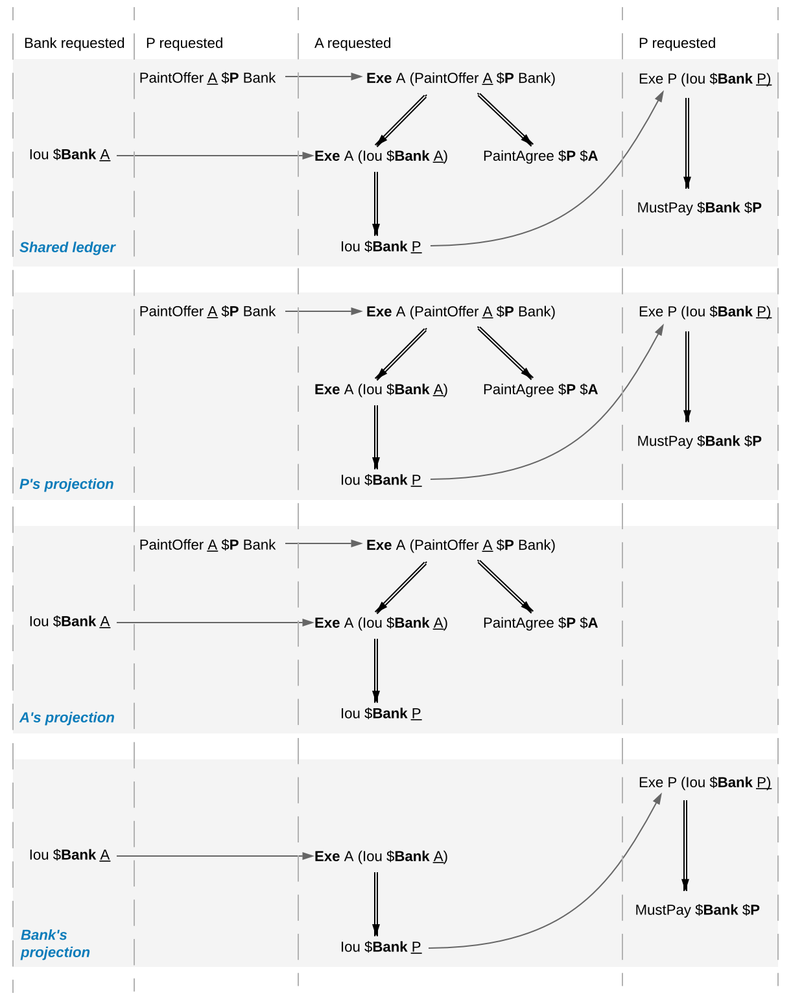

.. Copyright (c) 2022 Digital Asset (Switzerland) GmbH and/or its affiliates. All rights reserved.
.. SPDX-License-Identifier: Apache-2.0

.. _da-model-privacy:

Privacy
#######

The previous sections have addressed two out of three questions posed in the
introduction: "what the ledger looks like", and "who may request which changes".
This section addresses the last one, "who sees which changes and data". That is,
it explains the privacy model for Daml ledgers.

The privacy model of Daml Ledgers is based on a **need-to-know
basis**, and provides privacy **on the level of subtransactions**. Namely, a party learns only those
parts of ledger changes that affect contracts in which the party has a stake,
and the consequences of those changes.
And maintainers see all changes to the contract keys they maintain.

To make this more precise, a stakeholder concept is needed.

Contract Observers and Stakeholders
***********************************

Intuitively, as signatories are bound by a contract, they have a stake in it.
Actors might not be bound by the contract, but they still have a stake in their actions, as these are the actor's rights.
Generalizing this, **observers** are parties who might not be bound by the contract, but still have the right to see the contract.
For example, Alice should be an observer of the `PaintOffer`, such that she is made aware that the offer exists.

Signatories are already determined by the contract model discussed so far.
The full **contract model** additionally specifies the **contract observers** on each contract.
A **stakeholder** of a contract (according to a given contract model) is then either a signatory or a contract observer on the contract.
Note that in Daml, as detailed :ref:`later <da-model-daml>`, controllers specified using simple syntax are automatically made contract observers whenever possible.

In the graphical representation of the paint offer acceptance below, contract observers who are not signatories are indicated by an underline.

.. https://www.lucidchart.com/documents/edit/ea40a651-a2e0-4365-ae7d-4cee8cd07071/0

Choice Observers
****************

In addition to contract observers, the contract model can also specify **choice observers** on individual **Exercise** actions.
Choice observers get to see a specific exercise on a contract, and to view its consequences.
Choice observers are not considered stakeholders of the contract, they only affect the set of informees
on an action, for the purposes of projection (see below).

.. _da-model-projections:

Projections
***********

Stakeholders should see changes to contracts they hold a stake in, but that does not
mean that they have to see the entirety of any transaction that their contract is
involved in. This is made precise through *projections* of a transaction,
which define the view that each party gets on a transaction.
Intuitively, given a transaction within a commit, a party will see
only the subtransaction consisting of all actions on contracts where the party
is a stakeholder. Thus, privacy is obtained on the subtransaction level.

An example is given below. The transaction that consists
only of Alice's acceptance of the `PaintOffer` is projected for each of the
three parties in the example: the painter, Alice, and the bank.

.. https://www.lucidchart.com/documents/edit/8f532ae8-df30-4476-9627-23d076ec453d

Since both the painter and Alice are stakeholders of the `PaintOffer`
contract, the exercise on this contract is kept in the projection of both
parties. Recall that consequences of an exercise action are a part of
the action. Thus, both parties also see the exercise on the `Iou Bank A`
contract, and the creations of the `Iou Bank P` and `PaintAgree` contracts.

The bank is *not* a stakeholder on the `PaintOffer` contract (even
though it is mentioned in the contract). Thus, the projection for the
bank is obtained by projecting the consequences of the exercise on the
`PaintOffer`. The bank is a stakeholder in the contract `Iou Bank A`,
so the exercise on this contract is kept in the bank's projection. Lastly,
as the bank is not a stakeholder of the `PaintAgree` contract, the
corresponding **Create** action is dropped from the bank's projection.

Note the privacy implications of the bank's projection. While the bank
learns that a transfer has occurred from `A` to `P`, the bank does
*not* learn anything about *why* the transfer occurred. In
practice, this means that the bank does not learn what `A` is paying
for, providing privacy to `A` and `P` with respect to the bank.

.. _def-informee:

As a design choice, Daml Ledgers show to contract observers only the
:ref:`state changing <def-contract-state>` actions on the contract.
More precisely, **Fetch** and non-consuming **Exercise** actions are not shown to contract observers - except when they are
also actors or choice observers of these actions.
This motivates the following definition: a party `p` is an **informee** of an action `A` if one of the following holds:

  * `A` is a **Create** on a contract `c` and `p` is a stakeholder of `c`.

  * `A` is a consuming **Exercise** on a contract `c`, and `p` is a stakeholder of `c` or an actor on `A`.
    Note that a Daml "flexible controller" :ref:`can be an exercise actor without being a contract stakeholder <da-model-daml>`.

  * `A` is a non-consuming **Exercise** on a contract `c`, and `p` is a signatory of `c` or an actor on `A`.

  * `A` is an **Exercise** action and `p` is a choice observer on `A`.

  * `A` is a **Fetch** on a contract `c`, and `p` is a signatory of `c` or an actor on `A`.

  * `A` is a **NoSuchKey** `k` assertion and `p` is a maintainer of `k`.

.. _def-tx-projection:

Then, we can formally define the **projection** of a
transaction `tx = act`\ :sub:`1`\ `, …, act`\ :sub:`n` for a party `p` is the
subtransaction obtained by doing the following for each action `act`\ :sub:`i`:

#. If `p` is an informee of `act`\ :sub:`i`, keep `act`\ :sub:`i` as-is.
#. Else, if `act`\ :sub:`i` has consequences, replace `act`\ :sub:`i` by the projection (for `p`) of its consequences,
   which might be empty.
#. Else, drop `act`\ :sub:`i`.

.. _da-model-ledger-projection:

Finally, the **projection of a ledger** `l` for a party `p` is a list
of transactions obtained by first projecting the transaction of each
commit in `l` for `p`, and then removing all empty transactions from
the result. Note that the projection of a ledger is not a ledger, but
a list of transactions. Projecting the ledger of our
complete paint offer example yields the following projections for each
party:

.. https://www.lucidchart.com/documents/edit/c4df0455-13ab-415f-b457-f5654c2684be

Examine each party's projection in turn:

#. The painter does not see any part of the first commit, as he is
   not a stakeholder of the `Iou Bank A` contract. Thus, this
   transaction is not present in the projection for the painter at
   all. However, the painter is a stakeholder in the `PaintOffer`,
   so he sees both the creation and the exercise of this contract
   (again, recall that all consequences of an exercise action are a
   part of the action itself).

#. Alice is a stakeholder in both the `Iou Bank A` and
   `PaintOffer A B Bank` contracts. As all top-level actions in the ledger are
   performed on one of these two contracts, Alice's projection
   includes all the transactions from the ledger intact.

#. The Bank is only a stakeholder of the IOU contracts.
   Thus, the bank sees the first commit's
   transaction as-is. The second commit's transaction is, however
   dropped from the bank's projection. The projection of the last
   commit's transaction is as described above.

Ledger projections do not always satisfy the definition of
consistency, even if the ledger does. For example, in P's view, `Iou Bank A` is
exercised without ever being created, and thus without being made
active. Furthermore, projections can in general be
non-conformant. However, the projection for a party `p` is always

- internally consistent for all contracts,
- consistent for all contracts on which `p` is a stakeholder, and
- consistent for the keys that `p` is a maintainer of.

In other words,
`p` is never a stakeholder on any input contracts of its projection. Furthermore, if the
contract model is **subaction-closed**, which
means that for every action `act` in the model, all subactions of
`act` are also in the model, then the projection is guaranteed to be
conformant. As we will see shortly, Daml-based contract models are
conformant. Lastly, as projections carry no information about the
requesters, we cannot talk about authorization on the level of
projections.

.. _da-model-privacy-authorization:

Privacy Through Authorization
*****************************

Setting the maintainers as required authorizers for a **NoSuchKey** assertion ensures
that parties cannot learn about the existence of a contract without having a right to know about their existence.
So we use authorization to impose *access controls* that ensure confidentiality about the existence of contracts.
For example, suppose now that for a `PaintAgreement` contract, both signatories are key maintainers, not only the painter.
That is, we consider `PaintAgreement @A @P &P123` instead of `PaintAgreement $A @P &P123`.
Then, when the painter's competitor `Q` passes by `A`'s house and sees that the house desperately needs painting,
`Q` would like to know whether there is any point in spending marketing efforts and making a paint offer to `A`.
Without key authorization, `Q` could test whether a ledger implementation accepts the action **NoSuchKey** `(A, P, refNo)` for different guesses of the reference number `refNo`.
In particular, if the ledger does not accept the transaction for some `refNo`, then `Q` knows that `P` has some business with `A` and his chances of `A` accepting his offer are lower.
Key authorization prevents this flow of information because the ledger always rejects `Q`\ 's action for violating the authorization rules.

For these access controls, it suffices if one maintainer authorizes a **NoSuchKey** assertion.
However, we demand that *all* maintainers must authorize it.
This is to prevent spam in the projection of the maintainers.
If only one maintainer sufficed to authorize a key assertion,
then a valid ledger could contain **NoSuchKey** `k` assertions where the maintainers of `k` include, apart from the requester, arbitrary other parties.
Unlike **Create** actions to contract observers, such assertions are of no value to the other parties.
Since processing such assertions may be expensive, they can be considered spam.
Requiring all maintainers to authorize a **NoSuchKey** assertion avoids the problem.

.. _da-model-divulgence:

Divulgence: When Non-Stakeholders See Contracts
***********************************************

The guiding principle for the privacy model of Daml ledgers is that
contracts should only be shown to their stakeholders. However,
ledger projections can cause contracts to become visible to other
parties as well.

In the example of
`ledger projections of the paint offer <#da-ledgers-projections-example>`__,
the exercise on the `PaintOffer`
is visible to both the painter and Alice.  As a consequence, the
exercise on the `Iou Bank A` is visible to the painter, and the
creation of `Iou Bank P` is visible to Alice. As actions also contain
the contracts they act on, `Iou Bank A` was thus shown to the painter
and `Iou Bank P` was shown to Alice.

Showing contracts to non-stakeholders through ledger projections is
called **divulgence**. Divulgence is a deliberate choice in the design
of Daml ledgers. In the paint offer example, the only proper way to
accept the offer is to transfer the money from Alice to the painter.
Conceptually, at the instant where the offer is accepted, its
stakeholders also gain a temporary stake in the actions on the two
`Iou` contracts, even though they are never recorded as stakeholders
in the contract model. Thus, they are allowed to see these actions through
the projections.

More precisely, every action `act` on `c` is shown to all informees of all ancestor actions
of `act`.
These informees are called the **witnesses** of `act`.
If one of the witnesses `W` is not a stakeholder on `c`, then `act` and `c` are said to be **divulged** to `W`.
Note that only **Exercise** actions can be ancestors of other actions.

Divulgence can be used to enable delegation. For example, consider the
scenario where Alice makes a counteroffer to the painter. Painter's
acceptance entails transferring the IOU to him. To be able to construct the acceptance
transaction, the painter first needs to learn about the details of
the IOU that will be transferred to him. To give him these details, Alice
can fetch the IOU in a context visible to
the painter:

.. https://www.lucidchart.com/documents/edit/85524f9d-c111-4806-ae28-373057591fb8/0
.. image:: ./images/divulgence-for-disclosure-counteroffer.svg
   :align: center
   :width: 100%
   :name: da-paint-counteroffer-example
   :alt: A series of time sequences showing how delegation changes privacy, as described in the preceding paragraph.

In the example, the context is provided by consuming a `ShowIou` contract on which the painter is a stakeholder.
This now requires an additional contract type, compared to the original paint offer example.
An alternative approach to enable this workflow, without increasing the number of contracts required, is to
replace the original `Iou` contract by one on which the painter is a contract observer.
This would require extending the contract model with a (consuming) exercise action on the `Iou` that creates a new
`Iou`, with observers of Alice's choice.
In addition to the different number of commits, the two approaches differ in one more aspect.
Unlike stakeholders, parties who see contracts only through divulgence
have no guarantees about the state of the contracts in question. For
example, consider what happens if we extend our (original) paint offer example
such that the painter immediately settles the IOU.

.. https://www.lucidchart.com/documents/edit/5945bd51-45b5-4ba6-9e8d-5c1dcd612509/0

While Alice sees the creation of the `Iou Bank P` contract, she does
not see the settlement action. Thus, she does not know whether the
contract is still active at any point after its creation. Similarly,
in the previous example with the counteroffer, Alice could spend the
IOU that she showed to the painter by the time the painter attempts to
accept her counteroffer. In this case, the painter's transaction could
not be added to the ledger, as it would result in a double spend and
violate validity. But the painter has no way to predict whether
his acceptance can be added to the ledger or not.
