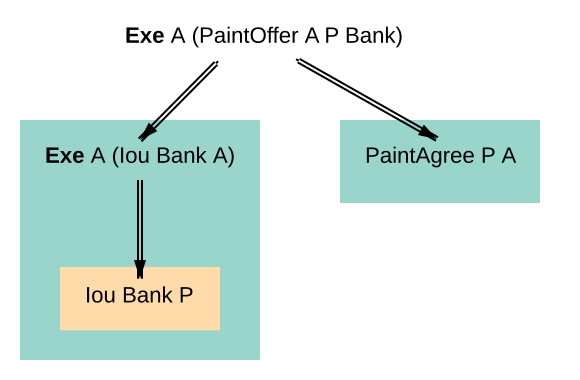
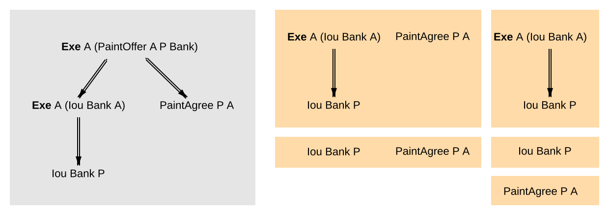
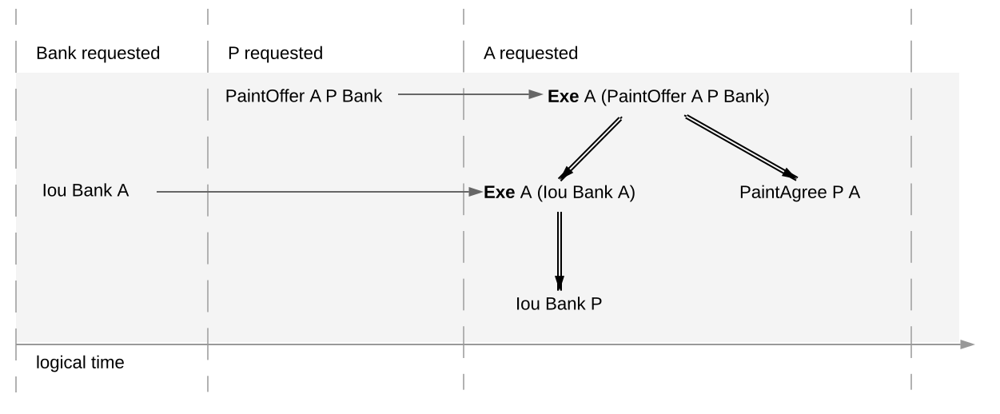
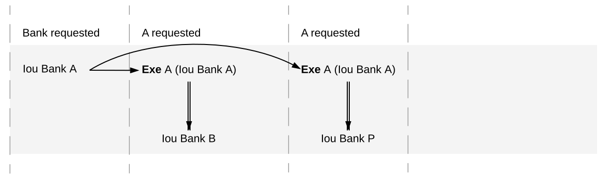
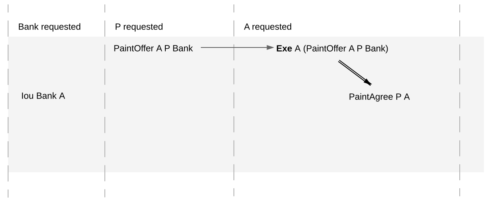
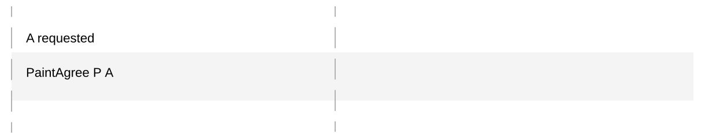
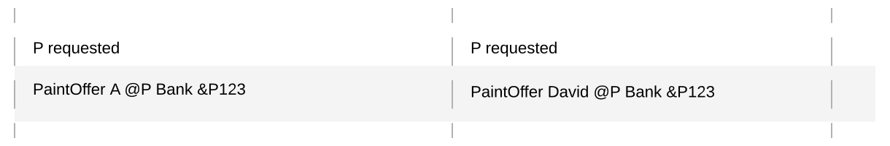

.. Copyright (c) 2023 Digital Asset (Switzerland) GmbH and/or its affiliates. All rights reserved.
.. SPDX-License-Identifier: Apache-2.0

.. _ledger-structure:

Structure
#########

This section looks at the structure of a Daml ledger and the associated ledger
changes. The basic building blocks of changes are *actions*, which get grouped
into *transactions*.

.. _actions-and-transactions:

Actions and Transactions
************************

One of the main features of the Daml ledger model is a *hierarchical action
structure*.

This structure is illustrated below on a toy example of a multi-party
interaction. Alice (`A`) gets some digital cash, in the form of an I-Owe-You
(IOU for short)
from a bank, and she needs her house painted. She gets an offer from
a painter (`P`) with reference number `P123` to paint her house in
exchange for this IOU. Lastly, `A`
accepts the offer, transferring the money and signing
a contract with `P`, whereby he is promising to paint her house.

This acceptance can be viewed as `A` *exercising* her right to accept
the offer. Her acceptance has two consequences. First, `A` transfers
her IOU, that is, *exercises* her right to transfer the IOU, after
which a new IOU for `P` is *created*.  Second, a new contract is
*created* that requires `P` to paint `A`'s house.

Thus, the acceptance in this example is reduced to two types of actions: (1)
creating contracts, and (2) exercising rights on them. These are also the
two main kinds of actions in the Daml ledger model. The visual notation below
records the relations between the actions during the above acceptance.

Formally, an **action** is one of the following:

#. a **Create** action on a contract, which records the creation of the contract
#. an **Exercise** action on a contract, which records that one or more parties
   have exercised a right they have on the contract, and which also contains:

   #. An associated set of parties called **actors**. These are the
      parties who perform the action.

   #. An exercise **kind**, which is either **consuming** or
      **non-consuming**. Once consumed, a contract cannot be used again
      (for example, Alice should not be able to accept the painter's
      offer twice). Contracts exercised in a non-consuming fashion
      can be reused.

   #. A list of **consequences**, which are themselves actions. Note that
      the consequences, as well as the kind and the actors, are
      considered a part of the exercise action itself. This nesting of
      actions within other actions through consequences of exercises
      gives rise to the hierarchical structure.
      The exercise action is the **parent action** of its consequences.

#. a **Fetch** action on a contract, which demonstrates that the contract exists and is active at the time of
   fetching.
   The action also contains **actors**, the parties who fetch the contract.
   A **Fetch** behaves like a non-consuming exercise with no consequences, and can be repeated.

#. a **Key assertion**, which records the assertion that the given :doc:`contract key </daml/reference/contract-keys>` is **not** assigned to any unconsumed contract on the ledger.

An **Exercise** or a **Fetch** action on a contract is said to **use** the contract.
Moreover, a consuming **Exercise** is said to **consume** (or **archive**) its contract.

The following EBNF-like grammar summarizes the structure of actions
and transactions. Here, "s | t" represents the choice between `s` and
`t`, "s t" represents `s` followed by `t`, and "s*" represents the
repetition of `s` zero or more times. The terminal 'contract' denotes
the underlying type of contracts, and the terminal 'party' the
underlying type of parties.

.. _action-EBNF:

::

   Action       ::= 'Create' contract
                  | 'Exercise' party* contract Kind Transaction
                  | 'Fetch' party* contract
                  | 'NoSuchKey' key
   Transaction  ::= Action*
   Kind         ::= 'Consuming' | 'NonConsuming'

The visual notation presented earlier captures actions precisely with
conventions that:

#. **Exercise** denotes consuming, **ExerciseN** non-consuming exercises, and **Fetch** a fetch.
#. double arrows connect exercises to their consequences, if any.
#. the consequences are ordered left-to-right.
#. to aid intuitions, exercise actions are annotated with suggestive names
   like "accept" or "transfer". Intuitively, these correspond to names of
   Daml choices, but they have no semantic meaning.

An alternative shorthand notation, shown below uses the abbreviations **Exe** and **ExeN** for exercises, and omits the
**Create** labels on create actions.

.. https://www.lucidchart.com/documents/edit/84166777-17e9-4254-a2f5-f52fff4881f0/0

To show an example of a non-consuming exercise, consider a different
offer example with an easily replenishable subject. For example, if
`P` was a car manufacturer, and `A` a car dealer, `P` could make an
offer that could be accepted multiple times.

.. https://www.lucidchart.com/documents/edit/101c12dc-e4ec-482c-9cf3-e062250713bb/0
.. image:: ./images/non-consuming-exercises.svg
   :align: center
   :width: 60%
   :alt: A flowchart showing the actions involved in the car deal. The topmost action is ExeN A (CarOffer A P Bank) "accept". Exercising this action leads to two further actions: Exe A (Iou Bank A) "transfer" and DeliverCarAgree P A. One further action follows from Exe A (Iou Bank A) "transfer": Iou Bank P

To see an example of a fetch, we can extend this example to the case where `P` produces exclusive cars and allows only
certified dealers to sell them.
Thus, when accepting the offer, `A` has to additionally show a valid quality certificate issued by some standards body `S`.

.. https://www.lucidchart.com/documents/edit/b20328c7-ce4a-4072-85b6-393666f31304/0
.. image:: ./images/fetches.svg
   :align: center
   :width: 90%
   :alt: The same chart as above but with a third action descending from ExeN A (CarOffer A P Bank) "accept": Fetch A (Certificate S A)

In the paint offer example, the underlying type of contracts consists
of three sorts of contracts:

PaintOffer houseOwner painter obligor refNo
  Intuitively an offer (with a reference number) by
  which the painter proposes to the house owner to paint her house, in
  exchange for a single IOU token issued by the specified obligor.

PaintAgree painter houseOwner refNo
  Intuitively a contract whereby
  the painter agrees to paint the owner's house

Iou obligor owner
  An IOU token from an obligor to an owner
  (for simplicity, the token is of unit amount).

In practice, multiple IOU contracts can exist between the same `obligor` and
`owner`, in which case each contract should have a unique identifier. However,
in this section, each contract only appears once, allowing us to drop the notion 
of identifiers for simplicity reasons.

A **transaction** is a list of actions. Thus, the consequences of
an exercise form a transaction. In the example, the consequences of
Alice's exercise form the following transaction, where actions are again
ordered left-to-right.

.. https://www.lucidchart.com/documents/edit/b9f66843-3ad8-409c-9965-ba1a9d5bb126

For an action `act`,
its **proper subactions** are all actions in the consequences of
`act`, together with all of their proper subactions. Additionally,
`act` is a (non-proper) **subaction** of itself.

The subaction relation is visualized below. Both the green
and yellow boxes are proper subactions of Alice's exercise on the paint
offer. Additionally, the creation of `Iou Bank P` (yellow box) is also a
proper subaction of the exercise on the `Iou Bank A`.

.. https://www.lucidchart.com/documents/edit/412cd784-855f-4032-a011-6849300792ed

Similarly, a **subtransaction** of a transaction is either the transaction
itself, or a **proper subtransaction**: a transaction obtained by removing at
least one action, or replacing it by a subtransaction of its consequences. For
example, given the transaction consisting of just one action, the paint offer
acceptance, the image below shows all its proper non-empty subtransactions on the right
(yellow boxes).

.. https://www.lucidchart.com/documents/edit/a4735a72-2d27-485c-a3ed-0c053dab0e11
 Box 5 - PaintAgree P A P123.

To illustrate :doc:`contract keys </daml/reference/contract-keys>`, suppose that the contract key for a `PaintOffer` consists of the reference number and the painter.
So Alice can refer to the `PaintOffer` by its key `(P, P123)`.
To make this explicit, we use the notation `PaintOffer @P A &P123` for contracts, where `@` and `&` mark the parts that belong to a key.
(The difference between `@` and `&` will be explained in the :ref:`integrity section <da-signatories-agreements-maintainers>`.)
The ledger integrity constraints in the next section ensure that there is always at most one active `PaintOffer` for a given key.
So if the painter retracts its `PaintOffer` and later Alice tries to accept it, she can then record the absence with a `NoSuchKey (P, P123)` key assertion.

Ledgers
*******

The transaction structure records the contents of the
changes, but not *who requested them*. This information is added by the notion
of a **commit**: a transaction paired with the parties that
requested it, called the **requesters** of the commit.
A commit may have one or more requesters.
Given a commit `(p, tx)` with transaction `tx = act`:sub:`1`\ `, …, act`:sub:`n`, every `act`:sub:`i` is
called a **top-level action** of the commit. A **ledger** is a sequence of
commits. A top-level action of any ledger commit is also a top-level action of
the ledger.

The following EBNF grammar summarizes the structure of commits and ledgers:

::

   Commit   ::= party+ Transaction
   Ledger   ::= Commit*

A Daml ledger thus represents the full history of all actions taken by
parties.\ [#ledger-vs-journal]_ Since the ledger is a sequence (of dependent actions), it induces an
*order* on the commits in the ledger. Visually, a ledger can be represented
as a sequence growing from left to right as time progresses. Below,
dashed vertical lines mark the boundaries of commits, and each commit is
annotated with its requester(s). Arrows link the create and
exercise actions on the same contracts. These additional arrows highlight
that the ledger forms a **transaction graph**. For example, the
aforementioned house painting scenario is visually represented as
follows.

.. https://www.lucidchart.com/documents/edit/85c311c5-8402-494d-bdcc-bb5ffff4e1bd

The definitions presented here are all the ingredients required to
*record* the interaction between parties in a Daml ledger. That is, they
address the first question: "what do changes and ledgers look
like?". To answer the next question, "who can request which changes",
a precise definition is needed of which ledgers are permissible,
and which are not. For example, the above
paint offer ledger is intuitively permissible, while all of the
following ledgers are not.

   Alice spending her IOU twice ("double spend"), once transferring it
   to `B` and once to `P`.

   Alice changing the offer's outcome by removing the transfer of the `Iou`.

   An obligation imposed on the painter without his consent.

.. figure:: ./images/stealing-ious.svg
   :align: center
   :name: painter-stealing-ious
   :alt: Described in the caption.

   Painter stealing Alice's IOU. Note that the ledger would be
   intuitively permissible if it was Alice performing the last commit.

.. figure:: ./images/failed-key-assertion.svg
   :align: center
   :name: alice-claiming-retracted-offer
   :alt: Described in the caption.

   Painter falsely claiming that there is no offer.

   Painter trying to create two different paint offers with the same reference number.

   
The next section discusses the criteria that rule out the above examples as
invalid ledgers.

.. [#ledger-vs-journal]

   Calling such a complete record "ledger" is standard in the
   distributed ledger technology community. In accounting terminology,
   this record is closer to a *journal* than to a ledger.
