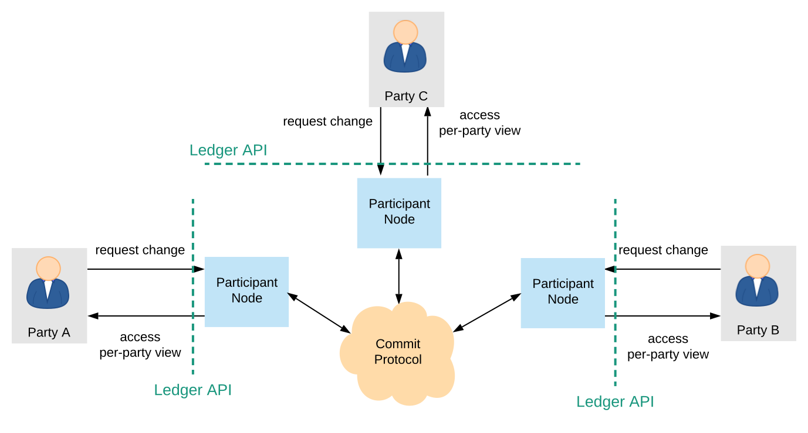

.. Copyright (c) 2019 Digital Asset (Switzerland) GmbH and/or its affiliates. All rights reserved.
.. SPDX-License-Identifier: Apache-2.0

.. _daml-ledger-topologies:

DAML Ledger Topologies
######################

The Ledger API provides parties with an abstraction of a virtual shared ledger, visualized as follows.

.. image:: ./ledger-model/images/da-ledger-model.svg
   :width: 80%
   :align: center

The real-world topologies of actual ledger implementations differ significantly, however.
The topologies can impact both the functional and non-functional properties of the resulting ledger.
This document:

1. Provides one useful categorization of the existing implementations' topologies.
   The categorization is not the only one possible, and it is not always clear-cut.
   Its main aim is to group the implementations according to their high-level properties.

2. Describes the general ledger properties of each category.

.. _centralized-topologies:

Centralized Topologies
**********************

In these topologies, there exists a single physical or logical system that contains the physical copy of the entire virtual shared ledger accessible through the API.

.. _centralized-topology:

The Fully Centralized Topology
==============================

The simplest topology is the one where the virtual shared ledger is implemented through a single machine containing a physical copy of the shared ledger.

.. image:: ./images/ledger-topologies/physical-shared-ledger.svg
   :width: 80%
   :align: center

The :ref:`DAML Sandbox <sandbox-manual>` uses this topology.
While simple, this topology has certain downsides:

- it is not highly available

- the real-world entity operating the physical shared ledger has significant power:

  - it is fully trusted with preserving the ledger's integrity
  - it has full insight into the entire ledger, and is thus trusted with privacy.

- it does not scale out of the box

- it provides no built-in way to interoperate (transactionally share data) across several deployed ledgers; each deployment defines its own segregated virtual shared ledger.

Replicating the physical ledger improves the availability properties.
If the replication algorithm is Byzantine fault tolerant and the number of replicas is high enough, integrity is then also improved.
However, adding replicas worsens the system's latency and throughput, as well as its privacy properties (since every replica has full insight into the ledger).
Performance and scaling properties can be improved by partitioning the system.
The following two sections describe the partitioning approaches used by several implementations.

.. _reader-writer-topology:

The Reader-Writer Partitioning Topology
=======================================

In this topology, the ledger is implemented as a distributed system.
The system consists of two kinds of nodes:

1. a central writer node, which holds the physical shared ledger and can extend it with new commits,

.. _participant-node-def:

2. **participant nodes**, which serve the ledger API to a subset of the system parties, which we say are hosted by this participant.
   A participant node may issue new commits on behalf of the parties it hosts, and holds a portion of the ledger that is relevant for those parties (i.e., the parties' :ref:`ledger projection <da-model-projections>`).
   In fact, the term "participant node" is also used in the case of a fully centralized topology, where the same machine is the both the writer and the sole participant node.

This setting is visualized below.

.. image:: ./images/ledger-topologies/centralized-writer-topology.svg
   :align: center

This topology improves on the last one by improving scaling and performance.
The participant nodes can handle the user connections, serve the read requests from the ledger, and pre-process the transactions that the users submit (e.g., by performing DAML evaluation).
Adding new participant nodes increases the capacity of the system.
These nodes need not be trusted by the other nodes; the final authority for extending the ledger lies with the central writer node.
In general, the participant nodes do not necessarily even need to know each other.
However, they have to be known to and accepted by the central writer node.
As with the previous topology, the central writer node is trusted with ensuring the ledger's integrity, and has access to all ledger data.
Again, the node can be replicated to increase availability and/or distribute the trust needed for integrity, as shown below.

.. image:: ./images/ledger-topologies/replicated-writer-topology.svg
   :align: center

DAML on `VMware Concord <https://blogs.vmware.com/blockchain>`__ and DAML on `Hyperledger Sawtooth <https://sawtooth.hyperledger.org/>`__ are examples of such a replicated setup.
The implementations that use this topology (replicated or not) do not provide interoperability across multiple deployments.
Out of the box, scalability is also limited, but can be improved by internally partitioning the writer node further, as shown next.

.. _staged-writer-topology:

The Staged Writer Topology
==========================

This topology is a refinement of the previous one.
The writer is split up into two stages.
The first stage performs the integrity checks that can be parallelized (namely, :ref:`conformance <da-model-conformance>` and :ref:`authorization <da-model-authorization>`).
Due to parallelization, this stage can be scaled out horizontally.
The second stage performs the :ref:`consistency <da-model-consistency>` check.
This stage is sequential, though it can internally still partition the data and implement a commit protocol to improve scaling.

.. image:: ./images/ledger-topologies/staged-writer-topology.svg
   :align: center

The central writer node is trusted with ensuring the ledger's integrity, and has access to all ledger data.
DAML on `Amazon Aurora <https://aws.amazon.com/rds/aurora/>`__ uses this topology.
The implementations that use this topology do not provide interoperability across multiple deployments.

.. _decentralized-ledger-topology:

Decentralized Ledger Topologies
*******************************

In these topologies, the ledger is again implemented as a distributed system.
However, unlike the centralized topologies, no system node holds a physical copy of the entire shared ledger.
Instead, the participant nodes hold just the part of the ledger (i.e., the :ref:`ledger projection <da-model-projections>`) that is relevant to the parties to whom they serve the Ledger API.
They jointly extend the ledger by running a distributed commit protocol.

The implementations might still rely on trusted third parties to facilitate the commit protocol.
The required trust in terms of privacy and integrity, however, can be significantly lowered compared to the previous topologies.
Moreover, unlike the previous topologies, the implementations can provide interoperability across trusted parties.
The exact trust assumptions and the degree of supported interoperability are implementation-dependent.
`Canton <http://canton.io>`__ and DAML on `R3 Corda <https://www.corda.net>`__ are two such implementations.
The main drawback of this topology is that availability can be influenced by the participant nodes.
Namely, transactions cannot be committed if they use data that is only stored on unresponsive nodes.
Spreading the data among additional trusted entities can mitigate the problem.
