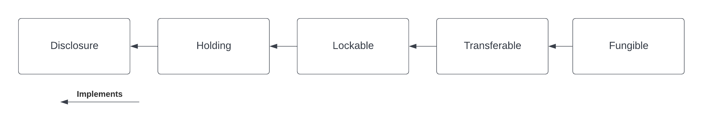

Getting started tutorial
########################

This tutorial introduces the core asset model of the library through a
simple example. The purpose is to illustrate the concepts of
:ref:`account <account>`, :ref:`instrument <instrument>`, and
:ref:`holding <holding>`, as well as showing how to work
with Daml interfaces.

We are going to

#. create an account for Alice and Bob at the Bank
#. issue a cash instrument
#. credit a cash holding to Alice’s account
#. transfer the holding from Alice to Bob

Download the code for the tutorial
**********************************

As a pre-requisite, the ``Daml SDK`` needs to be installed on your
machine.

Open a terminal and run:

.. code-block:: shell

   daml new quickstart-finance --template quickstart-finance

This creates a new folder with contents from our template.
Navigate to the folder and then run

.. code-block:: shell

   ./get-dependencies.sh

to download the required ``daml-finance`` packages.
You can then run

.. code-block:: shell

   daml studio

to open the code editor and inspect the code.

Structure of the code, dependencies
***********************************

The code includes

- three workflows defined in the ``Workflows`` folder
- a ``Setup`` script

The first encapsulate the core business logic of the application, whereas the latter includes scripts that are
executed on a one-off basis.

If you take a closer look at the ``Workflows``, you will recognize three
initiate / accept patterns to

- create an account
- make a deposit to the account
- execute a holding transfer

Files in this folder depend only on interface packages of ``daml-finance``
(the ones that start with ``Daml.Finance.Interface.*``), as you can see from
the import list.

This is important, as it decouples the user-defined business logic from
the template implementations used in ``daml-finance`` and, thus, makes it easier
to upgrade the one without being forced to upgrade the other.

On the other hand, the script in the ``Scripts`` folder depends also on
implementation packages (in this case, ``Daml.Finance.Asset``).

This is not problematic, as the script is meant to be run only once when
the application is initialized.

Running the setup script
************************

Let us now explore the setup script step-by-step.

Creating ``Holding`` and ``Account`` factories
==============================================

The first instruction instantiates an account factory. This is just a
template that is used by a party (the ``Bank`` in this case) to create
accounts as part of the ``CreateAccount`` workflow.

.. literalinclude:: code/daml/Scripts/Setup.daml
  :language: daml
  :start-after: -- CREATE_ACCOUNT_FACTORY_BEGIN
  :end-before: -- CREATE_ACCOUNT_FACTORY_END

Notice how the ``ContractId`` is immediately converted to an interface
upon creation: this is because our workflows do not have any knowledge
of concrete template implementations.

Similarly, we define a holding factory which is used within an account
to ``Credit`` and ``Debit`` holdings.

.. literalinclude:: code/daml/Scripts/Setup.daml
  :language: daml
  :start-after: -- CREATE_HOLDING_FACTORY_BEGIN
  :end-before: -- CREATE_HOLDING_FACTORY_END

This factory contract can be use to create ``Fungible`` holdings, which
are defined in ``Daml.Finance.Asset.Fungible`` and are
`fungible <../../Glossary.md#fungibility>`__, as well as
`transferable <../../Glossary.md#transferability>`__.

Opening Alice’s and Bob’s accounts
==================================

Once the factory templates are setup, we leverage our ``CreateAccount``
workflow to create an account at the ``Bank`` for Alice and Bob.

The creation of an account needs to be authorized by both the
``custodian`` and the ``owner`` (resp. the ``Bank`` and Alice in our
case). Authorization is collected using an initiate / accept pattern.

.. literalinclude:: code/daml/Scripts/Setup.daml
  :language: daml
  :start-after: -- SETUP_ALICE_ACCOUNT_BEGIN
  :end-before: -- SETUP_ALICE_ACCOUNT_END

Bob’s account is created in a similar fashion.

Issuing the cash instrument
===========================

In order to credit Alice’s account with some cash, we first need
to introduce a cash ``Instrument`` in our model.

.. literalinclude:: code/daml/Scripts/Setup.daml
  :language: daml
  :start-after: -- ISSUE_CASH_INSTRUMENT_BEGIN
  :end-before: -- ISSUE_CASH_INSTRUMENT_END

An instrument is a representation of what it is that we are holding
against the bank. It can be as simple as just a textual label (like in
this case) or can include complex on-ledger lifecycling logic.

To hold one unit of the cash instrument in this scenario means that we
can claim 1 USD from the holding’s custodian.

Notice how in this case the ``Bank`` acts both as the cash instrument’s
issuer and depository. This means that we fully trust the ``Bank`` with
any action concerning the instrument.

Depositing cash on Alice’s account
==================================

We can now deposit cash on Alice’s account, using the ``Deposit``
workflow. Alice issues a deposit

.. literalinclude:: code/daml/Scripts/Setup.daml
  :language: daml
  :start-after: -- CREATE_ALICE_HOLDING_BEGIN
  :end-before: -- CREATE_ALICE_HOLDING_END

Alice creates a request to deposit ``1,000 USD`` at the Bank, the Bank then
accepts the request and a corresponding ``Holding`` is created.

You can imagine that the latter step happens only after Alice has
showed up at the bank and delivered physical banknotes corresponding to
the deposit’s amount.

Transferring cash from Alice to Bob
===================================

The final step of our ``Setup`` script transfers Alice’s holding to Bob
using the ``Transfer`` workflow.

.. literalinclude:: code/daml/Scripts/Setup.daml
  :language: daml
  :start-after: -- TRANSFER_BEGIN
  :end-before: -- TRANSFER_END

Bob requests the cash to be transferred to his account, Alice
accepts the request.

Further considerations
**********************

We now take a look at some aspects of the workflow and try to answer
some questions that you might be having.

If you are curious to see more use-cases for the library, feel free to
jump to the next tutorials and come back to this section when you feel
it is the right time.

How does the ``Transfer`` workflow work?
========================================

If you look at the implementation of the ``Transfer`` workflow, you will
notice the following lines

.. literalinclude:: code/daml/Workflow/Transfer.daml
  :language: daml
  :start-after: -- DO_TRANSFER_BEGIN
  :end-before: -- DO_TRANSFER_END

The first line converts the holding contract id (of type
``ContractId Holding.I``) to the ``Transferable`` interface using
``coerceContractId``.

Then, the ``Transfer`` choice defined as part of the ``Transferable.I``
interface is invoked.

Finally, the new holding is converted back to a ``Holding.I`` before it
is returned. This is done using ``toInterfaceContractId``.

In order to fully understand these instructions, we need to keep it mind
the interface hierarchy used by our holding implementation.

We use ``coerceContractId`` to convert the ``Holding`` to a
``Transferable``. The success of this operation is not guaranteed and
will result in a run-time error if the holding implementation at hand
does not implement ``Transferable``.

We use ``toInterfaceContractId`` to convert back to a ``Holding``. This
is because all ``Transferable``\ s implement the ``Holding`` interface,
so the validity of this operation is guaranteed at compile-time.

Why is Alice an observer on Bob’s account?
==========================================

You might have noticed that Alice is an observer of Bob’s
account and might be wondering why this is the case.

This is because the party exercising the ``Transfer`` choice, which in
this case is Alice, needs to fetch Bob’s account in order to
verify that it has not been archived.

In one of the next tutorials, we will see how to use the ``Disclosure``
interface to temporarily disclose Bob’s account to Alice and
then undisclose it as part of the same transaction.

If we wanted to avoid Bob’s account contract ever being disclosed
to Alice, we would need a third party (in this case the ``Bank``) to
execute the ``Transfer``.

What are account used for?
==========================

An account is used as the proof of a business relationship between an
owner and a custodian: Alice is authorized to transfer cash to
Bob because Bob has a valid account at the ``Bank``.

This is done to avoid that Alice transfers cash to ``Charlie``
without ``Charlie`` being vetted and acknowledged by the ``Bank``.

Why do we need factories?
=========================

You might be wondering why we use ``Holding`` and ``Account`` factories
instead of creating an account or holding directly.

This is done in order to avoid having to reference
``Daml.Finance.Asset`` directly in user workflows (and hence simplify
upgrading procedures).

This is based on the assumption that there are very few factory
contracts which are setup on ledger initialization.

Exercises
*********

There are a couple of improvements to the code that can be implemented as an exercise.
Giving them a try will help you familiarize with the library and with Daml interfaces.

Split the holding to transfer the right amount
==================================================

In the example, Bob requests ``1,000 USD`` from Alice and Alice allocates a holding for exactly the right amount, for the transfer would otherwise fail.
We want the transfer to be successful also if Alice allocates a holding for a larger amount e.g., ``1,500 USD``.

We can leverage the fact that the holding is ``Fungible``, which makes it possible to ``Split`` it into a holding of ``1,000 USD`` and one of ``500 USD``.
In the implementation of the ``CashTransferRequest_Accept`` choice

- cast the allocated holding to the ``Fungible`` interface (which is defined in ``Daml.Finance.Interface.Asset.Fungible``)
- use the ``Split`` choice to split the larger holding into two holdings
- execute the transfer, allocating the holding on the correct amount

In the last step, you will need to cast the ``Fungible`` to a ``Transferable`` using ``toInterfaceContractId``.

Temporary account Disclosure
============================

There is no reason for Alice to be an observer on Bob's account before the transfer is initiated by Bob (and after the transfer is executed).

Modify the original code, such that

- Bob's account is disclosed to Alice once the transfer is initiated
- When the Transfer is executed, Alice removes herself from the account observers

In order to do that, you can leverage the fact that ``Account`` implements the ``Disclosure`` interface (which is defined in ``Daml.Finance.Interface.Common``).
This interface exposes the ``AddObservers`` and ``RemoveObservers`` choices to disclose / undisclose the account Bob's contract to Alice.
