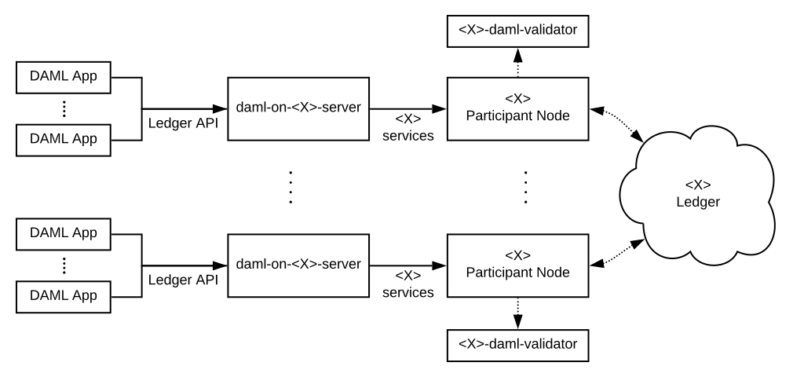
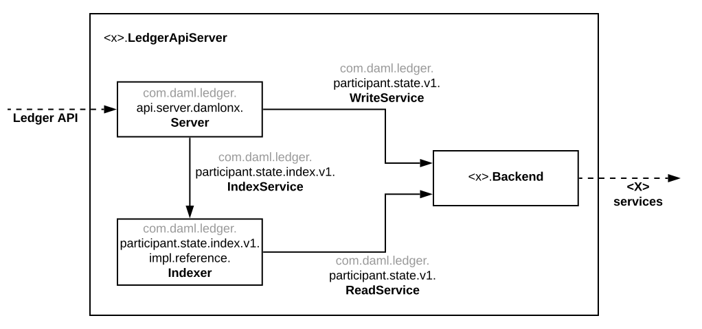

.. Copyright (c) 2019 Digital Asset (Switzerland) GmbH and/or its affiliates. All rights reserved.
.. SPDX-License-Identifier: Apache-2.0

DAML Integration Kit - PRE-ALPHA
################################

.. toctree::
   :hidden:

   /tools/ledger-api-test-tool/index

:doc:`DAML Applications </app-dev/app-arch/index>` run on DAML Ledgers.
A DAML Ledger is a server serving the
:doc:`/app-dev/ledger-api-introduction/index` as per the semantics defined in
the :doc:`/concepts/ledger-model/index` and the
`DAML-LF specification <https://github.com/digital-asset/daml/blob/master/daml-lf/spec/daml-lf-1.rst>`_.

The DAML Integration Kit helps third-party ledger developers to
implement a DAML Ledger on top of their distributed ledger or database of
choice. We provide the resources in the kit, which include guides to

- :ref:`implementing a DAML Ledger server <integration-kit_implementing>`
- :ref:`deploying a DAML Ledger server <integration-kit_deploying>`
- :ref:`testing a DAML Ledger server <integration-kit_testing>`
- :ref:`benchmarking a DAML Ledger server <integration-kit_benchmarking>`

Using these guides, you can focus on your own distributed-ledger or database
and reuse our DAML Ledger server and DAML interpreter code for
implementing the DAML Ledger API.

Status and roadmap
******************

The current status of the integration kit is PRE-ALPHA. We expect it to evolve
to ALPHA soon, BETA later, and GA quite a bit later. The roadmap below
explains what we mean by these different statuses, and what's missing to
progress.

PRE-ALPHA (current status)
  We develop the DAML Integration Kit in an open-first model. The PRE-ALPHA
  status means that there is enough information for interested third-parties
  to follow the *development* of the DAML integration kit. **We do though not
  make any stability guarantees!** Moreover the documentation is expected to
  contain holes, which are usually linked to GitHub issues.

ALPHA (`tracking GitHub issue <https://github.com/digital-asset/daml/issues/658>`__)
  Once we reach ALPHA status, the DAML Integration Kit is ready to be used by
  third-parties willing to accept the following caveats:

  - The architecture includes everything required to run DAML Applications in
    production. However, it misses support for testing DAML Applications in a
    uniform way against different DAML Ledgers. Concretely this means that
    Ledger API authorization, package upload, party on-boarding, ledger reset,
    and time manipulation are specific to each DAML Ledger. The reason
    for this is that it requires us to introduce APIs
    for uniform *administrative DAML ledger access*,
    which is different from the uniform *per-party DAML ledger access* that the
    DAML Ledger API provides. We will address this before reaching BETA
    status.
  - The architecture is likely to change due to learnings from pioneers like
    you! Where possible we strive to make these changes backwards compatible.
    This might though not always be possible.
  - The documentation might be spotty in some places, and you might have to
    infer some of the documentation from the code.
  - Some of our code might be fresh off the press and might therefore have a
    higher rate of bugs.

  That said: we highly value your feedback and input to direct our attention
  to where it provides the most value!
  You can get into contact with us using the feedback form on this
  documentation page or by creating issues or pull-requests against the `digital-asset/daml
  <https://github.com/digital-asset/daml>`__ GitHub repository.

  Use this `GitHub milestone <https://github.com/digital-asset/daml/milestone/4>`__
  to see the work outstanding to reach ALPHA status.

BETA (`tracking GitHub issue <https://github.com/digital-asset/daml/issues/660>`__)
  For us, BETA status means that we have architectural stability and solid
  documentation in place. At this point, third-parties should have everything
  they need to integrate DAML with their ledger of choice completely on their
  own.

  Before reaching BETA status, we expect to have:

  - hardened our test tooling
  - built tooling for benchmarking DAML ledgers
  - completed several integrations of DAML for different ledgers
  - implemented uniform *administrative DAML ledger access* to provide a
    portable way for testing DAML applications against different DAML ledgers

  Use this `GitHub milestone <https://github.com/digital-asset/daml/milestone/13>`__
  to see the work outstanding to reach BETA status.

GA (`tracking GitHub issue <https://github.com/digital-asset/daml/issues/661>`__)
  For us GA (General Availability) means that there are several
  production-ready DAML ledgers built using the DAML Integration Kit. We
  expect to reach GA in 2019.

DAML Ledgers built or in development
====================================

**TODO (ALPHA):** explain what ledgers exist; and what state they are in.
(`GitHub issue <https://github.com/digital-asset/daml/issues/673>`__)

.. _integration-kit_implementing:

Implementing your own DAML Ledger
*********************************

Each `X` ledger requires at least the implementation of a specific
``daml-on-<X>-server``, which implements the DAML Ledger API. It might also
require the implementation of a ``<X>-daml-validator``, which provides the
ability for nodes to validate DAML transactions.

For more about these parts of the architecture, read the
`Architectural overview`_.

Step-by-step guide
==================

Prerequisite knowledge
----------------------

Before you can decide on an appropriate architecture and implement your own
server and validator, you need a significant amount of context about DAML.
To acquire this context, you should:

1. Complete the :doc:`/getting-started/quickstart`.
2. Get an in-depth understanding of the :doc:`/concepts/ledger-model/index`.
3. Build a mental model of how the :doc:`/app-dev/ledger-api-introduction/index`
   is used to :doc:`build DAML Applications </app-dev/app-arch/index>`.

.. _integration-kit_writing_code:

Deciding on the architecture and writing the code
-------------------------------------------------

Once you have the necessary context, we recommend the steps
to implement your own server and validator:

1. Clone our example DAML Ledger (which is backed by an in-memory key-value store)
   from the `digital-asset/daml-on-x-example <https://github.com/digital-asset/daml-on-x-example>`__.

   **TODO (ALPHA):** create this example repository
   (`issue <https://github.com/digital-asset/daml/issues/139>`__)

2. Read the example code jointly with
   the `Architectural overview`_, `Resources we provide`_, and
   the `Library infrastructure overview`_ below.

3. Combine all the knowledge gained to decide on the architecture for your
   DAML on `X` ledger.

4. Implement your architecture; and let the world know about it by creating a
   PR against the
   `digital-asset/daml <https://github.com/digital-asset/daml>`__ repository
   to add your ledger to the list of `DAML Ledgers built or in development`_.

If you need help, then feel free to use the feedback form on this documentation page or GitHub issues on the
`digital-asset/daml <https://github.com/digital-asset/daml>`__ repository to
get into contact with us.

Architectural overview
======================

This section explains the architecture of a DAML ledger backed by a specific
ledger `X`.

The backing ledger can be a proper distributed ledger or also just a database.
The goal of a DAML ledger implementation is to allow multiple DAML applications,
which are potentially run by different entities, to execute multi-party workflows
using the ledger `X`.

This is a likely architecture for a setup with a distributed ledger:

.. original: https://www.lucidchart.com/invitations/accept/69799877-4e80-444d-96a3-3e90814e94df

It assumes that the `X` ledger allows entities to participate in the
evolution of the ledger via particular nodes. In the remainder of this
documentation, we call these nodes `participant nodes`.

In the diagram:

- The boxes labeled `daml-on-<X>-server` denote the DAML Ledger API
  servers, which implement the DAML Ledger API on top of the services provided
  by the `X` participant nodes.

- The boxes labeled `<X>-daml-validator` denote `X`-specific DAML transaction
  validation services. In a distributed ledger they provide the ability for
  nodes to :doc:`validate DAML transactions </concepts/ledger-model/ledger-integrity>`
  at the appropriate stage in the `X` ledger's transaction commit process.

  Whether they are needed, by what nodes they are used, and whether they are run
  in-process or out-of-process depends on the `X` ledger's architecture. Above
  we depict a common case where the participant nodes jointly maintain the
  ledger's integrity and therefore need to validate DAML transactions.

Message flow
------------

**TODO (BETA):**

- explain to readers the life of a transaction at a high-level, so they have a
  mental framework in place when looking at the example code.
  (`GitHub issue <https://github.com/digital-asset/daml/issues/672>`__)

Resources we provide
====================

- Scala libraries for validating DAML transactions and serving the
  Ledger API given implementations of two specific interfaces. See
  the `Library infrastructure overview`_ for an overview of these
  libraries.

- A complete example of a DAML Ledger backed by an in-memory key-value store,
  in the
  `digital-asset/daml-on-x-example <https://github.com/digital-asset/daml-on-x-example>`__
  GitHub repository.
  It builds on our Scala libraries and demonstrates how they
  can be assembled to serve the Ledger API and validate DAML transactions.

  **TODO (ALPHA):** actually create this repository
  (`GitHub issue <https://github.com/digital-asset/daml/issues/139>`__)!

  For ledgers where data is shared between all participant nodes, we
  recommend using this example as a starting point for implementing your
  server and validator.

  For ledgers with stronger privacy models, this example
  can serve as an inspiration. You will need to dive deeper into how
  transactions are represented and how to communicate them to
  implement :doc:`DAML's privacy model </concepts/ledger-model/ledger-privacy>`
  at the ledger level instead of just at the Ledger API level.

Library infrastructure overview
-------------------------------

To help you implement your server and validator, we provide the following
four Scala libraries as part of the DAML SDK. Changes
to them are explained as part of the :doc:`/support/release-notes`.

As explained in :ref:`integration-kit_writing_code`,
this section is best read jointly with the code in
`digital-asset/daml-on-x-example <https://github.com/digital-asset/daml-on-x-example>`__.

``participant-state.jar`` (`source code <https://github.com/digital-asset/daml/blob/master/ledger/participant-state/src/main/scala/com/daml/ledger/participant/state/v1/package.scala>`__)
  Contains interfaces abstracting over the state of
  a participant node relevant for a DAML Ledger API server.

  These are the
  interfaces whose implementation is specific to a particular `X` ledger. These
  interfaces are optimized for ease of implementation.
``participant-state-index.jar`` (`source code <https://github.com/digital-asset/daml/tree/master/ledger/participant-state-index>`__)
  Contains code for reading the abstract state
  of a participant node and indexing it to satisfy the read access
  patterns required for serving the Ledger API.

  The library provides both
  an interface enumerating all read access methods and an in-memory
  reference implementation of that interface.
  We expect to provide a persistent, SQL-backed index in the future
  (`tracking GitHub issue <https://github.com/digital-asset/daml/issues/581>`__).
``api-server-damlonx.jar`` (`source code <https://github.com/digital-asset/daml/blob/master/ledger/api-server-damlonx/src/main/scala/com/daml/ledger/api/server/damlonx/Server.scala>`__)
  Contains code that implements a DAML Ledger API
  server given implementations of the interfaces in ``participant-state.jar``.
``daml-engine.jar`` (`source code <https://github.com/digital-asset/daml/blob/master/daml-lf/engine/src/main/scala/com/digitalasset/daml/lf/engine/Engine.scala>`__)
  Contains code for serializing and deserializing DAML
  transactions and for validating them.

  An `<X>-daml-validator` is typically
  implemented by wrapping this code in the `X`-ledger's SDK for building
  transaction validators. ``daml-engine.jar`` also contains
  code for interpreting commands sent over the Ledger API. It is used
  by the `daml-on-<X>-server` to construct the transactions submitted
  to its participant node.

This diagram shows how the classes and interfaces provided by these
libraries are typically combined to instantiate a DAML Ledger API server
backed by an `X` ledger:

.. original: https://www.lucidchart.com/invitations/accept/04239d8e-70ec-4734-b943-9780731fa704

In the diagram above:

- Boxes labeled with fully qualified class names denote class instances.
- Solid arrows labeled with fully qualified interface names denote that an instance
  depends on another instance providing that interface.
- Dashed arrows denote that a class instance provides or depends on particular services.
- Boxes embedded in other boxes denote that the outer class instance
  creates the contained instances.

Explaining this diagram in detail (for brevity, we drop prefixes
of their qualified names where unambiguous):

:doc:`/app-dev/ledger-api-introduction/index`
  is the collection of gRPC
  services that you would like your `daml-on-<X>-server` to provide.
``<X> services``
  are the services provided by which underly your ledger,
  which you aim to leverage to build your `daml-on-<X>-server`.
``<x>.LedgerApiServer``
  is the class whose main method or constructor
  creates the contained instances and wires them up to provide the Ledger API
  backed by the ``<X> services``. You need to implement this for your DAML on
  `X` ledger.
``WriteService`` (`source code <https://github.com/digital-asset/daml/blob/master/ledger/participant-state/src/main/scala/com/daml/ledger/participant/state/v1/WriteService.scala>`_)
  is an interface abstracting over the mechanism to submit
  DAML transactions to the underlying `X` ledger via a participant node.
``ReadService`` (`source code <https://github.com/digital-asset/daml/blob/master/ledger/participant-state/src/main/scala/com/daml/ledger/participant/state/v1/ReadService.scala>`__)
  is an interface abstracting over the ability to subscribe to
  changes of the `X` ledger visible to a particular participant node.
  The changes are exposed as a stream that is resumable from any particular
  offset, which supports restarts of the consumer.
  We typically expect there to be a single consumer of the data provided on
  this interface. That consumer is responsible for assembling the streamed
  changes into a view onto the participant state suitable for querying.
``<x>.Backend``
  is a class implementing the ``ReadService`` and the
  ``WriteService`` on top of the ``<X> services``. You need to implement this
  for your DAML on `X` ledger.
``IndexService`` (`source code <https://github.com/digital-asset/daml/blob/master/ledger/participant-state-index/src/main/scala/com/daml/ledger/participant/state/index/v1/IndexService.scala>`__)
  is an interface specific to the needs
  that the ``damlonx.Server`` class has for querying the participant state
  exposed by the ``ReadService``.
  It contains methods for all the different read access patterns the
  ``Server`` uses to serve the Ledger API. We include it in this diagram, as
  in the future there will be choice on what implementation of the
  ``IndexService`` to choose.
``index.v1.impl.reference.Indexer`` (`source code <https://github.com/digital-asset/daml/blob/master/ledger/participant-state-index/reference/src/main/scala/com/daml/ledger/participant/state/index/v1/impl/reference/ReferenceIndexService.scala>`__)
  is an in-memory implementation of
  the ``IndexService`` interface. We recommend using that until the SQL-based
  index service is ready. See this `GitHub issue
  <https://github.com/digital-asset/daml/issues/581>`_ for its status.
``damlonx.Server`` (`source code <https://github.com/digital-asset/daml/blob/master/ledger/api-server-damlonx/src/main/scala/com/daml/ledger/api/server/damlonx/Server.scala>`__)
  is a class containing all the code to implement the
  Ledger API on top of an ``IndexService`` and a ``WriteService``. Its
  constructor also takes additional arguments for configuring among others
  logging and the port at which the Ledger API is served.

.. _integration-kit_deploying:

Deploying a DAML Ledger
***********************

**TODO (BETA):**

- explain recommended approach for Ledger API
  authorization
  (`GitHub issue <https://github.com/digital-asset/daml/issues/669>`__)
- explain option of using a persistent SQL-backed participant state index
  (`GitHub issue <https://github.com/digital-asset/daml/issues/581>`__).
- explain how testing of DAML applications (ledger reset, time manipulation,
  scripted package upload) can be supported by a uniform admin interface
  (`GitHub issue <https://github.com/digital-asset/daml/issues/347>`__).

.. _integration-kit_testing:

Testing a DAML Ledger
*********************

You can test your DAML ledger implementation using :doc:`Ledger API Test Tool
</tools/ledger-api-test-tool/index>`, which will assess correctness of
implementation of the :doc:`Ledger API
</app-dev/ledger-api-introduction/index>`. For example, it will show you if
there are consistency or conformance problem with your implementation.

Assuming that your Ledger API endpoint is accessible at ``localhost:6864``, you can use the tool in the following manner:

#. Obtain the tool:

   ``curl -L 'https://bintray.com/api/v1/content/digitalassetsdk/DigitalAssetSDK/com/daml/ledger/testtool/ledger-api-test-tool_2.12/$latest/ledger-api-test-tool_2.12-$latest.jar?bt_package=sdk-components' -o ledger-api-test-tool.jar``

#. Obtain the DAML archive required to run the tests:

   ``java -jar ledger-api-test-tool.jar --extract``

#. Load ``SemanticTests.dar`` which was created in the current directory into your Ledger.

#. Run the tool against your ledger:

   ``java -jar ledger-api-test-tool.jar -h localhost -p 6865``

See more in :doc:`Ledger API Test Tool </tools/ledger-api-test-tool/index>`.

.. _integration-kit_benchmarking:

Benchmarking a DAML Ledger
**************************

**TODO (BETA):**

- explain how to use the ``ledger-api-bench`` tool to evaluate the
  performance of your implementation of the Ledger API
  (`GitHub issue <https://github.com/digital-asset/daml/issues/671>`__).
