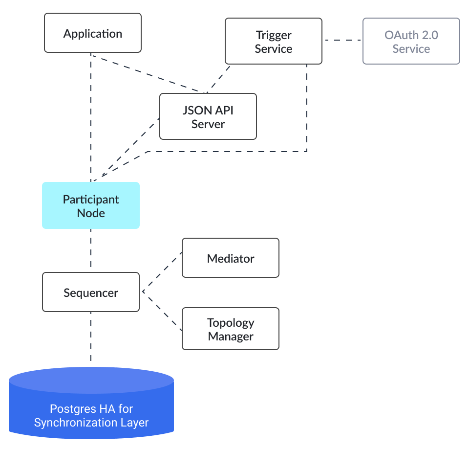

.. Copyright (c) 2022 Digital Asset (Switzerland) GmbH and/or its affiliates. All rights reserved.
.. SPDX-License-Identifier: Apache-2.0

Overview: Important Considerations When Building Applications With Daml
#######################################################################

Overall Considerations
**********************

Because Daml provides a unique and innovative solution to the problem of multi-party applications, some of the common architectural approaches used in existing solutions do not apply when working with Daml. You must understand Daml’s architecture and principles and design your application and deployment approaches accordingly.

Canton is fast and highly scalable, but it performs differently than traditional databases, particularly those that follow a monolithic architecture. Transactions are processed in fractions of a second -- quite fast for a distributed ledger (the blockchains used in cryptocurrencies like Bitcoin or Ethereum take many minutes to complete transactions) but slower than most traditional databases due to its distributed nature. Application design must take this into account.

Each component of Daml can be scaled, including running multiple domains and domain nodes, multiple participant nodes, and multiple parties. Integration components, e.g. HTTP JSON API Service and Trigger Service, also scale. Some components require that data is sharded in order to scale.

Developer Considerations
************************

When programming within a distributed system like Daml, the developer must view every action of the system as an asynchronous operation; contention is natural and expected. This contention can stifle the performance of applications if not handled properly. The aim is to reduce contention and handle it gracefully, not to eliminate it at all costs. If contention only occurs rarely, it may be cheaper in terms of both performance and complexity to let the occasional allocation fail and retry it than to implement sharding or other complex processes.

Application design must understand the sources of contention; this allows you to use different techniques to manage it and improve performance by increasing throughput and decreasing latency. These techniques include:

- Bundling or batching business logic to increase business transaction throughput - the marginal cost of extra business logic within a transaction is often small, so bundling or batching business logic cleverly can allow for throughput an order of magnitude higher.
- Maximizing parallelism with techniques like sharding, ensuring there is no contention between shards. (Avoid large sets of observers, which can negatively impact parallelism.) 

When designing Daml applications: 

* Understand where contention occurs
* Split contracts across natural lines to reduce single high contention contracts (e.g., don't represent asset holdings for all owners and types as a dictionary on a single contract, but as individual contracts)
* Partition contracts along natural lines and touch as few partitions as possible in each transaction (e.g., partition all asset positions into total asset positions, and then only touch one total asset position per transaction)
* Use contention-free representations where possible

The Daml language follows functional programming principles. To build safe, secure smart contracts with Daml, we recommended that the developers embrace functional programming. Using functional programming often helps to reduce contention.

The Daml SDK contains tools and libraries that simplify multi-party application development, including defining the application’s schema and implementing off-ledger code that leverages the Canton APIs.

Operational Considerations
**************************

Most components of Daml store state, so deployment techniques that follow stateless practices can be problematic within Daml. Achieving high availability and scalability requires clear understanding of the purpose of each component within the Daml solution. While all components in Daml scale horizontally, stateful components (e.g. participant nodes) scale horizontally via sharding.

The diagram below shows the components often used in a Daml deployment. High availability is achieved via either active-active (JSON API, sequencer) or active-passive (participant node, mediator) clustering. Node scaling is achieved via horizontal scaling with participant nodes requiring sharding across participants.

ver and the sequencer; the sequencer is further connected to the mediator, topology manager, and Postgres HA for Synchronoization layer.

Next Steps 
**********

Go to :doc:`/intro/0_Intro` to begin learning how to write smart contracts with Daml.

