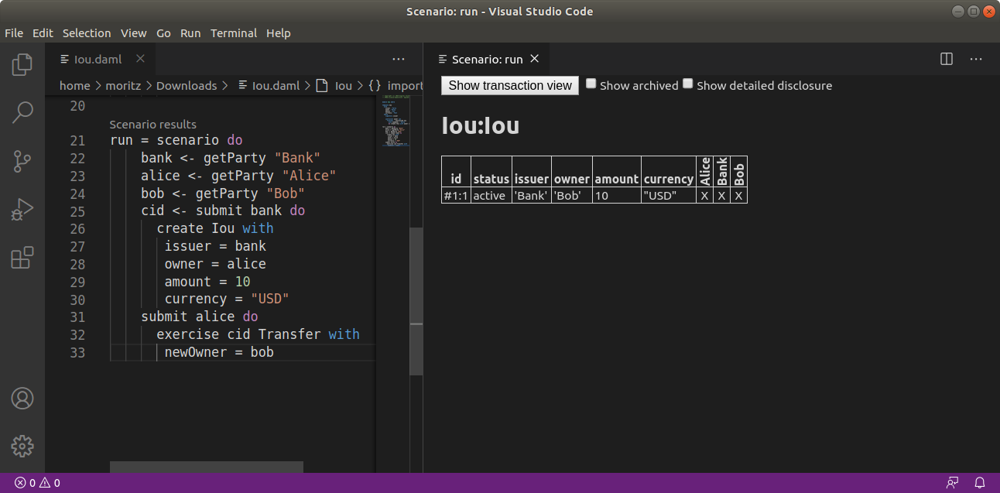
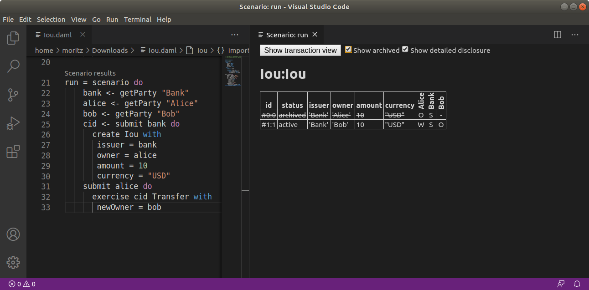
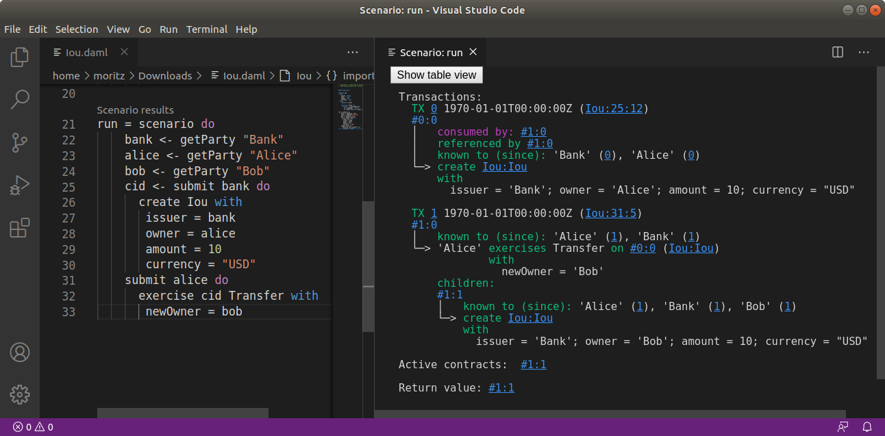

.. Copyright (c) 2020 Digital Asset (Switzerland) GmbH and/or its affiliates. All rights reserved.
.. SPDX-License-Identifier: Apache-2.0

DAML Studio
###########

DAML Studio is an integrated development environment (IDE) for DAML. It is an extension on top of `Visual Studio Code <https://code.visualstudio.com>`__ (VS Code), a cross-platform, open-source editor providing a `rich code editing experience <https://code.visualstudio.com/docs/editor/editingevolved>`__.

Installing
**********

DAML Studio is included in the :doc:`DAML SDK </getting-started/installation>`.

Creating your first DAML file
*****************************

1. Start DAML Studio by running ``daml studio`` in the current project.

   This command starts Visual Studio Code and (if needs be) installs the DAML Studio extension, or upgrades it to the latest version.

2. Make sure the DAML Studio extension is installed:

   1. Click on the Extensions icon at the bottom of the VS Code sidebar.
   2. Click on the DAML Studio extension that should be listed on the pane.

   .. image:: daml-studio/images/daml_studio_extension_view.png

3. Open a new file (``⌘N``) and save it (``⌘S``) as ``Test.daml``.
4. Copy the following code into your file:

.. literalinclude:: daml-studio/daml/Test.daml
  :language: daml

Your screen should now look like the image below.

   .. image:: daml-studio/images/daml_studio_extension_double_correct.png

5. Introduce a parse error by deleting the ``=`` sign and then clicking the
   Ⓧ symbol on the lower-left corner. Your screen should now look like the image below.

   .. image:: daml-studio/images/daml_studio_extension_double_wrong.png

6. Remove the parse error by restoring the ``=`` sign.

We recommend reviewing the `Visual Studio Code documentation
<https://code.visualstudio.com/docs/editor/codebasics>`_ to learn more
about how to use it.
To learn more about DAML, see :doc:`reference/index`.

Supported features
******************

Visual Studio Code provides many helpful features for editing DAML files and we recommend reviewing
`Visual Studio Code Basics <https://code.visualstudio.com/docs/editor/codebasics>`__ and `Visual Studio Code Keyboard Shortcuts for OS X <https://code.visualstudio.com/shortcuts/keyboard-shortcuts-macos.pdf>`_.
The DAML Studio extension for Visual Studio Code provides the following DAML-specific features:

Symbols and problem reporting
=============================

Use the commands listed below to navigate between symbols, rename them, and inspect any problems detected in your DAML files. Symbols are identifiers such as template names,
lambda arguments, variables, and so on.

============================ ===============
Command                      Shortcut (OS X)
============================ ===============
`Go to Definition`_          ``F12``
`Peek Definition`_           ``⌥F12``
`Rename Symbol`_             ``F2``
`Go to Symbol in File`_      ``⇧⌘O``
`Go to Symbol in Workspace`_ ``⌘T``
`Find all References`_       ``⇧F12``
`Problems Panel`_            ``⇧⌘M``
============================ ===============

.. note::
   You can also start a command by typing its name into the command palette (press ``⇧⌘P`` or ``F1``). The command palette
   is also handy for looking up keyboard shortcuts.

.. note::
   - `Rename Symbol`_, `Go to Symbol in File`_, `Go to Symbol in Workspace`_, and `Find all References`_ work on:
     choices, record fields, top-level definitions, let-bound variables, lambda arguments, and modules
   - `Go to Definition`_ and `Peek Definition`_ work on:
     top-level definitions, let-bound variables, lambda arguments, and modules

.. _Go to Definition: https://code.visualstudio.com/docs/editor/editingevolved#_go-to-definition
.. _Peek Definition: https://code.visualstudio.com/docs/editor/editingevolved#_peek
.. _Find all References: https://code.visualstudio.com/docs/editor/editingevolved#_peek
.. _Rename Symbol: https://code.visualstudio.com/docs/editor/editingevolved#_rename-symbol
.. _Go to Symbol in File: https://code.visualstudio.com/docs/editor/editingevolved#_go-to-symbol
.. _Go to Symbol in Workspace: https://code.visualstudio.com/docs/editor/editingevolved#_open-symbol-by-name
.. _Problems Panel: https://code.visualstudio.com/docs/editor/editingevolved#_errors-warnings

Hover tooltips
==============

You can `hover`_ over most symbols in the code to display additional information such as its type.

.. _hover: https://code.visualstudio.com/docs/editor/editingevolved#_hover

.. _scenario-script-results:

Scenario and DAML Script results
================================

Top-level declarations of type ``Scenario`` or ``Script`` are decorated with
a ``Scenario results`` or a ``Script results`` code lens.
You can click on the code lens to inspect the
execution transaction graph and the active contracts. The functionality
for inspecting the results is identical for DAML Scripts
and scenarios.

For the scenario from the :download:`Iou<daml-studio/daml/Iou.daml>`
module, you get the following table displaying all contracts that are
active at the end of the scenario. The first column displays the
contract id. The columns afterwards represent the fields of the
contract and finally you get one column per party with an ``X`` if the
party can see the contract or a ``-`` if not.

If you want more details, you can click on the *Show archived* checkbox, which extends
the table to include archived contracts, and on the *Show detailed disclosure* checkbox,
which displays why the contract is visible to each party, based on four categories:

1. ``S``, the party sees the contract because they are a signatory on the contract.
2. ``O``, the party sees the contract because they are an observer on the contract.
3. ``W``, the party sees the contract because they witnessed the creation of this contract, e.g.,
   because they are an actor on the ``exercise`` that created it.
4. ``D``, the party sees the contract because they have been divulged the contract, e.g.,
   because they witnessed an exercise that resulted in a ``fetch`` of this contract.

For details on the meaning of those four categories, refer to the
:ref:`DAML Ledger Model<da-model-privacy>`.
For the example above, the resulting table looks as follows. You can see the
archived ``Bank`` contract and the active ``Bank`` contract whose creation
``Alice`` has witnessed by virtue of being an actor on the ``exercise`` that
created it.

If you want to see the detailed transaction graph you can click on the
``Show transaction view`` button. The transaction graph
consists of transactions, each of which contain one or more updates to the
ledger, that is creates and exercises. The transaction graph also records
fetches of contracts.

For example a scenario for the :download:`Iou<daml-studio/daml/Iou.daml>` module looks as follows:

   Scenario results

Each transaction is the result of executing a step in the scenario. In the
image below, the transaction ``#0`` is the result of executing the first
line of the scenario (line 20), where the Iou is created by the bank. The following
information can be gathered from the transaction:

- The result of the first scenario transaction ``#0`` was the creation of the
  ``Iou`` contract with the arguments ``bank``, ``10``, and ``"USD"``.
- The created contract is referenced in transaction ``#1``, step ``0``.
- The created contract was consumed in transaction ``#1``, step ``0``.
- A new contract was created in transaction ``#1``, step ``1``, and has been
  divulged to parties 'Alice', 'Bob', and 'Bank'.
- At the end of the scenario only the contract created in ``#1:1`` remains.
- The return value from running the scenario is the contract identifier ``#1:1``.
- And finally, the contract identifiers assigned in scenario execution correspond to
  the scenario step that created them (e.g. ``#1``).

You can navigate to the corresponding source code by clicking on the location
shown in parenthesis (e.g. ``Iou:25:12``, which means the ``Iou`` module, line 25 and column 1).
You can also navigate between transactions by clicking on the transaction and contract ids (e.g. ``#1:0``).

DAML snippets
=============

You can automatically complete a number of "snippets" when editing a DAML
source file. By default, hitting ``^-Space`` after typing a DAML keyword
displays available snippets that you can insert.

To define your own workflow around DAML snippets, adjust
your user settings in Visual Studio Code to include the following options:

.. code-block:: json

   {
     "editor.tabCompletion": true,
     "editor.quickSuggestions": false
   }

With those changes in place, you can simply hit ``Tab`` after a keyword to insert the code pattern.

.. image:: daml-studio/images/daml_studio_snippet_demo.gif

You can develop your own snippets by following the instructions in
`Creating your own Snippets`_ to create an appropriate ``daml.json``
snippet file.

.. _Creating your own Snippets: https://code.visualstudio.com/docs/editor/userdefinedsnippets

Common scenario errors
**********************

During DAML execution, errors can occur due to exceptions (e.g. use of "abort", or division by zero), or
due to authorization failures. You can expect to run into the following errors when writing DAML.

When a runtime error occurs in a scenario execution, the scenario result view shows the error
together with the following additional information, if available:

Location of the failed commit
   If the failing part of the script was a ``submit``, the source location
   of the call to ``submit`` will be displayed.
Stack trace
   A list of source locations that were encoutered before the error occured. The last encountered
   location is the first entry in the list.
Ledger time
   The ledger time at which the error occurred.
Partial transaction
   The transaction that is being constructed, but not yet committed to the ledger.
Committed transaction
   Transactions that were successfully committed to the ledger prior to the error.
Trace
   Any messages produced by calls to ``trace`` and ``debug``.

Abort, assert, and debug
========================

The ``abort``, ``assert`` and ``debug`` inbuilt functions can be used in updates and scenarios. All three can be used to output messages, but ``abort`` and ``assert`` can additionally halt the execution:

.. literalinclude:: daml-studio/daml/Abort.daml
  :language: daml
  :lines: 8-10

.. code-block:: none

    Scenario execution failed:
      Aborted:  stop

    Ledger time: 1970-01-01T00:00:00Z

    Partial transaction:

    Trace:
      "hello, world!"

Missing authorization on create
===============================

If a contract is being created without approval from all authorizing
parties the commit will fail. For example:

.. literalinclude:: daml-studio/daml/CreateAuthFailure.daml
  :language: daml
  :lines: 7-13,15-18

Execution of the example scenario fails due to 'Bob' being a signatory
in the contract, but not authorizing the create:

.. code-block:: none

    Scenario execution failed:
      #0: create of CreateAuthFailure:Example at unknown source
          failed due to a missing authorization from 'Bob'

    Ledger time: 1970-01-01T00:00:00Z

    Partial transaction:
      Sub-transactions:
         #0
         └─> create CreateAuthFailure:Example
             with
               party1 = 'Alice'; party2 = 'Bob'

To create the "Example" contract one would need to bring both parties to
authorize the creation via a choice, for example 'Alice' could create a contract
giving 'Bob' the choice to create the 'Example' contract.

Missing authorization on exercise
=================================

Similarly to creates, exercises can also fail due to missing authorizations when a
party that is not a controller of a choice exercises it.

.. literalinclude:: daml-studio/daml/ExerciseAuthFailure.daml
  :language: daml
  :lines: 7-21,24-28

The execution of the example scenario fails when 'Bob' tries to exercise the
choice 'Consume' of which he is not a controller

.. code-block:: none

    Scenario execution failed:
      #1: exercise of Consume in ExerciseAuthFailure:Example at unknown source
          failed due to a missing authorization from 'Alice'

    Ledger time: 1970-01-01T00:00:00Z

    Partial transaction:
      Sub-transactions:
         #0
         └─> fetch #0:0 (ExerciseAuthFailure:Example)

         #1
         └─> 'Alice' exercises Consume on #0:0 (ExerciseAuthFailure:Example)
                     with

    Committed transactions:
      TX #0 1970-01-01T00:00:00Z (unknown source)
      #0:0
      │   known to (since): 'Alice' (#0), 'Bob' (#0)
      └─> create ExerciseAuthFailure:Example
          with
            owner = 'Alice'; friend = 'Bob'

From the error we can see that the parties authorizing the exercise ('Bob')
is not a subset of the required controlling parties.

Contract not visible
====================

Contract not being visible is another common error that can occur when a contract
that is being fetched or exercised has not been disclosed to the committing party.
For example:

.. literalinclude:: daml-studio/daml/NotVisibleFailure.daml
  :language: daml
  :lines: 7-15,17-21

In the above scenario the 'Example' contract is created by 'Alice' and makes no mention of
the party 'Bob' and hence does not cause the contract to be disclosed to 'Bob'. When 'Bob' tries
to exercise the contract the following error would occur:

.. code-block:: none

    Scenario execution failed:
      Attempt to fetch or exercise a contract not visible to the committer.
      Contract:  #0:0 (NotVisibleFailure:Example)
      Committer: 'Bob'
      Disclosed to: 'Alice'

    Ledger time: 1970-01-01T00:00:00Z

    Partial transaction:

    Committed transactions:
      TX #0 1970-01-01T00:00:00Z (unknown source)
      #0:0
      │   known to (since): 'Alice' (#0)
      └─> create NotVisibleFailure:Example
          with
            owner = 'Alice'

To fix this issue the party 'Bob' should be made a controlling party in one of the choices.

.. _daml-studio-packages:

Working with multiple packages
******************************

Often a DAML project consists of multiple packages, e.g., one
containing your templates and one containing a DAML trigger so that
you can keep the templates stable while modifying the trigger.  It is
possible to work on multiple packages in a single session of DAML
studio but you have to keep some things in mind. You can see the
directory structure of a simple multi-package project consisting of
two packages ``pkga`` and ``pkgb`` below:

.. code-block:: none

    .
    ├── daml.yaml
    ├── pkga
    │   ├── daml
    │   │   └── A.daml
    │   └── daml.yaml
    └── pkgb
        ├── daml
        │   └── B.daml
        └── daml.yaml

``pkga`` and ``pkgb`` are regular DAML projects with a ``daml.yaml``
and a DAML module. In addition to the ``daml.yaml`` files for the
respective packages, you also need to add a ``daml.yaml`` to the root
of your project. This file only needs to specify the SDK
version. Replace ``X.Y.Z`` by the SDK version you specified in the
``daml.yaml`` files of the individual packages. Note that this feature
is only available in SDK version ``0.13.52`` and newer.

.. code-block:: yaml

    sdk-version: X.Y.Z

You can then open DAML Studio once in the root of your project and
work on files in both packages. Note that if ``pkgb`` refers to
``pkga.dar`` in its ``dependencies`` field, changes will not be picked
up automatically. This is always the case even if you open DAML Studio
in ``pkgb``. However, for multi-package projects there is an
additional caveat: You have to both rebuild ``pkga.dar`` using ``daml
build`` and then build ``pkgb`` using ``daml build`` before restarting
DAML Studio.
