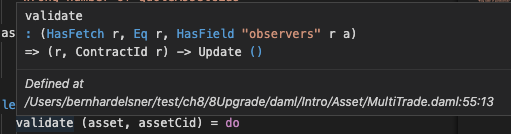

.. Copyright (c) 2022 Digital Asset (Switzerland) GmbH and/or its affiliates. All rights reserved.
.. SPDX-License-Identifier: Apache-2.0

Functional Programming 101
==========================

In this chapter, you will learn more about expressing complex logic in a functional language like Daml. Specifically, you'll learn about

- Function signatures and functions
- Advanced control flow (``if...else``, folds, recursion, ``when``)

If you no longer have your chapter 7 and 9 projects set up, and want to look back at the code, please follow the setup instructions in :doc:`9_Dependencies` to get hold of the code for this chapter.

.. note::

  There is a project template ``daml-intro-10`` for this chapter, but it only contains a single source file with the code snippets embedded in this section.

.. _haskell-connection:

The Haskell Connection
----------------------

The previous chapters of this introduction to Daml have mostly covered the structure of templates, and their connection to the :doc:`Daml Ledger Model </concepts/ledger-model/index>`. The logic of what happens within the ``do`` blocks of choices has been kept relatively simple. In this chapter, we will dive deeper into Daml's expression language, the part that allows you to write logic inside those ``do`` blocks. But we can only scratch the surface here. Daml borrows a lot of its language from `Haskell <https://www.haskell.org>`__. If you want to dive deeper, or learn about specific aspects of the language you can refer to standard literature on Haskell. Some recommendations:

- `Finding Success and Failure in Haskell (Julie Maronuki, Chris Martin) <https://joyofhaskell.com/>`__
- `Haskell Programming from first principles (Christopher Allen, Julie Moronuki) <http://haskellbook.com/>`__
- `Learn You a Haskell for Great Good! (Miran Lipovača) <http://learnyouahaskell.com/>`__
- `Programming in Haskell (Graham Hutton) <http://www.cs.nott.ac.uk/~pszgmh/pih.html>`__
- `Real World Haskell (Bryan O'Sullivan, Don Stewart, John Goerzen) <http://book.realworldhaskell.org/>`__

When comparing Daml to Haskell it's worth noting:

-   Haskell is a lazy language, which allows you to write things like ``head [1..]``, meaning "take the first element of an infinite list". Daml by contrast is strict. Expressions are fully evaluated, which means it is not possible to work with infinite data structures.
- Daml has a ``with`` syntax for records and dot syntax for record field access, neither of which is present in Haskell. However, Daml supports Haskell's curly brace record notation.
- Daml has a number of Haskell compiler extensions active by default.
- Daml doesn't support all features of Haskell's type system. For example, there are no existential types or GADTs.
- Actions are called Monads in Haskell.

Functions
---------

In :doc:`3_Data` you learnt about one half of Daml's type system: Data types. It's now time to learn about the other, which are Function types. Function types in Daml can be spotted by looking for ``->`` which can be read as "maps to".

For example, the function signature ``Int -> Int`` maps an integer to another integer. There are many such functions, but one would be:

.. literalinclude:: daml/daml-intro-10/daml/Main.daml
  :language: daml
  :start-after: -- INCREMENT_BEGIN
  :end-before: -- INCREMENT_END

You can see here that the function declaration and the function definitions are separate. The declaration can be omitted in cases where the type can be inferred by the compiler, but for top-level functions (ie ones at the same level as templates, directly under a module), it's often a good idea to include them for readability.

In the case of ``increment`` it could have been omitted. Similarly, we could define a function ``add`` without a declaration:

.. literalinclude:: daml/daml-intro-10/daml/Main.daml
  :language: daml
  :start-after: -- ADD_BEGIN
  :end-before: -- ADD_END

If you do this, and wonder what type the compiler has inferred, you can hover over the function name in the IDE:

What you see here is a slightly more complex signature:

.. literalinclude:: daml/daml-intro-10/daml/Main.daml
  :language: daml
  :start-after: -- ADD_SIG_BEGIN
  :end-before: -- ADD_SIG_END

There are two interesting things going on here:

1. We have more than one ``->``.
2. We have a type parameter ``a`` with a constraint ``Additive a``.

Function Application
....................

Let's start by looking at the right hand part ``a -> a -> a``. The ``->`` is right associative, meaning ``a -> a -> a`` is equivalent to ``a -> (a -> a)``. Using the "maps to" way of reading ``->`` we get "``a`` maps to a function that maps ``a`` to ``a``".

And this is indeed what happens. We can define a different version of ``increment`` by *partially applying* ``add``:

.. literalinclude:: daml/daml-intro-10/daml/Main.daml
  :language: daml
  :start-after: -- INCREMENT2_BEGIN
  :end-before: -- INCREMENT2_END

If you try this out in your IDE, you'll see that the compiler infers type ``Int -> Int`` again. It can do so because of the literal ``1 : Int``.

So if we have a function ``f : a -> b -> c -> d`` and a value ``valA : a``, we get ``f valA : b -> c -> d``, i.e. we can apply the function argument by argument. If we also had ``valB : b``, we would have ``f valA valB : c -> d``. What this tells you is that function *application* is left associative: ``f valA valB == (f valA) valB``.

Infix Functions
...............

Now ``add`` is clearly just an alias for ``+``, but what is ``+``? ``+`` is just a function. It's only special because it starts with a symbol. Functions that start with a symbol are *infix* by default which means they can be written between two arguments. That's why we can write ``1 + 2`` rather than ``+ 1 2``. The rules for converting between normal and infix functions are simple. Wrap an infix function in parentheses to use it as a normal function, and wrap a normal function in backticks to make it infix:

.. literalinclude:: daml/daml-intro-10/daml/Main.daml
  :language: daml
  :start-after: -- INFIX_BEGIN
  :end-before: -- INFIX_END

With that knowledge, we could have defined ``add`` more succinctly as the alias that it is:

.. literalinclude:: daml/daml-intro-10/daml/Main.daml
  :language: daml
  :start-after: -- ADD2_BEGIN
  :end-before: -- ADD2_END

If we want to partially apply an infix operation we can also do that as follows:

.. literalinclude:: daml/daml-intro-10/daml/Main.daml
  :language: daml
  :start-after: -- INFIX2_BEGIN
  :end-before: -- INFIX2_END

.. note::

  While function application is left associative by default, infix operators can be declared left or right associative and given a precedence. Good examples are the boolean operations ``&&`` and ``||``, which are declared right associative with precedences 3 and 2, respectively. This allows you to write ``True || True && False`` and get value ``True``. See section 4.4.2 of `the Haskell 98 report <https://www.haskell.org/onlinereport/decls.html>`_ for more on fixities.

Type Constraints
................

The ``Additive a =>`` part of the signature of ``add`` is a type constraint on the type parameter ``a``. ``Additive`` here is a typeclass. You already met typeclasses like ``Eq`` and ``Show`` in :doc:`3_Data`. The ``Additive`` typeclass says that you can add a thing, i.e. there is a function ``(+) : a -> a -> a``. Now the way to read the full signature of ``add`` is "Given that ``a`` has an instance for the ``Additive`` typeclass, ``a`` maps to a function which maps ``a`` to ``a``".

Typeclasses in Daml are a bit like interfaces in other languages. To be able to add two things using the ``+`` function, those things need to "expose" (have an instance for) the ``Additive`` interface (typeclass).

Unlike interfaces, typeclasses can have multiple type parameters. A good example, which also demonstrates the use of multiple constraints at the same time, is the signature of the ``exercise`` function:

.. code-block:: daml

  exercise : (Template t, Choice t c r) => ContractId t -> c -> Update r

Let's turn this into prose: Given that ``t`` is the type of a template, and that ``t`` has a choice ``c`` with return type ``r``, the ``exercise`` function maps a ``ContractId`` for a contract of type ``t`` to a function that takes the choice arguments of type ``c`` and returns an ``Update`` resulting in type ``r``.

That's quite a mouthful, and does require one to know what *meaning* the typeclass ``Choice`` gives to parameters ``t`` ``c`` and ``r``, but in many cases, that's obvious from the context or names of typeclasses and variables.

Note that using single letters, while common, is not mandatory. The above may be made a little bit clearer by expanding the type parameter names, at the cost of making the code a bit longer:

.. code-block:: daml

  exercise : (Template template, Choice template choice result) =>
               ContractId template -> choice -> Update result

Pattern Matching in Arguments
.............................

You met pattern matching in :doc:`3_Data`, using ``case`` expressions which is one way of pattern matching. However, it can also be convenient to do the pattern matching at the level of function arguments. Think about implementing the function ``uncurry``:

.. literalinclude:: daml/daml-intro-10/daml/Main.daml
  :language: daml
  :start-after: -- UNCURRY_SIG_BEGIN
  :end-before: -- UNCURRY_SIG_END

``uncurry`` takes a function with two arguments (or more, since ``c`` could be a function), and turns it into a function from a 2-tuple to ``c``. Here are three ways of implementing it, using tuple accessors, ``case`` pattern matching, and function pattern matching:

.. literalinclude:: daml/daml-intro-10/daml/Main.daml
  :language: daml
  :start-after: -- UNCURRY_BEGIN
  :end-before: -- UNCURRY_END

Any pattern matching you can do in ``case`` you can also do at the function level, and the compiler helpfully warns you if you did not cover all cases, which is called "non-exhaustive".

.. literalinclude:: daml/daml-intro-10/daml/Main.daml
  :language: daml
  :start-after: -- FROM_SOME_BEGIN
  :end-before: -- FROM_SOME_END

The above will give you a warning:

.. code-block:: none

  warning:
    Pattern match(es) are non-exhaustive
    In an equation for ‘fromSome’: Patterns not matched: None

A function that does not cover all its cases, like ``fromSome`` here, is called a *partial* function. ``fromSome None`` will cause a runtime error.

We can use function level pattern matching together with a feature called *Record Wildcards* to write the function ``issueAsset`` in chapter 9:

.. literalinclude:: daml/daml-intro-9/daml/Test/Intro/Asset/MultiTrade.daml
  :language: daml
  :start-after: -- ISSUE_ASSET_BEGIN
  :end-before: -- ISSUE_ASSET_END

The ``..`` in the pattern match here means bind all fields from the given record to local variables, so we have local variables ``issuer``, ``owner``, etc.

The ``..`` in the second to last line means fill all fields of the new record using local variables of the matching names, in this case (per the definition of ``Issue_Asset``), ``symbol`` and ``quantity``, taken from the ``asset`` argument to the function. In other words, this is equivalent to:

.. code-block:: daml

   exerciseCmd ahCid Issue_Asset with symbol = asset.symbol, quantity = asset.quantity

because the notation ``asset@(Asset with ..)`` binds ``asset`` to the entire record, while also binding all of the fields of ``asset`` to local variables.

Functions Everywhere
....................

You have probably already guessed it: Anywhere you can put a value in Daml you can also put a function. Even inside data types:

.. literalinclude:: daml/daml-intro-10/daml/Main.daml
  :language: daml
  :start-after: -- FUNCTION_IN_DATA_BEGIN
  :end-before: -- FUNCTION_IN_DATA_END

More commonly, it makes sense to define functions locally, inside a ``let`` clause or similar. A good example of this are the ``validate`` and ``transfer`` functions defined locally in the ``Trade_Settle`` choice of the  model from chapter 9:

.. literalinclude:: daml/daml-intro-9/daml/Intro/Asset/MultiTrade.daml
  :language: daml
  :start-after: -- LOCAL_FUNCTIONS_BEGIN
  :end-before: -- LOCAL_FUNCTIONS_END

You can see that the function signature is inferred from the context here. If you look closely (or hover over the function in the IDE), you'll see that it has signature

.. code-block:: shell

    validate : (HasFetch r, Eq r, HasField "observers" r a) => (r, ContractId r) -> Update ()

.. note::

    Bear in mind that functions are not serializable, so you can't use them inside template arguments, as choice inputs, or as choice outputs. They also don't have instances of the ``Eq`` or ``Show`` typeclasses which one would commonly want on data types.

The ``mapA`` and ``mapA_`` functions loop through the lists of assets and approvals, and apply the functions ``validate`` and ``transfer`` to each element of those lists, performing the resulting ``Update`` action in the process. We'll look at that more closely under :ref:`looping` below.

Lambdas
.......

Daml supports inline functions, called "lambda"s. They are defined using the ``(\x y z -> ...)`` syntax. For example, a lambda version of ``increment`` would be ``(\n -> n + 1)``.

Control Flow
------------

In this section, we will cover branching and looping, and look at a few common patterns of how to translate procedural code into functional code.

Branching
.........

Until Chapter 7 the only real kind of control flow introduced has been ``case``, which is a powerful tool for branching.

If ... Else
~~~~~~~~~~~

Chapter 5 also showed a seemingly self-explanatory ``if ... else`` expression, but didn't explain it further. Let's implement the function ``boolToInt : Bool -> Int`` which in typical fashion maps ``True`` to ``1`` and ``False`` to ``0``. Here is an implementation using ``case``:

.. literalinclude:: daml/daml-intro-10/daml/Main.daml
  :language: daml
  :start-after: -- BOOL_TO_INT_BEGIN
  :end-before: -- BOOL_TO_INT_END

If you write this function in the IDE, you'll get a warning from the linter:

.. code-block:: none

    Suggestion: Use if
    Found:
    case b of
        True -> 1
        False -> 0
    Perhaps:
    if b then 1 else 0

The linter knows the equivalence and suggests a better implementation:

.. literalinclude:: daml/daml-intro-10/daml/Main.daml
  :language: daml
  :start-after: -- BOOL_TO_INT2_BEGIN
  :end-before: -- BOOL_TO_INT2_END

In short: ``if ... else`` expressions are equivalent to ``case`` expressions, but can be easier to read.

Control Flow as Expressions
~~~~~~~~~~~~~~~~~~~~~~~~~~~

``case`` and ``if ... else`` expressions really are control flow in the sense that they short-circuit:

.. literalinclude:: daml/daml-intro-10/daml/Main.daml
  :language: daml
  :start-after: -- TEXT_TO_BOOL_BEGIN
  :end-before: -- TEXT_TO_BOOL_END

This function behaves as you would expect: the error only gets evaluated if an invalid text is passed in.

This is different from functions, where all arguments are evaluated immediately:

.. literalinclude:: daml/daml-intro-10/daml/Main.daml
  :language: daml
  :start-after: -- IFELSE_BEGIN
  :end-before: -- IFELSE_END

In the above, ``boom`` is an error.

While providing proper control flow, ``case`` and ``if ... else`` expressions do result in a value when evaluated. You can actually see that in the function definitions above. Since each of the functions is defined just as a ``case`` or ``if ... else`` expression, the value of the evaluated function is just the value of the ``case`` or ``if ... else`` expression. Values have a type: the ``if ... else`` expression in ``boolToInt2`` has type ``Int`` as that is what the function returns; similarly, the ``case`` expression in ``doError`` has type ``Bool``. To be able to give such expressions an unambiguous type, each branch needs to have the same type. The below function does not compile as one branch tries to return an ``Int`` and the other a ``Text``:

.. literalinclude:: daml/daml-intro-10/daml/Main.daml
  :language: daml
  :start-after: -- TYPE_ERROR_BEGIN
  :end-before: -- TYPE_ERROR_END

If we need functions that can return two (or more) types of things we need to encode that in the return type. For two possibilities, it's common to use the ``Either`` type:

.. literalinclude:: daml/daml-intro-10/daml/Main.daml
  :language: daml
  :start-after: -- INT_OR_TEXT_BEGIN
  :end-before: -- INT_OR_TEXT_END

When you have more than two possible types (and sometimes even just for two types), it can be clearer to define your own variant type to wrap all possibilities.

Branching in Actions
~~~~~~~~~~~~~~~~~~~~

The most common case where this becomes important is inside ``do`` blocks. Say we want to create a contract of one type in one case, and of another type in another case. Let's say we have two template types and want to write a function that creates an ``S`` if a condition is met, and a ``T`` otherwise.

.. literalinclude:: daml/daml-intro-10/daml/Main.daml
  :language: daml
  :start-after: -- S_T_BEGIN
  :end-before: -- S_T_END

It would be tempting to write a simple ``if ... else``, but it won't typecheck if each branch returns a different type:

.. literalinclude:: daml/daml-intro-10/daml/Main.daml
  :language: daml
  :start-after: -- TYPE_ERROR2_BEGIN
  :end-before: -- TYPE_ERROR2_END

We have two options:

1. Use the ``Either`` trick from above.
2. Get rid of the return types.

.. literalinclude:: daml/daml-intro-10/daml/Main.daml
  :language: daml
  :start-after: -- S_OR_T_BEGIN
  :end-before: -- S_OR_T_END

The latter is so common that there is a utility function in ``DA.Action`` to get rid of the return type: ``void : Functor f => f a -> f ()``.

.. literalinclude:: daml/daml-intro-10/daml/Main.daml
  :language: daml
  :start-after: -- VOID_BEGIN
  :end-before: -- VOID_END

``void`` also helps express control flow of the type "Create a ``T`` only if a condition is met.

.. literalinclude:: daml/daml-intro-10/daml/Main.daml
  :language: daml
  :start-after: -- CUSTOM_WHEN_BEGIN
  :end-before: -- CUSTOM_WHEN_END

Note that we still need the ``else`` clause of the same type ``()``. This pattern is so common, it's encapsulated in the standard library function ``DA.Action.when : (Applicative f) => Bool -> f () -> f ()``.

.. literalinclude:: daml/daml-intro-10/daml/Main.daml
  :language: daml
  :start-after: -- WHEN_BEGIN
  :end-before: -- WHEN_END

Despite ``when`` looking like a simple function, the compiler does some magic so that it short-circuits evaluation just like ``if ... else`` and ``case``. The following ``noop`` function is a no-op (i.e. "does nothing"), not an error as one might otherwise expect:

.. literalinclude:: daml/daml-intro-10/daml/Main.daml
  :language: daml
  :start-after: -- MAGIC_WHEN_BEGIN
  :end-before: -- MAGIC_WHEN_END

With ``case``, ``if ... else``, ``void`` and ``when``, you can express all branching. However, one additional feature you may want to learn is guards. They are not covered here, but can help avoid deeply nested ``if ... else`` blocks. Here's just one example. The Haskell sources at the beginning of the chapter cover this topic in more depth.

.. literalinclude:: daml/daml-intro-10/daml/Main.daml
  :language: daml
  :start-after: -- TELL_SIZE_BEGIN
  :end-before: -- TELL_SIZE_END

.. _looping:

Looping
.......

Other than branching, the most common form of control flow is looping. Looping is usually used to iteratively modify some state. We'll use JavaScript in this section to illustrate the procedural way of doing things.

.. code-block:: JavaScript

  function sum(intArr) {
    var result = 0;
    intArr.forEach (i => {
      result += i;
    });
    return result;
  }

A more general loop looks like this:

.. code-block:: JavaScript

  function whileF(init, cont, step, finalize) {
    var state = init();
    while (cont(state)) {
      state = step(state);
    }
    return finalize(state);
  }

In both cases, state is being mutated: ``result`` in the former, ``state`` in the latter. Values in Daml are immutable, so it needs to work differently. In Daml we will do this with folds and recursion.

.. _folds:

Folds
~~~~~

Folds correspond to looping with an explicit iterator: ``for`` and ``forEach`` loops in procedural languages. The most common iterator is a list, as is the case in the ``sum`` function above. For such cases, Daml has the ``foldl`` function. The ``l`` stands for "left" and means the list is processed from the left. There is also a corresponding ``foldr`` which processes from the right.

.. code-block:: daml

  foldl : (b -> a -> b) -> b -> [a] -> b

Let's give the type parameters semantic names. ``b`` is the state, ``a`` is an item. ``foldl``\ s first argument is a function which takes a state and an item and returns a new state. That's the equivalent of the inner block of the ``forEach``. It then takes a state, which is the initial state, and a list of items, which is the iterator. The result is again a state. The ``sum`` function above can be translated to Daml almost instantly with those correspondences in mind:

.. literalinclude:: daml/daml-intro-10/daml/Main.daml
  :language: daml
  :start-after: -- SUM_BEGIN
  :end-before: -- SUM_END

If we wanted to be more verbose, we could replace ``(+)`` with a lambda ``(\result i -> result + i)`` which makes the correspondence to ``result += i`` from the JavaScript clearer.

Almost all loops with explicit iterators can be translated to folds, though we have to take a bit of care with performance when it comes to translating ``for`` loops:

.. code-block:: JavaScript

  function sumArrs(arr1, arr2) {
    var l = min (arr1.length, arr2.length);
    var result = new int[l];
    for(var i = 0; i < l; i++) {
      result[i] = arr1[i] + arr2[i];
    }
    return result;
  }

Translating the ``for`` into a ``forEach`` is easy if you can get your hands on an array containing values ``[0..(l-1)]``. And that's how you do it in Daml, using *ranges*. ``[0..(l-1)]`` is shorthand for ``enumFromTo 0 (l-1)``, which returns the list you'd expect.

Daml also has an operator ``(!!) : [a] -> Int -> a`` which returns an element in a list. You may now be tempted to write ``sumArrs`` like this:

.. literalinclude:: daml/daml-intro-10/daml/Main.daml
  :language: daml
  :start-after: -- SUM_ARR_BEGIN
  :end-before: -- SUM_ARR_END

Unfortunately, that's not a very good approach. Lists in Daml are linked lists, which makes access using ``(!!)`` too slow for this kind of iteration. A better approach in Daml is to get rid of the ``i`` altogether and instead merge the lists first using the ``zip`` function, and then iterate over the "zipped" up lists:

.. literalinclude:: daml/daml-intro-10/daml/Main.daml
  :language: daml
  :start-after: -- SUM_ARR2_BEGIN
  :end-before: -- SUM_ARR2_END

``zip : [a] -> [b] -> [(a, b)]`` takes two lists, and merges them into a single list where the first element is the 2-tuple containing the first element of the two input lists, and so on. It drops any left-over elements of the longer list, thus making the ``min`` logic unnecessary.

Maps
~~~~

In effect, the lambda passed to ``foldl`` only "wants" to act on a single element of the (zipped-up) input list, but still has to manage the concatenation of the whole state. Acting on each element separately is a common-enough pattern that there is a specialized function for it: ``map : (a -> b) -> [a] -> [b]``. Using it, we can rewrite ``sumArr`` to:

.. literalinclude:: daml/daml-intro-10/daml/Main.daml
  :language: daml
  :start-after: -- SUM_ARR3_BEGIN
  :end-before: -- SUM_ARR3_END

As a rule of thumb, use ``map`` if the result has the same shape as the input and you don't need to carry state from one iteration to the next. Use folds if you need to accumulate state in any way.

Recursion
~~~~~~~~~

If there is no explicit iterator, you can use recursion. Let's try to write a function that reverses a list, for example. We want to avoid ``(!!)`` so there is no sensible iterator here. Instead, we use recursion:

.. literalinclude:: daml/daml-intro-10/daml/Main.daml
  :language: daml
  :start-after: -- REVERSE_BEGIN
  :end-before: -- REVERSE_END

You may be tempted to make ``reverseWorker`` a local definition inside ``reverse``, but Daml only supports recursion for top-level functions so the recursive part ``recurseWorker`` has to be its own top-level function.

Folds and Maps in Action Contexts
~~~~~~~~~~~~~~~~~~~~~~~~~~~~~~~~~

The folds and ``map`` function above are pure in the sense introduced in :doc:`5_Restrictions`: The functions used to map or process items have no side-effects. If you have looked at the chapter 9 models, you'll have noticed ``mapA``, ``mapA_``, and ``forA``, that seem to serve a similar role but within ``Action``\ s . A good example is the ``mapA`` call in the ``testMultiTrade`` script:

.. literalinclude:: daml/daml-intro-9/daml/Test/Intro/Asset/MultiTrade.daml
  :language: daml
  :start-after: -- MAPA_BEGIN
  :end-before: -- MAPA_END

Here we have a list of relationships (type ``[Relationship]``) and a function ``setupRelationship : Relationship -> Script (ContractId AssetHolder)``. We want the ``AssetHolder`` contracts for those relationships, i.e. something of type ``[ContractId AssetHolder]``. Using the map function almost gets us there, but ``map setupRelationship rels`` would have type ``[Update (ContractId AssetHolder)]``. This is a list of ``Update`` actions, each resulting in a ``ContractId AssetHolder``. What we need is an ``Update`` action resulting in a ``[ContractId AssetHolder]``. The list and ``Update`` are nested the wrong way around for our purposes.

Intuitively, it's clear how to fix this: we want the compound action consisting of performing each of the actions in the list in turn. There's a function for that: ``sequence : : Applicative m => [m a] -> m [a]``. It implements that intuition and allows us to "take the ``Update`` out of the list", so to speak. So we could write ``sequence (map setupRelationship rels)``. This is so common that it's encapsulated in the ``mapA`` function, a possible implementation of which is

.. literalinclude:: daml/daml-intro-10/daml/Main.daml
  :language: daml
  :start-after: -- MAPA_BEGIN
  :end-before: -- MAPA_END

The ``A`` in ``mapA`` stands for "Action", and you'll find that many functions that have something to do with "looping" have an ``A`` equivalent. The most fundamental of all of these is ``foldlA : Action m => (b -> a -> m b) -> b -> [a] -> m b``, a left fold with side effects. Here the inner function has a side-effect indicated by the ``m`` so the end result ``m b`` also has a side effect: the sum of all the side effects of the inner function.

To improve your familiarity with these concepts, you could try implementing ``foldlA`` in terms of ``foldl``, as well as ``sequence`` and ``mapA`` in terms of ``foldlA``. Here is one set of possible implementations:

.. literalinclude:: daml/daml-intro-10/daml/Main.daml
  :language: daml
  :start-after: -- IMPLEMENTATIONS_BEGIN
  :end-before: -- IMPLEMENTATIONS_END

``forA`` is just ``mapA`` with its arguments reversed. This is useful for readability if the list of items is already in a variable, but the function is a lengthy lambda.

.. literalinclude:: daml/daml-intro-9/daml/Test/Intro/Asset/MultiTrade.daml
  :language: daml
  :start-after: -- FORA_EXAMPLE_BEGIN
  :end-before: -- FORA_EXAMPLE_END

Lastly, you'll have noticed that in some cases we used ``mapA_``, not ``mapA``. The underscore indicates that the result is not used, so ``mapA_ fn xs fn == void (mapA fn xs)``. The Daml Linter will alert you if you could use ``mapA_`` instead of ``mapA``, and similarly for ``forA_``.

Next Up
-------

You now know the basics of functions and control flow, both in pure and Action contexts. The Chapter 9 example shows just how much can be done with just the tools you have encountered here, but there are many more tools at your disposal in the Daml Standard Library. It provides functions and typeclasses for many common circumstances and in :doc:`11_StdLib`, you'll get an overview of the library and learn how to search and browse it.
