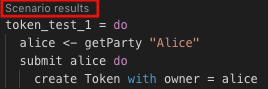
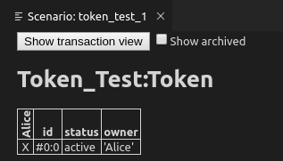
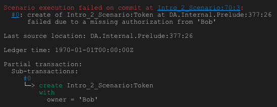
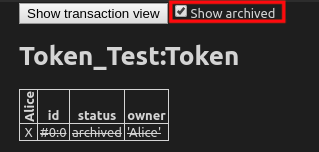
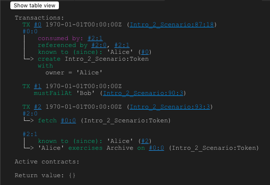

.. Copyright (c) 2023 Digital Asset (Switzerland) GmbH and/or its affiliates. All rights reserved.
.. SPDX-License-Identifier: Apache-2.0

.. _testing-using-script:

Test Templates Using Daml Script
================================

In this section you will test the ``Token`` model from :doc:`1_Token` using the :doc:`Daml Script </daml-script/index>` integration in :ref:`Daml Studio <script-results>`. You'll learn about the basic features of:

- Allocating parties
- Submitting transactions
- Creating contracts
- Testing for failure
- Archiving contracts
- Viewing ledger and final ledger state

.. hint::

  Remember that you can load all the code for this section into a folder called ``intro2`` by running ``daml new intro2 --template daml-intro-2``

.. script_basics:

Script Basics
-------------

A ``Script`` is like a recipe for a test, letting you script different parties submitting a series of transactions to check that your templates behave as you expect. You can also script some external information like party identities, and ledger time.

Below is a basic script that creates a ``Token`` for a party called "Alice":

.. literalinclude:: daml/daml-intro-2/daml/Token_Test.daml
  :language: daml
  :start-after: -- TOKEN_TEST_1_BEGIN
  :end-before: -- TOKEN_TEST_1_END

You declare a ``Script`` as a top-level variable and introduce it using ``script do``. ``do`` always starts a block, so the rest of the script is indented.

Before you can create any ``Token`` contracts, you need some parties on the test ledger. The above script uses the function ``allocateParty`` to put a party called "Alice" in a variable ``alice``. There are two things of note there:

- Use of ``<-`` instead of ``=``.

  The reason for that is ``allocateParty`` is an ``Action`` that can only be performed once the ``Script`` is run in the context of a ledger. ``<-`` means "run the action and bind the result". It can only be run in that context because, depending on the ledger state the script is running on, ``allocateParty`` will either give you back a party with the name you specified or append a suffix to that name if such a party has already been allocated.

  More on ``Actions`` and ``do`` blocks in :doc:`5_Restrictions`.

  If that doesn't quite make sense yet, for the time being you can think of this arrow as extracting the right-hand-side value from the ledger and storing it into the variable on the left.
- The argument ``"Alice"`` to ``allocateParty`` does not have to be enclosed in brackets. Functions in Daml are called using the syntax ``fn arg1 arg2 arg3``.

With a variable ``alice`` of type ``Party`` in hand, you can submit your first transaction. Unsurprisingly, you do this using the ``submit`` function. ``submit`` takes two arguments: the ``Party`` and the ``Commands``.

Just like ``Script`` is a recipe for a test, ``Commands`` is a recipe for a transaction. ``createCmd Token with owner = alice`` is a ``Commands``, which translates to a list of commands that will be submitted to the ledger creating a transaction which creates a ``Token`` with owner Alice.

You'll learn all about the syntax ``Token with owner = alice`` in :doc:`3_Data`.

You could write this as ``submit alice (createCmd Token with owner = alice)``, but just like scripts, you can assemble commands using ``do`` blocks. A ``do`` block always takes the value of the last statement within it so the syntax shown in the commands above gives the same result, whilst being easier to read. Note however, that the commands submitted as part of a transaction are not allowed to depend on each other.

Run the Scripts
---------------

There are a few ways to run Daml Scripts:

- In Daml Studio against a test ledger, providing visualizations of the resulting ledger.
- Using the command line ``daml test`` also against a test ledger, useful for continuous integration.
- Against a real ledger, take a look at the documentation for :doc:`Daml Script </daml-script/index>` for more information.
- Interactively using :doc:`Daml REPL </daml-repl/index>`.

In Daml Studio, you should see the text "Script results" just above the line ``token_test_1 = do``. Click on it to display the outcome of the script.

This opens the script view in a separate column in VS Code. The default view is a tabular representation of the final state of the ledger:

What this display means:

- The big title reading ``Token_Test:Token`` is the identifier of the type of contract that's listed below. ``Token_Test`` is the module name, ``Token`` the template name.

- The first column shows the ID of the contract. This will be explained later.

- The second column shows the status of the contract, either ``active`` or ``archived``.

- The next section of columns show the contract arguments, with one column per field. As expected, field ``owner`` is ``'Alice'``. The single quotation marks indicate that ``Alice`` is a party.

- The remaining columns, labelled vertically, show which parties know about which contracts. In this simple script, the sole party "Alice" knows about the contract she created.

To run the same test from the command line, save your module in a file ``Token_Test.daml`` and run ``daml damlc -- test --files Token_Test.daml``. If your file contains more than one script, all of them will be run.

.. _intro_2_failure:

Test for Failure
----------------

In :doc:`1_Token` you learned that creating a ``Token`` requires the authority of its owner. In other words, it should not be possible for Alice to create a token for another party and vice versa. A reasonable attempt to test that would be:

.. literalinclude:: daml/daml-intro-2/daml/Token_Test.daml
  :language: daml
  :start-after: -- FAILURE_TEST_1_BEGIN
  :end-before: -- FAILURE_TEST_1_END

However, if you open the script view for that script, you see the following message:

The script failed, as expected, but scripts abort at the first failure. This means that it only tested that Alice can't create a token for Bob, and the second ``submit`` statement was never reached.

To test for failing submits and keep the script running thereafter, or fail if the submission succeeds, you can use the ``submitMustFail`` function:

.. literalinclude:: daml/daml-intro-2/daml/Token_Test.daml
  :language: daml
  :start-after: -- TOKEN_TEST_2_BEGIN
  :end-before: -- TOKEN_TEST_2_END

``submitMustFail`` never has an impact on the ledger so the resulting tabular script view just shows the two tokens resulting from the successful ``submit`` statements. Note the new column for Bob as well as the visibilities. Alice and Bob cannot see each others' tokens.

.. _archiving:

Archive Contracts
-----------------

Archiving contracts is the counterpart to creating contracts. As contracts are immutable, whenever you want to update them (loosely: change their state) you have to archive the current contract residing on the ledger and create a new one.

To archive a contract use the ``archiveCmd`` instead of ``createCmd``. Whereas ``createCmd`` takes an instance of a template, ``archiveCmd`` takes a reference to a created contract. Archiving requires authorization from controllers.

.. important::
    Archive choices are present on all templates and cannot be removed.

References to contracts have the type ``ContractId a``, where ``a`` is a *type parameter* representing the type of contract that the id refers to. For example, a reference to a ``Token`` would be a ``ContractId Token``.

To ``archiveCmd`` the token Alice has created, you need the contract id. Retrieve the contract id from the ledger with the ``<-`` notation. How this works is discussed in :doc:`5_Restrictions`.

This script first checks that Bob cannot archive Alice's token. Then Alice successfully archives it:

.. literalinclude:: daml/daml-intro-2/daml/Token_Test.daml
  :language: daml
  :start-after: -- TOKEN_TEST_3_BEGIN
  :end-before: -- TOKEN_TEST_3_END

Explore the Ledger
------------------

The resulting script view is empty, because there are no contracts left on the ledger. However, if you want to see the history of the ledger, e.g. to see how you got to that state, tick the "Show archived" box at the top of the ledger view:

You can see that there was a ``Token`` contract, which is now archived, indicated both by the "archived" value in the ``status`` column as well as by a strikethrough.

Click on the adjacent "Show transaction view" button to see the entire transaction graph:

In the Daml Studio script runner, committed transactions are numbered sequentially. The lines starting with ``TX`` indicate that there are three committed transactions, with ids ``#0``, ``#1``, and ``#2``. These correspond to the three ``submit`` and ``submitMustFail`` statements in the script.

Transaction ``#0`` has one *sub-transaction* ``#0:0``, which the arrow indicates is a ``create`` of a ``Token``. Identifiers ``#X:Y`` mean ``commit X, sub-transaction Y``. All transactions have this format in the script runner. However, this format is a testing feature. In general, you should consider Transaction and Contract IDs to be opaque.

The lines above and below ``create Token_Test:Token`` give additional information:

- ``consumed by: #2:0`` tells you that the contract is archived in sub-transaction ``0`` of commit ``2``.
- ``referenced by #2:0`` tells you that the contract was used in other transactions, and lists their IDs.
- ``disclosed to (since): 'Alice' (#0)`` tells you who knows about the contract. The fact that ``'Alice'`` appears in the list is equivalent to an ``x`` in the tabular view. The ``(#0)`` gives you the additional information that ``Alice`` learned about the contract in commit ``#0``.
- Everything following ``with`` shows the create arguments.

Exercises
---------

To get a better understanding of script, try the following exercises:

1. Write a template for a second type of token.
2. Write a script with two parties and two types of tokens, creating one token of each type for each party and archiving one token for each party, leaving one token of each type in the final ledger view.
3. In :ref:`archiving` you tested that Bob cannot archive Alice's token. Can you guess why the submit fails? How can you find out why the submit fails?

  .. hint::

    Remember that in :ref:`intro_2_failure` we saw a proper error message for a failing submit.

Next Up
-------

In :doc:`3_Data` you will learn about Daml's type system, and how you can think of templates as tables and contracts as database rows.
