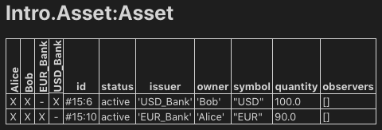

.. Copyright (c) 2020 Digital Asset (Switzerland) GmbH and/or its affiliates. All rights reserved.
.. SPDX-License-Identifier: Apache-2.0

7 Composing choices
===================

It's time to put everything you've learnt so far together into a complete and secure DAML model for asset issuance, management, transfer, and trading. This application will have capabilities similar to the one in :doc:`/app-dev/bindings-java/quickstart`. In the process you will learn about a few more concepts:

- DAML projects, packages and modules
- Composition of transactions
- Observers and stakeholders
- DAML's execution model
- Privacy

The model in this section is not a single DAML file, but a DAML project consisting of several files that depend on each other.

.. hint::

  Remember that you can load all the code for this section into a folder called ``7_Composing`` by running ``daml new 7Composing --template daml-intro-7``

DAML projects
-------------

DAML is organized in projects, packages and modules. A DAML project is specified using a single ``daml.yaml`` file, and compiles into a package in DAML's intermediate language, or bytecode equivalent, DAML-LF. Each DAML file within a project becomes a DAML module, which is a bit like a namespace. Each DAML project has a source root specified in the ``source`` parameter in the project's ``daml.yaml`` file. The package will include all modules specified in ``*.daml`` files beneath that source directory.

You can start a new project with a skeleton structure using ``daml new project_name`` in the terminal. A minimal project would contain just a ``daml.yaml`` file and an empty directory of source files.

 Take a look at the ``daml.yaml`` for the chapter 7 project:

.. literalinclude:: daml/daml-intro-7/daml.yaml.template
  :language: yaml

You can generally set ``name`` and ``version`` freely to describe your project. ``dependencies`` does what the name suggests: It includes dependencies. You should always include ``daml-prim`` and ``daml-stdlib``. The former contains internals of compiler and DAML Runtime, the latter gives access to the DAML Standard Library. ``daml-script`` contains the types and standard library for DAML Script.

You compile a DAML project by running ``daml build`` from the project root directory. This creates a ``dar`` file in ``.daml/dist/dist/project_name-project_version.dar``. A ``dar`` file is DAML's equivalent of a ``JAR`` file in Java: it's the artifact that gets deployed to a ledger to load the package and its dependencies. ``dar`` files are fully self-contained in that they contain all dependencies of the main package. More on all of this in :doc:`8_Dependencies`.

Project structure
-----------------

This project contains an asset holding model for transferrable, fungible assets and a separate trade workflow. The templates are structured in three modules: ``Intro.Asset``, ``Intro.Asset.Role``, and ``Intro.Asset.Trade``.

In addition, there are tests in modules ``Test.Intro.Asset``, ``Test.Intro.Asset.Role``, and ``Test.Intro.Asset.Trade``.

All but the last ``.``-separated segment in module names correspond to paths relative to the project source directory, and the last one to a file name. The folder structure therefore looks like this:

.. code-block:: none

  .
  ├── daml
  │   ├── Intro
  │   │   ├── Asset
  │   │   │   ├── Role.daml
  │   │   │   └── Trade.daml
  │   │   └── Asset.daml
  │   └── Test
  │       └── Intro
  │           ├── Asset
  │           │   ├── Role.daml
  │           │   └── Trade.daml
  │           └── Asset.daml
  └── daml.yaml

Each file contains a module header. For example, ``daml/Intro/Asset/Role.daml``:

.. literalinclude:: daml/daml-intro-7/daml/Intro/Asset/Role.daml
  :language: daml
  :start-after: -- PRAGMA_BEGIN
  :end-before: -- PRAGMA_END

You can import one module into another using the ``import`` keyword. The ``LibraryModules`` module imports all six modules:

.. literalinclude:: daml/daml-intro-7/daml/Intro/Asset/Role.daml
  :language: daml
  :start-after: -- IMPORT_BEGIN
  :end-before: -- IMPORT_END

Imports always have to appear just below the module declaration.
You can optionally add a list of names after the import to
import only the selected names:

.. code-block:: daml

  import DA.List (sortOn, groupOn)

If your module contains any DAML Scripts, you need to import the
corresponding functionality:

.. code-block:: daml

  import Daml.Script

Project overview
----------------

The project both changes and adds to the ``Iou`` model presented in :doc:`6_Parties`:

- Assets are fungible in the sense that they have ``Merge`` and ``Split`` choices that allow the ``owner`` to manage their holdings.
- Transfer proposals now need the authorities of both ``issuer`` and ``newOwner`` to accept. This makes ``Asset`` safer than ``Iou`` from the issuer's point of view.

  With the ``Iou`` model, an ``issuer`` could end up owing cash to anyone as transfers were authorized by just ``owner`` and ``newOwner``. In this project, only parties having an ``AssetHolder`` contract can end up owning assets. This allows the ``issuer`` to determine which parties may own their assets.
- The ``Trade`` template adds a swap of two assets to the model.

Composed choices and scripts
------------------------------

This project showcases how you can put the ``Update`` and ``Script`` actions you learnt about in :doc:`6_Parties` to good use. For example, the ``Merge`` and ``Split`` choices each perform several actions in their consequences.

- Two create actions in case of ``Split``
- One create and one archive action in case of ``Merge``

.. literalinclude:: daml/daml-intro-7/daml/Intro/Asset.daml
  :language: daml
  :start-after: -- MERGE_SPLIT_BEGIN
  :end-before: -- MERGE_SPLIT_END

The ``return`` function used in ``Split`` is available in any ``Action`` context. The result of ``return x`` is a no-op containing the value ``x``. It has an alias ``pure``, indicating that it's a pure value, as opposed to a value with side-effects. The ``return`` name makes sense when it's used as the last statement in a ``do`` block as its argument is indeed the "return"-value of the ``do`` block in that case.

Taking transaction composition a step further, the ``Trade_Settle`` choice on ``Trade`` composes two ``exercise`` actions:

.. literalinclude:: daml/daml-intro-7/daml/Intro/Asset/Trade.daml
  :language: daml
  :start-after: -- TRADE_SETTLE_BEGIN
  :end-before: -- TRADE_SETTLE_END

The resulting transaction, with its two nested levels of consequences, can be seen in the ``test_trade`` script in ``Test.Intro.Asset.Trade``:

.. code-block:: none

  TX #15 1970-01-01T00:00:00Z (Test.Intro.Asset.Trade:77:23)
  #15:0
  │   known to (since): 'Alice' (#15), 'Bob' (#15)
  └─> 'Bob' exercises Trade_Settle on #13:1 (Intro.Asset.Trade:Trade)
            with
              quoteAssetCid = #10:1; baseApprovalCid = #14:2
      children:
      #15:1
      │   known to (since): 'Alice' (#15), 'Bob' (#15)
      └─> fetch #11:1 (Intro.Asset:Asset)

      #15:2
      │   known to (since): 'Alice' (#15), 'Bob' (#15)
      └─> fetch #10:1 (Intro.Asset:Asset)

      #15:3
      │   known to (since): 'USD_Bank' (#15), 'Bob' (#15), 'Alice' (#15)
      └─> 'Alice',
          'Bob' exercises TransferApproval_Transfer on #14:2 (Intro.Asset:TransferApproval)
                with
                  assetCid = #11:1
          children:
          #15:4
          │   known to (since): 'USD_Bank' (#15), 'Bob' (#15), 'Alice' (#15)
          └─> fetch #11:1 (Intro.Asset:Asset)

          #15:5
          │   known to (since): 'Alice' (#15), 'USD_Bank' (#15), 'Bob' (#15)
          └─> 'Alice', 'USD_Bank' exercises Archive on #11:1 (Intro.Asset:Asset)

          #15:6
          │   referenced by #17:0
          │   known to (since): 'Bob' (#15), 'USD_Bank' (#15), 'Alice' (#15)
          └─> create Intro.Asset:Asset
              with
                issuer = 'USD_Bank'; owner = 'Bob'; symbol = "USD"; quantity = 100.0; observers = []

      #15:7
      │   known to (since): 'EUR_Bank' (#15), 'Alice' (#15), 'Bob' (#15)
      └─> 'Bob',
          'Alice' exercises TransferApproval_Transfer on #12:1 (Intro.Asset:TransferApproval)
                  with
                    assetCid = #10:1
          children:
          #15:8
          │   known to (since): 'EUR_Bank' (#15), 'Alice' (#15), 'Bob' (#15)
          └─> fetch #10:1 (Intro.Asset:Asset)

          #15:9
          │   known to (since): 'Bob' (#15), 'EUR_Bank' (#15), 'Alice' (#15)
          └─> 'Bob', 'EUR_Bank' exercises Archive on #10:1 (Intro.Asset:Asset)

          #15:10
          │   referenced by #16:0
          │   known to (since): 'Alice' (#15), 'EUR_Bank' (#15), 'Bob' (#15)
          └─> create Intro.Asset:Asset
              with
                issuer = 'EUR_Bank'; owner = 'Alice'; symbol = "EUR"; quantity = 90.0; observers = []

Similar to choices, you can see how the scripts in this project are built up from each other:

.. literalinclude:: daml/daml-intro-7/daml/Test/Intro/Asset/Role.daml
  :language: daml
  :start-after: -- TEST_ISSUANCE_BEGIN
  :end-before: -- TEST_ISSUANCE_END

In the above, the ``test_issuance`` script in ``Test.Intro.Asset.Role`` uses the output of the ``setupRoles`` script in the same module.

The same line shows a new kind of pattern matching. Rather than writing ``setupResult <- setupRoles`` and then accessing the components of ``setupResult`` using ``_1``, ``_2``, etc., you can give them names. It's equivalent to writing

.. code-block:: daml

  setupResult <- setupRoles
  case setupResult of
    (alice, bob, bank, aha, ahb) -> ...

Just writing ``(alice, bob, bank, aha, ahb) <- setupRoles`` would also be legal, but ``setupResult`` is used in the return value of ``test_issuance`` so it makes sense to give it a name, too. The notation with ``@`` allows you to give both the whole value as well as its constituents names in one go.

.. _execution_model:

DAML's execution model
----------------------

DAML's execution model is fairly easy to understand, but has some important consequences. You can imagine the life of a transaction as follows:

Command Submission
  A user submits a list of Commands via the Ledger API of a Participant Node, acting as a `Party` hosted on that Node. That party is called the requester.
Interpretation
  Each Command corresponds to one or more Actions. During this step, the ``Update`` corresponding to each Action is evaluated in the context of the ledger to calculate all consequences, including transitive ones (consequences of consequences, etc.). The result of this is a complete Transaction. Together with its requestor, this is also known as a Commit.
Blinding
  On ledgers with strong privacy, projections (see :ref:`privacy`) for all involved parties are created. This is also called *projecting*.
Transaction Submission
  The Transaction/Commit is submitted to the network.
Validation
  The Transaction/Commit is validated by the network. Who exactly validates can differ from implementation to implementation. Validation also involves scheduling and collision detection, ensuring that the transaction has a well-defined place in the (partial) ordering of Commits, and no double spends occur.
Commitment
  The Commit is actually commited according to the commit or consensus protocol of the Ledger.
Confirmation
  The network sends confirmations of the commitment back to all involved Participant Nodes.
Completion
  The user gets back a confirmation through the Ledger API of the submitting Participant Node.

The first important consequence of the above is that all transactions are committed atomically. Either a transaction is committed as a whole and for all participants, or it fails.

That's important in the context of the ``Trade_Settle`` choice shown above. The choice transfers a ``baseAsset`` one way and a ``quoteAsset`` the other way. Thanks to transaction atomicity, there is no chance that either party is left out of pocket.

The second consequence is that the requester of a transaction knows all consequences of their submitted transaction -- there are no surprises in DAML. However, it also means that the requester must have all the information to interpret the transaction.
We also refer to this as Principle 2 a bit later on this page.

That's also important in the context of ``Trade``. In order to allow Bob to interpret a transaction that transfers Alice's cash to Bob, Bob needs to know both about Alice's ``Asset`` contract, as well as about some way for ``Alice`` to accept a transfer -- remember, accepting a transfer needs the authority of ``issuer`` in this example.

Observers
---------

*Observers* are DAML's mechanism to disclose contracts to other parties. They are declared just like signatories, but using the ``observer`` keyword, as shown in the ``Asset`` template:

.. literalinclude:: daml/daml-intro-7/daml/Intro/Asset.daml
  :language: daml
  :start-after: -- ASSET_BEGIN
  :end-before: -- ASSET_END

The ``Asset`` template also gives the ``owner`` a choice to set the observers, and you can see how Alice uses it to show her ``Asset`` to Bob just before proposing the trade. You can try out what happens if she didn't do that by removing that transaction.

.. literalinclude:: daml/daml-intro-7/daml/Test/Intro/Asset/Trade.daml
  :language: daml
  :start-after: -- SET_OBSERVER_BEGIN
  :end-before: -- SET_OBSERVER_END

Observers have guarantees in DAML. In particular, they are guaranteed to see actions that create and archive the contract on which they are an observer.

Since observers are calculated from the arguments of the contract, they always know about each other. That's why, rather than adding Bob as an observer on Alice's ``AssetHolder`` contract, and using that to authorize the transfer in ``Trade_Settle``, Alice creates a one-time authorization in the form of a ``TransferAuthorization``. If Alice had lots of counterparties, she would otherwise end up leaking them to each other.

Controllers declared via the ``controller cs can`` syntax are automatically made observers. Controllers declared in the ``choice`` syntax are not, as they can only be calculated at the point in time when the choice arguments are known.

.. _privacy:

Privacy
-------

DAML's privacy model is based on two principles:

Principle 1. Parties see those actions that they have a stake in.
Principle 2. Every party that sees an action sees its (transitive) consequences.

Principle 2 is necessary to ensure that every party can independently verify the validity of every transaction they see.

A party has a stake in an action if

- they are a required authorizer of it
- they are a signatory of the contract on which the action is performed
- they are an observer on the contract, and the action creates or archives it

What does that mean for the ``exercise tradeCid Trade_Settle`` action from ``test_trade``?

Alice is the signatory of ``tradeCid`` and Bob a required authorizer of the ``Trade_Settled`` action, so both of them see it. According to rule 2. above, that means they get to see everything in the transaction.

The consequences contain, next to some ``fetch`` actions, two ``exercise`` actions of the choice ``TransferApproval_Transfer``.

Each of the two involved ``TransferApproval`` contracts is signed by a different ``issuer``, which see the action on "their" contract. So the EUR_Bank sees the ``TransferApproval_Transfer`` action for the EUR ``Asset`` and the USD_Bank sees the ``TransferApproval_Transfer`` action for the USD ``Asset``.

Some DAML ledgers, like the script runner and the Sandbox, work on the principle of "data minimization", meaning nothing more than the above information is distributed. That is, the "projection" of the overall transaction that gets distributed to EUR_Bank in step 4 of :ref:`execution_model` would consist only of the ``TransferApproval_Transfer`` and its consequences.

Other implementations, in particular those on public blockchains, may have weaker privacy constraints.

Divulgence
~~~~~~~~~~

Note that Principle 2 of the privacy model means that sometimes parties see contracts that they are not signatories or observers on. If you look at the final ledger state of the ``test_trade`` script, for example, you may notice that both Alice and Bob now see both assets, as indicated by the Xs in their respective columns:

This is because the ``create`` action of these contracts are in the transitive consequences of the ``Trade_Settle`` action both of them have a stake in. This kind of disclosure is often called "divulgence" and needs to be considered when designing DAML models for privacy sensitive applications.

Next up
-------

The model presented here is safe and sound so we could deploy it to production and start trading. But the journey doesn't stop there. In :doc:`8_Dependencies` you will learn how to extend an already running application to enhance it with new features. In that context you'll learn a bit more about the architecture of DAML, about dependencies, and identifiers.
