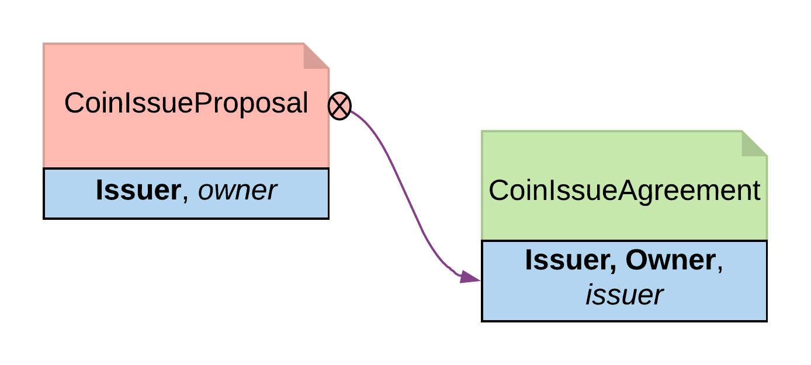

.. Copyright (c) 2020 Digital Asset (Switzerland) GmbH and/or its affiliates. All rights reserved.
.. SPDX-License-Identifier: Apache-2.0

Initiate and Accept
###################

The Initiate and Accept pattern demonstrates how to start a bilateral workflow. One party initiates by creating a proposal or an invite contract. This gives another party the chance to accept, reject or renegotiate.

Motivation
**********

It takes two to tango, but one party has to initiate. There is no difference in business world. The contractual relationship between two businesses often starts with an invite, a business proposal, a bid offering, etc.

Invite
  When a market operator wants to set up a market, they need to go through an on-boarding process, in which they invite participants to sign master service agreements and fulfill different roles in the market. Receiving participants need to evaluate the rights and responsibilities of each role and respond accordingly.
Propose
  When issuing an asset, an issuer is making a business proposal to potential buyers. The proposal lays out what is expected from buyers, and what they can expect from the issuer. Buyers need to evaluate all aspects of the offering, e.g. price, return, and tax implications, before making a decision.

The Initiate and Accept pattern demonstrates how to write a DAML program to model the initiation of an inter-company contractual relationship. DAML modelers often have to follow this pattern to ensure no participants are forced into an obligation.

Implementation
**************

The Initiate and Accept pattern in general involves 2 contracts:

Initiate contract
  The Initiate contract can be created from a role contract or any other point in the workflow. In this example, initiate contract is the proposal contract  *CoinIssueProposal* the issuer created from from the master contract *CoinMaster*.

  .. literalinclude:: daml/CoinIssuance.daml
    :language: daml
    :lines: 13-23

  The *CoinIssueProposal* contract has *Issuer* as the signatory, and *Owner* as the controller to the *Accept* choice. In its complete form, the *CoinIssueProposal* contract should define all choices available to the owner, i.e. Accept, Reject or Counter (e.g. re-negotiate terms).

  .. literalinclude:: daml/CoinIssuance.daml
    :language: daml
    :lines: 26-35

Result contract
  Once the owner exercises the *AcceptCoinProposal* choice on the initiate contract to express their consent, it returns a result contract representing the agreement between the two parties. In this example, the result contract is of type *CoinIssueAgreement*. Note, it has both *issuer* and *owner* as the signatories, implying they both need to consent to the creation of this contract. Both parties could be controller(s) on the result contract, depending on the business case.

  .. literalinclude:: daml/CoinIssuance.daml
    :language: daml
    :lines: 38-48

  Initiate and Accept pattern diagram

Trade-offs
**********

Initiate and Accept can be quite verbose if signatures from more than two parties are required to progress the workflow.
