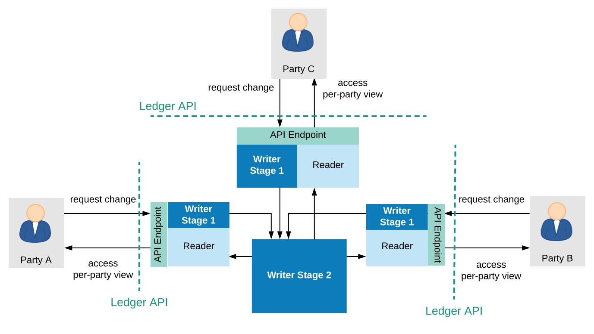
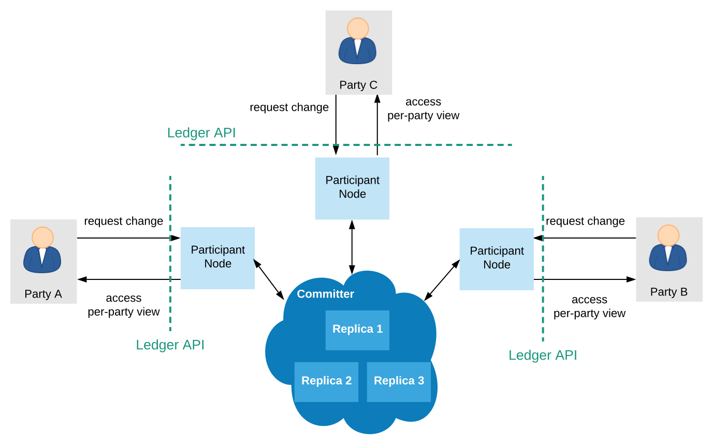
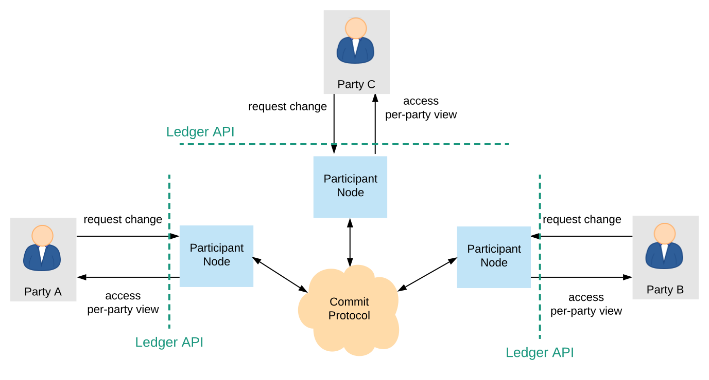

.. Copyright (c) 2021 Digital Asset (Switzerland) GmbH and/or its affiliates. All rights reserved.
.. SPDX-License-Identifier: Apache-2.0

.. _daml-ledger-topologies:

Daml Network Topologies
#######################

The Ledger API provides parties with an abstraction of a virtual shared ledger, visualized as follows.

.. image:: ../concepts/ledger-model/images/da-ledger-model.svg
   :width: 80%
   :align: center

The real-world topologies of actual ledger implementations differ significantly, however.
The topologies can impact both the functional and non-functional properties of the resulting ledger.
This document provides one useful categorization of the existing implementations' topologies: the split into global and partial state topologies, depending on whether single :ref:`trust domains <trust-domain>` can see the entire ledger, or just parts of it.
The implementations with topologies from the same category share many non-functional properties and trust assumptions.
Additionally, their :ref:`identity and package management <identity-package-management>` functions also behave similarly.

.. _global-state-topologies:

Global State Topologies
***********************

In global state topologies, there exists at least one :ref:`trust domain <trust-domain>` whose systems contain a physical copy of the entire virtual shared ledger that is accessible through the API.

.. _fully-centralized-ledger:

The Fully Centralized Ledger
============================

The simplest global state topology is the one where the virtual shared ledger is implemented through a single machine containing a physical copy of the shared ledger, whose real-world owner is called the **operator**.

.. image:: ./images/ledger-topologies/physical-shared-ledger.svg
   :width: 80%
   :align: center

The :ref:`Daml Sandbox <sandbox-manual>` uses this topology.
While simple to deploy and operate, the single-machine setup also has downsides:

1. it provides no scaling

#. it is not highly available

#. the operator is fully trusted with preserving the ledger's integrity

#. the operator has full insight into the entire ledger, and is thus fully trusted with privacy

#. it provides no built-in way to interoperate (transactionally share data) across several deployed ledgers; each deployment defines its own segregated virtual shared ledger.

The first four problems can be solved or mitigated as follows:

#. scaling by splitting the system up into separate functional components and parallelizing execution

#. availability by replication

#. trust for integrity by introducing multiple trust domains and distributing trust using Byzantine fault tolerant replication, or by maintaining one trust domain but using hardware-based Trusted Execution Environments (TEEs) or other cryptographic means to enforce or audit ledger integrity without having to trust the operator.

#. trust for privacy through TEEs that restrict data access by hardware means.

The remainder of the section discusses these solutions and their implementations in the different Daml ledgers.
The last problem, interoperability, is inherent when the two deployments are operated by different trust domains: by definition, a topology in which no single trust domain would hold the entire ledger is not a global state topology.

.. _scaling-daml-ledgers:

Scaling
=======

The main functionalities of a system providing the Ledger API are:

1. serving the API itself: handling the gRPC connections and authorizing users,

#. allowing the API users to access their :ref:`ledger projection <da-model-projections>` (reading the ledger), and

#. allowing the API users to issue commands and thus attempt to append commits to the shared ledger (writing to the ledger).

The implementation thus naturally splits up into components for serving the API, reading from the ledger, and writing to the ledger.
Serving the API and reading can be scaled out horizontally.
Reading can be scaled out by building caches of the ledger contents; as the projections are streams, no synchronization between the different caches is necessary.

To ensure ledger integrity, the writing component must preserve the ledger's :ref:`validity conditions <da-model-validity>`.
Writing can thus be further split up into three sub-components, one for each of the three validity conditions:

1. :ref:`model conformance <da-model-conformance>` checks (i.e., Daml interpretation),
#. :ref:`authorization <da-model-authorization>` checks, and
#. :ref:`consistency <da-model-consistency>` checks.

Of these three, conformance and authorization checks can be checked in isolation for each commit.
Thus, such checks can be parallelized and scaled out.
The consistency check cannot be done in isolation and requires synchronization.
However, to improve scaling, it can internally still use some form of sharding, together with a commit protocol.

For example, the next versions of Daml on `Amazon Aurora <https://aws.amazon.com/rds/aurora/>`__ and on `Hyperledger Fabric <https://www.hyperledger.org/projects/fabric>`__ will use such partitioned topologies.
The next image shows an extreme version of this partitioning, where each party is served by a separate system node running all the parallelizable functions.
The writing subsystem is split into two stages.
The first stage checks conformance and authorization, and can be arbitrarily replicated, while the second stage is centralized and checks consistency.

.. _daml-ledger-replication:

Replication: Availability and Distributing Trust
================================================

Availability is improved by replication.
The scaling methodology described in the previous section already improves the ledger's availability properties, as it introduces replication for most functions.
For example, if a node serving a client with the API fails, clients can fail over to other such nodes.
Replicating the writer's consistency-checking subsystem must use a consensus algorithm to ensure consistency of the replicated system (in particular, the `linearizability <https://aphyr.com/posts/333-serializability-linearizability-and-locality>`__ of the virtual shared ledger).

Replication can also help to lower, or more precisely distribute the trust required to ensure the system's integrity.
Trust can be distributed by introducing multiple organizations, i.e., multiple trust domains into the system.
In these situations, the system typically consists of two types of nodes:

1. **Writer nodes**, which replicate the physical shared ledger and can extend it with new commits.
   Writer nodes are thus also referred to as **committer nodes**.

.. _participant-node-def:

2. **Participant nodes**, (also called Client nodes in some platforms) which serve the Ledger API to a subset of the system parties, which we say are hosted by this participant.
   A participant node proposes new commits on behalf of the parties it hosts, and holds a portion of the ledger that is relevant for those parties (i.e., the parties' :ref:`ledger projection <da-model-projections>`).
   The term "participant node" is sometimes also used more generally, for any physical node serving the Ledger API to a party.

The participant nodes need not be trusted by the other nodes, or by the committer(s); the participants can be operated by mutually distrusting entities, i.e., belong to different trust domains.
In general, the participant nodes do not necessarily even need to know each other.
However, they have to be known to and accepted by the committer nodes.
The committer nodes are jointly trusted with ensuring the ledger's integrity.
To distribute the trust, the committer nodes must implement a Byzantine fault tolerant replication mechanism.
For example, the mechanism can ensure that the system preserves integrity even if up to a third of the committer nodes (e.g., 2 out of 7) misbehave in arbitrary ways.
The resulting topology is visualized below.

.. _replicated-committer-topology:

Daml on `VMware Concord <https://blogs.vmware.com/blockchain>`__ and Daml on `Hyperledger Sawtooth <https://sawtooth.hyperledger.org/>`__ are examples of such a replicated setup.

Trusted Execution Environments
==============================

Integrity and privacy can also be protected using hardware Trusted Execution Environments (TEEs), such as Intel SGX.
The software implementing the ledger can then be deployed inside of TEE **enclaves**, which are code blocks that the processor isolates and protects from the rest of the software stack (even the operating system).
The hardware ensures that the enclave data never leaves the processor unencrypted, offering privacy.
Furthermore, hardware-based attestation can guarantee that the operating entities process data using the prescribed code only, guaranteeing integrity.
The hardware is designed in such a way as to make any potential physical attacks by the operator extremely expensive.
This moves the trust necessary to achieve these properties from the operators of the trust domains that maintain the global state to the hardware manufacturer, who is anyway trusted with correctly producing the hardware.
Recent security research has, however, found scenarios where the TEE protection mechanisms can be compromised.

.. _partitioned-topologies:

Partitioned Ledger Topologies
*****************************

In these topologies, the ledger is implemented as a distributed system.
Unlike the global state topologies, no single trust domain holds a physical copy of the entire shared ledger.
Instead, the participant nodes hold just the part of the ledger (i.e., the :ref:`ledger projection <da-model-projections>`) that is relevant to the parties to whom they serve the Ledger API.
The participants jointly extend the ledger by running a distributed commit protocol.

The implementations might still rely on trusted third parties to facilitate the commit protocol.
The required trust in terms of privacy and integrity, however, can generally be lower than in global state topologies.
Moreover, unlike the previous topologies, they support interoperability: even if two transactions are committed with the help of disjoint sets of trusted third parties, their :ref:`output contracts <def-output-contract>` can in general still be used within the same atomic transaction.
The exact trust assumptions and the degree of supported interoperability are implementation-dependent.
`Canton <http://canton.io>`__ and Daml on `R3 Corda <https://www.corda.net>`__ are two such implementations.
The main drawback of this topology is that availability can be influenced by the participant nodes.
In particular, transactions cannot be committed if they use data that is only stored on unresponsive nodes.
Spreading the data among additional trusted entities can mitigate the problem.
