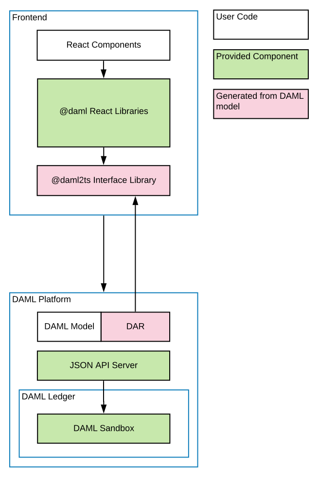

.. Copyright (c) 2021 Digital Asset (Switzerland) GmbH and/or its affiliates. All rights reserved.
.. SPDX-License-Identifier: Apache-2.0

App Architecture
****************

In this section we'll look at the different components of our social network app. The goal is to familiarize you enough to feel comfortable extending the code with a new feature in the next section. There are two main components:

  * the Daml model and
  * the React/TypeScript frontend.

We generate TypeScript code to bridge the two.

Overall, the social networking app is following the :ref:`recommended architecture of a fullstack Daml application <recommended-architecture>`. Below you can see a simplified version of the architecture represented in the app.

Let's start by looking at the Daml model, which defines the core logic of the application. Have `the Daml cheat-sheet <https://docs.daml.com/cheat-sheet/>`_ open in a separate tab for a quick overview of the most common Daml concepts.

The Daml Model
==============

In your terminal, navigate to the root ``create-daml-app`` directory and run::

  daml studio

This should open the Visual Studio Code editor at the root of the project.
(You may get a new tab pop up with release notes for the latest version of Daml Connect - just close this.)
Using the file *Explorer* on the left sidebar, navigate to the ``daml`` folder and double-click on the ``User.daml`` file.

The Daml code defines the *data* and *workflow* of the application.
Both are described in the ``User`` contract *template*.
Let's look at the data portion first.

.. literalinclude:: code/templates-tarball/create-daml-app/daml/User.daml
  :language: daml
  :start-after: -- MAIN_TEMPLATE_BEGIN
  :end-before: -- MAIN_TEMPLATE_END

There are two important aspects here:

1. The data definition (a *schema* in database terms), describing the data stored with each user contract.
In this case it is an identifier for the user and the list of users they are following.
Both fields use the built-in ``Party`` type which lets us use them in the following clauses.

2. The signatories and observers of the contract.
The signatories are the parties whose authorization is required to create or archive contracts, in this case the user herself.
The observers are the parties who are able to view the contract on the ledger.
In this case all users that a particular user is following are able to see the user contract.

Let's see what the ``signatory`` and ``observer`` clauses mean in our app more concretely.
A user Alice can see another user Bob in the network only when Bob is following Alice (only if Alice is in the ``following`` list in his user contract).
For this to be true, Bob must have previously started to follow Alice, as he is the sole signatory on his user contract.
If not, Bob will be invisible to Alice.

Here we see two concepts that are central to Daml: *authorization* and *privacy*.
Authorization is about who can *do* what, and privacy is about who can *see* what.
In Daml we must answer these questions upfront, as they fundamentally change the design of an application.

The last part of the Daml model is the operation to follow users, called a *choice* in Daml.

.. literalinclude:: code/templates-tarball/create-daml-app/daml/User.daml
  :language: daml
  :start-after: -- FOLLOW_BEGIN
  :end-before: -- FOLLOW_END

Daml contracts are *immutable* (can not be changed in place), so the only way to "update" one is to archive it and create a new instance.
That is what the ``Follow`` choice does: after checking some preconditions, it archives the current user contract and creates a new one with the new user to follow added to the list. Here is a quick explanation of the code:

    - The choice starts with the ``nonconsuming choice`` keyword followed by the choice name ``Follow``.
    - The return type of a choice is defined next. In this case it is ``ContractId User``.
    - After that we declare choice parameters with the ``with`` keyword. Here this is the user we want to start following.
    - The keyword ``controller`` defines the ``Party`` that is allowed to execute the choice. In this case, it is the ``username`` party associated with the ``User`` contract.
    - The ``do`` keyword marks the start of the choice body where its functionality will be written.
    - After passing some checks, the current contract is archived with ``archive self``.
    - A new ``User`` contract with the new user we have started following is created (the new user is added to the ``following`` list).

This information should be enough for understanding how choices work in this guide. More detailed information on choices can be found in :doc:`our docs </daml/reference/choices>`.

Let's move on to how our Daml model is reflected and used on the UI side.

TypeScript Code Generation
==========================

The user interface for our app is written in `TypeScript <https://www.typescriptlang.org/>`_.
TypeScript is a variant of JavaScript that provides more support during development through its type system.

In order to build an application on top of Daml, we need a way to refer to our Daml templates and choices in TypeScript.
We do this by using a Daml to TypeScript code generation tool in the SDK.

To run code generation, we first need to compile the Daml model to an archive format (a ``.dar`` file).
The ``daml codegen js`` command then takes this file as argument to produce a number of TypeScript packages in the output folder.
::

    daml build
    daml codegen js .daml/dist/create-daml-app-0.1.0.dar -o daml.js

Now we have a TypeScript interface (types and companion objects) to our Daml model, which we'll use in our UI code next.

The UI
======

On top of TypeScript, we use the UI framework `React <https://reactjs.org/>`_.
React helps us write modular UI components using a functional style - a component is rerendered whenever one of its inputs changes - with careful use of global state.

Let's see an example of a React component.
All components are in the ``ui/src/components`` folder.
You can navigate there within Visual Studio Code using the file explorer on the left sidebar.
We'll first look at ``App.tsx``, which is the entry point to our application.

.. literalinclude:: code/templates-tarball/create-daml-app/ui/src/components/App.tsx
  :language: tsx
  :start-after: // APP_BEGIN
  :end-before: // APP_END

An important tool in the design of our components is a React feature called `Hooks <https://reactjs.org/docs/hooks-intro.html>`_.
Hooks allow you to share and update state across components, avoiding having to thread it through manually.
We take advantage of hooks in particular to share ledger state across components.
We use custom :doc:`Daml React hooks </app-dev/bindings-ts/daml-react>` to query the ledger for contracts, create new contracts, and exercise choices. This is the library you will be using the most when interacting with the ledger [#f1]_ .

The ``useState`` hook (not specific to Daml) here keeps track of the user's credentials.
If they are not set, we render the ``LoginScreen`` with a callback to ``setCredentials``.
If they are set, then we render the ``MainScreen`` of the app.
This is wrapped in the ``DamlLedger`` component, a `React context <https://reactjs.org/docs/context.html>`_ with a handle to the ledger.

Let's move on to more advanced uses of our Daml React library.
The ``MainScreen`` is a simple frame around the ``MainView`` component, which houses the main functionality of our app.
It uses Daml React hooks to query and update ledger state.

.. literalinclude:: code/templates-tarball/create-daml-app/ui/src/components/MainView.tsx
  :language: tsx
  :start-after: // USERS_BEGIN
  :end-before: // USERS_END

The ``useParty`` hook simply returns the current user as stored in the ``DamlLedger`` context.
A more interesting example is the ``allUsers`` line.
This uses the ``useStreamQueries`` hook to get all ``User`` contracts on the ledger.
(``User.User`` here is an object generated by ``daml codegen js`` - it stores metadata of the ``User`` template defined in ``User.daml``.)
Note however that this query preserves privacy: only users that follow the current user have their contracts revealed.
This behaviour is due to the observers on the ``User`` contract being exactly in the list of users that the current user is following.

A final point on this is the *streaming* aspect of the query.
This means that results are updated as they come in - there is no need for periodic or manual reloading to see updates.

Another example, showing how to *update* ledger state, is how we exercise the ``Follow`` choice of the ``User`` template.

.. literalinclude:: code/templates-tarball/create-daml-app/ui/src/components/MainView.tsx
  :language: tsx
  :start-after: // FOLLOW_BEGIN
  :end-before: // FOLLOW_END

The ``useLedger`` hook returns an object with methods for exercising choices.
The core of the ``follow`` function here is the call to ``ledger.exerciseByKey``.
The *key* in this case is the username of the current user, used to look up the corresponding ``User`` contract.
The wrapper function ``follow`` is then passed to the subcomponents of ``MainView``.
For example, ``follow`` is passed to the ``UserList`` component as an argument (a `prop <https://reactjs.org/docs/components-and-props.html>`_ in React terms).
This gets triggered when you click the icon next to a user's name in the *Network* panel.

.. literalinclude:: code/templates-tarball/create-daml-app/ui/src/components/MainView.tsx
  :language: tsx
  :start-after: {/* USERLIST_BEGIN */}
  :end-before: {/* USERLIST_END */}

This should give you a taste of how the UI works alongside a Daml ledger.
You'll see this more as you develop :doc:`your first feature <first-feature>` for our social network.

.. rubric:: Footnotes

.. [#f1] FYI Behind the scenes the Daml React hooks library uses the :doc:`Daml Ledger TypeScript library </app-dev/bindings-ts/daml-ledger>` to communicate with a ledger implementation via the :doc:`HTTP JSON API </json-api/index>`.
