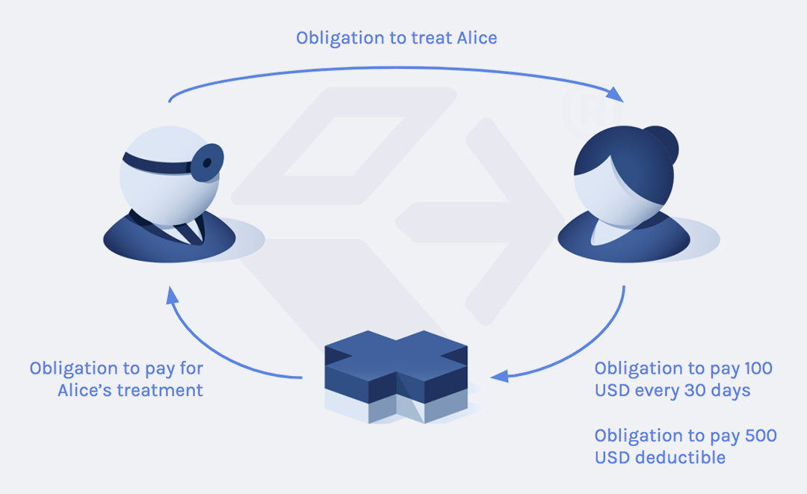

.. Copyright (c) 2019 Digital Asset (Switzerland) GmbH and/or its affiliates. All rights reserved.
.. SPDX-License-Identifier: Apache-2.0

Introduction to the product
###########################

DAML -- Digital Asset's language for smart contracts -- is a new paradigm for thinking about, designing, and writing software for multi-party business processes.

This page explains this paradigm and its benefits.

Distributed business processes
******************************

No company is an island. All companies need to do business with other companies or consumers. They buy goods, sell services, take on risk, and exchange information. These interactions are underpinned by the legal system and are made up of explicit or implicit contracts that can be enforced by a court of law in the event of a dispute. Such contracts describe *rights* and *obligations* of the parties in a business process.

A business process involving independent entities is referred to as a *distributed* business process. To illustrate, consider a simple process defined by the following rights and obligations:

* Alice, a consumer, has an obligation to pay her health insurance company a premium of 100 USD every 30 days.
* Alice has a right to get treatment from her doctor whenever she wants.
* The doctor has a right to get paid by the health insurance company for treating Alice.
* Alice has an obligation to pay up to 500 USD of each treatment's cost to the health insurance company. This is a per-treatment deductible.

We would like to digitize and automate this process so that the following becomes straightforward to achieve:

* Alice has an application on her phone that lists her treatments and bills.
* The doctor has an application for recording treatments that automatically requests payment from the patient's insurer.
* The insurance company automatically pays bills from doctors for insured patients and then sends bills to the patients for their deductibles.

This presents us with the following difficult engineering problems:

* We need to guarantee that all parties honor the contracts they have agreed to.
* We need to ensure that all the parties collect proofs in the form of digital documents, such that they can enforce their rights in a court of law if a dispute arises.
* The privacy of data needs to be preserved. For example, the health insurance company must not have access to all of the doctor's data.

A generalized version of such a process presents further challenges. Alice might switch insurance companies, insurance companies might have re-insurances with each other, Alice could choose to go to any one of thousands of doctors, and there are millions of patients. This becomes increasingly complex because each insurance company will have different data silos, doctors will have different applications for recording their treatments, and data will be stored in a fragmented manner amongst the parties. Such distributed systems are notoriously hard to build such that they work correctly, scale with good performance characteristics, and are resilient.

Today's reality is that distributed business processes often involve many manual steps. Data is entered, shared, and transformed manually because systems lack compatible APIs, data is segregated across different databases, even inside the same company, or the data quality is unreliable and requires human judgement. This leads to slow processing, high cost, high risk of errors, and difficulty providing regulators with consistent and reliable reports.

Digital Asset proposes an alternative model for implementing distributed business processes. One where subject-matter experts supported by software engineers write business processes in a form that is unambiguous and understood by both humans and machines. These processes can then be deployed on the Digital Asset Platform, which is designed to run them at scale while preserving the privacy and integrity of all involved data.

Digital Asset's offering has three main components:

1. DAML for expressing processes in a form that is friendly to both humans and machines.
2. Digital Asset Ledger Server for connecting as a node to the distributed ledger that executes business processes expressed in DAML.
3. DAML SDK for learning about, developing, and testing DAML processes.

DAML
****

DAML is a smart contract language for modeling multi-party business processes that can be deployed on the distributed Digital Asset Platform, which executes these processes with high integrity and privacy guarantees. Financial products and services are examples of such processes that will be used throughout this documentation. DAML is used to express rights and obligations within a computer system. It does not reinvent how business is conducted. Instead, it lets us express contracts in a form that computers can easily work with and that humans can still understand. For example, a DAML encoding of a simple insurance policy for the process described earlier might look like this:

.. literalinclude:: introduction/code/Insurance.daml
  :language: daml

A DAML library describes how parties can interact in a business process using DAML contract templates. DAML contracts encode the rights of the parties as choices that they can exercise, and obligations as agreements that they agree to. DAML does not have any notion of databases, storage schemas, nodes, network addresses, cryptographic keys, or similar concepts. Instead, the secure, distributed execution of a business process modeled in DAML is performed by the Digital Asset Ledger Server.

DAML is designed to be understood by both humans and machines. This means lawyers can read and assess the meaning of contracts, while developers can write programs that use a party's contracts to, for example, compute risk exposure, cash flow, or customer profiles.

DAML is an advanced, modern language that affords static analysis and strong consistency checks. The DAML SDK includes an Integrated Development Environment (IDE) called DAML Studio that provides feedback about potential problems during development. This makes developing business processes quicker, easier, and safer.

Digital Asset Ledger Server
***************************

The Digital Asset Ledger Server is the software that runs on the participant nodes that comprise the Digital Asset Ledger. In our example, Alice, the health insurance company, and the doctor would each run a node or delegate the running of their respective nodes to a trusted third party.

.. image:: introduction/images/health-stack.png
  :align: center

A DA Ledger Server interprets DAML code, stores contracts in a Private Contract Store (PCS), and synchronises with other nodes using a Global Synchronization Log (GSL) in a way that is scalable, resilient, and secure. It was built from the ground up with security, data privacy, and performance in mind and it uses state-of-the-art cryptographic primitives for identity keys, hash algorithms, and communication protocols. The DA Ledger Server leverages DAML's precision to:

* Orchestrate business processes between parties
* Enforce that the prescribed business process is followed
* Segregate data on a need-to-know basis among parties, such that each party only gets information about contracts that they are involved in
* Provide cryptographic evidence for the validity of all contracts

The term "ledger" is derived from the concept of an accounting ledger. Instead of financial transactions, the DA Ledger Server manages contracts.

The DA Ledger Server exposes an API that external applications can use to read contracts, get notified of contract creations and archivals, or exercise contract choices. For example, a smartphone app could use the API to let a user request treatment from a doctor.

DAML libraries are loaded onto the DA Distributed Ledger at runtime, which means that the global system can be adapted easily to support new or updated business processes. Therefore, complex business processes can be modeled, tested, and deployed on the DA Platform much more quickly than is possible with traditional tools.

DAML SDK
********

The DAML SDK is a collection of tools and documentation for working with and learning about DAML. It includes an IDE for DAML, tools to test your DAML models locally, and learning materials to help you develop the knowledge and skills to implement your own use cases on the Digital Asset Platform.

Summary and next steps
**********************

The DAML SDK helps you model distributed business processes in DAML. These can be deployed on the Digital Asset Platform, which offers unique features that allow secure, scalable, and cost-effective automation of complex interactions.

To start using the DAML SDK and DAML go to :doc:`quickstart` for a guided introduction.
