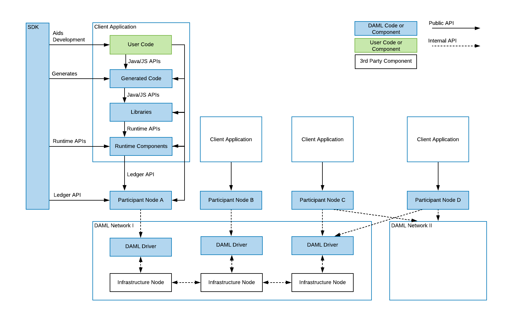

.. Copyright (c) 2022 Digital Asset (Switzerland) GmbH and/or its affiliates. All rights reserved.
.. SPDX-License-Identifier: Apache-2.0

Daml Ecosystem Overview
#######################

.. toctree::
   :hidden:

   status-definitions
   component-statuses

This page is intended to give you an overview of the components that constitute the Daml Ecosystem, what status they are in, and how they fit together. It lays out Daml's "public API" in the sense of :ref:`Semantic Versioning <versioning>`, and is a prerequisite to understanding Daml's :doc:`compatibility`.

The pages :doc:`status-definitions` and :doc:`component-statuses` give a fine-grained view of what labels like "Alpha" and "Beta" mean, which components expose public APIs and what status they are in.

.. _ecosystem-architecture:

Architecture
************

A high level view of the architecture of a Daml application or solution is helpful to make sense of how individual components, APIs and features fit into the Daml Stack.

The stack is segmented into two parts. Daml drivers encompass those components which enable an infrastructure to run Daml Smart Contracts, turning it into a **Daml Network**. **Daml Components** consists of everything developers and users need to connect to a Daml Network: the tools to build, deploy, integrate, and maintain a Daml Application. 

Taking the diagram from left to right, the SDK acts on various components of the client application and directly on the participant nodes: it aids in the development of user code, generates code of its own, feeds into runtime components via runtime APIs, and creates participant nodes via the Ledger API. The client application also acts on participant nodes via the Ledger API, and the user code for that application can act on the various Daml components of the application (generated code, libraries, and runtime components) via public API. Participant nodes, in turn, act via an internal API on the Daml network, specifically with Daml drivers that in turn interact with infrastructure nodes. The infrastructure nodes can also interact with each other. Each client application is linked to only one participant node, but a participant node can potentially touch more than one Daml network.

Daml Networks
*************

Daml drivers
============

At the bottom of every Daml Application is a Daml network, a distributed, or possibly centralized persistence infrastructure together with Daml drivers. Daml drivers enable the persistence infrastructure to act as a consensus, messaging, and in some cases persistence layer for Daml Applications. Most Daml drivers will have a public API, but there are no *uniform* public APIs on Daml drivers. This does not harm application portability since applications only interact with Daml networks through the Participant Node. A good example of a public API of a Daml driver is the deployment interface of `Daml for VMware Blockchain <https://www.digitalasset.com/daml-for-vmware-blockchain>`_. It's a public interface, but specific to the WMware driver.

Participant Nodes
*****************

On top of, or integrated into the Daml drivers sits a Participant Node, that has the primary purpose of exposing the Daml Ledger API. In the case of *integrated* Daml drivers, the Participant Node usually interacts with the Daml drivers through solution-specific APIs. In this case, Participant Nodes can only communicate with Daml drivers of one Daml Network. In the case of *interoperable* Daml drivers, the Participant Node communicates with the Daml drivers through the uniform Canton Protocol. The Canton Protocol is versioned and has some cross-version compatibility guarantees, but is not a public API. So participant nodes may have public APIs like monitoring and logging, command line interfaces or similar, but the only *uniform* public API exposed by all Participant Nodes is the Ledger API.

Ledger API
**********

The Ledger API is the primary interface that offers forward and backward compatibility between Daml Networks and Applications (including Daml components). As you can see in the diagram above, all interaction between components above the Participant Node and the Participant Node or Daml Network happen through the Ledger API. The Ledger API is a public API and offers the lowest level of access to Daml Ledgers supported for application use.

Daml Components
***************

Runtime Components
==================

Runtime components are standalone components that run alongside Participant Nodes or Applications and expose additional services like query endpoints, automations, or integrations. Each Runtime Component has public APIs, which are covered in :doc:`component-statuses`. Typically there is a command line interface, and one or more "Runtime APIs" as indicated in the above diagram.

Libraries
=========

Libraries naturally provide public APIs in their target language, be it Daml, or secondary languages like JavaScript or Java. For details on available libraries and their interfaces, see :doc:`component-statuses`.

Generated Code
==============

The SDK allows the generation of code for some languages from a Daml Model. This generated code has public APIs, which are not independently versioned, but depend on the Daml version and source of the generated code, like a Daml package. In this case, the version of the Daml SDK used covers changes to the public API of the generated code.

Developer Tools / SDK
=====================

The Daml SDK consists of the developer tools used to develop user code, both Daml and in secondary languages, to generate code, and to interact with running applications via Runtime, and Ledger API. The SDK has a broad public API covering the Daml Language, CLIs, IDE, and Developer tools, but few of those APIs are intended for runtime use in a production environment. Exceptions to that are called out on :doc:`component-statuses`.
