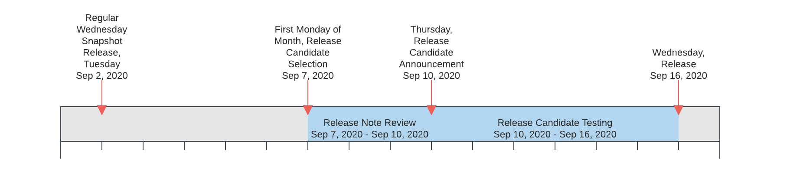

.. Copyright (c) 2023 Digital Asset (Switzerland) GmbH and/or its affiliates. All rights reserved.
.. SPDX-License-Identifier: Apache-2.0

Releases and Versioning
#######################

.. _versioning:

Versioning
**********

All Daml components follow `Semantic Versioning <https://semver.org/>`_. In short, this means that there is a well defined "public API", changes or breakages to which are indicated by the version number.

Stable releases have versions MAJOR.MINOR.PATCH. Segments of the version are incremented according to the following rules:

#. MAJOR version when there are incompatible API changes,
#. MINOR version when functionality is added in a backwards compatible manner, and
#. PATCH version when there are only backwards compatible bug fixes.

Daml's "public API" is laid out in the :doc:`overview`.

Cadence
*******

Regular snapshot releases are made every Wednesday, with additional snapshots released as needed. These releases contain Daml Components, both from the `daml repository <https://github.com/digital-asset/daml>`_ as well as some others.

Stable versions are released once a month. See :ref:`release_process` below for the usual schedule. This schedule is a guide, not a guarantee: additional releases may be made, or releases may be delayed or skipped entirely.

No more than one major version is released every six months, barring exceptional circumstances.

Individual Daml drivers follow their own release cadence, using already released Integration Components as a dependency.

.. _support_duration:

Support Duration
****************

Major versions will be supported for a minimum of one year after a subsequent Major version is release. Within a major version, only the latest minor version receives security and bug fixes.

.. _release-notes:

Release Notes
*************

Release notes for each release are published on the `Release Notes section of the Daml Driven blog <https://daml.com/release-notes/>`_.

.. _roadmap:

Roadmap
*******

Once a month Digital Asset publishes a community update to accompany the announcement of the release candidate for the next release. The community update contains a section outlining the next priorities for development. You can find community updates on the `Daml Driven Blog <https://daml.com/blog/engineering>`_, or subscribe to the mailing list or social media profiles on `https://daml.com/ <https://daml.com/>`_ to stay up to date.

.. _release_process:

Process
*******

Weekly snapshot and monthly stable releases follow a regular process and schedule. The process is documented `in the Daml repository <https://github.com/digital-asset/daml/blob/main/release/RELEASE.md>`_ so only the schedule for monthly releases is covered here.

Selecting a Release Candidate

  This is done by the Daml core engineering teams on the **first Monday of every month**.

  The monthly releases are time-based, not scope-based. Furthermore, Daml development is fully HEAD-based so both the repository and every snapshot are intended to be in a fully releasable state at every point. The release process therefore starts with "selecting a release candidate". Typically the Snapshot from the preceding Wednesday is selected as the release candidate.

Release Notes and Candidate Review

  After selecting the release candidate, Release Notes are written and reviewed with a particular view towards unintended changes and violations of :ref:`Semantic Versioning <versioning>`.

Release Candidate Refinement

  If issues surface in the initial review, the issues are resolved and different Snapshot is selected as the release candidate.

Release Candidate Announcement

  Barring delays due to issues during initial review, the release candidate is announced publicly with accompanying  Release Notes on **the Thursday following the first Monday of every Month**.

Communications, Testing and Feedback

  In the days following the announcement, the release is presented and discussed with both commercial and community users. It is also put through its paces by integrating it in `Daml Hub <https://hub.daml.com>`_ and several ledger integrations.

Release Candidate Refinement II

  Depending on feedback and test results, new release candidates may be issued iteratively. Depending on the severity of changes from release candidate to release candidate, the testing period is extended more or less.

Release

  Assuming the release is not postponed due to extended test periods or newly discovered issues in the release candidate, the release is declared stable and given a regular version number on **the second Wednesday after the first Monday of the Month**.

n September 10 the review process ends and release candidates are announced. Release candidate testing occurs from September 10 to September 16, and on Wednesday September 16 another release occurs.

   The release process timeline illustrated by example of September 2020.
