.. Copyright (c) 2023 Digital Asset (Switzerland) GmbH and/or its affiliates. All rights reserved.
.. SPDX-License-Identifier: Apache-2.0

Navigator
#########

The Navigator is a front-end that you can use to connect to any Daml Ledger and inspect and modify the ledger. You can use it during Daml development to explore the flow and implications of the Daml models.

The first sections of this guide cover use of the Navigator with the SDK. Refer to :ref:`navigator-manual-advanced-usage` for information on using Navigator outside the context of the SDK.

Navigator Functionality
***********************

Connect the Navigator to any Daml Ledger and use it to:

- View templates
- View active and archived contracts
- Exercise choices on contracts
- Advance time (This option applies only when using Navigator with the Daml Sandbox ledger.)

Starting Navigator
*********************************

Navigator is included in the SDK. To launch it:

1. Start Navigator via a terminal window running :doc:`Daml Assistant </tools/assistant>` by typing ``daml start``

2. The Navigator web-app is automatically started in your browser. If it fails to start,
   open a browser window and point it to the Navigator URL

  When running ``daml start`` you will see the Navigator URL. By default it will be `<http://localhost:7500/>`_.

.. note:: Navigator is compatible with these browsers: Safari, Chrome, or
   Firefox.

Logging In
**********

By default, Navigator shows a drop-down list with the users that have been
created via the :ref:`user management service <user-management-service>`. During
development, it is common to create these users in a
:ref:`Daml script <script-ledger-initialization>`: that you specify in the
``init-script`` section of your ``daml.yaml`` file so it is executed
on ``daml start``. Most of the templates shipped with the Daml SDK
already include such a setup script. Only users that have a primary
party set will be displayed.

After logging in, you will interact with the ledger as the primary
party of that user, meaning that you can see contracts visible to that
party and submit commands (e.g. create a contract) as that party.

The party you are logged in as is not displayed directly. However,
Navigator provides autocompletion based on the party id which starts
with the party id hint so a good option is to set the party id hint to
the user id when you allocate the party in your setup script. You can
see an example of that in the ``skeleton`` template:

.. literalinclude:: /_templates/skeleton/daml/Main.daml
  :language: daml
  :start-after: -- user_setup_begin
  :end-before: -- user_setup_end

The first step in using Navigator is to use the dropdown list on the Navigator home screen to select from the available
users.

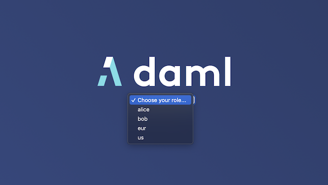

The main Navigator screen will be displayed, with contracts that the primary party of this user
is entitled to view in the main pane and
the  option to switch from contracts to templates in the pane at the left. Other options allow you to filter the
display, include or exclude archived contracts, and exercise choices as described below.

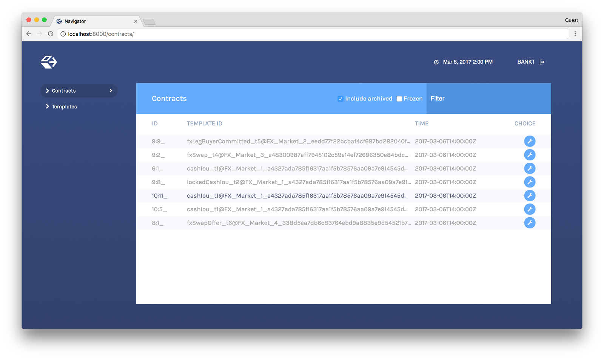

To change the active user:

#. Click the name of the current user in the top left corner of the screen.

#. On the home screen, select a different user.

You can act as different users in different
browser windows. Use Chrome's profile feature
https://support.google.com/chrome/answer/2364824 and sign in as
a different user for each Chrome profile.

Logging in as a Party
=====================

Instead of logging in by specifying a user, you can also log in by
specifying a party directly. This is useful if you do not want to or
cannot (because your ledger does not support user management) create
users.

To do so, you can start Navigator with a flag to disable support for user management::

   daml navigator --feature-user-management=false

To use this via ``daml start``, you can specify it in your ``daml.yaml`` file::

  navigator-options:
    - --feature-user-management=false

Instead of displaying a list of users on login, Navigator will
display a list of parties where each party is identified by its
display name.

Alternatively you can specify a fixed list of parties in your
``daml.yaml`` file. This will automatically disable user management
and display those parties on log in. Note that you still need
to allocate those parties before you can log in as them.

.. code-block:: yaml

   parties:
     - Alice::12201d00faa0968d7ab81e63ad6ad4ee0d31b08a3581b1d8596e68a1356f27519ccb
     - Bob::12201d00faa0968d7ab81e63ad6ad4ee0d31b08a3581b1d8596e68a1356f27519ccb

Viewing Templates or Contracts
******************************

Daml *contract ​templates* are ​models ​that contain ​the ​agreement ​statement, ​all ​the ​applicable
parameters, ​and ​the ​choices ​that ​can ​be ​made ​in ​acting ​on ​that ​data.
They ​specify ​acceptable input ​and ​the ​resulting ​output. ​A ​contract ​template ​contains ​placeholders ​rather ​than ​actual names, ​amounts, ​dates, ​and ​so ​on. In ​a *contract*, ​the ​placeholders ​have ​been ​replaced ​with ​actual ​data.

The Navigator allows you to list templates or contracts, view contracts based on a template, and view template and contract details.

Listing templates
=================

To see what contract templates are available on the ledger you are connected to, choose **Templates** in the left pane of the main Navigator screen.

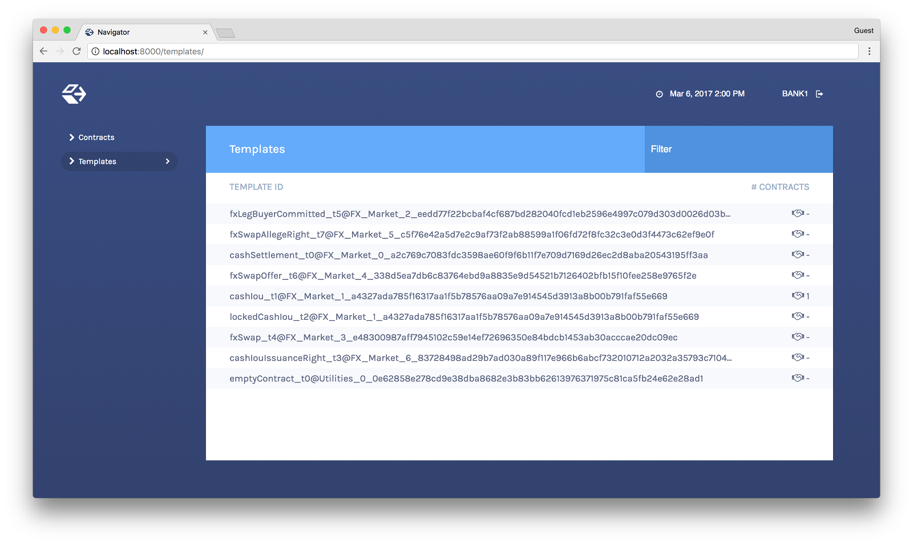

Use the **Filter** field at the top right to select template IDs that include the text you enter.

Listing contracts
=================

To view a list of available contracts, choose **Contracts** in the left pane.

In the Contracts list:

- Changes to the ledger are automatically reflected in the list of contracts. To
  avoid the automatic updates, select the **Frozen** checkbox. Contracts will still be marked as archived, but the contracts list will not change.

.. COMMENT: 2nd sentence above is rather cryptic. Why would I want to avoid automatic updates when all i'm doing is listing contracts - it's not clear?? Is this relevant in the SDK context - is it perhaps an Advanced feature???

- Filter the displayed contracts by entering text in the
  **Filter** field at the top right.

- Use the **Include Archived** checkbox at the top to include or exclude archived contracts.

Viewing contracts based on a template
=====================================

You can also view the list of contracts that are based on a particular template.

#. You will see icons to the right of template IDs in the template list with a number indicating how many contracts are based on this template.

#. Click the number to display a list of contracts based on that template.

**Number of Contracts**

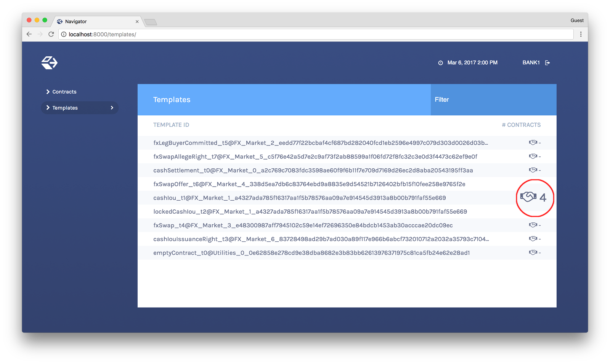

**List of Contracts**

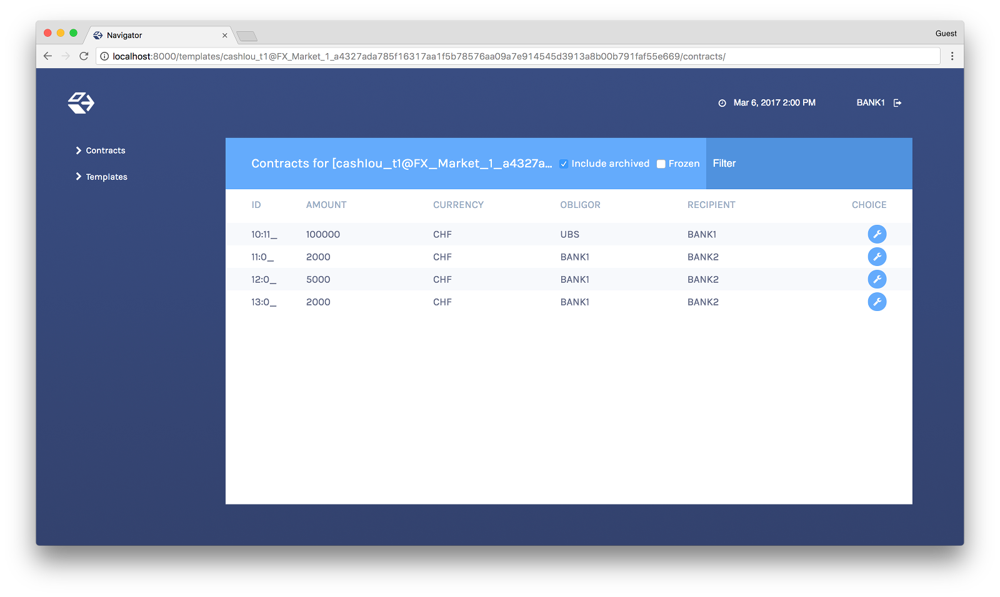

Viewing template and contract details
=====================================

To view template or contract details, click on a template or contract in the list. The template or contracts detail page is displayed.

**Template Details**

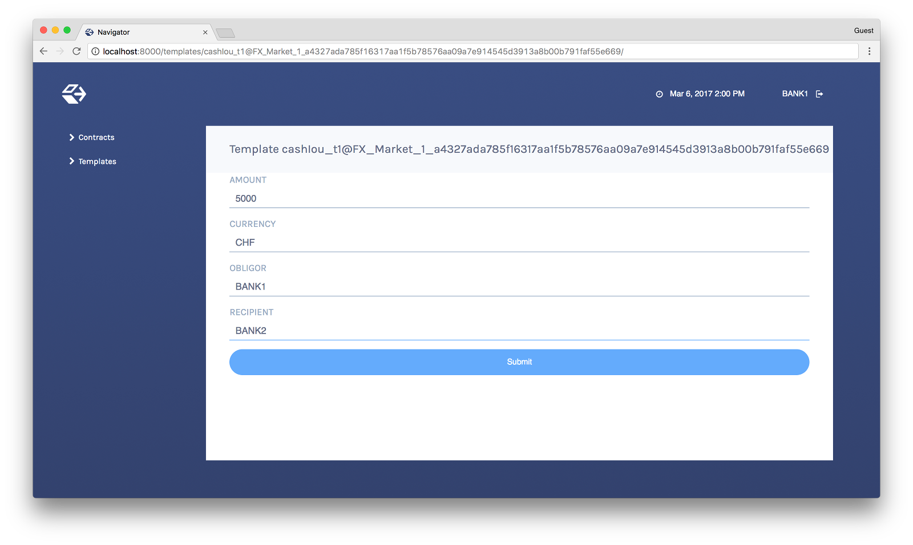

**Contract Details**

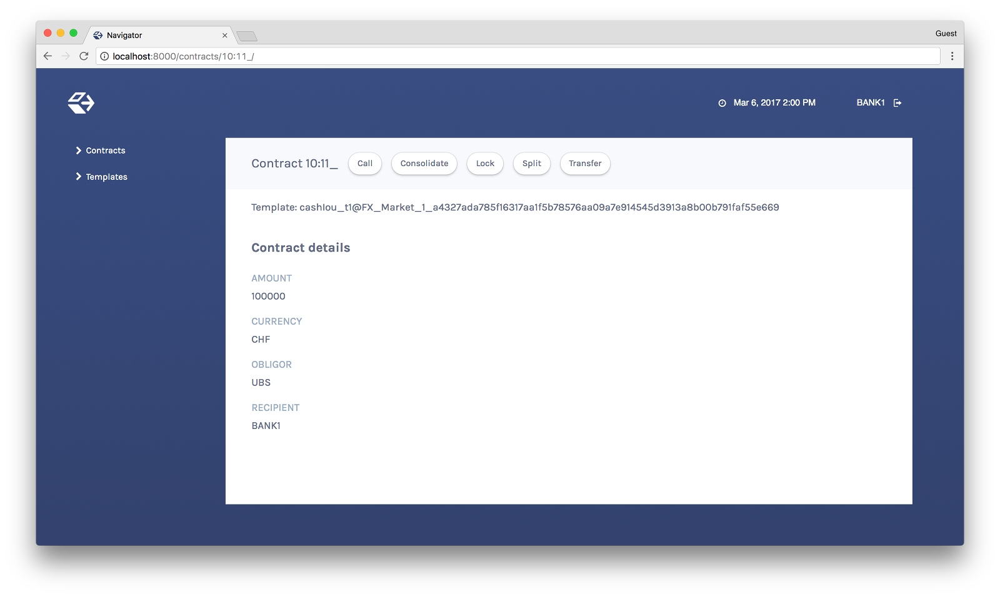

Using Navigator
***************
.. _navigator-manual-creating-contracts:

Creating contracts
==================

Contracts in a ledger are created automatically when you exercise
choices. In some cases, you create a contract directly from a
template. This feature can be particularly useful for testing and experimenting during development.

To create a contract based on a template:

#. Navigate to the template detail page as described above.

#. Complete the values in the form

#. Choose the **Submit** button.

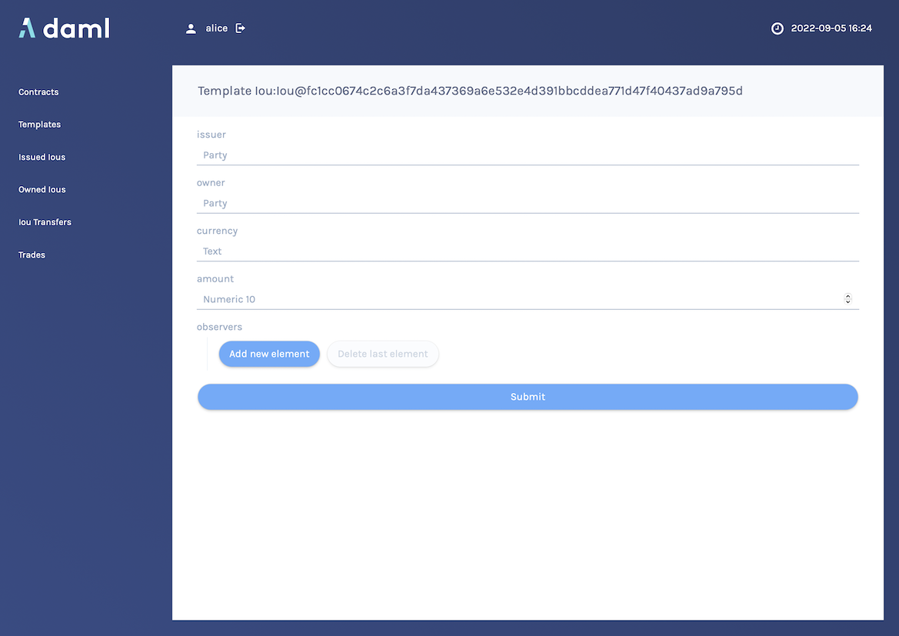

When the command has been committed to the ledger, the loading indicator in the navbar at the top
will display a tick mark.

While loading...

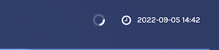

When committed to the ledger...

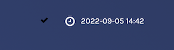

Exercising choices
==================

To exercise a choice:

1. Navigate to the contract details page (see above).

2. Click the choice you want to exercise in the choice list.

3. Complete the form.

4. Choose the **Submit** button.

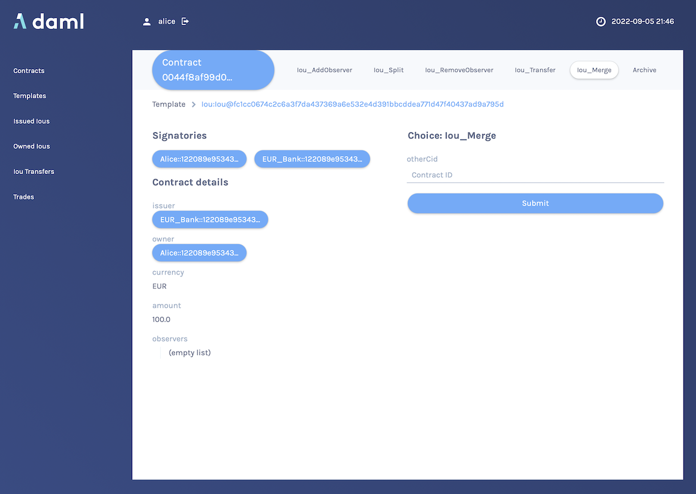

Or

1. Navigate to the choice form by clicking the wrench icon in a contract list.

2.  Select a choice.

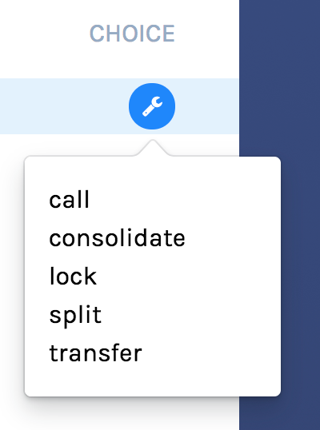

You will see the loading and confirmation indicators, as pictured above in Creating Contracts.

Advancing time
==============

It is possible to advance time against the Daml Sandbox. (This is not true of all Daml Ledgers.) This advance-time functionality can be useful when testing, for example, when entering a trade on one date and settling it on a later date.

To advance time:

1. Click on the ledger time indicator in the navbar at the top of the screen.

2. Select a new date / time.

3. Choose the **Set** button.

.. image:: images/advance-time.png
  :width: 25%
  :align: center
  :alt: The date and time in the navbar, selected and displaying the calendar interface.

.. _navigator-authorization:

Authorizing Navigator
*********************

If you are running Navigator against a Ledger API server that verifies authorization, you must provide the access token when you start the Navigator server.

The access token retrieval depends on the specific Daml setup you are working with: please refer to the ledger operator to learn how.

Once you have retrieved your access token, you can provide it to Navigator by storing it in a file and provide the path to it using the ``--access-token-file`` command line option.

If the access token cannot be retrieved, is missing or wrong, you'll be unable to move past the Navigator's frontend login screen and see the following:

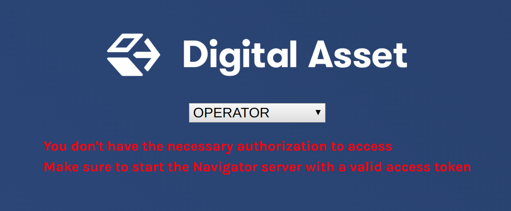

.. _navigator-manual-advanced-usage:

Advanced Usage
**************

.. _navigator-custom-views:

Customizable table views
========================

Customizable table views is an advanced rapid-prototyping feature,
intended for Daml developers who wish to customize the Navigator UI without
developing a custom application.

.. COMMENT: Suggest changing para below to procedure format.

To use customized table views:

1. Create a file ``frontend-config.js`` in your project root folder (or the folder from which you run Navigator) with the content below::

    import { DamlLfValue } from '@da/ui-core';

    export const version = {
      schema: 'navigator-config',
      major: 2,
      minor: 0,
    };

    export const customViews = (userId, party, role) => ({
      customview1: {
        type: "table-view",
        title: "Filtered contracts",
        source: {
          type: "contracts",
          filter: [
            {
              field: "id",
              value: "1",
            }
          ],
          search: "",
          sort: [
            {
              field: "id",
              direction: "ASCENDING"
            }
          ]
        },
        columns: [
          {
            key: "id",
            title: "Contract ID",
            createCell: ({rowData}) => ({
              type: "text",
              value: rowData.id
            }),
            sortable: true,
            width: 80,
            weight: 0,
            alignment: "left"
          },
          {
            key: "template.id",
            title: "Template ID",
            createCell: ({rowData}) => ({
              type: "text",
              value: rowData.template.id
            }),
            sortable: true,
            width: 200,
            weight: 3,
            alignment: "left"
          }
        ]
      }
    })

2. Reload your Navigator browser tab. You should now see a sidebar item titled "Filtered contracts" that links to a table with contracts filtered and sorted by ID.

To debug config file errors and learn more about the
config file API, open the Navigator ``/config`` page in your browser
(e.g., `<http://localhost:7500/config>`_).

Using Navigator with a Daml Ledger
==================================

By default, Navigator is configured to use an unencrypted connection to the ledger.
To run Navigator against a secured Daml Ledger,
configure TLS certificates using the ``--pem``, ``--crt``, and ``--cacrt`` command line parameters.
Details of these parameters are explained in the command line help::

  daml navigator --help
