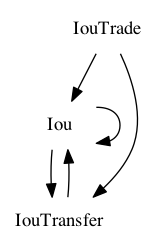

.. Copyright (c) 2019 The DAML Authors. All rights reserved.
.. SPDX-License-Identifier: Apache-2.0

Visualizing DAML Contracts
##########################

You can generate visual graphs for the contracts in your DAML project. To do this:

1. Install `Graphviz <http://www.graphviz.org/download/>`_.
2. Generate a DAR from your project by running ``daml build``.
3. Generate a `dot file <https://en.wikipedia.org/wiki/DOT_(graph_description_language)>`_ from that DAR by running ``daml damlc visual <path_to_project>/dist/<project_name.dar> --dot <project_name>.dot``
4. Generate the visual graph with Graphviz by running ``dot -Tpng <project_name>.dot > <project_name>.png``

Example: Visualizing the Quickstart project
*******************************************

Here's an example visualization based on the :doc:`quickstart </getting-started/quickstart>`. You'll need to `install Graphviz <http://www.graphviz.org/download/>`_ to try this out.

1. Generate the dar using ``daml build``
2. Generate a dot file ``daml damlc visual dist/quickstart-0.0.1.dar --dot quickstart.dot``
3. Generate the visual graph with Graphviz by running ``dot -Tpng quickstart.dot quickstart.png``

Running the above should produce an image which looks something like this:

