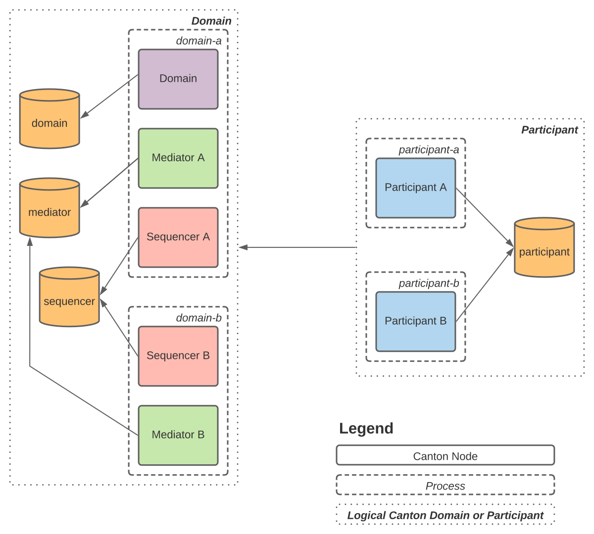

# Canton High Availability Deployment

It is possible to deploy Canton in a large variety of configurations.
Here we present how a single organization could deploy a single Canton Participant and Synchronizer
to maximise the availability properties of all services so that they may continue operating
when processes or machines fail.

## Background

### Component Overview

A Canton synchronizer is made of two primary components: the Sequencer, and the Mediator.

 * **Sequencer**
   * Responsible for sending events around the synchronizer.
   * Canton supports a number of Sequencer implementations.
     The version presented here is the relational database backed version that supports Postgres, and is intended for when a synchronizer is operated by a single organization.
     Alternative implementations use distributed ledger platforms such as Ethereum or Fabric to allow many organizations to operate a single decentralized synchronizer.
   * The database backed Sequencer implementation supports elastic horizontal scaling to run on many machines.
   * It coordinates many active instances by use of a shared single database.
 * **Mediator**
   * The synchronizer transaction coordinator.
   * Many Mediator replicas can be deployed within a single logical synchronizer and coordinate between themselves which instance
     is active and responsible for responding to transactions.

A Canton Participant is a single logical unit that can be replicated among many processes or machines.
All replicas share the same database and coordinate between them which Participant is active.

### Load Balancing

Components within Canton have built-in client-side load balancing.
The Participant can be configured with both Sequencer endpoints and will round-robin between the online endpoints.

Applications in-front of the Participant will require a separate load balancer to direct their ledger-api requests to the
active Participant node.

### Remote Administration

Each Canton Node exposes an admin-api that is used for remote administration.
These operations are typically invoked by a separate Canton process configured with references to the remote Nodes to administer.

The remote administration process can be configured with references to Canton Nodes running in different machines or processes
so operations that require configuring many distinct services can be easily done (such as synchronizer onboarding below).

## Example

[](https://www.lucidchart.com/documents/edit/b97b24e3-10cb-4441-a561-4ab2879af97d/mXwzAnnOLpm1)

Logically this is a single Participant connected to a single synchronizer.
However the synchronizer components have been split between two separate processes
so that the Sequencing and Mediator components will continue to operate if a process fails.
The Participant is also split between two processes.

In a real deployment these could be separate machines running each process,
or even have each Canton node as its own process.

For convenience a script is provided that will start a Postgres docker container running a single server
that will then create the appropriate databases with a shared user.
This in practice would likely not be deployed as a single shared server and instead each database could be hosted
on its own machine, or the databases themselves would be replicated.

A configuration file is provided for each node as well as a remote configuration config for administration.
This allows for composing the nodes in a variety of ways: at the extremes all nodes could be run in a single process or
each node could be run as its own process.

For this example we have shared a `postgres.conf` storage configuration file to use for the database settings that
remain static for all nodes, and then just set the database name as appropriate for each individual node within their configs.

This setup is intentionally minimal for this specific example - you are encouraged to tailor them for your own needs.
Keep in mind it is also possible to source values in these configuration files from environment variables using the syntax: `key = ${YOUR_ENV_VAR}`.

```sh
# assumes you are in the 04-high-availability directory

# start a postgres docker container and create 5 separate databases
./run-docker-postgres.sh &

# start the participant-a process
../../bin/canton daemon --log-file-name=participant-a.log \
  --config postgres.conf,participant-a.conf &

# start the participant-b process
../../bin/canton daemon --log-file-name=participant-b.log \
  --config postgres.conf,participant-b.conf &

# run the onboarding bootstrap script remotely against all nodes
../../bin/canton run --log-file-name=bootstrap.log \
  --config admin/remote-mediator-a.conf,admin/remote-mediator-b.conf,admin/remote-sequencer-a.conf,admin/remote-sequencer-b.conf,admin/remote-participant-a.conf,admin/remote-participant-b.conf \
  admin/bootstrap.canton
```
