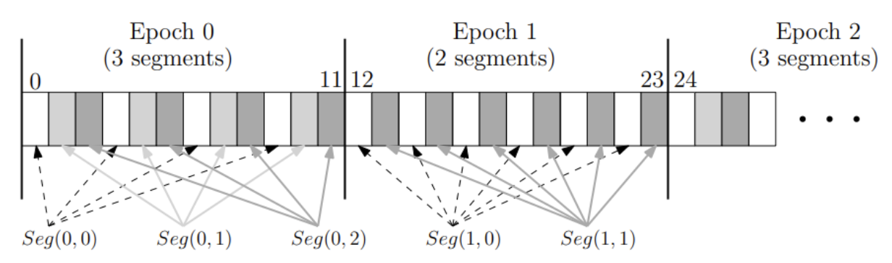

# # \[Design - Canton BFT ordering service\] Timestamps

## Background
Traditionally, consensus and ordering services assign sequential, logical timestamps to
sequenced updates (transactions) corresponding to the total global order. Clients of the
service are then expected to simply process (execute) the updates in the assigned
sequential order. Logical timestamps are used in place of accurate wall clock times
because agreeing on time in any distributed system is, at least traditionally, a hard
problem.

Nonetheless, as blockchains and smart contracts have emerged, we see applications, and
even core protocols (e.g., Canton), relying on the ability to know (at least to some
approximation) at what time certain transactions were sequenced and should be executed.

### Existing Timestamp Approaches
We know of two approaches (so far) that assign timestamps to transactions sequenced by a
BFT ordering service.

The first approach requires clock synchronization (e.g., correct nodes’ clocks should be
within one minute of each other); a single node serves as the leader at any given time
and includes a local wall-clock timestamp with its proposals. Followers acknowledge
proposals only if the timestamp is within the acceptable skew (based on the clock
synchronization requirements) and monotonically increasing. The latter can be achieved
by having correct leader nodes set their proposal timestamp to `max(time.now(),
previousProposal.timestamp + 1).`

The second approach comes from CometBFT and leverages decentralization. The proposal
for round `i` includes a LastCommit field, which contains a
[canonical set](https://docs.cometbft.com/v0.37/spec/consensus/consensus#canonical-vs-subjective-commit)
of `2f+1` signed messages from the previous round (round `i-1`), and each node computes
the timestamp of round `i` as [the median timestamp value among the `2f+1` votes](
https://docs.cometbft.com/v0.37/spec/consensus/bft-time). Using the median
guarantees that the timestamp is consistent with a correct node (no extreme outliers);
including the set of votes in the following round ensures that all nodes consider the
exact same set of input timestamps.

### Timestamping Difficulties with Concurrent Ordering Services
Unfortunately, the parallel nature of recent BFT ordering services prevents these
straightforward timestamping strategies from working out of the box. These recent
works rely on multiple validator nodes, all concurrently leading concurrent rounds
of consensus, to remove bottlenecks and better utilize network resources.
These strategies work well for throughput, but producing a strictly increasing timestamp
assignment across a single, interleaved sequence of transactions is not simple.
In most cases, post-ordering timestamp adjustments are necessary to ensure that the
assigned timestamps coincide with the logically increasing sequence numbers.

In addition, there are specific issues that limit our ability to use either of the two
above existing approaches out of the box:
* For the former, while we will likely rely on some form of clock synchronization to keep
    timestamps within reason of wall clocks, we want to avoid tighter clock
    synchronization (e.g., within 1 minute) if possible, for practical reasons. The
    approach also allows bad leaders to unilaterally push timestamps ahead, up to the
    acceptable future skew.

* For the latter, ISS leaders are intended to work on multiple slots within the active
    epoch at a time (see below), with each slot representing a different instance of
    parallel consensus. However, this parallelism does not support well CometBFT’s median
    calculation, as concurrent slots (even originating from the same validator) can
    now (a) start before having the previous slot’s LastCommit field, and (b) finish
    out of order.

We explain how best to address these gaps by modifying existing approaches below.

### ISS Log Subdivision


The log is divided in epochs. Each epoch `e` has a corresponding epoch length `k` and
number of segments `s`, where:

* `k > 0` is a configurable number of sequence numbers (slots) in the epoch to be
    assigned; each slot, once ordered, contains a block `b` with a set of `t`
    transactions
* `s > 0` is the number of segments, which corresponds to the number of underlying
    parallel consensus instances; typically, the number of segments matches the
    total number of active validator nodes in the topology
* Commonly, `k` and `s` are configured in tandem such that each of the `s` segments is
    assigned an equal ratio of the `k` total slots, which preserves ordering service
    fairness within each epoch with respect to each validator node
* Let’s call (`e >= 0`, `b >= 0`, `t >= 0`) a transaction position `t` in block `b`
    (equivalent to sequence number `k`) in epoch `e`, and assume that `b` and `e` are
    included in the blocks.

### Design Trade-Off: Per-Batch vs. Per-Transaction Timestamp Assignment
There are trade-offs between assigning strictly-increasing timestamps to each block
of transactions or to each individual transaction within a block.

* If assigning timestamps per block, each block delivered to the ordering service
    clients (i.e., the domain sequencers) will see every transaction within a block
    as having the same timestamp; it is thus the sequencers’ responsibility to unpack
    transactions from a block and assign strictly-increasing timestamps to each
    transaction, such that the clients of the domain (participants, mediators) see
    strictly-increasing timestamps across all transactions.
  * Pros: (1) the ordering service only assigns
    timestamps to blocks during consensus, often not even looking at individual
    transactions, which potentially saves costs by continuing to allow the ordering
    service to avoid unpacking blocks after consensus; (2) the domain sequencers
    already have logic to smooth (assign) per-transaction timestamps that delivered
    by the underlying drivers.
  * Cons: (1) the ordering service must ensure that the sequencer can assign
    unique timestamps to all transactions between two consecutive blocks. For example,
    given the existing microsecond precision on transaction timestamps, and assuming
    the ordering service assigns millisecond precision to blocks, each block has an
    upper limit of 1000 transactions; (2) The governance design requires that the
    ordering service can query the topology state based on the timestamps of epoch
    transitions.
* If assigning timestamps per transaction, the clients
    (sequencers) will now see a unique timestamp for each transaction by default;
    any existing timestamp smoothing logic in the sequencer can be disabled
    (or ignored).
  * Pros: (1) the ordering service may already need to unpack blocks
    (depending on delivery size constraints, block format expected by the sequencer
    logic above the driver, etc.), (2) fewer constraints (e.g., number of transactions
    per block) to consider, etc.
  * Cons: the ordering service now needs to unpack a block after
    consensus, assign a unique timestamp to each transaction, then repack the block
    for delivery to the sequencers.

**After careful consideration, the team has decided to move forward with the
per-transaction timestamp assignment.**

## ISS BFT Timestamping Approaches

### Median, Sequential, Post-Order Shifting

#### Core idea
Each validator node produces BFT time in isolation for the consensus instances it
leads. For a single validator, consecutive blocks are produced sequentially. For
example, assume blocks 10 and 14 are assigned to validator 2 (but blocks 11, 12, and
13 are not); block 14 starts only after block 10 completes. Validators include, with
their proposal for block b, a canonical set of `2f+1` signed protocol messages from the
final voting stage that completed the previous block – `prev(b, v)`, where `prev(b, v)`
returns the block led by validator v that immediately precedes block b. Similar to
CometBFT, this allows validators to compute the timestamp of block b as the median
of the timestamps included in the canonical set of signed messages. This strategy
ensures a safe timestamp is chosen and maintains relative clock accuracy (with
respect to validators’ wall clocks) corresponding to the start of each block.

Across different validators, blocks continue to be produced in parallel; for example,
a topology with 16 active validators produces 16 blocks concurrently. However,
since blocks must be delivered in a global order, the ordering service must
deterministically “adjust” non-sequential block timestamps based on the delivery
order to maintain global strictly-increasing timestamps.

#### Block timestamps
The ISS BFT timestamp for a block `b` led by validator `v` is generally computed as the
median of the timestamps included in the canonical set of protocol messages from `v`’s
most recent block (preceding `b`):
```
iss_bft_time(b) =
    MAX(median(prev(b, v).canonical_set),
        iss_bft_time(b-1) + min_block_time_granularity
       )
```

Note that in certain cases, `prev(b, v)` may be undefined (if this is the first block),
or may reference a block produced in a previous epoch, in which case exceptions
are described next. Assume `last(e, v)` returns the last block `v` produced in epoch `e`,
and `last(e)` returns the last block produced in epoch `e` in general.

When the most recent block produced by v does not exist (undefined):
```
iss_bft_time(b), where prev(b, v) is undefined =
    MAX(recent_stable_block.timestamp + min_block_time_granularity),
        iss_bft_time(b-1) + min_block_time_granularity
       )
```

Where `recent_stable_block` refers to the most recent common reference block (known to
all nodes) that can provide a recent timestamp from which to extend. At the beginning
of the network, `recent_stable_block` can refer to the genesis block[^2]. If, however, the
genesis block is too far in the past to represent an accurate timestamp, validators
can choose to propose and order a “bootstrap block” (empty block) that will
essentially consume the old timestamp of the genesis block and allow subsequent blocks
(with real transaction data) to be assigned more up-to-date timestamps.

[^2]: It may be beneficial for validators to always order a bootstrap block to (a)
avoid the possibility of assigning old, expired timestamps to client transactions,
and (b) prevent a significant time skew with respect to the ledger time computed
by the participant.

Once the network has been alive for at least one epoch, the most recent stable block
can be the last block in the previous epoch. Alternatively, an `end_of_epoch` block
could be deterministically created by all nodes at the end of the previous epoch,
and used for assigning timestamps to each validator’s first block in a given epoch.

**After careful consideration, the team has decided to move forward with the last block
from the previous epoch.**

When the most recent block produced by `v` is from the previous epoch:
```
iss_bft_time(b), where prev(b, v) == last(e-1, v) =
    MAX(last(e-1).timestamp + min_block_time_granularity,
        iss_bft_time(b-1) + min_block_time_granularity
       )
```

Within an epoch, once a block led by validator `v` is assigned `⊥`, e.g., due to
timeouts or view changes in the underlying consensus protocol (e.g., PBFT), all
remaining blocks in the epoch not already proposed by the initial leader `v` will
also result in `⊥`. In the case of sequential blocks per validator, this results in
all remaining blocks in the epoch led by `v` also deciding `⊥`.

A block that is decided with value `⊥` may not contain the previous canonical set
included by the original validator `v` that was assigned this block, and thus a safe
timestamp to assign is:
```
iss_bft_time(b), where value(b) == ⊥ =
    iss_bft_time(b-1) + min_block_time_granularity
```

#### Transaction timestamps
For transaction timestamps, an additional post-ordering step must be performed.

When the transaction is in the middle of an ordered block:
```
iss_bft_time(b, t), where t > 0 =
    iss_bft_time(b, t-1) + min_tx_time_granularity
````

When the transaction is the first in an ordered block, it takes on the timestamp of
the block itself:
```
iss_bft_time(b, t), where t == 0 =
    iss_bft_time(b)
```

The above definitions work well when the number of transactions in a block is bound
such that:
```
num_txs_per_block * min_tx_time_granularity <= min_block_time_granularity
```
With a `min_tx_time_granularity` of 1 microsecond and `min_block_time_granularity` of
1 millisecond, we can support 1000 transactions per block.

If we allow more transactions per block than the granularity permits, i.e.:
```
num_txs_per_block * min_tx_time_granularity > min_block_time_granularity
```
then the timestamp and block timestamp assignment strategy requires a small
modification. Specifically, rather than adding `min_block_time_granularity` to each
block timestamp, we need to take into account the timestamp assigned to the last
transaction in the previous block (either previous by validator `v` or block `b-1`,
depending on which is higher).

Assume `last_tx(b-1)` returns the last transaction in block `b-1`, the block timestamp
assignment (from earlier) now becomes:
```
iss_bft_time(b) =
    MAX(median(prev(b, v).canonical_set),
        last_tx(b-1).timestamp + min_tx_time_granularity
       )

iss_bft_time(b), where prev(b, v) is undefined =
    MAX(last_tx(recent_stable_block).timestamp + min_tx_time_granularity),
        last_tx(b-1).timestamp + min_tx_time_granularity
       )

iss_bft_time(b), where prev(b, v) == last(e-1, v) =
    last_tx(b-1).timestamp + min_tx_time_granularity
```

For simplicity, and if possible, it is preferable to limit the number of transactions
in each block such that the minimum block time granularity is not surpassed by the
timestamp assignments to transactions in any single block. It is possible that such a
limit (e.g., 1000 transactions per block) is reasonable in practice.

**After careful consideration, the team has decided to limit the number of transactions
in each block.**

#### Comments & Shortcomings
* By including `2f+1` signed protocol messages from validators, the computed median value
will always be among the times sent by correct nodes. Moreover, the set is identical for
all validators because the leader includes a canonical set in the next proposal,
ensuring all correct validators deterministically compute the same median value.

* In extreme cases, validators could have wildly misaligned wall clocks; the worst case
is when they are split in two synchronized halves that are heavily skewed from each
other. In such cases, with unlucky choices of the `2f+1` set, the median could swing[^3]
back and forth and the time difference between subsequent blocks could be greater
than timeouts. These situations should be considered a violation of the trust
assumptions, i.e., it is required that correct validators have reasonably synchronized
clocks, enough not to cause timeouts.

[^3]: These timestamp swings may break monotonicity, and if so we'll need to adopt a
time vote adjustment similar to the CometBFT
[last rule](https://docs.cometbft.com/v0.37/spec/consensus/bft-time), or a shift.
If we adopt this rule, perhaps we don't need the clocks to be synchronized.

* An in-memory cache will be used to speed up BFT time calculations but, in case of a
crash, reconstructing the BFT time for the last block in an epoch (i.e., the worst case)
requires reading the whole epoch from the beginning.
  * On the other hand, crash recovery can be made more efficient by persisting
    additional information. In particular, since we plan to have the ordering node and
    sequencing node in the same process, access to consensus storage is available.

* If we base the BFT time for the first block in an epoch on the previous epoch’s end
time (or the end time of the last available block in the previous epoch), there is an
implicit reliance on BFT time produced potentially under a different configuration
with different trust assumptions.

* Since, within each consensus instance, each block would be determining the time for
the subsequent block, assuming all the wall clocks are synchronized, this approach’s
BFT time would be behind the wall clock, in the normal case, of a duration
corresponding to the average time it takes to produce a block. We could however
introduce an adjustment parameter to compensate for this.

### Alternative Design Sketches

#### Median from Signed “Prepare”
Including `2f+1` signed protocol messages that complete a block (Commit in PBFT,
Accept in BFT extensions of Paxos, or PreCommit in CometBFT) in the next block for
computing a block timestamp is safe and straightforward; however, it has the
unfortunate property that a validator cannot have two blocks in flight at the same
time, even from the same epoch. One potential alternative is to consider collecting
`2f+1` signed protocol messages that correspond to the “lock-in” or “binding” property
for a given consensus iteration (Prepare in PBFT, Write in BFT extensions of Paxos,
PreVote in CometBFT). While this change does not allow arbitrary blocks by a single
validator to make progress in parallel, it at least allows the next block to start
while the previous block by a validator is roughly halfway through its lifetime.

In the normal case, this approach works well; block `b` from validator `v` includes
a canonical set of `2f+1` Prepare messages from `v`’s previous block. However,
some precaution must be taken due to the fact that `2f+1` signed Prepare messages do
not guarantee that a block will be ordered successfully. Even after a validator
collects `2f+1` Prepares for a block, that block may time out in the underlying
consensus instance, resulting in all nodes deciding `⊥` for the block value. It is not
yet clear how to handle this situation: a block `b` has `2f+1` signed Prepares from the
previous block `prev(b, v)`, but `prev(b, v)` was “canceled” in a way. Should this
affect the timestamp calculated for block `b`, such that we no longer compute a
median if the previous block failed to complete?

#### Pre-Calculate Timestamps at the Start of each Epoch[^4]
Rather than trying to align block timestamps with wall clocks throughout the epoch,
we can potentially generate a (block) timestamp aligned with wall clock times at the
start of each epoch, and then use this single timestamp, shifted deterministically,
to produce strictly-increasing timestamp assignments across all blocks in the epoch.

The main advantage of this approach is that it allows all blocks in the epoch,
including those from the same validator, to make progress concurrently, which,
in theory, should result in better performance since it better aligns with the
original ISS algorithm. The main disadvantage is that block timestamps within the
epoch are no longer as accurate, as they likely will appear cluttered around the time
of the start of the epoch, rather than evenly spaced across the epoch’s duration
(for example, 8-15 seconds). Yes, there is the possibility that the deterministic
shifting can actually space things out more evenly across the epoch’s duration, but
this shifting is merely an approximation, and not actually based on observed
timestamps.

[^4]: This approach and the subsequent one are considerably simpler; if we determine
that epoch durations will never need to be greater than the minimum skew between
ordering time and ledger time (which is admittedly not that easy, as we can't
control an epoch's elapsed time), we will seriously consider switching to one of them.

#### One Block = An Entire Epoch
Another alternative approach is to consider a “block” as the entire epoch of ordered
batches of transactions. All batches of transactions in the epoch get concatenated
together, and then the responsibility of the order service is to simply produce one
timestamp, at some point during the epoch. This timestamp gets assigned to the first
batch (or transaction) in the epoch, and the usual deterministic shifting of all
subsequent batches (or transactions) in the epoch creates the strictly-increasing
timestamp assignment.

Similar to the previous approach, the main benefit is enabling full concurrency of
batches; but, this approach goes one step further as it no longer needs a serial
block at the start of the epoch to explicitly generate a timestamp. As far as
downsides, again similar to the previous approach, timestamp accuracy is sacrificed.
