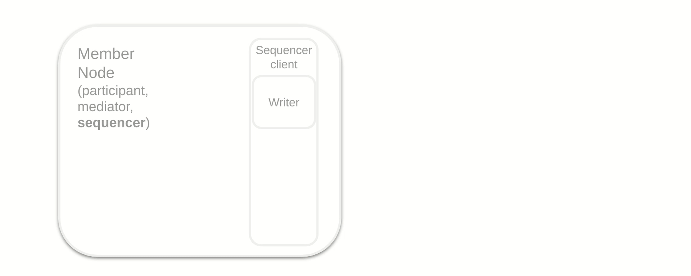
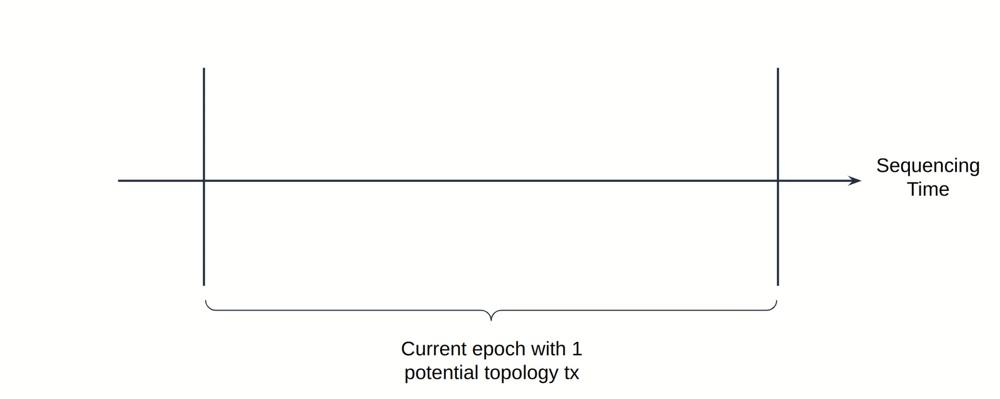
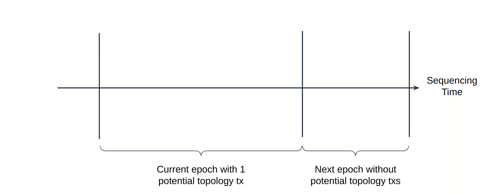

[Topology basics intro](https://docs.google.com/document/d/1tVMTdl4Lq_w9htyOd-q0nf76QM3J4Duf9XuWM-PfzAg/edit) (originally written as starting point for BFT governance ordering integration brainstorming)

# Overview of sequencing and topology processing in Canton

## Sequencing events processing architecture

- A **sequencer client** instance sits in every node-typed **synchronizer member**
  (a party is also a synchronizer member but doesn't correspond to a whole node, so it has no sequencer client of its
  own) and allows synchronizer members to:
  1. **Submit submission requests** to a **sequencer**`s gRPC API.
  2. **Subscribe to sequenced events** that have the member as a **recipient** so that they can be processed by
     appropriate **handlers**.
  The sequencer client employs a DB for crash-fault-tolerance purposes.
- A sequencer's gRPC API accepts submission requests and forwards them to the synchronizer's **ordering layer** that
  produces a synchronizer-wide ordering of submitted requests.
- Once ordered by the ordering layer, every ordered submission request is validated before becoming a sequenced event.
- Submission requests have a set of **recipients** which may be either specific members or symbolic groups such as
  `AllSequencersOfSynchronizer` or `AllMembersOfSynchronizer`.
- One sequenced event handler is `TopologyTransactionProcessingSubscriber` that sends **topology transactions** to the
  synchronizer member's **topology processor** instance, which also, like the sequencer client, sits in every
  node-typed synchronizer member.
  - The topology processor also has its own DB, the **topology store**.
  - Topology can be interrogated via the **topology client** that accesses the topology store and hands out
    **topology snapshots**.
- Topology transactions are requests that change the structure of the synchronizer and are currently always addressed to
  `AllMembersOfSynchronizer` (i.e., no partitioning nor privacy is supported yet).
  - Onboarding a sequencer to a synchronizer is one type of topology transaction; onboarded sequencers must be provided
    a bootstrap sequencer snapshot that includes a topology snapshot, which currently includes the whole synchronizer
    topology history (due to no pruning).
- The **sequencer runtime** also subscribes to itself as a sequencer via a sequencer client, but the one it
  employs runs on `DirectSequencerClientTransport` to skip networking and authentication.
  - The sequencer runtime also has its own DB.
  - A sequencer node currently is a recipient only of topology transactions and traffic top-ups.
  - As a consequence, a sequencer node's event handlers, including the topology processor, only see events that
    are either topology transactions or traffic top-ups.

## Sequencing and effective time

- **Sequencing time** is a unique, strictly increasing timestamp assigned to every successful **sequenced event**,
  which is produced if the validation of an ordered submission request is successful.
  - It induces a synchronizer timeline that establishes a "happens-before" relationship that can be used by all
    synchronizer members.
  - If the ordering layer assigns to ordered submissions a timestamp that is strictly increasing, then the
    sequencing time is the same as the ordering time, else it gets adjusted deterministically.
- Due to the fact that topology transactions affect the behavior of the system, including the validation and processing
  of subsequent topology transactions, they are processed sequentially by the topology transaction processor.
  - To recover efficiency, they are however not immediately applied to the topology but only after an `epsilon` greater
    or equal to a **configured activation delay**, which is a dynamic synchronizer parameter.
- Topology transactions have not only a sequencing time like all requests but also an **effective time**,
  also called `validFrom`, which is defined as the sequencing time plus an **actual activation delay**.
- Since the configured activation delay can change, before being applied to a topology transaction it may need to be
  increased by an **adjustment**, resulting in the actual activation delay.
  This ensures that the topology change processing and activation order is the same as the sequenced order, preserving
  the "happened-before" relationship induced by sequencing time; thus, in general, the configured activation delay
  is a lower bound on the actual activation delay `epsilon`.
    - Consider the following example:
        - `250ms` is the configured activation delay.
        - `topotx0` sequenced at `t0` sets the configured activation delay to `0`.
        - Then assume `topotx1` is sequenced at `t1 = t0 + 250ms`
          and `topotx2` is sequenced at `t2 = (t0 + 250ms).immediateSuccessor`.
        - Then at `t1` topology activation time the `250ms` activation delay is still active,
          but at `t2` it's `0`, so without adjustments `topotx2` would become active before `topotx1`
          even though it was sequenced later, violating the "happens-before" relationship determined by
          the sequencing time (which is the actual synchronizer timeline).
    - See [TopologyTimestampPlusEpsilonTracker`s ScalaDoc] for more info.
- A topology change is visible in the topology snapshot obtained by querying the topology client with the immediate
  successor of its effective time, which we call **topology activation time**.
  - A topology query for `t` topology activation time will thus produce a topology snapshot that includes all the
    changes corresponding to applying to the initial topology state, in order, all topology transactions
    that have an effective time up to and _excluding_ `t`.
- However, sequenced event handlers, and among them the topology processor, know that time has elapsed only when they
  process a sequenced event addressed to their synchronizer member.
  - More precisely, the topology processor handler receives only topology transactions addressed to its synchronizer member
    and **time proof**s, which are emtpy messages submitted just to be sequenced, so that handlers know that sequencing
    time has elapsed.
- When the topology processor sees an event sequenced at `t`, the topology client knows how to compute topology
  snapshots of topologies active at least up to and including the immediate successor of the effective time,
  i.e., `t + epsilon` because anything sequenced after `t` will have an effective time after `t + epsilon`.
  - However, it doesn't know how to compute a topology snapshot after that, so such queries will block until the topology
    processor has processed further sequenced events that allow it to compute the requested topology snapshot.

# Challenges of applying topology changes to the ordering layer

- A **BFT ordering layer** is built upon a distributed protocol between communicating **ordering nodes**.
- `BftBlockOrderer` implements ordering on top of a variant of the [ISS] consensus protocol and conflates
  ordering nodes with sequencer nodes, i.e., every sequencer is also an ordering node and there are no
  ordering nodes besides sequencers.
  - Thus, any topology change that affects the set of sequencers active in the synchronizer, their identities
    and/or and the keys used during the consensus protocol runs, also affects the ordering layer. We refer to
    the topology portion that affects the sequencers as the **sequencer topology**.
  - Since `BftBlockOrderer` conflates ordering nodes with sequencer nodes, the sequencer topology minus the
    key not used in the BFT ordering protocol constitutes the **ordering topology**.
- Most if not all "permissioned" consensus protocols, in which ordering nodes are authenticated, and [ISS] in
  particular (which is the protocol currently implemented by BFT sequencers), assume that the topology is
  _fixed/static_ for a certain number of protocols runs; thus, relevant topology changes cannot be applied
  as soon as they become active, but only at certain reconfiguration points.
  - [ISS] in particular proceeds in **epochs**; an epoch is defined as a certain number of protocol runs, and a
    reconfiguration can only be applied at the end of an epoch.
- At the end of an epoch, if there is a possibility that the topology has changed, `BftBlockOrderer` instances
  within all sequencer nodes must retrieve a new topology snapshot using the topology client, and derive from it
  an ordering topology for the subsequent epoch to use.
  - The new epoch cannot start until the ordering topology has been determined, which means that no
    sequencing can take place before that.
  - `BftBlockOrderer` instances must thus make sure that the effective time used to query the topology
    snapshot will produce a result, i.e., that the topology client has seen sequencing time advance
    far enough to have the knowledge to compute the requested topology snapshot, as no further sequencing
    that would advance time and unblock the query will happen until the ordering topology is determined.
  - `BftBlockOrderer` instances cannot however rely on ordered submission requests to advance sequencing time,
    even if the sequencers are recipients, because they originate from clients and may fail post-ordering
    validation and be dropped before becoming sequenced events.

## Topology ticks to the rescue

- For the reasons mentioned above, `BftBlockOrderer` instances use an active dedicated mechanism to ensure that
  the topology client has seen sequencing time advance far enough to be able to compute the
  requested topology snapshot; it is implemented in `OutputModule` and `BlockUpdateGenerator`:
  - `OutputModule` instances are replicated state machines based on the ordered log of submission requests, i.e.,
    their output and the following topology query behavior is deterministic and the same in all honest sequencer nodes.
  - When a submission request is detected during an epoch that has sequencers as recipients, the last
    block of the epoch includes a **topology tick timestamp** which guarantees that no further ordered submissions
    will be assigned a lower sequencing timestamp, so that the topology processor can serve topology snapshots,
    even if `epsilon` is 0, up to and including a topology activation time immediately after the
    topology tick timestamp (and even further if `epsilon` is non-zero).
    - Due to the existence of `epsilon`, this is however not sufficient to assess whether the topology could
      change during an epoch, because a topology change could be sequenced in an epoch but become effective
      only in a later epoch that may have no submission requests addressed to sequencers.
    - For this reason, `OutputModule` queries then the topology client not only for the topology snapshot corresponding
      to the topology tick timestamp, but also for any **pending topology changes**. It then waits for the result before
      starting the next epoch. If there are pending topology changes, the next epoch is automatically considered
      as an epoch potentially changing the topology, just as if a submission request addressed to sequencers
      were ordered. This ensures that `OutputModule` queries for an up-to-date topology snapshot
      at the end of the next epoch as well, preventing that relevant topology changes are missed.
  - When `BlockUpdateGenerator` sees a block with a topology tick timestamp, it emits directly, bypassing all
    regular submission request validation, a sequenced event addressed to all sequencers with sequencing time
    equal to the topology tick timestamp. Such an event reaches the topology processor in the sequencer runtime
    and advances the effective time, unblocking the topology client query for the next epoch performed by
    `OutputModule`.
  - During state transfer for sequencer onboarding, consensus is not active and topology changes are queried for,
    in order to assess whether there are pending topology changes, but not applied, as the onboarding topology is
    assumed (for simplicity and because it corresponds to sensible governance anyway) to stay unchanged
    until onboarding completes.
    - However, the topology tick timestamp is still included in the last block of epochs that may have changed the
      topology ensuring in this way that all sequencers have aligned counters. This ensures in turn that sequencer
      snapshots are coherent (which will be important for BFT onboarding in the future) and that pruning also works
      correctly.
      - Whether to query the topology and tick is determined, during onboarding state transfer, in the same way
        as for regular epochs, i.e., by checking state-transferred blocks for submission requests with sequencers
        as recipients and by considering whether there are pending topology changes from the previous epoch.
        - The information about whether there are pending topology changes to be considered in the onboarding
          epoch is included in the implementation-specific attachment to the onboarding sequencer snapshot,
          as the onboarding sequencer doesn't query for the onboarding epoch's topology and thus cannot retrieve this
          information by itself.

[TopologyTimestampPlusEpsilonTracker ScalaDoc]: https://github.com/DACH-NY/canton/blob/2b438f0490556bfce646dc59c065cf5b2d3dfec3/community/base/src/main/scala/com/digitalasset/canton/topology/processing/TopologyTimestampPlusEpsilonTracker.scala#L59-L78
