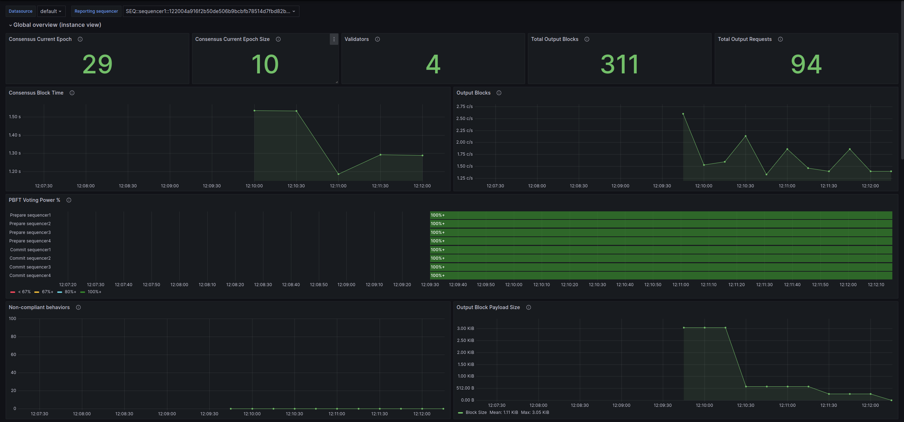
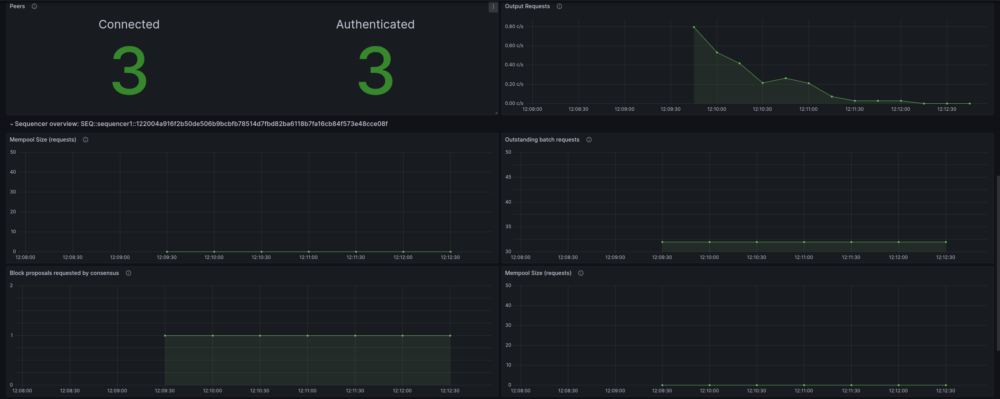
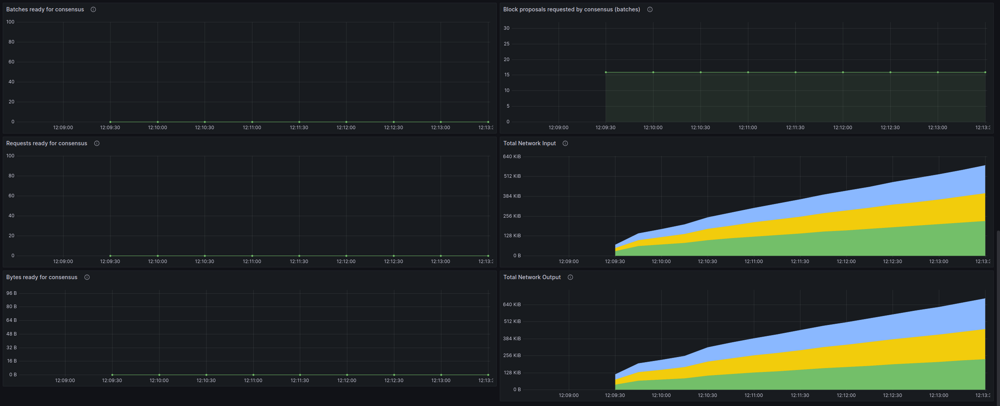

# BFT Sequencers - Observability Example

Observability example of a Canton BFT synchronizer configured with 4 BFT sequencers derived from the
[Daml Enterprise Observability Example](https://docs.daml.com/canton/usermanual/monitoring.html#hands-on-with-the-daml-enterprise-observability-example)
in the official documentation.

## 🚦 Prerequisites 🚦

* [**Docker**](https://docs.docker.com/get-docker/).
* [**Docker Compose V2 (as plugin `2.x`)**](https://github.com/docker/compose).
* Build Canton as follows:
  * `sbt packRelease`
  * `cd community/app/target/release/canton`
  * Copy [`Dockerfile`](canton/Dockerfile) there.
  * `docker build . -t canton-community:latest` (or anything matching your [.env](.env)'s `CANTON_IMAGE`).
* A matching ledger API test tool ("LAPITT"):
  * Build it with `sbt ledger-test-tool-2-dev/assembly`.
  * Copy it as `lapitt.jar` in the project's root directory from `enterprise/ledger-test-tool/tool/lf-v2.dev/target/scala-2.13/ledger-api-test-tool-2.dev-3.?.0-SNAPSHOT.jar`

⚠️ **Docker compose V1 is deprecated and incompatible with this project**, check [Docker documentation](https://docs.docker.com/compose/migrate/).
One sign you are using the wrong version is the command syntax with a dash instead of a space:
`docker compose` (V2 ✔️) VS `docker-compose` (V1 ❌).

## Quickstart

To quickly get up and running, **make sure you have all the prerequisites installed** and then:

* Ensure you have enough CPU/RAM/disk to run this project; if resource limits are reached, a container can be killed.
Canton can use over 4GB of RAM for example.
* Start everything: `docker compose up`
* Create workload: there are various scripts that generate load, run them in different terminals:
  * `scripts/generate-load.sh` (generates gRPC traffic to the Ledger API running the conformance tests in loop)
* Log in to the Grafana at [http://localhost:3000/](http://localhost:3000/) using the default
user and password `digitalasset`. After you open any dashboard, you can lower the time range to 5 minutes and
refresh to 10 seconds to see results quickly.
* After you stop, you must [cleanup everything](#cleanup-everything) and start fresh next time:
`docker compose down -v`

The "BFT ordering" dashboard should look like this:




")

## Components

Docker Compose will start the following services:

* PostgreSQL database server
* All-in-one Canton node (mediator, sequencer and participant)
* Monitoring
  * Prometheus `2.x`
  * Grafana `9.x`
  * Node Exporter
  * Loki + Promtail `2.x`

Prometheus and Loki are [preconfigured as datasources for Grafana](grafana/datasources.yml). You can add other
services/exporters in the [Docker compose file](docker-compose-observability.yml) and scrape them changing the
[Prometheus configuration](prometheus/prometheus.yml).

## Startup

Start everything (blocking command, show all logs):

```sh
docker compose up
```

Start everything (detached: background, not showing logs)

```sh
docker compose up -d
```

If you see the error message `no configuration file provided: not found`
please check that you are placed at the root of this project.

### Starting a Canton Console

```sh
docker exec -it daml_observability_canton_console bin/canton -c /canton/config/console.conf
```

For example:

```
@ participant1.synchronizers.list_registered().map(_._1.synchronizerAlias.unwrap)
res0: Seq[String] = Vector("mysynchronizer")

@ sequencer1.bft.get_ordering_topology()
res1: com.digitalasset.canton.synchronizer.sequencing.sequencer.block.bftordering.admin.SequencerBftAdminData.OrderingTopology = OrderingTopology(
  currentEpoch = 30L,
  sequencerIds = Vector(SEQ::sequencer1::122068109171..., SEQ::sequencer2::1220ec0faf93..., SEQ::sequencer3::122078a60382..., SEQ::sequencer4::12203fdba69e...)
)

@ sequencer1.bft.get_peer_network_status(None)
res2: com.digitalasset.canton.synchronizer.sequencer.block.bftordering.admin.SequencerBftAdminData.PeerNetworkStatus = PeerNetworkStatus(
  endpointStatuses = Vector(
    PeerEndpointStatus(endpointId = PeerEndpointId(address = "0.0.0.0", port = Port(n = 31032), transportSecurity = false), health = PeerEndpointHealth(status = Authenticated, description = None)),
    PeerEndpointStatus(endpointId = PeerEndpointId(address = "0.0.0.0", port = Port(n = 31033), transportSecurity = false), health = PeerEndpointHealth(status = Authenticated, description = None)),
    PeerEndpointStatus(endpointId = PeerEndpointId(address = "0.0.0.0", port = Port(n = 31031), transportSecurity = false), health = PeerEndpointHealth(status = Authenticated, description = None))
  )
)
```

#### Testing catch-up state transfer

Because a remote console (i.e., remote instance references) is used here, nodes cannot be easily restarted.
The easiest way to trigger catch-up is to remove some of the connections (copy-paste ready):

```
import com.digitalasset.canton.synchronizer.sequencer.block.bftordering.core.driver.BftBlockOrdererConfig.{EndpointId, P2PEndpointConfig}
import com.digitalasset.canton.config.RequireTypes.Port
sequencer1.bft.remove_peer_endpoint(EndpointId("0.0.0.0", Port.tryCreate(31031), false))
sequencer3.bft.remove_peer_endpoint(EndpointId("0.0.0.0", Port.tryCreate(31031), false))
sequencer4.bft.remove_peer_endpoint(EndpointId("0.0.0.0", Port.tryCreate(31031), false))
sequencer2.bft.remove_peer_endpoint(EndpointId("0.0.0.0", Port.tryCreate(31030), false))
sequencer2.bft.remove_peer_endpoint(EndpointId("0.0.0.0", Port.tryCreate(31032), false))
sequencer2.bft.remove_peer_endpoint(EndpointId("0.0.0.0", Port.tryCreate(31033), false))
```

And then add them back:

```
sequencer2.bft.add_peer_endpoint(P2PEndpointConfig("0.0.0.0", Port.tryCreate(31030), None))
sequencer2.bft.add_peer_endpoint(P2PEndpointConfig("0.0.0.0", Port.tryCreate(31032), None))
sequencer2.bft.add_peer_endpoint(P2PEndpointConfig("0.0.0.0", Port.tryCreate(31033), None))
sequencer1.bft.add_peer_endpoint(P2PEndpointConfig("0.0.0.0", Port.tryCreate(31031), None))
sequencer3.bft.add_peer_endpoint(P2PEndpointConfig("0.0.0.0", Port.tryCreate(31031), None))
sequencer4.bft.add_peer_endpoint(P2PEndpointConfig("0.0.0.0", Port.tryCreate(31031), None))
```

## Stopping

* If you used a blocking `docker compose up`, just cancel via keyboard with `[Ctrl]+[c]`

* If you detached compose: `docker compose down`

### Cleanup Everything

Stop everything, remove networks and all Canton, Prometheus & Grafana data stored in volumes:

```sh
docker compose down --volumes
```

## Important Endpoints to Explore

* Prometheus: http://localhost:9090/
* Grafana: http://localhost:3000/ (default user and password: `digitalasset`)
* Participant's Ledger API endpoint: http://localhost:10011/

Check all exposed services/ports in the different [Docker compose YAML] files:
* [Canton](docker-compose-canton.yml)
* [Observability stack](docker-compose-observability.yml)

### Logs

```sh
docker logs daml_observability_postgres
docker logs daml_observability_prometheus
docker logs daml_observability_grafana
```
You can open multiple terminals and follow logs (blocking command) of a specific container:

```
docker logs -f daml_observability_postgres
docker logs -f daml_observability_prometheus
docker logs -f daml_observability_grafana
```

You can query Loki for logs [using Grafana in the `Explore` section](http://localhost:3000/explore?left=%7B%22datasource%22:%22loki%22%7D).

### Metrics

You can query Prometheus for metrics [using Grafana in the `Explore` section](http://localhost:3000/explore?left=%7B%22datasource%22:%22prometheus%22%7D).

## Configuration

### Prometheus

[`prometheus.yml`](prometheus/prometheus.yml) [[documentation]](https://prometheus.io/docs/prometheus/latest/configuration/configuration/)

Reload or restart on changes:
* Reload:
  * Signal: `docker exec -it daml_observability_prometheus -- kill -HUP 1`
  * HTTP: `curl -X POST http://localhost:9090/-/reload`
* Restart: `docker compose restart prometheus`

### Grafana

* Grafana itself: [`grafana.ini`](grafana/grafana.ini) [[documentation]](https://grafana.com/docs/grafana/latest/setup-grafana/configure-grafana/)
* Data sources: [`datasources.yml`](grafana/datasources.yml) [[documentation]](https://grafana.com/docs/grafana/latest/datasources/)
* Dashboard providers: [`dashboards.yml`](grafana/dashboards.yml) [[documentation]](https://grafana.com/docs/grafana/latest/administration/provisioning/#dashboards)

Restart on changes: `docker compose restart grafana`

#### Dashboards

All dashboards (JSON files) are auto-loaded from directory
[`grafana/dashboards/`](./grafana/dashboards)

* Automatic: place your JSON files in the folder (loaded at startup, reloaded every 30 seconds)
* Manual: create/edit via Grafana UI

### Loki

* Loki itself: [`loki.yaml`](loki/loki.yaml) [[documentation]](https://grafana.com/docs/loki/latest/configure/)

Restart on changes: `docker compose restart loki`

* Promtail: [`promtail.yaml`](loki/promtail.yaml) [[documentation]](https://grafana.com/docs/loki/latest/send-data/promtail/configuration/)

Restart on changes: `docker compose restart promtail`

##### Examples Source

* Prometheus and Grafana [[source]](https://github.com/grafana/grafana/tree/main/public/app/plugins/datasource/prometheus/dashboards/)
* Node exporter full [[source]](https://grafana.com/grafana/dashboards/1860-node-exporter-full/)
* Loki and Promtail [[source]](https://grafana.com/grafana/dashboards/14055-loki-stack-monitoring-promtail-loki/)
