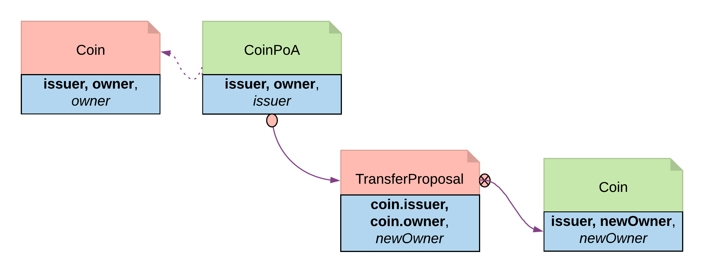

.. Copyright (c) 2023 Digital Asset (Switzerland) GmbH and/or its affiliates. All rights reserved.
.. SPDX-License-Identifier: Apache-2.0

The Delegation Pattern
######################

The Delegation pattern gives one party the right to exercise a choice on behalf of another party. The agent can control a contract on the ledger without the principal explicitly committing the action.

Motivation
**********

Delegation is prevalent in the business world. In fact, the entire custodian business is based on delegation. When a company chooses a custodian bank, it is effectively giving the bank the rights to hold their securities and settle transactions on their behalf. The securities are not legally possessed by the custodian banks, but the banks should have full rights to perform actions in the client's name, such as making payments or changing investments.

The Delegation pattern enables Daml modelers to model the real-world business contractual agreements between custodian banks and their customers. Ownership and administration rights can be segregated easily and clearly.

Implementation
**************

**Pre-condition**: There exists a contract, on which controller Party A has a choice and intends to delegate execution of the choice to Party B. In this example, the owner of a *Coin* contract intends to delegate the *Transfer* choice.

.. literalinclude:: daml/CoinIssuance.daml
  :language: daml
  :start-after: -- BEGIN_COIN_TEMPLATE_DATATYPE
  :end-before: -- END_COIN_TEMPLATE_DATATYPE

.. literalinclude:: daml/CoinIssuance.daml
  :language: daml
  :start-after: -- BEGIN_COIN_TEMPLATE_TRANSFER
  :end-before: -- END_COIN_TEMPLATE_TRANSFER

Delegation Contract
  - *Principal*, the original coin owner, is the signatory of delegation contract *CoinPoA*. This signatory is required to authorize the *Transfer* choice on *coin*.

  .. literalinclude:: daml/CoinDelegation.daml
    :language: daml
    :start-after: -- BEGIN_COIN_POA
    :end-before: -- END_COIN_POA

  - Whether or not the *Attorney* party should be a signatory of *CoinPoA* is subject to the business agreements between *Principal* and *Attorney*. For simplicity, in this example, *Attorney* is not a signatory.
  - *Attorney* is the controller of the Delegation choice on the contract. Within the choice, *Principal* exercises the choice *Transfer* on the Coin contract.

  .. literalinclude:: daml/CoinDelegation.daml
    :language: daml
    :start-after: -- BEGIN_COIN_POA_TRANSFER
    :end-before: -- END_COIN_POA_TRANSFER

  - *Coin* contracts need to be disclosed to *Attorney* before they can be used in an exercise of *Transfer*. This can be done by adding *Attorney* to *Coin* as an Observer. This can be done dynamically, for any specific *Coin*, by making the observers a *List*, and adding a choice to add a party to that List:

  .. literalinclude:: daml/CoinIssuance.daml
    :language: daml
    :start-after: -- BEGIN_COIN_TEMPLATE_DISCLOSE
    :end-before: -- END_COIN_TEMPLATE_DISCLOSE

.. note:: The technique is likely to change in the future. Daml is actively researching future language features for contract disclosure.

   Delegation pattern diagram

