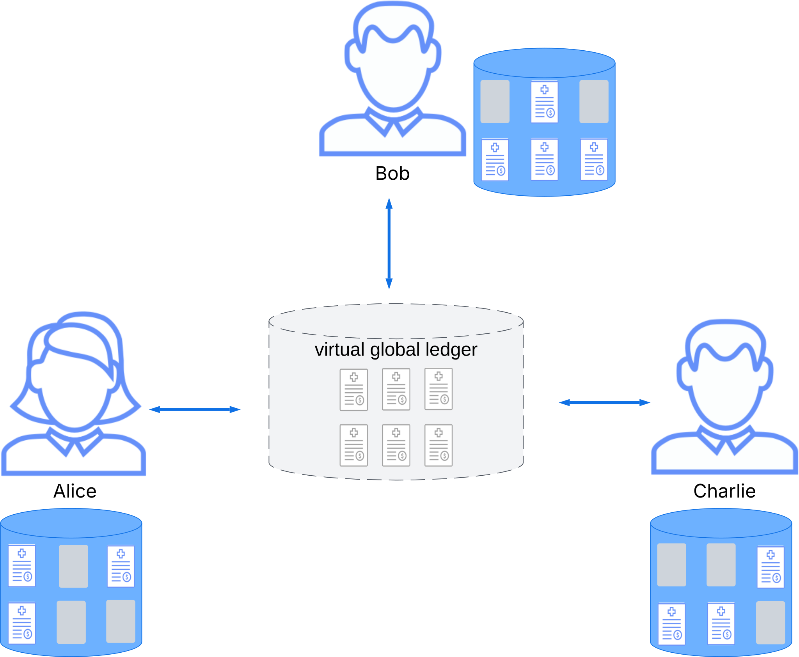

.. Copyright (c) 2023 Digital Asset (Switzerland) GmbH and/or its affiliates. All rights reserved.
.. SPDX-License-Identifier: Apache-2.0

.. _da-ledgers:

Ledger Model
############

.. note::

   * Update examples and notation in the style of the Canton polyglott whitepaper
     https://www.canton.network/hubfs/Canton%20Network%20Files/whitepapers/Polyglot_Canton_Whitepaper_11_02_25.pdf

     Interleave definitions and diagrams with concrete examples from Daml; link to Daml source files that are checked by CI.

   * Remove exceptions

   * Extend with time, upgrading (via packages), requester of a commit, explicit disclosure

   

Canton enables multi-party workflows by providing parties with a *virtual global ledger* (VGL),
which encodes the current state of their shared contracts written in a smart contract language.
At a high level, the interactions are visualized below:
Three parties Alice, Bob, and Charlie connect independently to a virtual global ledger, depicted as a large cloud.
They hold different views of that ledger in their local databases shown as blue icons.
The global ledger is virtual in the sense that no single entity typically sees this global ledger in its entirety;
it is an imaginary database that represents the union of all parties' databases.

.. https://lucid.app/lucidchart/e119dde8-4abe-4b09-9a95-5ca6ef3fb509/edit

The Ledger Model defines:

  #. What the changes and the ledgers looks like - the :ref:`structure <ledger-structure>` of the Canton Ledger
  #. Who sees which changes and data - the :ref:`privacy model <da-model-privacy>` for the Canton Ledger
  #. What changes to the ledger are allowed and who can request them - the integrity model for the Canton Ledger

The sections below review these concepts of the Ledger Model in turn and how they relate to Daml smart contracts.

.. _da-ledgers-running-example:

Running example
***************

The running example for the Ledger Model is a simple multi-party interaction of two parties atomically swapping their digital assets.
A digital asset is modeled as a ``SimpleAsset`` with an issuer, an owner, and the asset description.
The owner can transfer such an asset to a new owner with the ``Transfer`` choice.

.. note::
   These Daml templates are for illustration purposes only.
   They are not meant for real-world usage as they are heavily simplified.

.. literalinclude:: ./daml/SimpleAsset.daml
   :language: daml
   :start-after: SNIPPET-ASSET-START
   :end-before: SNIPPET-ASSET-END

An atomic swap, also known as delivery versus payment (DvP), combines two asset transfers between the parties in a single transaction.
The ``SimpleDvP`` template below captures the agreement between two parties ``partyA`` and ``partyB`` to swap ownership of the two allocated assets.
Either party to the DvP can execute the swap by exercising the ``Settle`` choice.

.. literalinclude:: ./daml/SimpleDvP.daml
   :language: daml
   :start-after: SNIPPET-DVP-BEGIN
   :end-before: SNIPPET-DVP-END

To create a DvP contract instance, the parties go through the usual propose-accept workflow pattern shown next.
Party ``proposer`` creates a proposal for the party ``counterparty`` with their allocated asset and the description of the asset they expect to swap with.
The ``counterparty`` can accept the proposal with the ``Accept`` choice to create a ``SimpleDvP`` contract, or can accept and immediately settle the swap with the ``AcceptAndSettle`` choice.

.. literalinclude:: ./daml/SimpleDvP.daml
   :language: daml
   :start-after: SNIPPET-PROPOSAL-BEGIN
   :end-before: SNIPPET-PROPOSAL-END

.. .. toctree::
   :maxdepth: 3
   ledger-structure
   ledger-privacy
   ledger-validity
   ledger-integrity
   ledger-daml
   ledger-exceptions
