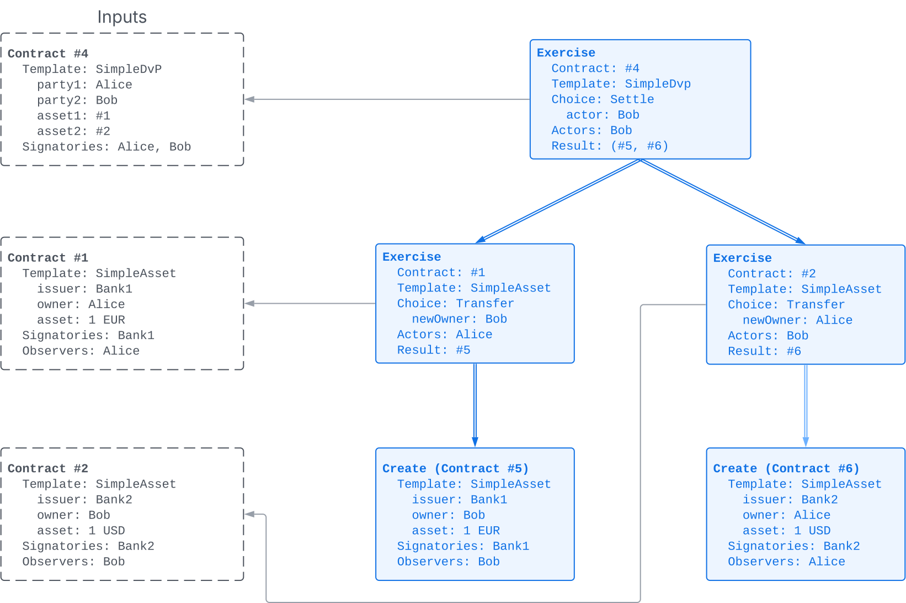
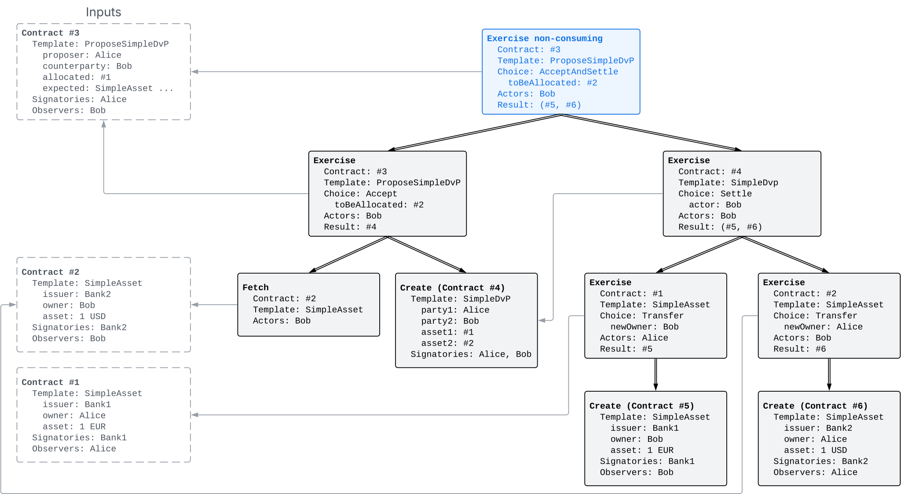
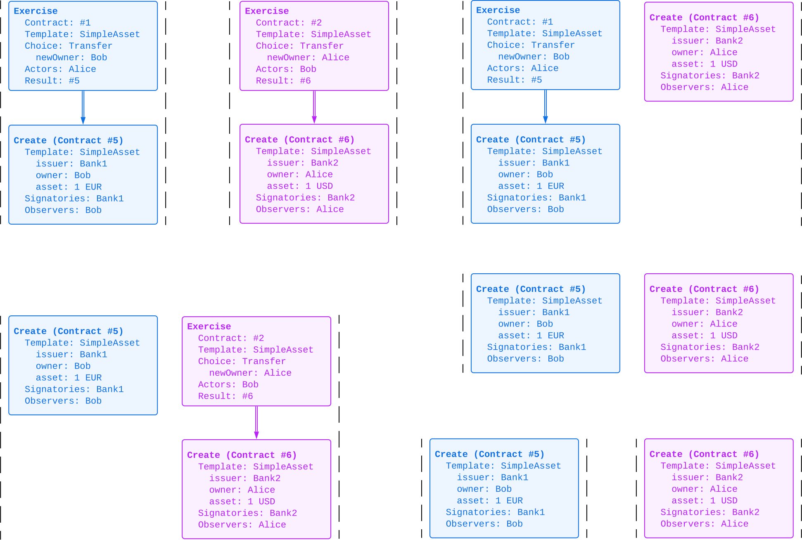

.. Copyright (c) 2023 Digital Asset (Switzerland) GmbH and/or its affiliates. All rights reserved.
.. SPDX-License-Identifier: Apache-2.0

   

   
.. _ledger-structure:

Structure
#########

This section looks at the structure of a ledger that records the interactions between the parties as ledger changes.
The definitions presented here address the first question: "What do changes and ledgers look like?".
The basic building blocks of the recorded interactions are :ref:`actions <actions>`, which get grouped into :ref:`transactions <transactions>`, *updates*, *commits*, and the :ref:`Ledger <da-ledger-definition>`.

.. _ledger-structure_running_example:

Running workflow example
************************

Most of the examples in this section look at the following Daml Script scenarios
based on the templates from the :ref:`running example <da-ledgers-running-example>`.
Two banks first each issue one asset to either Alice or Bob and then Alice proposes a DvP to Bob.
Bob accepts the proposal and settles the DvP.

.. literalinclude:: ./daml/SimpleDvP.daml
   :language: daml
   :start-after: SNIPPET-SCRIPT-BEGIN
   :end-before: SNIPPET-SCRIPT-END

Acceptance and settlement can happen either in a single step via the ``AcceptAndSettle`` choice.

.. literalinclude:: ./daml/SimpleDvP.daml
   :language: daml
   :start-after: SNIPPET-ACCEPT_AND_SETTLE-BEGIN
   :end-before: SNIPPET-ACCEPT_AND_SETTLE-END

Or in two separate steps with ``Accept`` followed by ``Settle``:

.. literalinclude:: ./daml/SimpleDvP.daml
   :language: daml
   :start-after: SNIPPET-ACCEPT_THEN_SETTLE-BEGIN
   :end-before: SNIPPET-ACCEPT_THEN_SETTLE-END

.. _actions:

Actions
*******

.. _actions-hierarchical-structure:

Hierarchical structure
======================

One of the main features of the Ledger Model is a *hierarchical action structure*.
This structure is illustrated using Bob settling the DvP by exercising the ``Settle`` choice in the above scenario.
Alice and Bob have allocated their assets (contracts #1 and #2) on the ledger to a ``SimpleDvp`` contract (#4).
These contracts appears as inputs (dashed boxes on the left) in the diagram below.

.. https://lucid.app/lucidchart/f3f49c7c-d257-4136-9dcb-39750f45c24d/edit

         
Exercising the ``Settle`` choice yields an Exercise action,
which is the tree of nodes shown in blue.
The input contracts on the left are not part of the action.
The root node describes the parameters of the choice and references the ``SimpleDvp`` input contract #4.
It has two subtrees, which perform the asset transfers automatically as part of the ``Settle`` choice.

#. The left subtree represents Alice exercising the ``Transfer`` choice on her ``SimpleAsset`` contract #1.
   It consists of two nodes:
   The root node describes the parameters of the choice and the input contract #1.
   The child node, which is a one-node subtree of its own, encodes the creation of Bob's new ``SimpleAsset`` contract #5.
   
#. The right subtree is analogous:
   The root node of the subtree describes Bob exercising the ``Transfer`` choice on his ``SimpleAsset`` contract #2,
   and its child encodes the creation of Alice's new ``SimpleAsset`` contract #6.

Notably, the Exercise action is the whole tree even though the root node already describes all the relevant parameters.
The Ledger Model focuses on actions rather than nodes because the root node cannot exist on its own, without its children,
as the choice body in the Daml model must always execute when the choice is exercised.
The :ref:`integrity section <da-model-integrity>` goes into the details of this.

Nevertheless actions are not indivisible, but hierarchical:
The left and right subtrees are actions in their own right,
namely the Exercise actions for Alice and Bob exercising their ``Transfer`` choice on their ``SimpleAsset`` input contracts #1 and #2, respectively.
And each of the two subtrees contains another subtree,
namely the creation of Bob's and Alice's new ``SimpleAsset`` contracts #5 and #6.
Each of these subtrees is an action in its own right.
This hierarchical structure induces a :ref:`subaction relationship explained below <da-ledger-subaction>`
and forms the basis for the :ref:`privacy model <da-model-privacy>`.

.. _def-action:

Definition
==========

Overall, the settlement in the above example contains two types of actions:

#. Creating contracts

#. Exercising choices on contracts.

These are also the two main kinds of actions in the Ledger Model.

A **node** is one of the following:

#. A **Create** node records the creation of the contract.
   It contains the following pieces of information:

   * The **contract ID** is a unique identifier of the contract.
     It is equivalent to the transaction output (TxO) in ledgers based on :ref:`unspent transaction outputs (UTxO) <da-ledger-input-output>`.

   * The **template ID** identifies the Daml code associated with the contract,
     and its arguments define the **contract instance**, which is the immutable data associated with the contract ID.

   * The **signatories** are the non-empty set of parties that must authorize the creation and archival of the contract.

   * The **contract observers**, or just observers for short, are the set of parties that will be informed about the contract creation and archival, in addition to the signatories.

   In Daml, the signatories and contract observers are determined by the ``signatory`` and ``observer`` clauses defined by the template.
   
   Create nodes are depicted as shown below.
   Diagrams often omit fields with empty values and observers that are also signatories.

   .. https://lucid.app/lucidchart/31888b88-d836-457d-a4a8-05e3e161e07f/edit
   .. image:: ./images/create-node.svg
      :align: center
      :width: 30%
      :alt: The structure of a **Create** node.

#. An **Exercise** node records the parameters of a choice that one or more parties have exercised on a contract.
   It contains the following pieces of information:

   * An exercise **kind**, which is either **consuming** or
     **non-consuming**. Once consumed, a contract cannot be used again;
     for example, Alice must not be able to transfer her asset twice, as this would be double spending.
     In contrast, contracts exercised in a non-consuming fashion can be reused, for example for expressing a delegation from one party to another.
      
   * The **contract ID** on which the choice is exercised.
     This contract is called the **input contract**.

   * The **interface ID** if this choice was exercised through a Daml interface.

   * The **template ID** that defines the smart contract code for the choice with the given **choice name**;
     and the **choice arguments** that are passed to the smart contract code.
     
   * An associated set of parties called **actors**.
     These are the parties who perform the action.
     They are specified in the ``controller`` clause in the Daml template.

   * An associated set of **choice observers**.
     These parties will be informed about the choice being exercised.

   * The **exercise result** as the Daml value returned by evaluating the choice body.

   Exercise nodes are depicted as shown below, where the consequences are indicated by arrows ordered left-to-right.
   Diagrams omit the kind if it is consuming, empty field values, and choice observers that are also actors.

   .. https://lucid.app/lucidchart/ce3c7eb2-081e-4ac4-af92-5efc11d21c17/edit
   .. image:: ./images/exercise-node.svg
      :align: center
      :width: 30%
      :alt: The structure of an **Exercise** node.

#. A **Fetch** node on a contract, which demonstrates that the contract exists and is active at the time of fetching.
   A Fetch behaves like a non-consuming Exercise with no consequences, and can be repeated.
   The fetch node contains the following pieces of information, analogous to Exercise nodes:
   **contract ID**, **interface ID**, **template ID**, and the **actors**, namely the parties who fetch the contract.

   Fetch nodes are depicted as shown below.

   .. https://lucid.app/lucidchart/27844d5e-0cdb-4f22-8f67-e97f3839e613/edit
   .. image:: ./images/fetch-node.svg
      :align: center
      :width: 30%
      :alt: The structure of a **Fetch** node.

An **action** consists of a **root node** and a list of **consequences**, which are themselves actions.
This gives rise to the tree structure of an action: The root node of an action has as children the root nodes of its consequences.

An action inherits its kind from its root node:

#. A **Create action** has a Create node as the root.
   The consequences are empty.

#. An **Exercise action** has an Exercise node as the root
   and the consequences are the subactions.
   The Exercise action is the **parent action** of its consequences.

#. A **Fetch action** as a Fetch node as the root.
   The consequences are empty.
   
The terminology on nodes extends to actions via the root node.
For example, the signatories of a Create action are the signatories of the Create node,
and an Exercise action is (non)consuming if and only if its root node is.
Moreover, an Exercise or a Fetch action on a contract is said to **use** the contract.
Finally, a consuming Exercise is said to **consume** (or **archive**) its contract.

Examples
========

An example of a Fetch action appears in the ``Accept`` choice on a DvP proposal contract from the template ``ProposeSimpleDvP``.
The choice body fetches the ``SimpleAsset`` that Bob allocates to the DvP,
which checks that the asset contract is active and brings the contract instance into the computation,
so that the choice implementation can assert that this asset meets the expectation expressed in the proposal contract.
The next diagram shows this Exercise action with the Fetch action as its first consequence.

.. https://lucid.app/lucidchart/556f7b43-565f-4b94-b670-719135a77bec/edit
.. image:: ./images/dvp-propose-accept-action.svg
   :align: center
   :width: 100%
   :alt: The accept action on Alice's ``ProposeSimpleDvP`` exercised by Bob.

A non-consuming Exercise shows up in the combined ``AcceptAndSettle`` choice on the ``ProposeSimpleDvP`` contract:
This choice is non-consuming so that the ``Accept`` choice exercised in the choice body can consume the proposal contract.
As the next diagram shows, non-consuming Exercises yield multiple references to the same input contract #3.
The diagram also shows that fetches have the same effect: input contract #2 is used twice.

.. _da-dvp-propose-accept-and-settle-action:

.. https://lucid.app/lucidchart/fdcc5894-e013-499e-ba85-de16300381a8/edit

.. _da-ledger-subaction:
         
Subactions
==========

This example again highlights the hierarchical structure of actions:
The ``AcceptAndSettle`` action contains the corresponding actions for ``Accept`` and ``Settle`` as its consequences.

More generally, for an action `act`, its **proper subactions** are all actions in the consequences of
`act`, together with all of their proper subactions.
Additionally, `act` is a (non-proper) **subaction** of itself.

The subaction relation is visualized below for Bob's ``Settle`` Exercise.
Each borderless box contains an action (via its tree of nodes) and the nesting of these boxes encodes the subaction relation.
In detail, both the blue and purple boxes are proper subactions of Bob's ``Settle`` action shown in grey.
The green box is a proper subaction of the blue and the grey boxes, and the yellow box is a proper subaction of the purple and the grey boxes.

.. https://lucid.app/lucidchart/dbe05602-46b8-4b23-8957-a8e15af912e6/edit
.. image:: ./images/dvp-settle-subactions.svg
   :align: center
   :width: 60%
   :alt: The subactions of Bob exercising the ``Settle` choice on the DvP contract.

.. _transactions:
         
Transactions
************

A **transaction** is a list of actions that are executed atomically.
Those actions are called the **root actions** of the transaction.
That is, for a transaction `tx = act`:sub:`1`\ `, …, act`:sub:`n`, every `act`:sub:`i` is a root action.
For example, if Alice and Charlie have made one DvP proposal each for Bob, then Bob may want to both accept simulataneously.
To that end, Bob exercises both ``Accept`` choices in a single transaction with two root actions (blue and purple), as shown next.
Visually, transactions are delimited by the dashed lines on both sides, to distinguish them from actions.
Like for actions, the input contracts on the left are not part of the transaction.

.. https://lucid.app/lucidchart/acb71942-2a11-417c-ae0a-003c8ea2da69/edit
.. image:: ./images/dvp-accept-two.svg
   :align: center
   :width: 100%
   :alt: A transaction with two top-level actions where Bob accepts two DvP proposal, one from Alice and one from Charlie.

For another example, the consequences of an Exercise action are a list of actions and therefore form a transaction
In the example of the ``Settle`` action on Alice's and Bob's ``SimpleDvP``,
the consequences of the ``Settle`` action form the following transaction,
where actions are ordered left-to-right as before.
The transaction consists of two root actions (blue and purple), namely the two ``Transfer`` actions of the two legs of the DvP.

.. https://lucid.app/lucidchart/b8f2c6d1-654b-4658-adc5-77eb59e27d05/edit
.. image:: ./images/dvp-settle-consequences-are-transactions.svg
   :align: center
   :width: 50%
   :alt: The consequences of the ``Settle`` action are a transaction of two actions, namely the two ``Transfer`` legs of the DvP.

         
The hierarchical structure of actions extends to transactions and yields the notion of subtransactions.
A **proper subtransaction** of a transaction is obtained by (repeatedly) replacing an action by its consequences;
and a **subtransaction** of a transaction is either the transaction itself or a proper subtransaction thereof.

For example, given the transaction shown above consisting only of the two consequences of the ``Settle`` action,
the next diagram shows all seven proper non-empty subtransactions, each with their dashed delimiters.

.. https://lucid.app/lucidchart/c5ff472e-3161-42a0-ac2d-275774a2b9b8/edit

The :ref:`privacy model <da-model-privacy>` uses the concept of subtransactions to define the visibility rules.

.. _da-ledger-input-output:
      
Inputs and outputs
******************

The Ledger Model falls into the category of `(extended) UTxO-style ledgers <https://en.wikipedia.org/wiki/Unspent_transaction_output>`_
where the set of unspent transaction outputs (UTxOs) constitutes the current state of a ledger.
Here, the **transaction outputs** are the contract IDs of the contracts created in a transaction.
When a contract is consumed, its contract ID is spent and thus removed from the UTxO set.
The data associated with each UTxO is immutable;
modifications happen by consuming a contract ID and recreating a new contract with a different contract ID.

This Ledger Model extends the UTxO model in two aspects:

* A transaction may use a contract without consuming it, for example by exercising a non-consuming choice or fetching it.
  In such a case, the contract ID remains in the set of UTxOs even though it appears as an input to a transaction.

* Transactions are structured hierarchically and contract IDs created in the transaction may be consumed within the same transaction.
  For example, inside the ``AcceptAndSettle`` action, the created ``SimpleDvP`` in the first consequence is consumed by the second consequence.
  Such contracts are called **transient**.

These aspects are discussed in more detail in the remaining sections of the Ledger Model.

.. _da-ledger-definition:

Ledger
******

The transaction structure records the contents of a party interaction.
The ledger records two more aspects of an interaction:

* An identifier to uniquely refer a particular party interaction.

* The parties who requested a particular party interaction.

Due to the :ref:`privacy model <da-model-privacy>`, not everyone sees all parts of a party interaction.
A unique identifier for a party interaction allows different parties to correlate whether they see parts of the same interactions.
The notion of an **update** adds such an identifier.
It consists of a single transaction and the so-called **update ID**, a string.
Examples in the Ledger Model use update IDs of the form ``TX i`` for some number ``i``, similar to the transaction view in Daml Studio.
On the Ledger API, update IDs are arbitrary strings whose lexicographic order is independent from their order on the ledger.

A **commit** adds the information *who requested a party interaction*.
It consists of an update and the one or more parties that requested it.
Those parties are called the **requesters** of the commit.
In Daml Script, the requesters correspond to the ``actAs`` parties given to the ``submit`` commands.

.. admonition:: Definition: Ledger
                
   A **Ledger** is a directed acyclic graph (DAG) of commits, where the update IDs are unique.

.. admonition:: Definition: top-level action

   For a commit, the root actions of its transaction are called the **top-level actions**.
   A top-level action of any ledger commit is also a top-level action of the ledger.

A Canton Ledger thus represents the full history of all actions taken by parties.
The graph structure of the Ledger induces a **happens-before order** on the commits in the ledger.
We say that commit `c`:sub:`1` *happens before* `c`:sub:`2` if and only if the ledger contains a non-empty path from `c`:sub:`1` to `c`:sub:`2`,
or equivalently, the transitive closure of the graph contains an edge from `c`:sub:`1` to `c`:sub:`2`.

.. note::
   The :ref:`integrity conditions <da-model-integrity>` on a ledger require that the happens-before order respects the lifecycle of contracts.
   For example, the commit that creates a contract must happen before the commit that spends the contract unless they are the same.
   For the next few sections, we will consider only ledgers that meet these conditions.

Visually, a ledger can be represented as a sequence growing from left to right as time progresses.
Below, dashed vertical lines in purple mark the boundaries of commits,
and each commit is annotated with its requester(s) and the update ID.
Blue arrows link each Exercise and Fetch action to the Create action of the input contract.
These arrows highlight that the ledger forms a **transaction graph** in the sense of a UTXO blockchain.

For example, the following Daml Script encodes the whole workflow of the running DvP example.

.. literalinclude:: ./daml/SimpleDvP.daml
   :language: daml
   :start-after: SNIPPET-SCRIPT-BEGIN
   :end-before: SNIPPET-SCRIPT-END

.. literalinclude:: ./daml/SimpleDvP.daml
   :language: daml
   :start-after: SNIPPET-ACCEPT_AND_SETTLE-BEGIN
   :end-before: SNIPPET-ACCEPT_AND_SETTLE-END

This workflow gives rise to the ledger shown below with four commits:

* In the first commit, Bank 1 requests the creation of the ``SimpleAsset`` of ``1 EUR`` issued to Alice (contract #1).
  
* In the second commit, Bank 2 requests the creation of the ``SimpleAsset`` of ``1 USD`` issued to Bob (contract #2).

* In the third commit, Alice requests the creation of the ``SimpleDvpPoposal`` (contract #3).

* In the forth commit, Bob requests to exercise the ``AcceptAndSettle`` choice on the DvP proposal.

.. _da-dvp-ledger:
  
.. https://lucid.app/lucidchart/3ef6e9da-b534-4640-bc19-8fa5c7fb3a71/edit
.. image:: ./images/dvp-ledger.svg
   :align: center
   :alt: The sequence of commits for the whole DvP workflow. First, banks 1 and 2 issue the assets, then Alice proposes the DvP, and finally Bob accepts and settles it.

.. note::
   The integrity constraints do not impose an order between independent commits.
   In this example, there need not be edges among the first three commits ``TX 0``, ``TX 1``, and ``TX 2``,
   so they could be presented in any order.

   As the Ledger is a DAG, one can always extend the order into a linear sequence via a topological sort.
   For the next sections, we pretend that the Ledger is totally ordered (unless otherwise specified).
   We discuss the more general partial orders in the :ref:`causality section <local-ledger>`.

