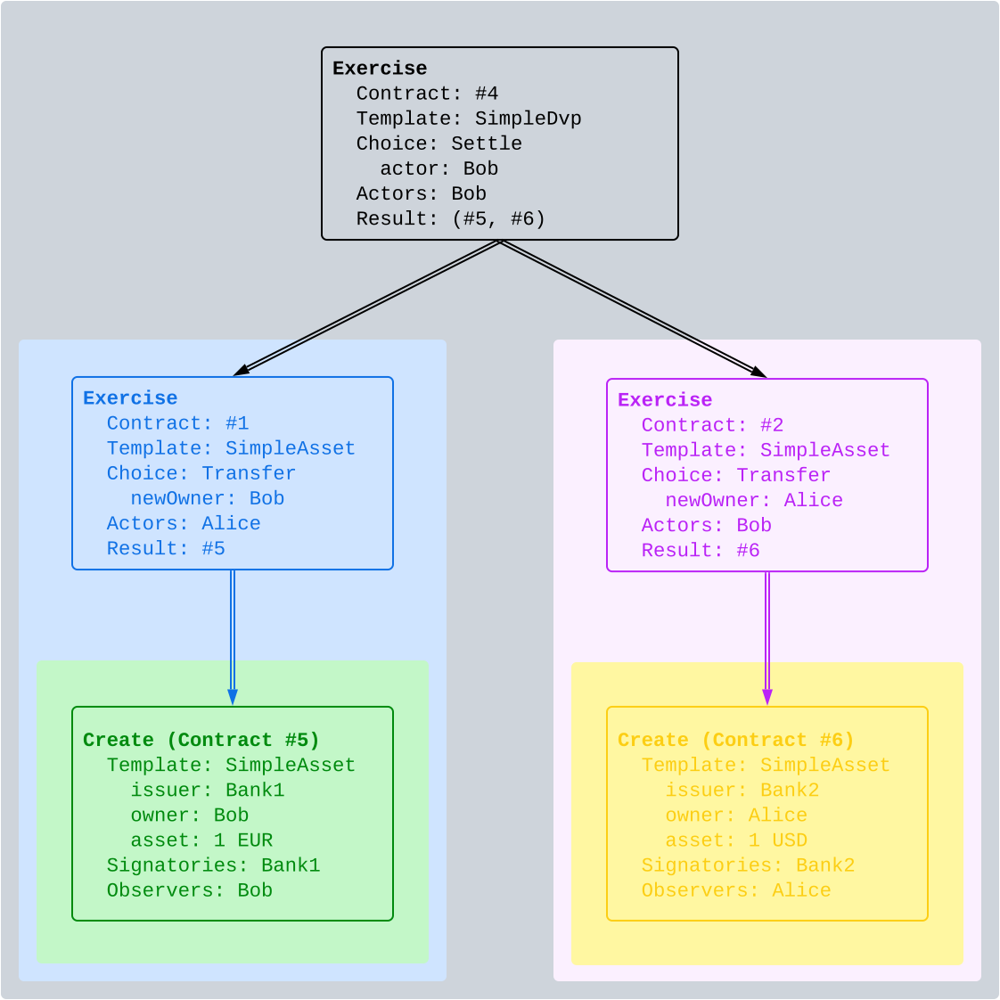
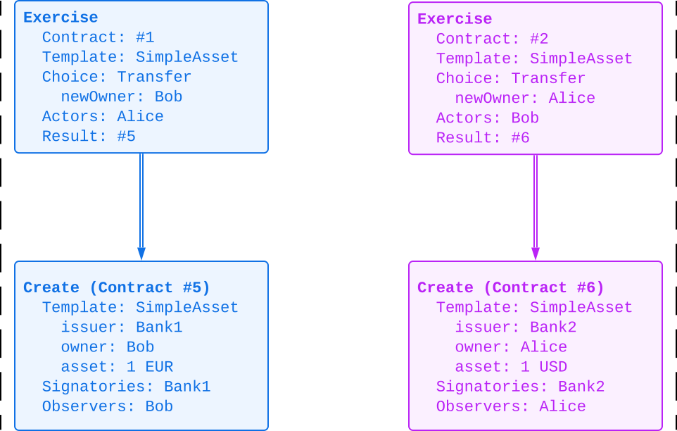

.. Copyright (c) 2023 Digital Asset (Switzerland) GmbH and/or its affiliates. All rights reserved.
.. SPDX-License-Identifier: Apache-2.0

   

   
.. _ledger-structure:

Structure
#########

This section looks at the structure of a ledger and the associated ledger changes.
The definitions presented here are all the ingredients required to *record* the interaction between parties in a Daml ledger.
That is, they address the first question: "what do changes and ledgers look like?".
The basic building blocks of changes are *actions*, which get grouped into *transactions*, *commits*, and the *Ledger*.

Running workflow example
************************

Most of the examples in this section look at the following Daml Script scenarios
based on the templates from the :ref:`running example <da-ledgers-running-example>`.
Two banks first each issue one asset to either Alice or Bob and then Alice proposes a DvP to Bob.
Bob accepts the proposal and settles the DvP,
either in one step via ``AcceptAndSettle`` or in two separate steps with ``Accept`` followed by ``Settle``.

.. literalinclude:: ./daml/SimpleDvP.daml
   :language: daml
   :start-after: SNIPPET-SCRIPT-BEGIN
   :end-before: SNIPPET-SCRIPT-END

.. literalinclude:: ./daml/SimpleDvP.daml
   :language: daml
   :start-after: SNIPPET-ACCEPT_AND_SETTLE-BEGIN
   :end-before: SNIPPET-ACCEPT_AND_SETTLE-END

.. literalinclude:: ./daml/SimpleDvP.daml
   :language: daml
   :start-after: SNIPPET-ACCEPT_THEN_SETTLE-BEGIN
   :end-before: SNIPPET-ACCEPT_THEN_SETTLE-END

.. _actions:

Actions
*******

Hierarchical structure
======================

One of the main features of the Ledger Model is a *hierarchical action structure*.
This structure is illustrated using Bob settling the DvP by exercising the ``Settle`` choice in the above scenario.
Alice and Bob have allocated their assets (contracts #1 and #2) on the ledger to a ``SimpleDvp`` contract (#4).
These contracts appears as inputs in the diagram below.

Exercising the ``Settle`` choice yields an Exercise action that references the ``SimpleDvp`` input contract #4.
This action contains two consequences, which perform the asset transfers automatically as part of the ``Settle`` choice.

#. Alice exercises the ``Transfer`` choice on her ``SimpleAsset`` contract #1, which archives the contract.
   This subaction contains another consequence, namely the creation of Bob's new ``SimpleAsset`` contract #5.
   
#. Bob exercises the ``Transfer`` choice on his ``SimpleAsset`` contract #2.
   As a consequence thereof, Alice's new ``SimpleAsset`` contract #6 is created.

The diagram below depicts this hierarchical structure of actions (in blue):
Every exercise of a choice and create of a contract yields a node in a tree with the consequences as children,
denoted by the dash-dotted arrows.
The nodes refer to input contracts shown in gray, which are not part of the action itself.

.. https://lucid.app/lucidchart/f3f49c7c-d257-4136-9dcb-39750f45c24d/edit
.. image:: ./images/dvp-settle-action.svg
   :alt: The settlement action on the ``SimpleDvp`` contract between Alice and Bob, with the two legs of the swap as consequences.

Overall, the settlement in this example contains two types of actions:

#. Creating contracts

#. Exercising choices on contracts.

These are also the two main kinds of actions in the Ledger Model.

Definition
==========

.. _def-action:

An **action** is one of the following:

#. A **Create** action on a template, which records the creation of the contract.
   A Create action contains the following pieces of information:

   * The **contract ID** is a unique identifier of the contract.
     It is equivalent to the transaction output (TxO) in ledger models based on `unspent transaction outputs (UTxO) <https://en.wikipedia.org/wiki/Unspent_transaction_output>`_.

   * The **template ID** identifies the Daml code associated with the contract,
     and its arguments define the **contract instance**, which is the immutable data associated with the contract ID.

   * The **signatories** are the non-empty set of parties that must authorize the creation and archival of the contract.

   * The **contract observers**, or just observers for short, are the set of parties that will be informed about the contract creation and archival, in addition to the signatories.

   In Daml, the signatories and contract observers are determined by the ``signatory`` and ``observer`` clauses defined by the template.
   
   Create nodes are depicted as shown below.
   Diagrams often omit fields with empty values and observers that are also signatories.

   .. https://lucid.app/lucidchart/31888b88-d836-457d-a4a8-05e3e161e07f/edit
   .. image:: ./images/create-node.svg
      :align: center
      :width: 30%
      :alt: The structure of a **Create** node.
   
#. An **Exercise** action on a contract, which records that one or more parties have exercised a choice on the contract.
   An Exercise action contains the following pieces of information:

   * An exercise **kind**, which is either **consuming** or
     **non-consuming**. Once consumed, a contract cannot be used again;
     for example, Alice must not be able to transfer her asset twice, as this would be double spending.
     In contrast, contracts exercised in a non-consuming fashion can be reused.
      
   * The **contract ID** on which the choice is exercised.
     This contract is called the **input contract**.

   * The **interface ID** if this choice was exercised through a Daml interface.

   * The **template ID** that defines the smart contract code for the choice with the given **choice name**;
     and the **choice arguments** that are passed to the smart contract code.
     
   * An associated set of parties called **actors**.
     These are the parties who perform the action.
     They are specified in the ``controller`` clause in the Daml template.

   * An associated set of **choice observers**.
     These parties will be informed about the choice being exercised.

   * The **exercise result** as the Daml value returned by evaluating the choice body.

   * A list of **consequences**, which are themselves actions. Note that
     the consequences, as well as the kind and the actors, are
     considered a part of the exercise action itself. This nesting of
     actions within other actions through consequences of exercises
     gives rise to the hierarchical structure.
     The exercise action is the **parent action** of its consequences.

   Exercise nodes are depicted as shown below, where the consequences are indicated by arrows ordered left-to-right.
   Diagrams omit the kind if it is consuming, empty field values, and choice observers that are also actors.

   .. https://lucid.app/lucidchart/ce3c7eb2-081e-4ac4-af92-5efc11d21c17/edit
   .. image:: ./images/exercise-node.svg
      :align: center
      :width: 30%
      :alt: The structure of an **Exercise** node.

#. A **Fetch** action on a contract, which demonstrates that the contract exists and is active at the time of fetching.
   A Fetch behaves like a non-consuming exercise with no consequences, and can be repeated.
   The action contains the following pieces of information, analogous to Exercise nodes:
   **contract ID**, **interface ID**, **template ID**, and the **actors**, namely the parties who fetch the contract.

   Fetch actions are depicted as shown below.

   .. https://lucid.app/lucidchart/27844d5e-0cdb-4f22-8f67-e97f3839e613/edit
   .. image:: ./images/fetch-node.svg
      :align: center
      :width: 30%
      :alt: The structure of a **Fetch** node.

An **Exercise** or a **Fetch** action on a contract is said to **use** the contract.
Moreover, a consuming **Exercise** is said to **consume** (or **archive**) its contract.
Finally, the consequences of a **Fetch** or **Create** node are empty.

Examples
========

An example of a Fetch action appears in the ``Accept`` choice on a DvP proposal contract from the template ``ProposeSimpleDvP``.
The choice body fetches the ``SimpleAsset`` that Bob allocates to the DvP,
which checks that the asset contract is active and brings the contract instance into the computation,
so that the choice implementation can assert that this asset meets the expectation expressed in the proposal contract.
The next diagram shows this Exercise action with the Fetch action as its first consequence.

.. https://lucid.app/lucidchart/556f7b43-565f-4b94-b670-719135a77bec/edit
.. image:: ./images/dvp-propose-accept-action.svg
   :align: center
   :width: 100%
   :alt: The accept action on Alice's ``ProposeSimpleDvP`` exercised by Bob.

A non-consuming exercise shows up in the combined ``AcceptAndSettle`` choice on the ``ProposeSimpleDvP`` contract:
This choice is non-consuming so that the ``Accept`` choice exercised in the choice body can consume the proposal contract.
As the next diagram shows, non-consuming exercises yield multiple references to the same input contract #3.
The diagram also shows that fetches have the same effect: input contract #2 is used twice.

.. https://lucid.app/lucidchart/fdcc5894-e013-499e-ba85-de16300381a8/edit
.. image:: ./images/dvp-propose-accept-and-settle-action.svg
   :align: center
   :width: 100%
   :alt: The accept-and-settle action on Alice's ``ProposeSimpleDvP`` exercised by Bob.

Subactions
==========
         
This example again highlights the hierarchical structure of actions:
The ``AcceptAndSettle`` action contains the corresponding actions for ``Accept`` and ``Settle`` as its consequences.

More generally, for an action `act`, its **proper subactions** are all actions in the consequences of
`act`, together with all of their proper subactions.
Additionally, `act` is a (non-proper) **subaction** of itself.

The subaction relation is visualized below for Bob's ``Settle`` exercise by the nesting of the boxes with rounded corners.
Both the blue and purple boxes are proper subactions of Bob's ``Settle`` action shown in grey.
The green box is a proper subaction of the blue and the grey boxes, and the yellow box is a proper subaction of the purple and the grey boxes.

.. https://lucid.app/lucidchart/dbe05602-46b8-4b23-8957-a8e15af912e6/edit

.. _transactions:
         
Transactions
************

A **transaction** is a list of actions that are executed atomically.
Those actions are called the **root actions** of the transaction.
That is, for a transaction `tx = act`:sub:`1`\ `, …, act`:sub:`n`, every `act`:sub:`i` is a **root action**.
For example, if Alice and Charlie have made one DvP proposal each for Bob, then Bob may want to accept both simulataneously.
To that end, Bob exercises both ``Accept`` choices in a single transaction with two root actions (blue and purple), as shown next.

.. https://lucid.app/lucidchart/acb71942-2a11-417c-ae0a-003c8ea2da69/edit

For another example, consequences of an exercise form a transaction.
In the example of the ``Settle`` action on Alice's and Bob's ``SimpleDvP``,
the consequences of the ``Settle`` action form the following transaction,
where actions are ordered left-to-right as before.
The transaction consists of two root actions (blue and purple), namely the two ``Transfer`` actions of the two legs of the DvP.

.. https://lucid.app/lucidchart/b8f2c6d1-654b-4658-adc5-77eb59e27d05/edit

         
The hierarchical structure of actions extends to transactions and yields the notion of subtransactions.
A **proper subtransaction** of a transaction is obtained by (repeatedly) replacing an action by its consequences;
and a **subtransaction** of a transaction is either the transaction itself or a proper subtransaction thereof.

For example, given the transaction shown above consisting only of the two consequences of the ``Settle`` action,
the next diagram shows all its proper non-empty subtransactions, each in its own box.

.. https://lucid.app/lucidchart/c5ff472e-3161-42a0-ac2d-275774a2b9b8/edit
.. image:: ./images/dvp-settle-consequences-subtransactions.svg
   :align: center
   :width: 100%
   :alt: All proper subtransactions of the consequences of the ``Settle`` action.

         
Inputs and outputs
******************

The Ledger Model falls into the category of (extended) UTxO-style ledgers
where the set of unspent transaction outputs (UTxOs) constitutes the current state of a ledger.
Here, the **transaction outputs** are the contract IDs of the contracts created in a transaction.
When a contract is consumed, its contract ID is spent and thus removed from the UTxO set.
The data associated with each UTxO is immutable;
modifications happen by consuming a contract ID and recreating a new contract with a different contract ID.

This Ledger Model extends the UTxO model in two aspects:

* A transaction may use a contract without consuming it, for example by exercising a non-consuming choice or fetching it.
  In such a case, the contract ID remains in the set of UTxOs even though it appears as an input to a transaction.

* Transactions are structured hierarchically and contract IDs created in the transaction may be consumed within the same transaction.
  For example, inside the ``AcceptAndSettle`` action, the created ``SimpleDvP`` in the first consequence is consumed by the second consequence.
  Such contracts are called **transient**.

These aspects are discussed in more detail in the remaining sections of the Ledger Model.

Ledger
******

The transaction structure records the contents of the changes, but not *who requested them*.
This information is added by the notion of a **commit**:
It consists of a single transaction and the one or more parties that requested it.
Those parties called the **requesters** of the commit.
In Daml Script, the requesters correspond to the ``actAs`` parties given to the ``submit`` commands.

Definition **Ledger**:
  A **Ledger** is a directed acyclic graph (DAG) of commits,
  where an edge `(c`:sub:`1`\ `, c`:sub:`2`\ `)` connects a commit `c`:sub:`1` to another commit `c`:sub:`2`
  if and only if the transaction of `c`:sub:`1` uses a contract ID created by the transaction in `c`:sub:`2`.

Definition **top-level action**:
  For a commit, the root actions of its transaction are called the **top-level actions**.
  A top-level action of any ledger commit is also a top-level action of the ledger.

A Canton Ledger thus represents the full history of all actions taken by parties.
The graph structure of the Ledger induces an *order* on the commits in the ledger.
Visually, a ledger can be represented as a sequence growing from left to right as time progresses.
Below, dashed vertical lines in purple mark the boundaries of commits,
and each commit is annotated with its requester(s).
Blue arrows link each exercise and fetch actions to the create action of the input contract.
These arrows highlight that the ledger forms a **transaction graph**.

For example, the following Daml Script encodes the whole workflow of the running DvP example.

.. literalinclude:: ./daml/SimpleDvP.daml
   :language: daml
   :start-after: SNIPPET-SCRIPT-BEGIN
   :end-before: SNIPPET-SCRIPT-END

This workflow gives rise to the ledger shown below with four commits:

* In the first commit, Bank 1 requests the creation of the ``SimpleAsset`` of ``1 EUR`` issued to Alice (contract #1).
  
* In the second commit, Bank 2 requests the creation of the ``SimpleAsset`` of ``1 USD`` issued to Bob (contract #2).

* In the thrid commit, Alice requests the creation of the ``SimpleDvpPoposal`` (contract #3).

* In the forth commit, Bob requests to exercise the ``AcceptAndSettle`` choice on the DvP proposal.

.. https://lucid.app/lucidchart/3ef6e9da-b534-4640-bc19-8fa5c7fb3a71/edit

.. note::
   The Ledger does not impose an order between independent commits.
   In this example, there are no edges among the first three commits,
   so they could be presented in any order.

   As the Ledger is a DAG, one can always extend the order into a linear sequence via a topological sort.
   For the next sections, we pretend that the Ledger is totally ordered (unless otherwise specified).
   We discuss the more general partial orders in the causality section.

.. todo::
   Link to causality section

