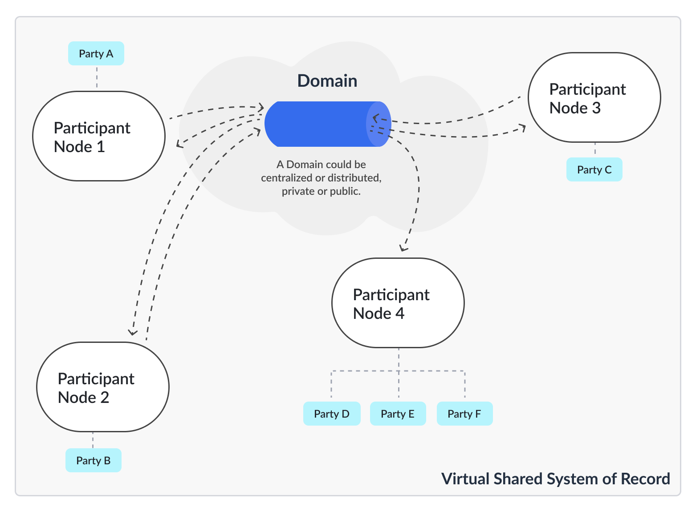

.. Copyright (c) 2023 Digital Asset (Switzerland) GmbH and/or its affiliates. All rights reserved.
.. SPDX-License-Identifier: Apache-2.0

.. _overview-multiparty-applications-intro:

Multi-party applications
========================

Multi-party applications, and multi-party application networks such as the Canton Network, solve problems in a way that was impossible with the technologies and architectures that came before. Successfully building multi-party applications requires learning a few new concepts, including architectural principles and patterns. This document explains:

- why multi-party applications matter

- what a multi-party application is

- important concepts in multi-party applications

- key architectural concepts in Daml

- a transfer example using Daml

Why do multi-party applications matter?
---------------------------------------

Have you ever wondered why bank transfers, stock purchases or healthcare claims take days to process? Given our technological advances, including the speed of networks, you might expect these transactions to take less than a second to complete. A protocol like email takes only a few seconds to send and receive, while these important business workflows take days or weeks.

What delays these transactions? The processes in question all involve multiple organizations that each keep their own records, resulting in data silos. The processes to ensure consistency between those data silos are complex and slow. When inconsistencies arise, the correction processes (sometimes referred to as reconciliation) are expensive, time-consuming and often require human intervention to determine why two parties have differing views of the result of a business interaction. There are a myriad of reasons for these discrepancies, including differences in data models and error handling logic, inconsistent business process implementations and system faults.

Here's a deeper look at the problem via the example of a transfer of $100 from Alice's account in Bank A to Bob's account in Bank B. (Money is an easily understood example of an asset transferred between parties. The same problems occur in other industries with other assets, for example, healthcare claims, invoices, or orders.) Money cannot simply appear or disappear during a transfer. The banks need to ensure that at some point in time, `t`:sub:`0`, $100 are in Alice's account, and at the next point in time, `t`:sub:`1`, those $100 are gone from Alice's account and present in Bob's account – but at no point are the $100 present in both accounts or in neither account.

In legacy systems, each bank keeps track of cash holdings independently of the other banks. Each bank stores data in its own private database. Each bank performs its own processes to validate, secure, modify, and regulate the workflows that transfer money. The coordination between multiple banks is highly complex. The banks have an obligation to limit their counterparty risk - the probability that the other party in the transaction may not fulfill its part of the deal and may default on the contractual obligations.

Today's common, albeit highly inefficient and costly, solution for a bank account transfer involves the following steps:

#. Bank A sends a message to Bank B via a messaging standard and provider like SWIFT or SEPA.
#. Bank A and Bank B determine a settlement plan, possibly including several intermediaries. Gaining an agreement on the settlement plan is time-consuming and often incurs additional fees.
#. The settlement process entails (i) debiting $100 from Alice's account at Bank A, (ii) crediting the commercial account at Bank B, and (iii) once Bank B has the money, crediting Bob's account at Bank B.

In order to make this process atomic (that is, to make it take place between a point `t`:sub:`0` and a point `t`:sub:`1`) banks discretize time into business days. On day `t`:sub:`0` the instruction is made and a settlement plan is created. Outside of business hours between day `t`:sub:`0` and day `t`:sub:`1`, the plan is executed through end of day netting and settlement processes. In a sense, banks agree to stop time outside of business hours.

If intermediaries are involved, the process is more complex. Cross-border payments or currency conversion add yet more complexity. The resulting process is costly and takes days. During this multi-day process the $100 is locked within the system where it is useless to both Alice and Bob. Delays are common, and if there are problems reconciliation is hugely expensive. Consolidating through centralized intermediaries introduces systemic risk, including the risk of unauthorized disclosure and privacy breaches - and with that risk comes increased latency. Banks insist on this approach, despite the downsides, to reduce counterparty risk and to comply with regulations. At every point in time, ownership of the money is completely clear. (To learn more about cash transfers in traditional banking systems, read `this accessible writeup on international money transfers <https://web.archive.org/web/20220731223958/https://medium.com/@yudapramad/how-international-money-transfers-actually-work-bac65f075bb5>`_.)

Services like PayPal, Klarna, and credit cards, which provide an experience of instant payments internationally, do this by accepting the counterparty risk or acting as banks themselves. If a shop accepts credit cards and you pay with a credit card, both you and the shop have an account with the credit card company. When you purchase, the credit card company can instantly debit $100 from your account and credit $100 to the shop's account because it is as if both Alice and Bob are using accounts at the same bank – the bank is certain that Alice has $100 in her account and can execute a simple transaction that deducts $100 from Alice's account and adds $100 to Bob's.

Wouldn't it be great if a system existed that allowed multiple parties to transact with each other with the same immediacy and consistency guarantees a single organization can achieve on a database while each kept sovereignty and privacy of their data? That's Canton!

Canton is a system for real-time multi-party systems, enabling organizations to deliver the experiences modern users expect without assuming counterparty risk or the expense of reconciliation. The sections below describe how Canton achieves this, including the architectural concepts and considerations necessary to build and deploy a solution with Canton effectively.

What is a multi-party application?
----------------------------------

A multi-party application is one in which data, and the rules and workflows that govern the data, are shared between two or more parties without any party having to give up sovereignty or any single party (including the application provider) being able to control or override the agreed rules of the system. A party could be a company, a department within a company, an organization, an individual or a person. The specific definition of a party will be unique to the application and the domain of that application.

A well-designed multi-party application provides several benefits:

- a clean, consistent view of all data managed by the application across all parties

- consistent, connected, and efficient processes between all parties involved in the application

- privacy controls over portions of the shared data, such that each party sees only the data that it is explicitly entitled to view and/or modify

- individual party ownership of and responsibility for sensitive data

In most cases, no single party can view all of the data within a multi-party application.

Multi-party applications solve complex operational processes while keeping data clean and consistent, thereby eliminating isolated, disconnected and inefficient processes that often require expensive reconciliation. Multi-party applications manage the relationships, agreements, and transactions between parties, providing consistent real-time views of all data.

Multi-party solutions normally utilize distributed ledger (blockchain) technology to ensure each party has an immutable, consistent view of the shared data and business processes that govern the data. By providing a consistent view of data with all counterparties, a multi-party application removes friction, cost, and risk within a joint business process. A distributed ledger protects against a malicious actor in the network, attempting to write or overwrite data to the detriment of other parties.

Important concepts in multi-party applications
----------------------------------------------

For a multi-party application to fully deliver its value, the following conditions must be met:

- Multiple involved parties have data sovereignty – that is, they keep their data within their own systems and require strong guarantees that no external party can access or modify that data outside of pre-agreed rules.

- Shared state and rules are codified into an executable schema that determines what data can move between parties, who can read that data, and how that data is manipulated.

- Processes happen in real time as there is no additional reconciliation or manual processing required between organizations.

For each individual party to gain the full benefits of a multi-party system, it should:

- Integrate the application - Bank A must treat the multi-party infrastructure as the golden source of truth for payment information and integrate it as such with the rest of their infrastructure. Otherwise they are merely trading inter-bank reconciliation for intra-bank reconciliation.

- Utilize composability by building advanced systems that rely on the base-level multi-party agreements. For example, a healthcare claim application should be built using the payment solution. Integrating one multi-party application with another preserves all the properties of each across both applications. In this example, the patient privacy requirements of a health claims application are retained, as are the financial guarantees of the payment application. Without composability, multi-party applications become bigger silos and you end up reconciling the healthcare claims multi-party application with the payments multi-party application.

Smart contracts, distributed ledgers, and blockchains are commonly used to build and deliver multi-party applications. A smart contract codifies the terms of the agreement between parties, including the rights and obligations of each party, directly written into lines of code. The code controls the execution, and transactions are trackable and final. In a multi-party application, the smart contract defines the data workflow through actions taken by the parties involved.

Distributed ledgers and blockchains provide consensus between the parties, with a cryptographic audit trail maintained and validated by the system. Within multi-party solutions, the distributed ledger ensures no one party can unilaterally change the system's state and protects data sovereignty, while the distributed ledger synchronizes the nodes securely in real time.

Important requirements for real-world multi-party infrastructure
----------------------------------------------------------------

Businesses operate in a complex environment with strong expectations imposed due to legal, regulatory and competitive
requirements. At the same time, businesses run millions of transactions in parallel across the globe. Therefore, a
multi-party infrastructure that support real-world multi-party applications must be able to address a number of key requirements
simultaneously:

- **Data sovereignty**: Each party must retain control over its own data, ensuring that no other party can access or modify it without
  explicit permission.

- **Privacy**: The system must be built around the principle of **data minimization** to ensure that parties can only see the data they are entitled to view, even when multiple parties are involved in a transaction.

- **Horizontal Scalability**: The system must be able to globally scale with any number of parties, transactions, and applications.

- **Composability**: The system must allow for the composition of multiple applications and workflows, enabling complex business
  processes to be built on top of each other

- **Interconnectivity**: Each party must retain control over its connectivity and be able to operate independently, without delegating
  to a central authority or an anonymous group of operators.

- **Security**: The system must provide strong security guarantees to protect against malicious actors and unauthorized access.

The distributed ledger Canton has been built to meet these requirements, creating a network of multi-party applications and infrastructure, called the *Canton Network*.

Key architectural concepts in the Canton Network
------------------------------------------------

There are two layers necessary for building multi-party applications: expressing the data and update rules
using the Daml smart contract language and synchronizing the ledger state using the Canton protocol.

The Daml language is a smart contract language for multi-party applications. Conceptually, Daml is similar to the Structured Query Language (SQL) used in traditional database systems, describing the data schema and rules for manipulating the data.

The Daml language:

- defines the shared state between the parties, including process permissions and data ownership

- defines workflows, execution policies, and read/write permissions

- enables developers to build rich transactions that codify strict business rules

- defines the APIs through which multi-party applications can talk to each other and compose

The Daml code that collectively makes up the data schema and rules for an application is called a Daml model. Increasingly sophisticated and valuable solutions are composed from existing Daml models, enabling a rich ecosystem that accelerates application development.

Using the Daml language, developers define the schema for a shared ledger. The Canton protocol ensures that each party gets a unique view into the shared ledger, which is their projection of the full system.

In the execution model for Canton, each party of the application is hosted on a Validator Node (as shown in the diagram below). The Validator Node stores the party's unique projection and history of the shared system of record. Validator Nodes synchronize by running the Canton Protocol for consensus between them. The protocol is executed by sending encrypted messages through synchronizers which route messages and offer guaranteed delivery and order consistency. Synchronizers are also units of access control and availability, meaning an application can be additionally protected from interference by other applications or malicious actors by synchronizing it only through a given synchronizers, and restricting which validators can connect to it.

.. todo:: replace this with a new and update image, adding the source link to it

d, public or private.

Transfer example in the Canton Network
--------------------------------------

Consider the transfer example described above with Alice and Bob. Using Daml, the process looks like this:

#. Alice logs into her online banking at Bank A and enters a transfer to Bob at Bank B.
#. The online banking backend creates a transaction that deducts $100 from Alice's account and creates a transfer to Bob at Bank B.
#. When Bank B accepts the transfer, Bank A credits $100 to Bank B's account at Bank A and Bank B simultaneously credits Bob's account by $100.
#. Bob's online banking interfaces with the Canton Ledger and can see the incoming funds in real time.

At every point, ownership of the $100 is completely clear and all systems are fully consistent. As the data records
in both banks are updated simultaneously, the process can happen in real time, without any delays or reconciliation.

