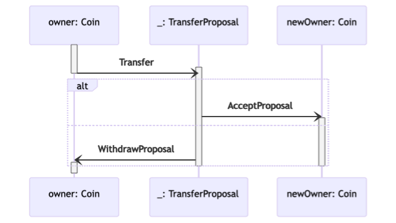
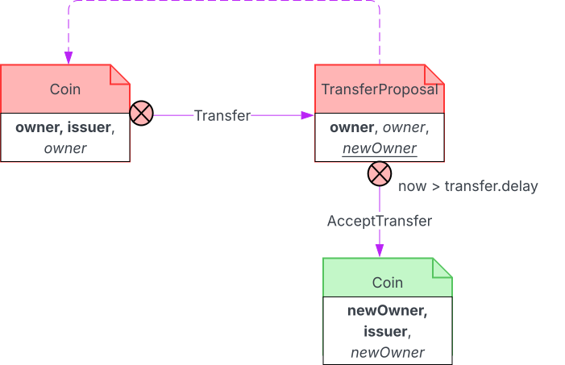

.. Copyright (c) 2023 Digital Asset (Switzerland) GmbH and/or its affiliates. All rights reserved.
.. SPDX-License-Identifier: Apache-2.0

.. _implementing-time-constraints:

How To Implement Time Constraints
#################################

The next subsections demonstrate how the following Coin and TransferProposal contracts can be modified to use
different types of ledger time constraints to control when parties are allowed to perform ledger writes.

Coin contract

.. literalinclude:: ./daml/SimpleCoinTransfer.daml
    :language: daml
    :start-after: -- BEGIN_SIMPLE_COIN_TEMPLATE
    :end-before: -- END_SIMPLE_COIN_TEMPLATE

.. literalinclude:: ./daml/SimpleCoinTransfer.daml
    :language: daml
    :start-after: -- BEGIN_SIMPLE_COIN_TRANSFER
    :end-before: -- END_SIMPLE_COIN_TRANSFER

TransferProposal contract

.. literalinclude:: ./daml/SimpleCoinTransfer.daml
    :language: daml
    :start-after: -- BEGIN_PROPOSAL_TEMPLATE
    :end-before: -- END_PROPOSAL_TEMPLATE

.. literalinclude:: ./daml/SimpleCoinTransfer.daml
    :language: daml
    :start-after: -- BEGIN_SIMPLE_COIN_ACCEPT_TRANSFER
    :end-before: -- END_SIMPLE_COIN_ACCEPT_TRANSFER

.. literalinclude:: ./daml/SimpleCoinTransfer.daml
    :language: daml
    :start-after: -- BEGIN_SIMPLE_COIN_REJECT_TRANSFER
    :end-before: -- END_SIMPLE_COIN_REJECT_TRANSFER

.. https://lucid.app/lucidchart/f4495d3a-c1ad-423d-806d-24fb312347df/edit

   Simple coin transfer with consent withdrawal

How to check that a deadline is valid
*************************************

This design pattern demonstrates how to limit choices so that they must occur by a given deadline.

Motivation
^^^^^^^^^^

When parties need to perform ledger writes by a given deadline.

Implementation
^^^^^^^^^^^^^^

Transfer proposals can be accepted at any point in time. To restrict this behaviour so that acceptance must occur by a
fixed time, a guard for AcceptTransfer choice execution can be added.

TransferProposal contract
    In the TransferProposal contract, the body of the AcceptTransfer choice is modified to assert that the contract deadline is valid.

    .. literalinclude:: ./daml/LimitedTimeCoinTransfer.daml
      :language: daml
      :start-after: -- BEGIN_LIMITED_TIME_ACCEPT_COIN_TRANSFER
      :end-before: -- END_LIMITED_TIME_ACCEPT_COIN_TRANSFER

As transfer proposals are created when a Transfer choice is executed, the time by which an AcceptTransfer can be executed
needs to be passed in as a choice parameter.

Coin contract
    In the Coin contract, the Transfer choice has an additional deadline argument, so that TransferProposal contracts can
    be given a fixed lifetime.

    .. literalinclude:: ./daml/LimitedTimeCoinTransfer.daml
      :language: daml
      :start-after: -- BEGIN_LIMITED_TIME_COIN_TRANSFER
      :end-before: -- END_LIMITED_TIME_COIN_TRANSFER

.. https://lucid.app/lucidchart/b203182f-5b3f-4162-976a-6d1ba8101acf/edit

.. figure:: ./images/timeLimitedCoinTransfer.svg
   :align: center
   :width: 100%

   Time limited coin ownership transfer

How to check that a deadline has passed
***************************************

This design pattern demonstrates how to ensure choices only occur after a given deadline.

Motivation
^^^^^^^^^^

When parties need to perform ledger writes after a fixed time delay.

Implementation
^^^^^^^^^^^^^^

Transfer proposals can be accepted at any point in time. To restrict this behaviour so that acceptance can only occur
after a fixed delay, a guard for AcceptTransfer choice execution can be added.

TransferProposal contract
    In the TransferProposal contract, the body of the AcceptTransfer choice is modified to assert that the contract deadline has been exceeded or passed.

    .. literalinclude:: ./daml/DelayedCoinTransfer.daml
      :language: daml
      :start-after: -- BEGIN_DELAYED_ACCEPT_COIN_TRANSFER
      :end-before: -- END_DELAYED_ACCEPT_COIN_TRANSFER

As transfer proposals are created when a Transfer choice is executed, the delay time after which an AcceptTransfer can be executed
needs to be passed in as a choice parameter.

Coin contract
    In the Coin contract, the Transfer choice has an additional deadline argument, so that TransferProposal contracts can
    be given a delay.

    .. literalinclude:: ./daml/DelayedCoinTransfer.daml
      :language: daml
      :start-after: -- BEGIN_DELAYED_COIN_TRANSFER
      :end-before: -- END_DELAYED_COIN_TRANSFER

.. https://lucid.app/lucidchart/3acf1391-b25b-420c-8ea3-627e9d276528/edit

   Delayed coin ownership transfer

Grant time-limited writes to parties
************************************

This design pattern demonstrates how to grant time-limited writes to parties.

Motivation
^^^^^^^^^^

When parties need to be able to perform ledger writes, but writes need to only be granted for a specific time window.

Implementation
^^^^^^^^^^^^^^

Transfer proposals can be accepted at any point in time. To restrict this behaviour so that acceptance can only occur
within a given time window, a guard for AcceptTransfer choice execution can be added.

TransferProposal contract
    In the TransferProposal contract, the body of the AcceptTransfer choice is modified to assert that the contract deadline has been exceeded or passed.

    .. literalinclude:: ./daml/CoinWithTransferWindow.daml
      :language: daml
      :start-after: -- BEGIN_ACCEPT_COIN_TRANSFER_WINDOW
      :end-before: -- END_ACCEPT_COIN_TRANSFER_WINDOW

As transfer proposals are created when a Transfer choice is executed, the interval start and end times, during which
an AcceptTransfer can be executed need to be passed in as choice parameters.

Coin contract
    In the Coin contract, the Transfer choice has an additional deadline argument, so that TransferProposal contracts can
    be given a delay.

    .. literalinclude:: ./daml/CoinWithTransferWindow.daml
      :language: daml
      :start-after: -- BEGIN_COIN_TRANSFER_WINDOW
      :end-before: -- END_COIN_TRANSFER_WINDOW

.. https://lucid.app/lucidchart/29366bd1-a8aa-4aa3-bf09-e7a6f2de0163/edit

   Time limited coin ownership transfer

Where to use getTime
********************

For workflows that prepare transactions and submit them at a latter date, care needs to be taken when using calls to getTime.a

If the prepare and submission times are expected to be more than one minute apart, then using getTime should be avoided.

Using getTime causes the current ledger (prepare) time to get recorded against the transaction (as workflow evaluation
is now dependent on the ledger time returned by calls to getTime). This in turn constrains how the sequencer may reorder
transactions. As global synchronizers are configured such that the prepare to persist time must be bounded by 1 minute,
this restricts the workflows that may use getTime.
