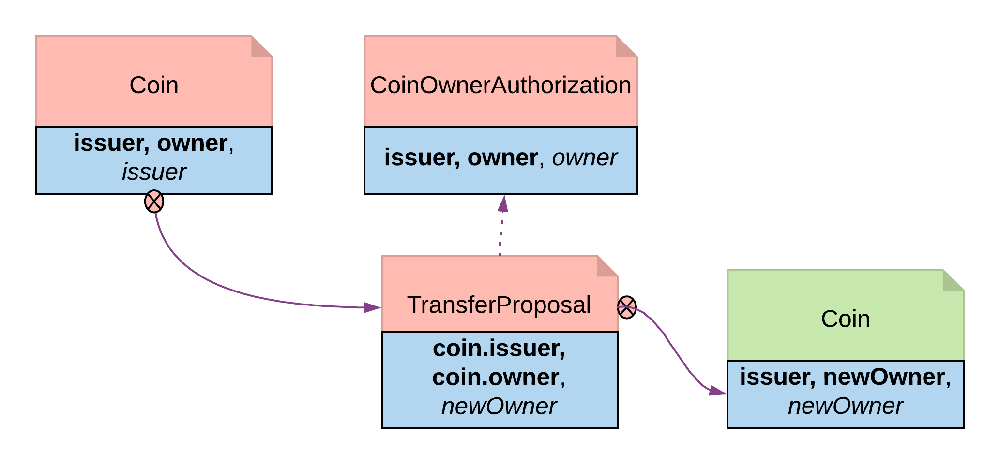

.. Copyright (c) 2023 Digital Asset (Switzerland) GmbH and/or its affiliates. All rights reserved.
.. SPDX-License-Identifier: Apache-2.0

The Authorization Pattern
#########################

The Authorization pattern demonstrates how to make sure a controlling party is authorized before they take certain actions.

Motivation
**********

Authorization is an universal concept in the business world as access to most business resources is a privilege, and not given freely. For example, security trading may seem to be a plain bilateral agreement between the two trading counterparties, but this could not be further from truth. To be able to trade, the trading parties need go through a series of authorization processes and gain permission from a list of service providers such as exchanges, market data streaming services, clearing houses and security registrars etc.

The Authorization pattern shows how to model these authorization checks prior to a business transaction.

Authorization
*************

Here is an implementation of a *Coin transfer* without any authorization:

.. literalinclude:: daml/CoinIssuance.daml
  :language: daml
  :start-after: -- BEGIN_COIN_TEMPLATE_DATATYPE
  :end-before: -- END_COIN_TEMPLATE_DATATYPE

.. literalinclude:: daml/CoinIssuance.daml
  :language: daml
  :start-after: -- BEGIN_COIN_TEMPLATE_TRANSFER
  :end-before: -- END_COIN_TEMPLATE_TRANSFER

This is may be insufficient since the issuer has no means to ensure the newOwner is an accredited company. The following changes fix this deficiency.

Authorization contract
    The below shows an authorization contract *CoinOwnerAuthorization*. In this example, the issuer is the only signatory so it can be easily created on the ledger. Owner is an observer on the contract to ensure they can see and use the authorization.

    .. literalinclude:: daml/CoinTransferWithAuthorization.daml
        :language: daml
        :start-after: -- BEGIN_COIN_OWNER_AUTH_TEMPLATE
        :end-before: -- END_COIN_OWNER_AUTH_TEMPLATE

    Authorization contracts can have much more advanced business logic, but in its simplest form, *CoinOwnerAuthorization* serves its main purpose, which is to prove the owner is a warranted coin owner.

TransferProposal contract
    In the TransferProposal contract, the Accept choice checks that newOwner has proper authorization. A *CoinOwnerAuthorization* for the new owner has to be supplied and is checked by the two assert statements in the choice before a coin can be transferred.

    .. literalinclude:: daml/CoinTransferWithAuthorization.daml
        :language: daml
        :start-after: -- BEGIN_ACCEPT_COIN_TRANSFER
        :end-before: -- END_ACCEPT_COIN_TRANSFER

   Authorization Diagram

