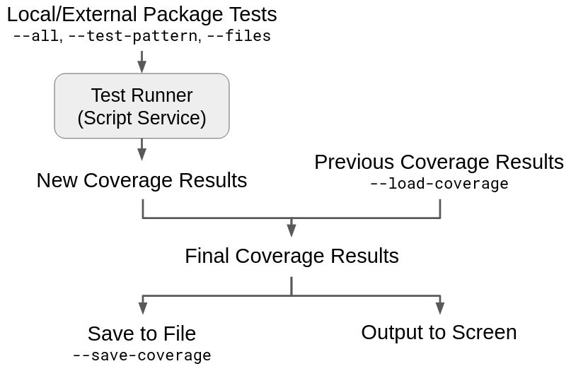

.. Copyright (c) 2023 Digital Asset (Switzerland) GmbH and/or its affiliates. All rights reserved.
.. SPDX-License-Identifier: Apache-2.0

Test Daml contracts
===================

This chapter is all about testing and debugging the Daml contracts you've built using the tools from earlier chapters. You've already met Daml Script as a way of testing your code inside the IDE. In this chapter you'll learn about more ways to test with Daml Script and its other uses, as well as other tools you can use for testing and debugging. You'll also learn about a few error cases that are most likely to crop up only in actual distributed testing, and which need some care to avoid. Specifically we will cover:

- Daml test tooling - Daml Script
- The choice coverage
- The ``trace`` and ``debug`` functions
- Contention

Note that this section only covers testing your Daml contracts. For more holistic application testing, please refer to :brokenref:`/getting-started/testing`.

If you no longer have your projects set up, load all the code for this parts 1 and 2 of this section into two folders ``intro12-part1`` and ``intro12-part2``, by running ``daml new intro12-part1 --template daml-intro-12-part1`` and ``daml new intro12-part2 --template daml-intro-12-part2``.

Daml test tooling
-----------------

There are three primary tools available in the SDK to test and interact with Daml contracts. It is highly recommended to explore the respective docs. The :doc:`dependencies` model lends itself well to being tested using these tools.

:ref:`daml-script`

   :ref:`daml-script` should be familiar by now. It's a way to script commands and queries from multiple parties against a Daml Ledger. Unless you've browsed other sections of the documentation already, you have probably used it mostly in the IDE. However, Daml Script can do much more than that. It has four different modes of operation:

   1. Run on a special script service in the IDE, providing the script views.
   2. Run the script service via the Daml assistant, which is useful for quick regression testing.
   3. Start a sandbox and run against that for regression testing against an actual Ledger API.
   4. Run against any other already running ledger.

Debug, trace, and stacktraces
-----------------------------

The above demonstrates nicely how to test the happy path, but what if a function doesn't behave as you expected? Daml has two functions that allow you to do fine-grained printf debugging: ``debug`` and ``trace``. Both allow you to print something to StdOut if the code is reached. The difference between ``debug`` and ``trace`` is similar to the relationship between ``abort`` and ``error``:

- ``debug : Text -> m ()`` maps a text to an Action that has the side-effect of printing to StdOut.
- ``trace : Text -> a -> a`` prints to StdOut when the expression is evaluated.

.. code-block:: none

  daml> let a : Script () = debug "foo"
  daml> let b : Script () = trace "bar" (debug "baz")
  [Daml.Script:378]: "bar"
  daml> a
  [DA.Internal.Prelude:532]: "foo"
  daml> b
  [DA.Internal.Prelude:532]: "baz"
  daml>

If in doubt, use ``debug``. It's the easier of the two to interpret the results of.

The thing in the square brackets is the last location. It'll tell you the Daml file and line number that triggered the printing, but often no more than that because full stacktraces could violate subtransaction privacy quite easily. If you want to enable stacktraces for some purely functional code in your modules, you can use the machinery in :ref:`module-da-stack-24914` to do so, but we won't cover that any further here.

Check coverage
-----------------

When ``daml test`` runs a set of tests, it analyzes the ledger record from those tests to report template and choice coverage. It calculates what percentage of templates defined in the package were created and what percentage of choices defined in the package were exercised.

You can also save the resulting coverage results for the test set to a file and then read them back into a future report. In an invocation of ``daml test``, you can both read results in and run tests simultaneously in order to generate a final report which aggregates them. More details on the workflows that this enables are detailed in :ref:`save-results-workflows`.

Flags controlling test set
~~~~~~~~~~~~~~~~~~~~~~~~~~

You can control the set of tests run by ``daml test`` using ``--test-pattern PATTERN``, ``--files FILE``, and ``--all``.

* Passing ``--test-pattern <PATTERN>`` runs only the local tests which match ``PATTERN``.
* Passing ``--files <FILE>`` runs only the tests found in ``FILE``.
* Enabling ``--all`` runs tests in dependency modules as well. Note: all external tests are run, regardless of the setting in ``test-pattern``; ``test-pattern`` only restricts local tests.

Flags controlling serialization
~~~~~~~~~~~~~~~~~~~~~~~~~~~~~~~

You can save the final coverage results of a ``daml test`` invocation using ``--save-coverage FILE``. This writes the list of templates and choices in scope, along with the list of templates created and choices exercised.

You can read in previous coverage results using ``--load-coverage FILE``. This flag can be set multiple times, in which case the results from each file will be read and aggregated into the final result.

There may be occasions where you only need to aggregate coverage results from files, without running any tests. To do that, use the ``--load-coverage-only`` flag, which ensures that no tests are run.

Flags controlling report
~~~~~~~~~~~~~~~~~~~~~~~~

Enabling ``--show-coverage`` tells the final printed report to include the names of any templates, choices, and interfaces which are not covered. By default, the report only reports the percentage of coverage.

You can remove choices from the rendered coverage report with ``--coverage-ignore-choice PATTERN``. This flag's behavior is further documented in :ref:`exclude-choices`.

Define templates, choices, and interfaces
~~~~~~~~~~~~~~~~~~~~~~~~~~~~~~~~~~~~~~~~~

To demonstrate how the coverage report works, we start by defining three dummy templates, ``T1``, ``T2``, and ``T3``. Each template has two dummy choices:

.. literalinclude:: daml/daml-intro-12-part1/daml/Token_Coverage_Part1.daml
  :language: daml
  :start-after: -- TEMPLATE_DEFINITIONS_START
  :end-before: -- TEMPLATE_DEFINITIONS_END

We also define an interface ``I`` with instances for ``T1`` and ``T2``:

.. literalinclude:: daml/daml-intro-12-part1/daml/Token_Coverage_Part1.daml
  :language: daml
  :start-after: -- INTERFACE_DEFINITIONS_START
  :end-before: -- INTERFACE_DEFINITIONS_END

Start testing
~~~~~~~~~~~~~

By writing a test which selectively creates and exercises only some of these templates and choices, we will see how the coverage report shows us templates and choices we haven't created and exercised respectively.

To start, the test allocates a single party, ``alice``, which we will use for the whole test:

.. literalinclude:: daml/daml-intro-12-part1/daml/Token_Coverage_Part1.daml
  :language: daml
  :start-after: -- ALLOCATE_PARTY_START
  :end-before: -- ALLOCATE_PARTY_END

Template creation coverage
~~~~~~~~~~~~~~~~~~~~~~~~~~

The coverage report mentions which templates were defined but never created. For example, the following test creates contracts out of only ``T1`` and ``T2``, never creating instances of template ``T3``:

.. literalinclude:: daml/daml-intro-12-part1/daml/Token_Coverage_Part1.daml
  :language: daml
  :start-after: -- CREATE_TEMPLATES_START
  :end-before: -- CREATE_TEMPLATES_END

Running ``daml test --show-coverage`` reports how many templates were defined (3), how many were created (2, 66.7%), and the names of those that weren't created (``T3``):

.. code-block::

  > daml test --show-coverage
  ...
  Modules internal to this package:
  - Internal templates
    3 defined
    2 ( 66.7%) created
    internal templates never created: 1
      Token_Coverage_Part1:T3
  ...

.. _Template choice exercise coverage:

Template choice exercise coverage
~~~~~~~~~~~~~~~~~~~~~~~~~~~~~~~~~

The coverage report also tracks which choices were exercised. For example, the following test exercises the first and second choices of ``T1``, and the second choice of ``T2``. It also archives ``T1``, but not ``T2``.

.. literalinclude:: daml/daml-intro-12-part1/daml/Token_Coverage_Part1.daml
  :language: daml
  :start-after: -- EXERCISE_TEMPLATES_START
  :end-before: -- EXERCISE_TEMPLATES_END

``daml test --show-coverage`` reports that the test exercised 4 out of 9 choices, and lists the choices that weren't exercised, including the second choice of ``T2`` and all the choices on ``T3``.

Note that ``Token_Coverage_Part1:T2:Archive`` is included in the list of unexercised choices - because ``t2`` was not archived, its ``Archive`` choice was not run.

.. code-block::

  > daml test --show-coverage
  ...
  - Internal template choices
  9 defined
  4 ( 44.4%) exercised
  internal template choices never exercised: 5
    Token_Coverage_Part1:T2:Archive
    Token_Coverage_Part1:T2:C_T2_2
    Token_Coverage_Part1:T3:Archive
    Token_Coverage_Part1:T3:C_T3_1
    Token_Coverage_Part1:T3:C_T3_2
  ...

Interface choice exercise coverage
~~~~~~~~~~~~~~~~~~~~~~~~~~~~~~~~~~

The coverage report also tracks interfaces, with two differences:
* Because interfaces are not created directly but rather cast from templates which implement them, the coverage report cannot not track their creation nor their archival.
* Because interfaces can be cast from many possible implementing templates, the report tracks interface choices by what interface they are exercised on and which template they were cast from. In the report, these interface choices are formatted as ``<module>:<template>:<choice_name>`` - the ``<choice_name>`` tells us the interface, the ``<template>`` tells us the template type an interface contract was cast from.

The following test creates ``t1`` and ``t2`` as before, but casts them immediately to ``I`` to get two contracts of ``I``: ``t1_i`` via ``T1``, and ``t2_i`` via ``T2``. It exercises both choices on the ``t1_i``, but only the first choice on ``t2_i``.

.. literalinclude:: daml/daml-intro-12-part1/daml/Token_Coverage_Part1.daml
  :language: daml
  :start-after: -- EXERCISE_INTERFACES_START
  :end-before: -- EXERCISE_INTERFACES_END

In the coverage report, there are four detected choices, as expected: two choices for the implementation of ``I`` for ``T1``, and two choices for the implementation of ``I`` for ``T2``. Three were exercised, so the only choice that wasn't exercised was ``C_I_1`` for ``T2``, which is reported as ``Token_Coverage_Part1:T2:C_I_1``.

.. code-block::

  > daml test --show-coverage
  ...
  - Internal interface choices
    4 defined
    3 ( 75.0%) exercised
    internal interface choices never exercised: 1
      Token_Coverage_Part1:T2:C_I_2
  ...

Check coverage of external dependencies
------------------------------------------

The coverage report also describes coverage for external templates, interfaces, and choices. In the ``intro12-part1`` directory, run ``daml build --output intro12-part1.dar``, and copy the resulting ``./intro12-part1.dar`` file into the ``intro12-part2`` directory, where the remainder of our commands will be run.

The ``daml.yaml`` configuration file in part2 specifies ``intro12-part1.dar`` as a dependency, letting us import its module.

Definitions
~~~~~~~~~~~

We begin by defining importing the external dependency ``Token_Coverage_Part1`` as ``External`` to bring all of its external templates and interfaces into scope.

.. literalinclude:: daml/daml-intro-12-part2/daml/Token_Coverage_Part2.daml
  :language: daml
  :start-after: -- IMPORT_EXTERNAL_BEGIN
  :end-before: -- IMPORT_EXTERNAL_END

We also define a dummy template ``T`` with no choices, but an implementation of external interface ``External.I``.

.. literalinclude:: daml/daml-intro-12-part2/daml/Token_Coverage_Part2.daml
  :language: daml
  :start-after: -- DEFINE_INTERNAL_TEMPLATE_BEGIN
  :end-before: -- DEFINE_INTERNAL_TEMPLATE_END

Finally, we define an interface ``I`` with one dummy choice, and implementations for our local template ``T`` and the external template ``External.T1``.

.. literalinclude:: daml/daml-intro-12-part2/daml/Token_Coverage_Part2.daml
  :language: daml
  :start-after: -- DEFINE_INTERNAL_INTERFACE_START
  :end-before: -- DEFINE_INTERNAL_INTERFACE_END

Local definitions
~~~~~~~~~~~~~~~~~

Running ``daml test -p '^$'`` to create a coverage report without running any tests: Because no tests were run, coverage will be 0% in all cases. However, the report will still tally all discovered templates, interfaces, and choices, both external and internal.

.. code-block:: none

  Modules internal to this package:
  - Internal templates
    1 defined
    0 (  0.0%) created
  - Internal template choices
    1 defined
    0 (  0.0%) exercised
  - Internal interface implementations
    3 defined
      2 internal interfaces
      1 external interfaces
  - Internal interface choices
    4 defined
    0 (  0.0%) exercised

  Modules external to this package:
  - External templates
    3 defined
    0 (  0.0%) created in any tests
    0 (  0.0%) created in internal tests
    0 (  0.0%) created in external tests
  - External template choices
    9 defined
    0 (  0.0%) exercised in any tests
    0 (  0.0%) exercised in internal tests
    0 (  0.0%) exercised in external tests
  - External interface implementations
    2 defined
  - External interface choices
    4 defined
    0 (  0.0%) exercised in any tests
    0 (  0.0%) exercised in internal tests
    0 (  0.0%) exercised in external tests

We defined 1 template with 1 default choice (``Archive``), which get reported along with their coverage in the first two sections:

.. code-block:: none

  - Internal templates
    1 defined
    0 (  0.0%) created
  - Internal template choices
    1 defined
    0 (  0.0%) exercised

We also have 3 interface implementations that we have defined locally, ``External.I for T``, ``I for T``, and ``I for External.T1``. Note that while the interface implementations are local, the interfaces that they are defined over can be non-local - in this case we have 2 for the local interface ``I``, and 1 for the external interface ``External.I``. The total number of locally defined implementations, and the breakdown into local interfaces and external interfaces, is presented in the "Internal interface implementations" section.

.. code-block:: none

  - Internal interface implementations
    3 defined
      2 internal interfaces
      1 external interfaces

These local interface implementations provide 4 choices, two from ``External.I for T``, one from ``I for T``, and one from ``I for External.T1``, reported in the next section along with coverage.

.. code-block:: none

  - Internal interface choices
    4 defined
    0 (  0.0%) exercised

External definitions
~~~~~~~~~~~~~~~~~~~~

By importing ``Token_Coverage_Part1`` as ``External``, we have brought 3 templates, 9 template choices, 2 interface instances, and 4 interface choices into scope from there, which are listed in the external modules section.

.. code-block:: none

  ...
  Modules external to this package:
  - External templates
    3 defined
    ...
  - External template choices
    9 defined
    ...
  - External interface implementations
    2 defined
  - External interface choices
    4 defined
    ...

External, internal, and "any" coverage
~~~~~~~~~~~~~~~~~~~~~~~~~~~~~~~~~~~~~~

Unlike internal types, externally defined types can be covered by both internal and external tests. As a result, the report for external types distinguishes between coverage provided by internal tests, external tests, and "any" tests (both internal and external tests).

Here we cover how to run internal and external tests simultaneously to get an aggregate report, and how to interpret this report.

The ``--all`` flag runs tests in external modules as well. Run ``daml test --all --test-pattern notests`` in the ``intro12-part2`` directory - this instructs ``daml test`` to run all tests from external modules, and to run local tests matching ``notests``. We have no local tests named ``notests``, so this will only run the ``main`` test from ``part1``. Because the ``main`` test from ``part1`` does not use any of the types defined in ``part2``, the internal section of the resulting coverage report shows 0% everywhere. However, the ``main`` test does exercise many types in ``part1`` which are external to ``part2`` - as a result, the report's "external" section is similar to the "internal" section in the report for ``part1``:

.. code-block:: none

  ...
  Modules external to this package:
  - External templates
    3 defined
    2 ( 66.7%) created in any tests
    0 (  0.0%) created in internal tests
    2 ( 66.7%) created in external tests
  - External template choices
    9 defined
    4 ( 44.4%) exercised in any tests
    0 (  0.0%) exercised in internal tests
    4 ( 44.4%) exercised in external tests
  - External interface implementations
    2 defined
  - External interface choices
    4 defined
    3 ( 75.0%) exercised in any tests
    0 (  0.0%) exercised in internal tests
    3 ( 75.0%) exercised in external tests

Note that unlike the internal section of the report in Part 1, the external section of the report in Part 2 has coverage for internal tests, external tests, and any tests. In this report, we only ran an external test, ``External:main``, so 0 is reported for all internal tests.

Let's write a local test which will create ``External:T3``, a template which the ``External:main`` test does not create.

.. literalinclude:: daml/daml-intro-12-part2/daml/Token_Coverage_Part2.daml
  :language: daml
  :start-after: -- TEST_T3_BEGIN
  :end-before: -- TEST_T3_END

If we run this test on its own using ``daml test --test-pattern testT3``, our external coverage report will show that 1 out of 3 of the external templates in scope were created, 1 by internal tests and 0 by external tests.

.. code-block:: none

  ...
  modules external to this package:
  - external templates
    3 defined
    1 ( 33.3%) created in any tests
    1 ( 33.3%) created in internal tests
    0 (  0.0%) created in external tests
  ...

We can run this test alongside the ``External:main`` test using ``daml test --all --test-pattern testT3``, to get an aggregate coverage report. The report now shows that 2 out of 3 of the external templates in scope were created in ``External:main``, and 1 out of 3 by internal test ``testT3``. Because ``External:main`` creates ``External:T1`` and ``External:T2``, and ``testT3`` creates ``External:T3``, all types are created across our tests, and the overall coverage across any tests is 3 out of 3 (100%).

.. code-block:: none

  ...
  Modules external to this package:
  - External templates
    3 defined
    3 (100.0%) created in any tests
    1 ( 33.3%) created in internal tests
    2 ( 66.7%) created in external tests
  ...

If we define a different local test, ``testT1AndT2``, which creates ``T1`` and ``T2``, running it alongside ``External:Main``, our report shows 2 out of 3 for "internal tests", 2 out of 3 for "external tests", but 2 out of 3 for "any tests"! Because the templates created by each test overlap, ``T3`` is never created and never covered, so despite an abundance of testing for external templates, coverage is still less than 100%.

.. literalinclude:: daml/daml-intro-12-part2/daml/Token_Coverage_Part2.daml
  :language: daml
  :start-after: -- TEST_T1_AND_T2_BEGIN
  :end-before: -- TEST_T1_AND_T2_END

.. code-block:: none

  ...
  Modules external to this package:
  - External templates
    3 defined
    2 ( 66.7%) created in any tests
    2 ( 66.7%) created in internal tests
    2 ( 66.7%) created in external tests
  ...

External template choices and interface instance choices are also reported with "any", internal, and external coverage - we will not cover them here.

.. _save-results-workflows:

Save results workflows
~~~~~~~~~~~~~~~~~~~~~~

The ``--save-coverage`` and ``--load-coverage`` flags enable you to write coverage results to a file and read them back out again. Multiple coverage results from different files can be aggregated, along with new coverage results from tests, and then written back to a new file.

This enables three new kinds of coverage testing which should be especially useful to those with large test suites.

Single test iteration
~~~~~~~~~~~~~~~~~~~~~

When iterating on a single test, you can see the overall coverage of the system by loading in coverage results from all unchanged tests and running the single test, producing an aggregate result.

.. code-block:: sh

  > # Run tests 1 through 8, long running
  > daml test --pattern Test[12345678] --save-coverage unchanged-test-results
  ...
  > # Run test 9, aggregate with results from tests 1 through 8
  > daml test --pattern Test9 --load-coverage unchanged-test-results
  ...
  > # ... make some changes to test 9 ...
  > # Only need to run test 9 to compare coverage report
  > daml test --pattern Test9 --load-coverage unchanged-test-results

Multiple test aggregation
~~~~~~~~~~~~~~~~~~~~~~~~~

When running a large test suite, you can split the suite across multiple machines and aggregate the results.

.. code-block:: sh

  > # On machine 1:
  > daml test --pattern Machine1Test --save-coverage machine1-results
  ...
  > # On machine 2:
  > daml test --pattern Machine2Test --save-coverage machine2-results
  ...
  > # On machine 3:
  > daml test --pattern Machine3Test --save-coverage machine3-results
  ...
  > # Aggregate results into a single report once all three are done
  > daml test --load-coverage-only \
      --load-coverage machine1-results \
      --load-coverage machine2-results \
      --load-coverage machine3-results

Test failure recovery
~~~~~~~~~~~~~~~~~~~~~

If a test failure causes one ``daml test`` to fail, other coverage results from other tests can be used, and only the failing test needs to be rerun.

.. code-block:: sh

  > # First test run
  > daml test --pattern Test1 --save-coverage test1-results
  ...
  > # Second test run:
  > daml test --pattern Test2 --save-coverage test2-results
  ...
  > # Third test run (failing):
  > daml test --pattern Test3 --save-coverage test3-results
  ...
  FAILED
  ...
  > # ... fix third test ...
  > # Third test run (succeeds):
  > daml test --pattern Test3 --save-coverage test3-results
  ...
  > # Aggregate results into a single report once all three are done
  > daml test --load-coverage-only \
      --load-coverage test1-results \
      --load-coverage test2-results \
      --load-coverage test3-results

.. _exclude-choices:

Exclude choices from the coverage report
----------------------------------------

To exclude choices from the printed coverage report, use ``--coverage-ignore-choice PATTERN``. Any choice whose fully qualified name matches the regular expression in ``PATTERN`` is removed from the coverage report. The choice will not be included in counts of defined choices or in counts of exercised choices. The choice is treated as if it does not exist.

The fully qualified name of a choice depends on whether the choice is defined in the local package or in an external package. Choices defined in the local package are fully qualified as ``<module>:<template>:<choice name>``. Choices defined in external packages are fully qualified as ``<package id>:<module>:<template>:<choice name>``. By defining your pattern to match different sections in the fully qualified names of your choices, you can exclude choices based on package id, module, template, or name.

Example: excluding archive choices
~~~~~~~~~~~~~~~~~~~~~~~~~~~~~~~~~~

To exclude the ``Archive`` choice from coverage, match for the string "Archive" in the "name" portion of the fully qualified name. Do this by specifying ``--coverage-ignore-choice ':Archive$'``.

If applied to the coverage report in `Template choice exercise coverage`_, your coverage report changes from the following:

.. code-block::

  > daml test --show-coverage
  ...
  - Internal template choices
  9 defined
  4 ( 44.4%) exercised
  internal template choices never exercised: 5
    Token_Coverage_Part1:T2:Archive
    Token_Coverage_Part1:T2:C_T2_2
    Token_Coverage_Part1:T3:Archive
    Token_Coverage_Part1:T3:C_T3_1
    Token_Coverage_Part1:T3:C_T3_2
  ...

to a report that ignores ``Archive`` choices in all cases:

.. code-block::

  > daml test --show-coverage --coverage-ignore-choice ':Archive$'
  ...
  - Internal template choices
  7 defined
  4 ( 57.1%) exercised
  internal template choices never exercised: 3
    Token_Coverage_Part1:T2:C_T2_2
    Token_Coverage_Part1:T3:C_T3_1
    Token_Coverage_Part1:T3:C_T3_2
  ...

Example: excluding choices from a specific module
~~~~~~~~~~~~~~~~~~~~~~~~~~~~~~~~~~~~~~~~~~~~~~~~~

To exclude a specific module (for example ``MyModule``) from coverage, match for the "module" portion of the fully qualified name. Do this by specifying ``--coverage-ignore-choice '(^|:)MyModule:[^:]*:[^:]*$'``. This matches for any template and any choice, matches for your module name, and ignores any leading package identifier.

Exclude choices from serialized reports
~~~~~~~~~~~~~~~~~~~~~~~~~~~~~~~~~~~~~~~~~

To ensure that serialized data always reflects full coverage information, the flag does **not** eliminate the choices from serialization using the ``--save-coverage`` flag. Serialized reports saved to a file always contain all information collected. The ``--coverage-ignore-choice`` flag only excludes choices from the printed report. For any text report generated from serialized data, you must specify ``--coverage-ignore-choice`` every time it is generated.

