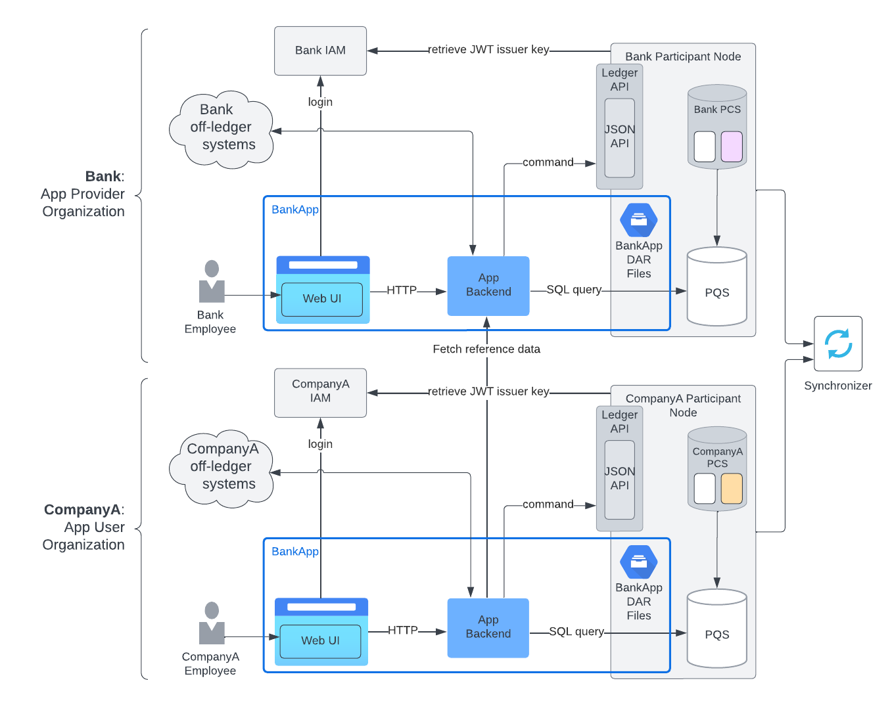
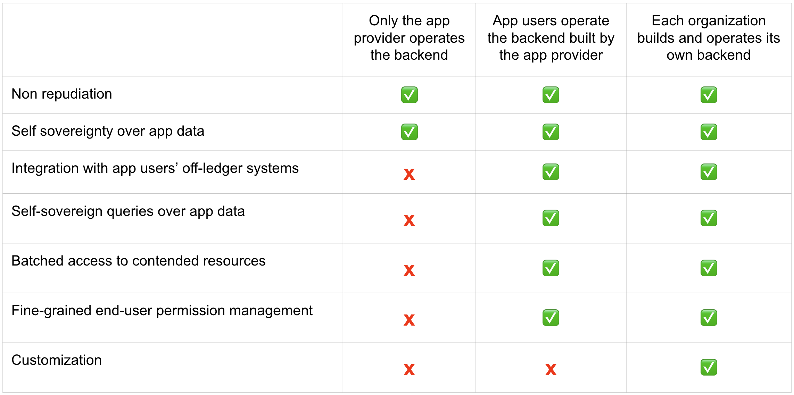
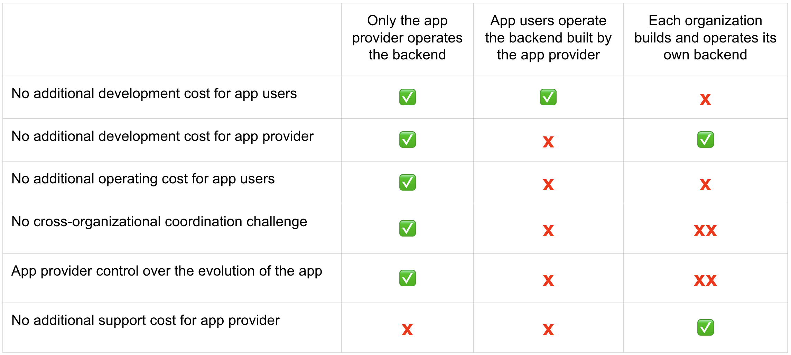

Daml Application Architecture Design Considerations
###################################################
Building and operating a production-level Daml application requires careful design considerations for each component. This document introduces the fundamental components of a Daml application, with a focus on the core responsibilities of the backend. It also discusses the costs and benefits of viable tech stacks and architectural options from both the app provider's and app user's perspectives. For a concise overview of a recommended architecture, refer to :ref:`Daml Application Architecture <recommended-architecture>`.

1. Daml Application Components
==============================

1.1 Frontend
------------
Frontends enable human end-users to efficiently interact with the business processes of a Daml app. Apps designed purely for system-to-system integration solutions may not require a frontend, but all other apps need one.

To achieve :ref:`non-repudiation <non-repudiation>`, all actions taken by an end-user in the name of an :ref:`app provider <app-provider>` or an :ref:`app user <app-user>` organization must be submitted via that organization’s :ref:`participant node <participant-node>` from a frontend under their control. Otherwise, the organization could dispute a transaction record, claiming that it does not correspond to the actions performed by the end-user. To ensure the best possible non-repudiation guarantees, the app provider and each app user should host the app frontend on a web server under their control. For the same reason, each organization’s frontend should be configured to log in via that organization’s IAM. The IAM issues access tokens that can be used to submit commands to the organization’s participant node. Note that frontends don't directly communicate with the ledger. The frontends send commands to the backends, which in turn send commands to the ledger.

1.2 Daml Model
--------------
Daml models define the cross-organization workflows and serve as API definitions for the components interacting with these workflows. They are compiled into :ref:`DAR files <dar-file-dalf-file>`, also known as Daml packages. The DAR files must be uploaded to all Canton participant nodes of app users.

1.3 Backend
-----------
The backends interact directly with the :ref:`Ledger API <ledger-api>` to manage access to participant nodes. The backends utilize Daml parties to represent the app provider and the app users, and Daml contracts to represent the state of the workflows between these organizations.

Daml parties act on the ledger and read data from it at the organization level. Note that a backend does not have to be implemented as a single monolithic component. It’s a logical component that can be implemented using a micro-services architecture, or any other service architecture preferred by the development team.

The backends typically serve one or more of the following purposes:

* Provision higher-level APIs
* Automate on-ledger workflows
* Integrate with off-ledger systems

Details of the backend functionalities and design considerations are as follows:

1.3.1 Provision higher-level APIs
~~~~~~~~~~~~~~~~~~~~~~~~~~~~~~~~~
The participant nodes and the synchronizer ensure that shared application data is synchronized across organizations in real time. When frontends or other systems need to run specific queries on this data, they send requests to the backend. The backend serves these queries from application specific APIs with appropriate access control and performance characteristics. 

When an app needs to communicate with the ledger, several common considerations can be abstracted into higher-level APIs. These APIs can then be used by other logical components of the backend, frontend, or external apps and systems. 

These considerations differ for the read path (reading data from the ledger) and the write path (writing to the ledger). 

1.3.1.1 Read
^^^^^^^^^^^^
On the read path, the most important consideration is to read ledger data using the :doc:`Participant Query Store (PQS) <../query/pqs-user-guide>`. Leveraging application-specific indices ensures that queries are implemented in a way that scales to the application’s needs. PQS extends and compliments capabilities available through Ledger API. 

* Ledger API is optimized for exposing the current state of the ledger and the changes to it without filtering. Daml apps typically have application-specific query needs, which often include retrieval of individual contracts.
* PQS is designed to serve as an operational datastore, providing flexible and efficient query capabilities for ledger data on the participant node. With PQS, you can retrieve ledger data using SQL over a JDBC connection, for example. This makes implementing the read path as simple and standard as implementing any other web service backed by an SQL database.

PQS has access to all data it is configured and allowed to ingest from the :ref:`Private Contract Store (PCS) <private-contract-store>` but does not implement any additional access control for PQS clients. However, when presenting the retrieved data to upstream components, it is necessary to ensure that appropriate end-user authentication and access controls are enforced by the API service. Delegating the implementation of end-user access controls to the developers of the Daml app backend, rather than including them in PQS, allows access controls to be implemented at any level of granularity. Crucially, it allows access controls to be based on intra-organizational business requirements. This enables different users within the same organization to access different datasets, as opposed to constraining access control to the schemas encoded in the Daml model, which focus on inter-organizational access control.

PQS supports accessing both the :doc:`Active Contract Set (ACS) <../daml/resource-management/active-contract-set>` and the ledger history within the pruning window of PQS. It is recommended to choose the pruning window based on business needs and the expected data volume. If required, PQS can serve as a flexible source of filtered events for analytical processing or to populate a data warehouse. PQS stores both contracts and the exercise events that justify the contracts’ creation and archival.

As a Daml model design consideration, it is recommended to avoid storing information about completed workflow steps in the form of active contracts, as this leads to unbounded growth of the ACS. Instead, historic events in PQS should be used as the golden source to serve, for example, an application-specific transaction log or to deliver notifications about completed workflow steps to end-users. In some cases, it is useful to include additional non-consuming exercise events to represent specific workflow events or notifications that should be communicated to stakeholders in the workflow.

PQS provides a general-purpose, queryable view of ledger history and state suitable for a wide range of use cases. PQS is the recommended path for automation and integration components to access ledger data. However, for certain specialized high-scale read use cases, a custom operational data store (ODS) solution may need to be designed to store and index data in a format tailored to specific read requirements.

1.3.1.2 Write
^^^^^^^^^^^^^
On the write path, the most important consideration when implementing higher-level APIs is reliability, which breaks down into two related items: retry behavior on command failure and idempotency of command submission.

* Retry behavior: Since retrying failed command submissions is required by every component of the application that needs to send commands to the ledger, it usually makes sense to package this capability in a reusable fashion.
* Idempotency: Since commands to the ledger may be recomputed and resubmitted due to retries and/or crashes, it is important to ensure that writes to the ledger are idempotent.
  * A simple way of achieving this is to make the command sent to the ledger consume some of its input. For example, exercising a consuming choice on the contract that led to sending the command.
  * Another technique is to use command deduplication. Participant nodes provide a mechanism in the Ledger API to ensure that they execute a command at most once. This mechanism is known as command deduplication. It works by the participant node storing the command ID and deduplicating later submissions with the same command ID. For details on the mechanics of command deduplication, see the Ledger API documentation.

1.3.1.3 Serve reference data contracts
^^^^^^^^^^^^^^^^^^^^^^^^^^^^^^^^^^^^^^
A special case of provisioning a higher-level API is serving reference data contracts required by app users to submit their Daml transactions. Sometimes, Daml models include contracts that provide reference data. For example, an app provider may store a directory of eligible counterparties for over-the-counter trades as on-ledger contracts. Another example is financial market data, such as a stock index closing value, foreign exchange, or interest rate fixing provided by an oracle party and stored as an on-ledger contract. 

Such contracts are typically not visible to the app users' Daml parties, because maintaining their visibility on-ledger for app users' parties is onerous, and because contracts with many observers should be avoided for performance reasons. Instead of managing the visibility of such contracts on-ledger, a Daml feature named “explicit disclosure” is utilized. This feature allows the stakeholders of a contract to share it out of band with other parties, so that these parties can include the contract with a Daml transaction submission, which in turn allows the submitting parties to access these contracts during Daml transaction processing. With explicit disclosure, a transaction that requires the submitting party to have visibility of a contract will succeed even though the submitting party is not a stakeholder in the contract.

1.3.2 Automate on-ledger workflows
~~~~~~~~~~~~~~~~~~~~~~~~~~~~~~~~~~
Steps in on-ledger workflows that do not require human intervention are automated using the backend. For example, in a customer onboarding workflow of a financial services app, the backend might listen to a new customer onboarding request on-ledger and advance it automatically once the provider's off-ledger "know your customer" (KYC) compliance system gives the green light to onboard the customer.

Daml code has no independent thread of execution. Contracts on the ledger are passive records of synchronized data and rights specifying who can advance the shared workflows. These workflows remain static until advanced by external components. Any action on the ledger must be initiated by external components.

When implementing automation in a Daml app backend, it is recommended to modularize it into retriable tasks: well-defined, independent units of work that the automation is guaranteed to complete. Tasks can then be processed with bounded parallelism based on this code.

* Automation triggered by external events: Automation tasks can be triggered by external events. Common examples of external events are messages received from off-ledger systems and time events, which allow automation tasks to run at a given time or on a given schedule.
* State-triggered automation: Tasks often represent the need for a backend to advance an on-ledger workflow. For example, this could involve handling an app-user onboarding request by checking the provided information against an off-ledger know-your-customer (KYC) system and auto-accepting the request when that check succeeds. Given that on-ledger workflows represent their state using Daml contracts, these tasks are triggered by the creation of Daml contracts (or by the backend discovering their existence after it has started). These kinds of tasks are called "state-triggered automation." Note that Daml contracts that trigger automation should be consumed in the triggered command processing to avoid the automation looping.

  Technically, state-triggered automation can often be considered time-triggered as well, as it is typically implemented by periodically querying the PQS for new tasks in a polling fashion. When retrying such tasks, it is important to rerun the whole query against PQS to ensure that the new attempt is based on the most recent data, as the ledger state may be changing due to concurrent actions. An automation task should always utilize the most recent ledger state available on PQS. When multiple queries need to be executed as part of the same automation task run, ensure that a consistent ledger offset is utilized in all queries.

Each task should be automatically retried on retryable errors up to a limit. The entire code block that processes the task should be retried, not just the ledger command submission within the block. This ensures that the most recent ledger state is reflected in the command being submitted—or even discovering that, due to concurrent actions on the ledger, the task has already been completed or is otherwise no longer valid. In such cases, the retrying loop should exit.

1.3.3 Integrate with off-ledger systems
~~~~~~~~~~~~~~~~~~~~~~~~~~~~~~~~~~~~~~~
Backend functionality also includes integration with off-ledger systems. For example, this may involve running off-ledger anti-money laundering compliance checks, populating reporting databases while processing on-ledger financial transactions, or initiating on-ledger financial transactions from an off-ledger pre-trade analytics system. When designing a Daml app it is crucial to understand the specific integration needs of the app users as well as the app provider organization and to put the backend infrastructure in place to serve these.

For this backend functionality there are no special considerations. Use your existing integration technologies as appropriate, following the IT landscape, where the Daml app backend is expected to be deployed. 

There are various integration options:

* A common case is for the backend to query off-ledger systems as part of automating on-ledger workflows. For example, this could involve querying a know-your-customer database or running a complex computation using a system that already implements it. Examples of such computations include margin calculations on financial positions or netting computations for optimizing transaction settlements in financial markets.
* Data can be pushed from off-ledger systems to the ledger using API calls or by having the backend consume messages from a message queue. This approach can be used, for example, to ingest pricing data from a message queue and create reference data contracts providing this pricing data for on-ledger workflows.
* Data can be pushed from the ledger to off-ledger systems by the backend using webhooks or by writing to message queues. A pull-based consumption is also possible, leveraging the offset-based access to events provided by both PQS and the Ledger API. An example of this kind of dataflow is replicating securities registration data from an on-ledger registry to order book matching services. Other examples include feeding accounting systems or populating reporting databases.
* These options are non-exhaustive. There are other ways to exchange data between the ledger and off-ledger systems. Use whatever technology makes development and deployment of the app easier for the app provider and app users. Regardless of the technology used, it is recommended to keep the read and write paths separate and to implement integration between off-ledger systems and the ledger via a backend service, rather than allowing off-ledger systems to use the Ledger API directly.

2. Choose Tech Stack for Backend
================================

2.1 Use a standard stack for building an enterprise application
---------------------------------------------------------------
* To interact with the Ledger API, use any library considered standard for interacting with gRPC services.
* Adopt the standard tech stack for IAM integration.
* Background processing is required to react to on-ledger state changes and ingest data from external sources into the ledger.
* Ensure all interactions with the ledger are crash-fault tolerant by implementing retries with idempotent commands.

2.2 Any programming language can be used to implement Daml app backend services
-------------------------------------------------------------------------------
* Certain languages offer higher-level programming tools, such as the :doc:`Daml Codegen <../tools/codegen>`.
* The Daml Codegen is particularly useful for interacting with the payload of Daml contracts, as it generates the mapping between types implemented in Daml models and language types. For example, the codegen utility can generate Java classes corresponding to Daml contract templates in Daml models. These classes include all boilerplate code for encoding and decoding the Ledger API representation of Daml contract arguments and for creating commands to exercise the contracts’ choices.
* Refer to the :ref:`Ledger API <how-to-access-ledger-api>` documentation for the latest list of languages where higher-level programming tools are readily available. For other languages without existing infrastructure code, gRPC can be used directly. In such cases, consider creating :doc:`ledger bindings <../app-dev/bindings-x-lang/index>`, including a codegen utility or other metaprogramming features, for the language of choice.

.. _arch-options:

3. Architecture Options
=======================
There is no one-size-fits-all architecture for Daml apps. Instead, a continuum of possible architectures exists. Each architectural choice involves trade-offs, and selecting the most appropriate option depends on specific business needs. To weigh the trade-offs, consider three distinct architectures:

* :ref:`App Provider <app-provider>` Operates the Backend
* :ref:`App User <app-user>` Operates the Backend Built by the App Provider
* Each Organization Builds and Operates Its Own Backend

3.1 App Provider Operates the Backend
-------------------------------------
The first option requires the fewest components to build, where app users operate only the frontends, while the app provider exclusively operates the backend. 

In this architecture, app users’ frontends submit commands to the ledger using the Ledger API or HTTP JSON API. To read from the ledger, app users’ frontends rely on the app provider’s backend. This approach is the simplest to deploy and still ensures non-repudiation and self-sovereignty of app data for both app providers and app users. However, it does not support integration with app users’ off-ledger systems and limits the possibilities for automating on-ledger workflows. In this configuration, the backend can only submit commands to the ledger on behalf of the app provider’s Daml parties, while app users’ Daml parties can send commands to the ledger exclusively through the frontend.

3.2 App User Operates the Backend Built by the App Provider
-----------------------------------------------------------
When app users operate the backends built by the app provider, they gain additional benefits beyond non-repudiation and self-sovereignty over app data provided by operating a participant node:

* Self-sovereign queries over app data: Queries over app data can be served by the app user’s own backend, fed from their copy of app data. Whether this is required depends on the use case. For example, this might be necessary for app users making high-stakes decisions in low-trust environments or for those requiring strict control over decision-making infrastructure for compliance purposes.
* App user system integration: Integration with off-ledger systems under the app user’s control can be facilitated by operating a local backend, which acts as a bridge between these systems and the application.
* Batched access to contended resources: When many end-users access the same on-ledger resource owned by an app user, a backend can batch access to improve throughput. For instance, multiple traders might allocate funds from a company’s on-ledger account. A local backend allows batching of requests, enabling a single Daml transaction to handle multiple allocation requests simultaneously, significantly increasing processing speed compared to handling requests sequentially.
* Fine-grained end-user permission management: Fine-grained access control for end-users, regarding reading on-ledger data and performing on-ledger actions using Daml parties that represent the app user’s organization, is best implemented via a backend that manages access to the app user’s participant node and hosted Daml parties.

The disadvantages of app users operating the backend built by the app provider include:

* App user operating costs: App users must allocate resources for monitoring and maintaining their backend.
* Multi-version deployments: App users may delay upgrading their backend to a new release, resulting in multiple backend versions running simultaneously. This complicates workflow changes and testing of upgrades.
* On-prem software challenges for the app provider: App provider developing a backend for app users to operate requires the app provider to function as an on-prem software provider, presenting additional challenges:
  * App provider support staff: The app provider must maintain a client-facing support team to address backend operation issues during the app user’s business hours.
  * App provider release management: Releasing software for customer operations on-prem requires additional communication and care compared to managing internal releases, adding complexity to the release process.

3.3 Each Organization Builds and Operates Its Own Backend
---------------------------------------------------------
The architecture where each organization builds and operates its own app frontend and backend provides maximum flexibility for meeting specific requirements related to automation and integration with off-ledger systems. However, this flexibility comes at a cost.

App users that build and operate their own backends and/or frontends gain additional benefits:

* Customization: App users can tailor the app backend and/or frontend to their specific needs. This may include custom system integrations or fine-grained end-user access controls.
* Lower software supply chain risk: Operating self-developed software reduces reliance on third-party code, minimizing supply chain risks. This can be critical when auditing third-party code proves too costly or impractical.

The disadvantages of this highly flexible architecture include:

* App user software development cost: The app provider must always build and operate its own frontend and backend. App users, however, may not necessarily need to. When app users are required to develop their own frontend and backend, significant budget and expertise are needed for development and maintenance. This requirement can greatly reduce the total addressable market for the app.
* Cross-organization software development: The initial development of the app and future changes necessitate coordination between the app provider and app user organizations. While Daml facilitates specifying APIs for workflows across organizations, the complexities of cross-organization software development should not be underestimated.
* Restricted app evolution: Apps are expected to evolve over time to address new business requirements. However, app users may lack the willingness or capability to modify their frontend and backend code, complicating efforts to change or decommission existing workflows.

.. _properties-summary:

3.4 Properties Summary
----------------------

3.4.1 Properties of the Architectures
~~~~~~~~~~~~~~~~~~~~~~~~~~~~~~~~~~~~~

This table summarizes the properties of each of the three architectures under consideration. Note that there is a continuum of possible architectures in between. App architecture can also evolve over time. Starting with a simpler architecture that provides the minimum required set of properties is recommended, with additional complexity introduced as business requirements evolve.

3.4.2 Properties of the Architectures from a Cost Perspective
~~~~~~~~~~~~~~~~~~~~~~~~~~~~~~~~~~~~~~~~~~~~~~~~~~~~~~~~~~~~~

This table summarizes the properties of the same three architectures from the perspective of cost and other software engineering considerations. Favoring the architecture that requires the least engineering and operational effort from app users while still meeting their requirements is recommended. 

Note that an “X” indicates an issue with an item, while “XX” signifies that the issue is more severe. For example, the challenge of cross-organizational coordination becomes significantly more pronounced when each organization builds its own backend, compared to situations where app users operate a backend provided by the app provider.

4. Key Takeaways
================
1. A Daml app typically requires three components: an app frontend, Daml models, and app backends. Daml models need to be deployed on the app provider’s and each app user’s participant node.
2. A Daml application backend serves three primary purposes: provisioning higher-level APIs for communication with the ledger, automating on-ledger workflows, and integrating with off-ledger systems.
3. When implementing a higher-level API, use PQS to read from the ledger. On the write path to the ledger, reliability is the most important consideration, which includes two related factors: retry behavior on command failure and idempotency of command submission.
4. The functions served by a Daml app backend are not unusual, and the tech stack required to implement it is standard. Use the standard enterprise application stack for building the Daml app backend.
5. There are various options for developing and operating the app backends and frontends, and the app architecture can evolve over time. The recommended approach is to initially favor an architecture that minimizes software engineering and operational effort for app users while meeting their requirements. This approach helps minimize delivery risk and maximize the app's total addressable market.