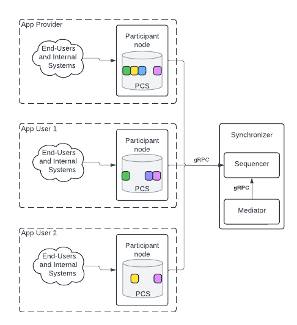

Daml Application Infrastructure
###############################

Daml Application Infrastructure: Minimum Requirements to Run a Daml Application on Canton
*****************************************************************************************
Daml applications run on the Canton infrastructure and provide the benefits of distributed ledger technology, data sovereignty, and privacy. This documentation explores the components of Canton and the minimum requirements to run a Daml application on the Canton infrastructure.

High-Level Infrastructure
*************************
The Canton infrastructure consists of two main components: participant nodes and synchronizers.

Participant Node
================
Participant nodes store the app state collectively. Each participant node stores its own view of the overall app state in a database called the Private Contract Store (PCS).

The colored boxes inside the PCS represent Daml contracts and show that each PCS only stores contracts where at least one party hosted on the participant node is a stakeholder. The overall app state is the combined set of active contracts from each participant node’s PCS.

Changes to the state are committed as atomic transactions via the synchronizer.

Synchronizer
============
The Canton synchronizer is a total-order, reliable multicast system that ensures consistent message ordering and data delivery across components of a distributed ledger.

A synchronizer consists of a sequencer and a mediator. The sequencer provides the ordering of transactions, and the mediator provides consensus for transaction confirmation.

Participant nodes do not communicate directly with each other but communicate with the synchronizer. For most Daml apps, the synchronizer is operated by the app provider. This is the default option when designing a Daml app.

Communication Between Participant Nodes and Synchronizers
=========================================================
Participant nodes communicate with synchronizers via the Canton protocol, which is implemented using gRPC.

Participant nodes send two types of messages to the sequencer using the gRPC protocol:

* Send: a regular message; a single gRPC message, to which the sequencer responds with a one-time response.
* Read: a subscription request; a server-side streaming gRPC, to which the sequencer responds with a stream of messages.

Participant nodes always initiate both send and read operations to the sequencer. Therefore, the sequencer must permit inbound gRPC connectivity, while the participant nodes must permit outbound gRPC connectivity to enable required communication between infrastructure components.

The mediator communicates with the sequencer using the same mechanism and subscribes to streaming messages from the sequencer. However, since the sequencer and mediator typically run in the same administrative domain, this communication does not present security concerns, unlike communication between participant nodes and the sequencer.

Minimum Requirements
********************
The minimum infrastructure required to run a Daml app includes:

* A single synchronizer for all the app’s workflows. The synchronizer does not need to be exclusive to one app. Multiple Daml apps may share the same synchronizer.
* A separate participant node for each organization involved in the app’s workflows. The participant nodes must all be connected to the synchronizer.

Each organization should maintain administrative control over its participant node. This can be achieved either by deploying the participant node within the organization’s own administrative domain, or by using a managed participant node service like Daml Hub.

Benefits of Each Organization Operating a Participant Node
**********************************************************
When each organization operates its own participant node, all changes made by the app provider or any app user to the application data are signed and submitted by the participant node under that entity’s control. This provides two crucial benefits:

.. _non-repudiation:

Non-repudiation
===============
The ledger records cryptographic evidence of the workflow steps taken by both the app provider and the app users. Therefore, none of them can effectively repudiate or deny their steps in shared workflows. For example:

* An app user cannot deny to the app provider that they submitted a buy order.
* An app provider cannot deny to the user that they wrongfully canceled an order submitted by an app user.

Non-repudiation applies to both the app provider and the app users.

Self-sovereignty Over App Data for App Users
============================================
App users receive a copy of all their app data that is synchronized in real time with the provider and other stakeholders’ copies of that data. This copy empowers app users to build custom integrations of their application data with their internal systems at will. Additionally, this copy implies that the data remains accessible even if the provider loses it, for example, as a result of a ransomware attack.

The app user’s participant node validates all changes to the app user’s data before they are committed. The validation checks are specified in the application’s DAR files uploaded to the user’s participant node. For example, if the application’s DAR file specifies that the app user must authorize all asset transfers, the user’s participant node ensures that this rule is enforced. This prevents third parties, including the app provider, from tampering with the record.

Architecture and Control
========================
While it is technically possible to have an architecture where the app provider has access to an app user’s participant node, such architecture would necessarily result in the loss of the non-repudiation property and is therefore considered an anti-pattern. Each organization should use its own Identity and Access Management (IAM) system to control access to its participant node. This approach allows organizations to maintain control over their data, ensuring the system achieves the non-repudiation property.

Key Takeaways
*************
1. The Canton infrastructure consists of two main components: participant nodes and synchronizers.
2. The minimum infrastructure required to run a Daml app includes one synchronizer for the whole app and a separate participant node for each organization involved in the workflows of the app.
3. The app provider and each app user should utilize a participant node under their own control for two benefits: non-repudiation and self-sovereignty over app data.
4. Each organization should use its own IAM to control access to its participant node.
