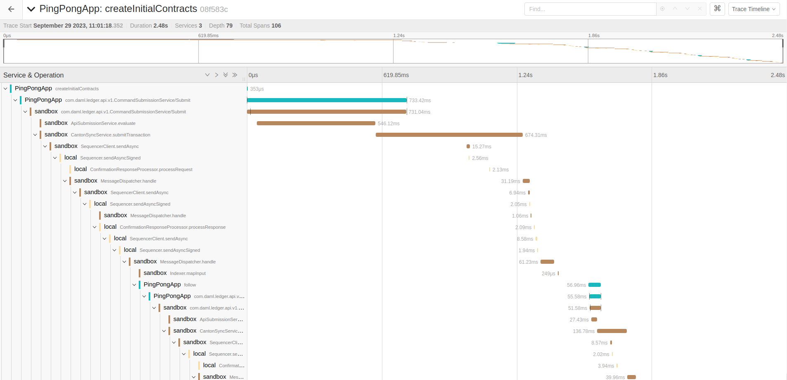

.. Copyright (c) 2023 Digital Asset (Switzerland) GmbH and/or its affiliates. All rights reserved.
.. SPDX-License-Identifier: Apache-2.0

.. _open-tracing-ledger-api-client:

Open Tracing in Ledger API Client Applications
##############################################

Introduction
============

Distributed tracing is a technique used for troubleshooting performance issues in a microservices environment like Daml Enterprise. Tracing in Canton has been described in a page dedicated to monitoring (Canton Monitoring / Tracing). This guide describes how to write **Ledger API** client applications so that distributed traces and spans can seamlessly continue between the client and Canton software components.

To study a **Ledger API** client application with OpenTelemetry support in detail, see this `example on GitHub <https://github.com/digital-asset/ex-java-bindings-with-opentelemetry>`__.

The example implements a variation of the already familiar ``PingPong`` application where every call to the **Ledger API** is decorated with an OpenTelemetry trace context and demonstrates how to retrieve the trace context from past transactions.

To familiarize yourself with the broader topic of open tracing, consult the official pages of `the OpenTelemetry project <https://opentelemetry.io/>`_. To find out more about open tracing in Java, the documentation on `Java OpenTelemetry instrumentation <https://opentelemetry.io/docs/instrumentation/java/>`_ is an excellent source of references and examples.

Set Up an OpenTelemetry Environment
===================================

To observe distributed tracing in action, you first need to start an OpenTelemetry backend server. Canton supports Jaeger, Zipkin, or OTLP formats. To start a Jaeger server you can use the following docker command:

::

    docker run --rm -it --name jaeger\
      -p 16686:16686 \
      -p 14250:14250 \
      jaegertracing/all-in-one:1.22.0

You also have to start Canton with OpenTelemetry exporting enabled. You can achieve it by defining a new ``jaeger.conf`` configuration file:

::

    canton.monitoring.tracing.tracer.exporter {
      type = jaeger
      address = "localhost" // it's the default, so can be omitted
      port = 14250 // it's the default, so can be omitted
    }

Next, launch a small Canton installation combining the ``jaeger.conf`` into the configuration mix:

::

    bin/canton -c examples/01-simple-topology/simple-topology.conf -c jaeger.conf

Add Project Dependencies
========================

To use the OpenTelemetry libraries, add the following **Maven** dependencies to your project's ``pom.xml``:

.. remoteliteralinclude:: https://raw.githubusercontent.com/digital-asset/ex-java-bindings-with-opentelemetry/master/pom.xml
   :language: xml
   :lines: 33-52

.. note::
    Replace the version number in each dependency with the version you want to use. To find available versions, check the `Maven Central Repository <https://search.maven.org/artifact/io.opentelemetry/opentelemetry-api>`__.

Initialize
==========

An application that wants to use OpenTelemetry must initialize a number of global controller objects that orchestrate different aspects of the distributed tracing process such as span creation, propagation, and export. The exact set of controllers needed may vary from application to application. You may draw some inspiration from the selection used in the example inside `the OpenTelemetryUtil.createOpenTelemetry method <https://github.com/digital-asset/ex-java-bindings-with-opentelemetry/blob/master/src/main/java/examples/pingpong/codegen/OpenTelemetryUtil.java>`_. This is the minimum set required for a fully functional Jaeger trace reporting.

The next step is to initialize the GRPCTelemetry controller, which is responsible for the propagation of the trace contexts inside the HTTP2 headers of the gRPC communication.

The example wraps the necessary initialization steps in the constructor of the OpenTelemetryUtil class. All you have to do is call:

.. code-block:: java

    OpenTelemetryUtil openTelemetry = new OpenTelemetryUtil(APP_ID);

The GRPCTelemetry controller can construct client call interceptors that need to be mounted on top of the **Netty** channels used in the gRPC communication. The example provides a useful helper method called ``withClientInterceptor`` that injects an interceptor at the channel builder level:

.. remoteliteralinclude:: https://raw.githubusercontent.com/digital-asset/ex-java-bindings-with-opentelemetry/master/src/main/java/examples/pingpong/codegen/PingPongMain.java
   :language: java
   :lines: 51-56

And with that, you are all set to start generating own spans, reporting them to the **Jaeger** server and also propagating them transparently to the **Ledger API**.

Start New Spans
===============

Before making a gRPC call, you must generate a new span to cover the multi-component interaction that is about to be initiated. The example provides a useful combinator called ``runInNewSpan`` that wraps the execution of an arbitrary function in a newly generated span:

.. remoteliteralinclude:: https://raw.githubusercontent.com/digital-asset/ex-java-bindings-with-opentelemetry/master/src/main/java/examples/pingpong/codegen/OpenTelemetryUtil.java
   :language: java
   :lines: 153-160

You can use it on a command submission as follows:

.. code-block:: java

    openTelemetry.runInNewSpan("createInitialContracts", () -> submissionService.submit(request));

The gRPC interceptors that were mounted at the initialization stage do the rest of the work behind the scenes making sure that the spans make it across to the Canton.

Continue Spans Across Different Applications
============================================

Sometimes you may wish to continue the same span across multiple Daml transactions forming a single workflow. This may be especially interesting when different client application instances interact through the ledger and yet their entire conversation should be seen as a single coherent succession of spans. In that case, it is possible to extract the trace context associated with the past transactions from the Transaction, TransactionTree, or Completion records that are returned from the following **Ledger API** calls:

* ``TransactionService.GetTransactions``
* ``TransactionService.GetTransactionTrees``
* ``TransactionService.GetTransactionByEventId``
* ``TransactionService.GetTransactionById``
* ``TransactionService.GetFlatTransactionByEventId``
* ``TransactionService.GetFlatTransactionById``
* ``CompletionService.CompletionStream``

You can extract the context by using a helper function implemented in the example:

.. code-block:: java

    Context extractedContext = openTelemetry.contextFromDamlTraceContext(tx.getTraceContext());

The extracted context then has to be elevated to the status of the current context. Doing this allows the continuation of the original trace context into the present operation. Again the example provides a convenient combinator for that:

.. code-block:: java

    openTelemetry.runInOpenTelemetryScope(extractedContext, () -> ... );

Finally, you generate a new span within the original context. You can use the already familiar ``runInNewSpan`` method:

.. code-block:: java

    openTelemetry.runInNewSpan("follow", () ->
      submissionService.submit(SubmitRequest.toProto(ledgerId, commandsSubmission))
    )

Put It All Together
===================

When the client applications follow the rules and pass the trace contexts without interruption, it becomes possible to witness the entire workflow as one long succession of spans in Jaeger UI. The span diagram collected while running the example application is shown below:

