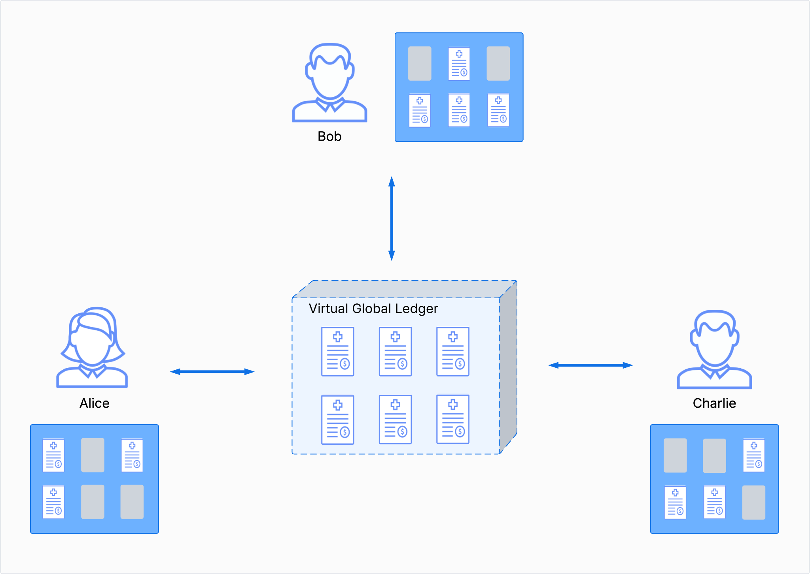

.. Copyright (c) 2023 Digital Asset (Switzerland) GmbH and/or its affiliates. All rights reserved.
.. SPDX-License-Identifier: Apache-2.0

.. _da-ledgers:

Ledger Model
############

.. note::

   * Update examples and notation in the style of the Canton polyglott whitepaper
     https://www.canton.network/hubfs/Canton%20Network%20Files/whitepapers/Polyglot_Canton_Whitepaper_11_02_25.pdf

     Interleave definitions and diagrams with concrete examples from Daml; link to Daml source files that are checked by CI.

   * Remove exceptions

   * Extend with time, upgrading (via packages), requester of a commit, explicit disclosure

   

Daml Ledgers enable multi-party workflows by providing
parties with a virtual *shared ledger*, which encodes the current
state of their shared contracts, written in Daml. At a high level, the interactions are visualized as
follows:

.. https://www.lucidchart.com/documents/edit/505709a9-e972-4272-b1fd-c01674c323b8

The Daml ledger model defines:

  #. what the ledger looks like - the structure of Daml ledgers
  #. who can request which changes - the integrity model for Daml ledgers
  #. who sees which changes and data - the privacy model for Daml ledgers

The below sections review these concepts of the ledger model in turn.
They also briefly describe the link between Daml and the model.

.. .. toctree::
   :maxdepth: 3

   ledger-structure
   ledger-integrity
   ledger-privacy
   ledger-daml
   ledger-exceptions
