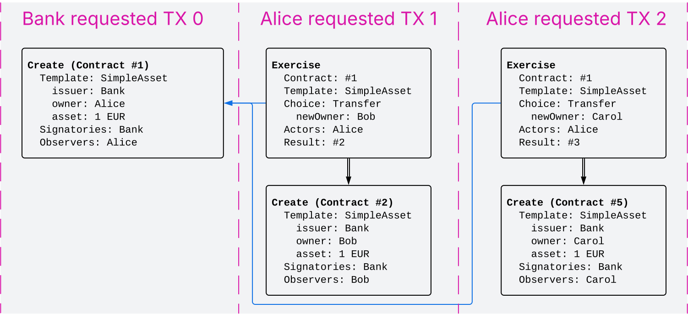
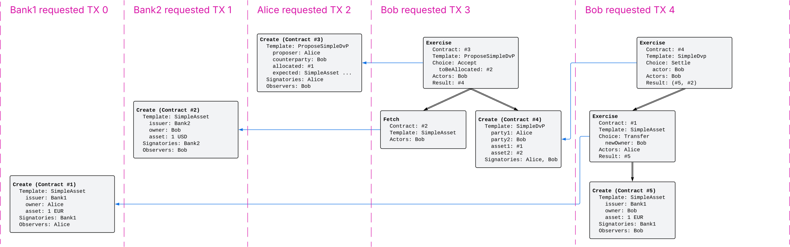
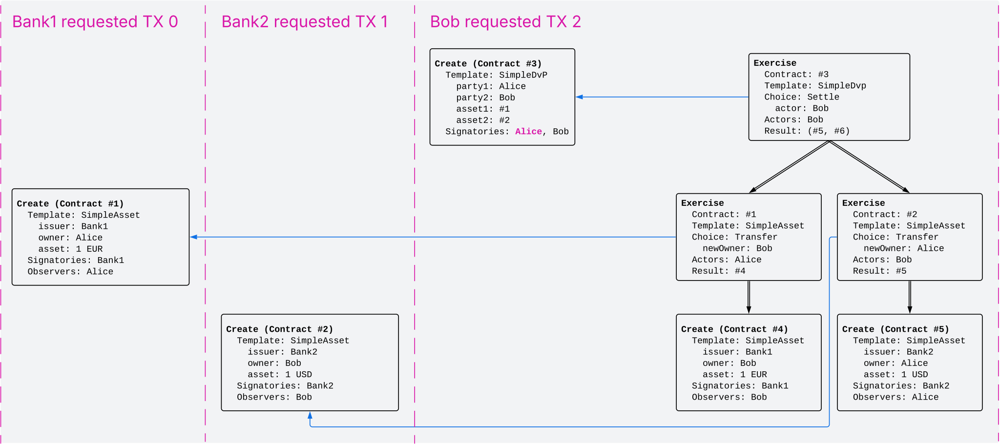
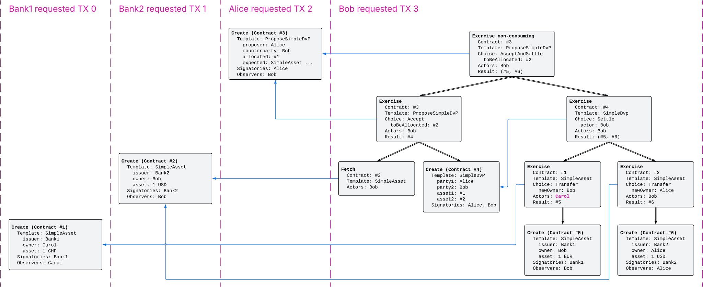
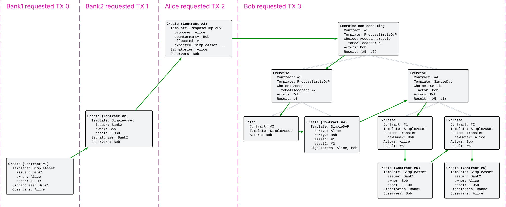
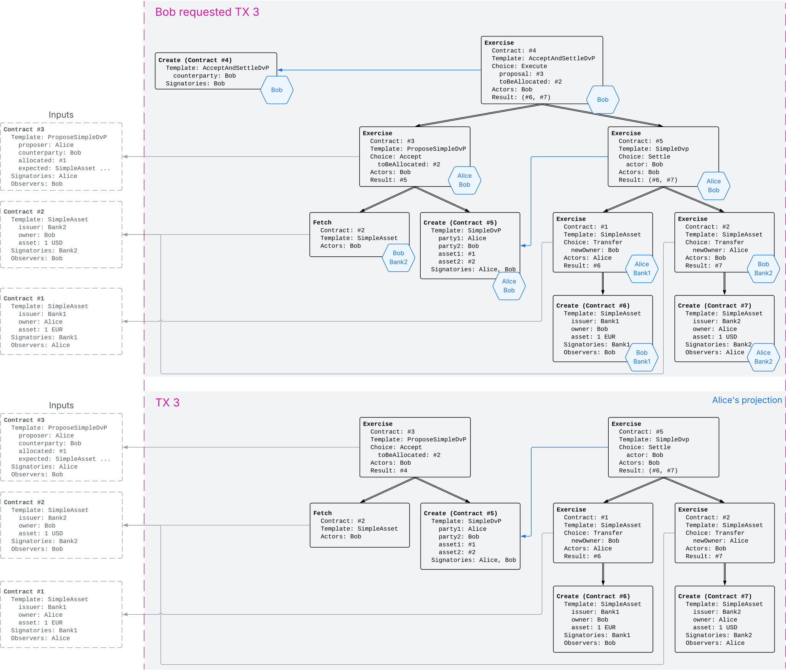
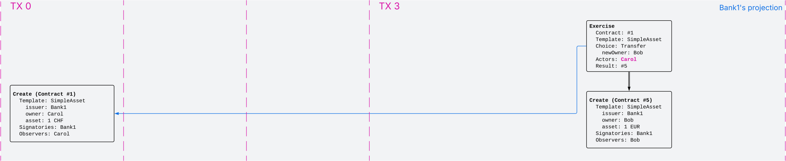

.. Copyright (c) 2023 Digital Asset (Switzerland) GmbH and/or its affiliates. All rights reserved.
.. SPDX-License-Identifier: Apache-2.0

.. _da-model-integrity:

Integrity
#########

The section on the :ref:`ledger structure <ledger-structure>` section answered the question “What does the Ledger looks like?” by introducing a hierarchical format to record the party interactions as changes.
The section on :ref:`privacy <da-model-privacy>` answered the question “Who sees which changes and data?” by introducing projections.
This section addresses the question "Who can request which changes?" by defining which ledgers are valid.

.. _da-model-validity:

Validity
********

At the core is the concept of a *valid ledger*: a change is permissible if adding the corresponding commit to the ledger results in a valid ledger.
**Valid ledgers** are those that fulfill three conditions:

* :ref:`Consistency <da-model-consistency>`:
  Exercises and fetches on inactive contracts are not allowed, i.e. contracts that have not yet been created or have already been consumed by an exercise.

* :ref:`Conformance <da-model-conformance>`:
  Only a restricted set of actions is allowed on a given contract.
  This restriction is encoded via the Daml templates that implement the smart contract logic.

* :ref:`Authorization <da-model-authorization>`:
  The parties who may request a particular change are restricted.

Later sections add further validity conditions as they increase the expressivity of the ledger model.
Intuitively, the :ref:`running example of the DvP workflow <da-dvp-ledger>` should be and actually is valid.
It is instructive to look at examples that violate some validity condition though,
even before they are defined precisely.

.. _da-model-consistency-violation:

Consistency violation example
=============================
In this example, Alice tries to transfer her asset twice ("double spend"), once to Bob and once to Charlie,
as shown in the following Daml script excerpt.
This script is expected to fail at runtime.

.. literalinclude:: ./daml/SimpleAsset.daml
   :language: daml
   :start-after: SNIPPET-double-spend-START
   :end-before: SNIPPET-double-spend-END

The corresponding Canton ledger looks as shown below.
This ledger violates the consistency condition because contract #1 is the input to two consuming exercise nodes,
one in ``TX 1`` and one in ``TX 2``.

.. https://lucid.app/lucidchart/9fb12975-8d57-4f73-9c81-0154879c3cc9/edit

Conformance violation example
=============================
         
In the second example, the last transaction ``TX 4`` omits one leg of the DvP workflow:
Bob exercises the ``Settle`` choice, but it has only one subaction, namely Alice transferring her IOU.
This violates conformance because the implementation of the ``Settle`` choice on a ``SimpleAsset`` mandates that there are two consequences.
(This situation cannot be expressed as a Daml script scenario
because Daml script ensures that all generated transactions conform to the Daml code.)

.. https://lucid.app/lucidchart/30be82bc-9d5c-4531-b7ff-3762eaa0a72d/edit

.. _da-model-authorization-violation:
         
Authorization violation examples
================================
         
The next three examples show different kinds of authorization violations.
First, Alice attempts to steal Bob's asset by requesting a transfer in his name.
This results in an authorization failure because for ``TX 1`` the actor of the exercise root action differs from the requester.

.. literalinclude:: ./daml/SimpleAsset.daml
   :language: daml
   :start-after: SNIPPET-steal-START
   :end-before: SNIPPET-steal-END

.. https://lucid.app/lucidchart/c26ab5f9-b2e2-4ed5-82d4-2af02fec2edc/edit
.. image:: ./images/asset-steal.svg
   :align: center
   :width: 50%
   :alt: A ledger where Alice submits a transaction where Bob exercises the transfer choice on his asset

Next, Bob wants to skip the propose-accept workflow for creating the ``SimpleDvP`` contract and instead creates it out of nowhere and immediately settles it.
This must be treated as an authorization failure, as Alice did not consent to swapping her EUR asset against Bob's USD asset.

.. literalinclude:: ./daml/SimpleDvP.daml
   :language: daml
   :start-after: SNIPPET-create-auth-error-START
   :end-before: SNIPPET-create-auth-error-END

On the ledger, the first root action of ``TX 2`` is not properly authorized
because Alice is a signatory of the contract #3 created in the first root action even though she did not request the update.

.. _da-dvp-ledger-create-auth-failure:

.. https://lucid.app/lucidchart/cd2cef11-6f69-4f9c-8e1e-d79488547de2/edit

The third example shows that authorization failures may not only happen at root actions.
Here, Alice allocates Carol's CHF asset in the DvP proposal.
When Bob tries to settle the DvP, the Exercise to transfer Carol's asset in the first leg is not properly authorized
because Carol did not agree to have her asset transferred away.

.. literalinclude:: ./daml/SimpleDvP.daml
   :language: daml
   :start-after: SNIPPET-nested-auth-error-START
   :end-before: SNIPPET-nested-auth-error-END

The ledger produced by this script has an authorization failure for the Exercise node on contract #1:
The transaction structure provides no evidence that the actor Carol has agreed to exercising the ``Transfer`` choice on her asset.

.. _da-dvp-ledger-nested-auth-failure:

.. https://lucid.app/lucidchart/50e2ad7a-ef88-4fb8-bf62-44027034a3dd/edit

.. _da-model-consistency:

Consistency
***********

Consistency can be summarized in one sentence:
Contracts must be created before they are used, and they cannot be used after they are consumed.
This section introduces the notions that are needed to make this precise.

Execution order
===============

The meaning of "before" and "after" is given by establishing an execution order on the nodes of a ledger.
The ledger's graph structure already defines a :ref:`happens-before order <da-ledger-definition>` on ledger commits.
The execution order extends this happens-before order to all the nodes within the commits' transactions
so that "before" and "after" are also defined for the nodes of a single transaction.
This is necessary because a contract can be created and used multiple times within a transaction.
In the ``AcceptAndSettle`` :ref:`action of the DvP example <da-dvp-propose-accept-and-settle-action>`, for example,
contract #3 is used twice (once in the non-consuming exercise at the root and once consumingly in the first consequence)
and contract #4 is created and consumed in the same action.

.. admonition:: Definiton: execution order

   For two distinct nodes `n`:sub:`1` and `n`:sub:`2` within the same action or transaction, `n`:sub:`1` **executes before** `n`:sub:`2`
   if `n`:sub:`1` appears before `n`:sub:`2` in the preorder traversal of the (trans)action, noting that the transaction is an ordered forest.
   For a ledger, every node in commit `c`:sub:`1` **executes before** every node in commit `c`:sub:`2`
   if the commit `c`:sub:`1` happens before `c`:sub:`2`.

     
Diagrammatically, the execution order is given by traversing the trees from root to leaf and left to right:
the node of a parent action executes before the nodes in the subactions, and otherwise the nodes on the left precede the nodes on the right.
For example, the following diagram shows the execution order with bold green arrows for the running DvP example.
So a node `n`:sub:`1` executes before `n`:sub:`2` if and only if there is a non-empty path of green arrows from `n`:sub:`1` to `n`:sub:`2`.

.. _da-dvp-ledger-execution-order:

.. https://lucid.app/lucidchart/e3e9a609-b5bd-4faf-beb8-cd1166b160f1/edit

The execution order is always a strict partial order.
That is, no node executes before itself (irreflexivity) and whenever node `n`:sub:`1` executes before `n`:sub:`2` and `n`:sub:`2` executes before `n`:sub:`3`, then `n`:sub:`1` also executes before `n`:sub:`3` (transitivity).
This property follows from the ledger being a directed acyclic graph of commits.

The execution order extends naturally to actions on the ledger by looking at how the action's nodes are ordered.
In particular, an action always executes before its subactions.

Internal consistency
====================

Internal consistency ensures that if several nodes act on a contract within an action, transaction, or ledger,
then those nodes execute in an appropriate order.

.. _def-contract-consistency:

.. admonition:: Definition: internal consistency

   An action, transaction, or ledger is **internally consistent for a contract** `c`
   if for any two distinct nodes `n`:sub:`1` and `n`:sub:`2` on `c` in the action, transaction, or ledger,
   all of the following hold:

   * If `n`:sub:`1` is a **Create** node, `n`:sub:`1` executes before `n`:sub:`2`.

   * If `n`:sub:`2` is a consuming **Exercise** node, then `n`:sub:`1` executes before `n`:sub:`2`.

   The action, transaction or ledger is **internally consistent for a set of contracts**
   if it is internally consistent for each contract in the set.
   It is **internally consistent** if it is internally consistent for all contracts.

For example, transaction ``TX 3`` shown above in the :ref:`execution order example <da-dvp-ledger-execution-order>` is internally consistent,
as the following analysis shows.
The nodes in the transaction involve six contracts #1 to #6.

* Contracts #1, #5, and #6 appear only in one node each, namely ⑨, ⑩, and ⑫, respectively.
  ``TX 3`` is therefore trivially consistent for these contracts.

* Contract #2 appears in the Fetch node ⑥ and the Exercise node ⑪.
  So internal consistency holds for #2 because the first condition does not apply and the second one is satisfied
  as ⑪ is consuming and ⑥ executes before ⑪.

* Contract #3 appears in the two Exercise nodes ④ and ⑤.
  Since the consuming ⑤ executes after the non-consuming ④, internal consistency holds also for #3.

* Contract #4 is created in ⑦ and consumed in ⑧.
  So both conditions require that ⑦ executes before ⑧, which is the case here.

By similar reasoning, the whole ledger consisting of ``TX 0``, ``TX 1``, ``TX 2``, and ``TX 3`` is internally consistent.

In contrast, the next diagram shows that the ledger in the :ref:`consistency violation example <da-model-consistency-violation>` is not internally consistent for contract #1.
This contract appears in nodes ①, ②, and ④.
The first condition is satisfied because the Create node ① executes before both other nodes ② and ④.
The second condition is satisfied for `n`:sub:`1` = ② and `n`:sub:`2` = ④,
but violated for `n`:sub:`1` = ④ and `n`:sub:`2` = ② as ④ does not execute before ②.

.. https://lucid.app/lucidchart/8c9a03ef-6ab0-4105-811a-161e5587cf1c/edit
.. image:: ./images/asset-double-spend-execution-order.svg
   :align: center
   :width: 75%
   :alt: The execution order of the ledger where Alice double-spends her asset

.. note::
   Internal consistency constrains the order of the commits in a Ledger via the execution order.
   In the running DvP example, ``TX 0``, ``TX 1``, and ``TX 2`` all create contracts that ``TX 3`` uses.
   Internal consistency therefore demands that these create nodes execute before the usage nodes in ``TX 3``.
   So by the definition of the execution order, ``TX 0``, ``TX 1``, and ``TX 2`` all must happen before ``TX 3``
   (although internal consistency does not impose any particular order among ``TX 0``, ``TX 1``, and ``TX 2``).

Internal consistency does not require Create nodes for all contracts that are used.
This way, internal consistency is meaningful for pieces of a ledger such as individual transactions or actions,
which may use contracts created earlier as inputs.

.. _da-model-contract-consistency:

Contract consistency
====================

Contract consistency strengthens internal consistency in that used contracts actually have been created within the action, transaction, or ledger.

.. admonition:: Definition: contract consistency

   An action, transaction, or ledger is **consistent for a contract** if all of the following hold:
   
   * It is internally consistent for the contract.
     
   * If a node uses the contract, then there is also a node that creates the contract.

   It is **consistent for a set of contracts** if it is consistent for all contracts in the set.
   It is **consistent** if it is consistent for all contracts.

For example, the above DvP ledger is consistent because it is internally consistent and all used contracts are created.

Interaction with projection
===========================

:ref:`Projections <da-model-projections>` retain the execution order and preserve (internal) consistency only to some extent.
For example, Alice's :ref:`projection of the DvP workflow <da-dvp-ledger-projections>` is not consistent
because it lacks ``TX 1`` and therefore the creation of contract #2 used in ``TX 3``.

Fortunately, consistency behaves well under projections if we look only at contracts the parties are stakeholders of.
In detail, if an action, transaction, or ledger is (internally) consistent for a set of contracts `C`
and `P` is a set of parties such that every contract in `C` has at least one stakeholder in `P`,
then the projection to `P` is also (internally) consistent for `C`.

To see this, note that the execution order of the projection of an action or transaction to `P`
is the restriction of the execution order of the unprojected action or transaction to the projection.
That is, if `n`:sub:`1` and `n`:sub:`2` are two nodes in the projection,
then `n`:sub:`1` executes before `n`:sub:`2` in the projection if and only if
`n`:sub:`1` executes before `n`:sub:`2` in the original (trans)action.
Accordingly, projections preserve internal consistency of an action or transaction too.
Moreover, the projection to `P` never removes a Create node if one of the stakeholders is in `P`.
Therefore, consistency is preserved too.
For ledgers, the same argument applies with the current simplification of totally ordered ledgers.
The :ref:`causality section <local-ledger>` relaxes the ordering requirement, but makes sure
that projections continue to preserve (internal) consistency for the parties' contracts.

From Canton's perspective, the dual property is at least as important:
If the projection of a (trans)action or ledger to a set of parties `P` is (internally) consistent for a set of contracts `C`
where each contract has at least one signatory in `P`,
then so is the (trans)action or ledger itself.
This statement can be shown with a similar argument.

Importantly, this dual property requires a *signatory* of the contracts in `P`, not just a stakeholder.
The following example shows that the propery does not hold if `P` contains a stakeholder, but no signatory.
To that end, we extend the ``SimpleAsset`` template with a non-consuming ``Present`` choice
so that the issuer and owner can show the asset to a choice observer ``viewer``:

.. literalinclude:: ./daml/SimpleAsset.daml
   :language: daml
   :start-after: SNIPPET-ASSET-PRESENT-START
   :end-before: SNIPPET-ASSET-PRESENT-END

In the following script, Alice transfers her EUR asset to Bob and then later the Bank wants to show Alice's EUR asset to Vivian.
Such a workflow can happen naturally when Alice submits her transfer concurrently with the Bank submitting the ``Present`` command,
and the Synchronizer happens to order Alice's submission first.

.. literalinclude:: ./daml/SimpleAsset.daml
   :language: daml
   :start-after: SNIPPET-projection-reflect-START
   :end-before: SNIPPET-projection-reflect-END

The next diagram shows the corresponding ledger and Alice's projection thereof.
The projection does not include the non-consuming Exercise ④ because Alice is not a signatory of the EUR asset #1 and therefore not an informee of ④.
Alice's projection is therefore consistent for contract #1.
In contrast, the original ledger violates internal consistency for #1, namely the second condition:
for `n`:sub:`2` as ② and `n`:sub:`1` as ④, the consuming exercise ② does not execute after ④.

.. https://lucid.app/lucidchart/d9be439e-ae1b-4226-af8d-76a43222fed0/edit
.. image:: ./images/asset-projection-reflect-consistency.svg
   :align: center
   :width: 75%
   :alt: An inconsistent ledger where Alice's projection is consistent

With signatories instead of stakeholders, this problem does not appear:
A signatory is an informee of all nodes on the contract and therefore any node relevant for consistency for the contract is present in the signatory's projection.

.. _da-model-conformance:

Conformance
***********

The *conformance* condition constrains the actions that may occur on the ledger.
Formally, a **contract model** (or a **model** for short) specifies the set of all possible actions.
In practice, Daml templates define such a model as follows:

* Choices declare the controller and the choice observers and constrain via their body the valid values in the exercised contract and choice arguments.
  Their body defines the subactions (by creating, fetching or exercising contracts) and the Exercise result.

* The ``ensure`` clause on the template constrains the valid arguments of a Create node.

With :externalref:`smart-contract upgrading <upgrade-model-reference>`, the templates applicable for a given contract may change over time.
For simplicity, the Ledger Model assumes that it is always clear (to all involved parties) what template defines the set of possible actions for a given contract.

.. admonition:: Definition: conformance

   A action **conforms** to a model if the model contains it.
   A transaction **conforms** to a model if all the actions of the transaction conform to the model.
   A ledger **conforms** to a model if all top-level transactions of the ledger conform to the model.

The above :ref:`example of conformance violation <da-model-consistency-violation>` shows this definition in action.
The :ref:`choice implementation <da-ledgers-running-example>` of ``SimpleDvP.Settle`` exercises ``Transfer`` on two contracts and therefore requires that there are two subactions.
The action on the ledger however has only one of the two subactions and therefore violates conformance.
This example demonstrates why the contract model specifies actions instead of nodes:
a set of acceptable nodes cannot catch when a consequence is missing from an action,
because nodes ignore the tree structure.

Interaction with projection
===========================

Like consistency, conformance to a Daml model behaves well under projections.
If an action, transaction or ledger conforms to a Daml model, then all their projections also conform to the same Daml model.

In fact, Daml models enjoy the stronger property that every subaction of a Daml-conformant action conforms itself.
This essentially follows from two observations:

* The controllers of any choice may jointly exercise it on any contract, and the signatories of a contract may jointly create the contract, without going through some predefined workflow.
  So contract creations and choices are essentially public.

* The Daml language is referentially transparent.
  That is, all inputs and outputs of a transaction are explicitly captured in contracts, choice arguments and exercise results.

Not every such projection can be expressed as a set of commands on the Ledger API, though.
The Ledger Model considers this lack of expressivity artificial, because future versions of the Ledger API may remove such restrictions.
First, a projection may contain a Fetch node at the root, like the :ref:`projection of the DvP <da-dvp-acceptandsettle-projection>` ``AcceptAndSettle`` choice for Bank 2.
Yet, there is no Ledger API command to fetch a contract, as there are only commands for creating and exercising contracts.
Second, the Ledger API command language does not support feeding the result of an Exercise as an argument to a subsequent command.
For example, suppose that the ``AcceptAndSettle`` choice of ``ProposeSimpleDvP`` was actually implemented on a helper template ``AcceptAndSettleDvP`` as shown below.

.. literalinclude:: ./daml/SimpleDvP.daml
   :language: daml
   :start-after: SNIPPET-ACCEPTANDSETTLEDVP-BEGIN
   :end-before: SNIPPET-ACCEPTANDSETTLEDVP-END

Bob can then execute accept and settle the DvP in one transaction by creating a helper contract and immediately exercising the ``Execute`` choice.

.. literalinclude:: ./daml/SimpleDvP.daml
   :language: daml
   :start-after: SNIPPET-ACCEPT_AND_SETTLE_DVP-BEGIN
   :end-before: SNIPPET-ACCEPT_AND_SETTLE_DVP-END
                
The difference to the running example is that Bob is the only stakeholder of this helper contract.
Accordingly, Alice's projection of this ``TX 3`` consists of two root actions, where the second exercises a choice on a contract created in a consequence of the first.

.. https://lucid.app/lucidchart/34c6c342-981d-474b-b05b-ad49e07aa50a/edit

Even though such transactions cannot be currently expressed in the language of Ledger API commands,
they are considered conformant Daml transactions according to the Ledger Model.
In other words, conformance does not look at how values flow across actions,
and this is what makes conformance behave well under projections.

.. important::

   A Daml model can restrict the flow of information only within an action.
   Across actions, it is at the discretion of the submitters to ensure the desired flow.
   The Ledger does not validate this.

Conformance of an action or transaction depends only on the Daml model of interest,
which is unabiguously referenced via the package IDs.
Therefore, witnesses, informees and third parties can independently check conformance of an action.
So conformance is common knowledge.

.. _da-model-authorization:

Authorization
*************

The last validity condition rules out the :ref:`authorization violation examples <da-model-authorization-violation>`.
Authorization requirements are expressed in Daml using the signatories and observers of a contract and the controllers of choices.

.. _da-ledgers-required-authorizers:

Required authorizers
====================

Every node defines a non-empty set of parties who must have consented to the action of this node.
This set is called the **required authorizers** of the node and defined as follows:
For Create nodes, the required authorizers are the signatories of the contract,
and for Exercise and Fetch nodes, the required authorizers are the actors of the node.

For the above :ref:`example where Bob tries to skip the propose-accept workflow <da-dvp-ledger-create-auth-failure>`,
the following table lists for each party the nodes for which they are a required authorizer.
For example, node ③ has the required authorizers Alice and Bob because they are the signatories of contract #3.

.. _da-dvp-ledger-create-auth-failure-required-authorizers:

.. list-table:: Required authorizers in the :ref:`example where Bob tries to skip the propose-accept workflow <da-dvp-ledger-create-auth-failure>`
   :widths: 10 23 23 21 23
   :header-rows: 1

   * - Node
     - Bank1
     - Bank2
     - Alice
     - Bob
   * - ①
     - signatory
     -
     -
     -
   * - ②
     -
     - signatory
     -
     -
   * - ③
     -
     -
     - signatory
     - signatory
   * - ④
     -
     -
     -
     - actor
   * - ⑤
     -
     -
     - actor
     -
   * - ⑥
     - signatory
     -
     -
     -
   * - ⑦
     -
     -
     -
     - actor
   * - ⑧
     -
     - signatory
     -
     -

       
Authorization context
=====================

In a Canton ledger, a party can **authorize** a subaction of a commit in two ways:

* The requesters of a commit authorize every top-level action of the commit.

* For an Exercise action, the signatories of the input contract and the actors of the action jointly authorize every consequence of the action.

The set of authorizing parties for a given action is called the **authorization context**.
Continuing the example of the required authorizers, the following table shows the authorization context for each node.
For instance, the authorization context for nodes ③ and ④'s authorization context consists of Bob because Bob is the sole requester of the commit.
For node ⑥, the authorization context contains two parties:

* Bank1 because Bank1 is the signatory of the input contract of the parent node ⑤.
* Alice because Alice is the actor on the parent node ⑤.

Similarly, the authorization context for nodes ⑤ and ⑦ contains both Alice and Bob: Alice is a signatory on the input contract #3 of the parent node ④,
and Bob is both a signatory on #3 and the actor of ④.

.. _da-dvp-ledger-create-auth-failure-authorization-contexts:

.. list-table:: Authorization contexts in the :ref:`example where Bob tries to skip the propose-accept workflow <da-dvp-ledger-create-auth-failure>`
   :widths: 10 23 23 21 23
   :header-rows: 1

   * - Node
     - Bank1
     - Bank2
     - Alice
     - Bob
   * - ①
     - requester of ``TX 0``
     -
     -
     -
   * - ②
     -
     - requester of ``TX 1``
     -
     -
   * - ③
     -
     -
     - 
     - requester of ``TX 2``
   * - ④
     -
     -
     - 
     - requester of ``TX 2``
   * - ⑤
     -
     -
     - signatory on #3
     - signatory on #3 + actor of ④
   * - ⑥
     - signatory on #1
     -
     - actor of ⑤
     -
   * - ⑦
     -
     -
     - signatory on #3
     - signatory on #3 + actor of ④
   * - ⑧
     -
     - signatory on #2
     -
     - actor of ⑦

.. important::
   The authorization context summarizes the *context* (parent action or commit) in which an action happens on the Ledger.
   It cannot be derived from the action itself.

.. _da-ledgers-authorization-rules:

Authorization rules
===================

Well-authorization ensures that the authorizing parties and the required authorizers fit together.

.. admonition:: Definition: Well-authorization

   An action is **internally well-authorized** if for every proper subaction, the authorization context contains all the required authorizers of the subaction.
   
   An action is **well-authorized** if it is internally well-authorized and the authorization context of the action contains all the required authorizers of the action.
   
   A commit is **well-authorized** if every root action is well-authorized.

In the running example, well-authorization requires that every non-empty cell in the :ref:`required authorizers table <da-dvp-ledger-create-auth-failure-required-authorizers>`
is also non-empty in the :ref:`authorization context table <da-dvp-ledger-create-auth-failure-authorization-contexts>`.
For example, the commit ``TX 0`` is well-authorized because it contains only one subaction ①
and the required authorizer Bank1 is also the requester of the commit.
Conversely, the commit ``TX 2`` is not well-authorized because ③'s required authorizers include Alice who is not in ③'s authorization context.
This authorization failure captures the problem with this commit ``TX 2``:
The Ledger does not contain any record of Alice consenting to the DvP.

In contrast, the Exercise action at ④ is well-authorized.
This illustrates how authorization flows from the signatories of a contract to the consequences of the choices.
Assuming that the signatories Alice and Bob entered the ``SimpleDvP`` contract #3,
the authorization rules allow Bob, the one controller of the ``Settle`` choice, to swap the two assets
even though Bob does not own one of the assets (#1).
In other words, Alice **delegates** via the ``SimpleDvp`` contract #3 to Bob the right to transfer her asset #1.

A similar flow of authorization also happens in the propose-accept workflow for the ``SimpleDvP`` contract in :ref:`the correct workflow <da-dvp-ledger>`:
In ``TX 2``, Alice proposes the ``ProposeSimpleDvP`` contract #3 as a signatory.
When Bob accepts the proposal with the ``Accept`` choice,
Alice's authority flows to the creation of the ``SimpleDvP`` contract #4,
where both Alice and Bob are signatories.

Interaction with projection
===========================

The :ref:`third authorization violation example <da-dvp-ledger-nested-auth-failure>` illustrates the difference between well-authorization and internal well-authorization.
The action rooted at node ⑨ is internally well-authorized
because it has only one proper subaction with node ⑩ whose authorization context includes the required authorizer Bank1.
Yet, the action itself is not well-authorized because the required authorizers of ⑨ include Carol,
but its authorization context contains only Alice and Bob,
as they are signatories of the input contract #4 of node ⑧.

The authorization failure disappears in the projection to Bank1 though,
because the projection of a ledger forgets the requesters of the commits.
So from Bank1's perspective, the asset transfer looks fine.

.. https://lucid.app/lucidchart/a12ccf62-7acd-45be-896e-588286b517e1/edit

This example reiterates that well-authorization of an action cannot be determined solely from the action alone,
and projections do not retain the context for root actions of the projection.

In contrast, internal well-authorization is a property of an action in isolation, independent of a context.
For example, the actions rooted at ⑧ and ④ are not internally well-authorized because they contain the action at ⑨ as a sub-action
and they define the authorization context for ⑨.
Accordingly, internal well-authorization interacts with projection similar to conformance.
That is, internal well-authorization is common knowledge, but not well-authorization.

Authorization vs. conformance
=============================

Well-authorization and conformance are both necessary to ensure that the Ledger contains only the intended changes.
To illustrate this, we modify the :ref:`third authorization violation example <da-dvp-ledger-nested-auth-failure>` such that node ⑨ specifies Alice as the actor instead of Carol.
Then, the action (and the ledger as a whole) is well-authorized.
Yet, it no longer conforms to the Daml model,
because the ``Transfer`` choice defines the ``controller`` to be the ``owner`` of the asset #1, which is Carol in this case.

This conformance failure does show up in Bank 1's projection, unlike corresponding the well-authorization failure from the previous section.

Valid Ledgers
*************

Having formalized the three conditions consistency, conformance and well-authorization, we can now formally define validity.

.. admonition:: Definition: Valid Ledger

   A Canton Ledger is **valid** for a set of parties `P` if all of the following hold:

   - The Ledger is consistent for contracts whose signatories include one of the parties in `P`.

   - The Ledger conforms to the Daml templates.

   - Every root action on the Ledger is internally well-authorized and its required authorizers in `P` are requesters of the commit.

   The Ledger is valid if it is valid for all parties.

The restriction to a set of parties `P` comes from privacy.
As discussed above, consistency and well-authorization are not common knowledge.
The Canton protocol therefore relies on the relevant parties to check these conditions.
Accordingly, the protocol only ensures these properties for the parties that follow the protocol.
   
Virtual Global Ledger
=====================

The Canton protocol creates a Virtual Global Ledger (VGL) that is valid for the honest parties
and such that each of these parties sees their projection of VGL.
Honesty here means that the parties and the nodes they are using correctly follow the Canton protocol 
subject to the Byzantine fault tolerance configured in the topology.

This Virtual Global Ledger is not materialized anywhere due to privacy:
in general, no node knows the entirety of the ledger.
Accordingly, the Canton protocol cannot ensure the validity of the Virtual Global Ledger as a whole.
For example, if a group of signatories decides to commit a double spend of a contract,
then this is their decision.
Since each spend may be witnessed by a different honest party,
the VGL contains both spends and is therefore inconsistent for this contract.

   
..
  Parking lot

  Input and output contracts
  ==========================

  The :ref:`ledger structure section <da-ledger-input-output>` already introduced the idea of input and output contracts.

.. 
  The next section discusses the criteria that rule out the above examples as
  invalid ledgers.
  
  Ledger projections do not always satisfy the definition of
  consistency, even if the ledger does. For example, in P's view, `Iou Bank A` is
  exercised without ever being created, and thus without being made
  active. Furthermore, projections can in general be
  non-conformant. However, the projection for a party `p` is always
  
  - internally consistent for all contracts,
  - consistent for all contracts on which `p` is a stakeholder, and
  - consistent for the keys that `p` is a maintainer of.
  
  In other words,
  `p` is never a stakeholder on any input contracts of its projection. Furthermore, if the
  contract model is **subaction-closed**, which
  means that for every action `act` in the model, all subactions of
  `act` are also in the model, then the projection is guaranteed to be
  conformant. As we will see shortly, Daml-based contract models are
  conformant. Lastly, as projections carry no information about the
  requesters, we cannot talk about authorization on the level of
  projections.
  

  Contract state
  ==============

  .. _def-contract-state:

  In addition to the consistency notions, the before-after relation on actions can also be used to define the notion of
  **contract state** at any point in a given transaction.
  The contract state is changed by creating the contract and by exercising it consumingly.
  At any point in a transaction, we can then define the latest state change in the obvious way.
  Then, given a point in a transaction, the contract state of `c` is:

  #. **active**, if the latest state change of `c` was a create;

  #. **archived**, if the latest state change of `c` was a consuming exercise;

  #. **inexistent**, if `c` never changed state.

  A ledger is consistent for `c` exactly if **Exercise** and **Fetch** actions on `c` happen only when `c` is active,
  and **Create** actions only when `c` is inexistent.
  The figures below visualize the state of different contracts at all points in the example ledger.

  .. https://www.lucidchart.com/documents/edit/19226d95-e8ba-423a-8546-e5bae6bd3ab7
  .. figure:: ./images/consistency-paint-offer-activeness.svg
     :align: center
     :width: 100%
     :alt: The first time sequence from above. Every action in the first and second commits is inexistent; in the third commit, Exe A (PaintOffer P A P123) is active while all the actions below it are archived.

     Activeness of the `PaintOffer` contract

  .. https://www.lucidchart.com/documents/edit/19226d95-e8ba-423a-8546-e5bae6bd3ab7
  .. figure:: ./images/consistency-alice-iou-activeness.svg
     :align: center
     :width: 100%
     :alt: The same time sequence as above, but with PaintOffer P A P123 in the second commit and Exe A (Iou Bank A) in the third commit also active.

     Activeness of the `Iou Bank A` contract

  The notion of order can be defined on all the different ledger structures: actions, transactions, updates,
  and ledgers.
  Thus, the notions of consistency, inputs and outputs, and contract state can also all be defined on all these
  structures.
  The **active contract set** of a ledger is the set of all contracts
  that are active on the ledger. For the example above, it consists
  of contracts `Iou Bank P` and `PaintAgree P A`.

  .. _def-input-contract:

  Definition »input contract«
     For an internally consistent transaction,
     a contract `c` is an **input contract** of the transaction
     if the transaction contains an **Exercise** or a **Fetch** action on `c` but not a **Create c** action.

  .. _def-output-contract:

  Definition »output contract«
     For an internally consistent transaction,
     a contract `c` is an **output contract** of the transaction
     if the transaction contains a **Create c** action, but not a consuming **Exercise** action on `c`.

  Note that
  the input and output contracts are undefined for transactions that are not
  internally consistent. The image below shows some examples of internally consistent
  and inconsistent transactions.

  .. figure:: ./images/internal-consistency-examples.svg
     :align: center
     :width: 100%
     :alt: Three transactions involving an Iou between Bank A and Bank B, as described in the caption.

     The first two transactions violate the conditions of internal consistency.
     The first transaction creates the `Iou` after exercising it consumingly, violating both conditions.
     The second transaction contains a (non-consuming) exercise on the `Iou` after a consuming one, violating the second condition.
     The last transaction is internally consistent.
