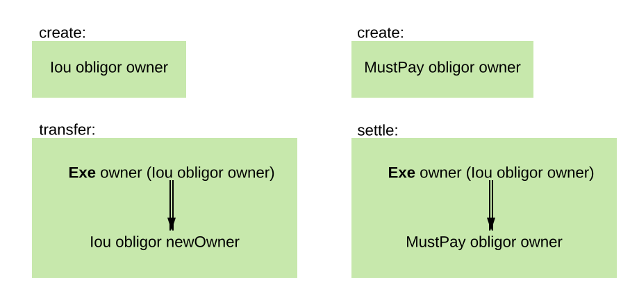
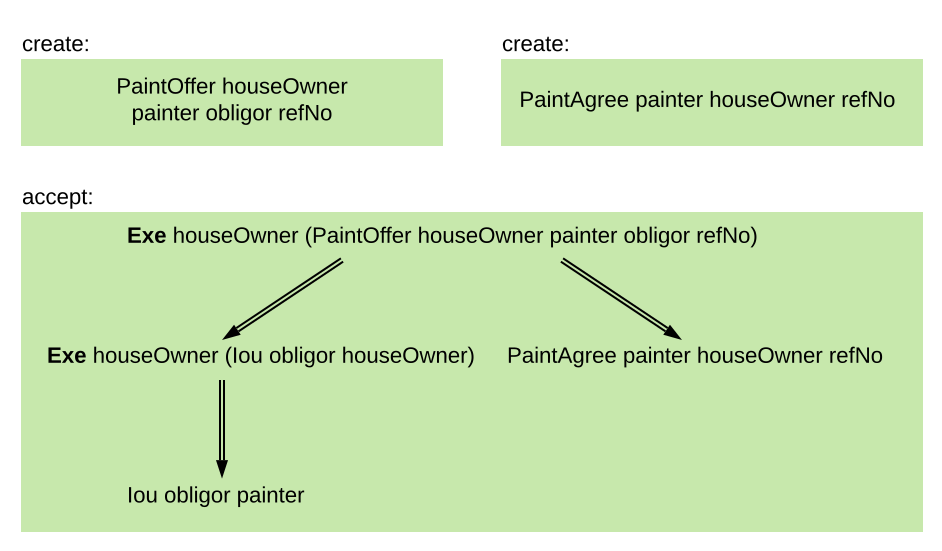
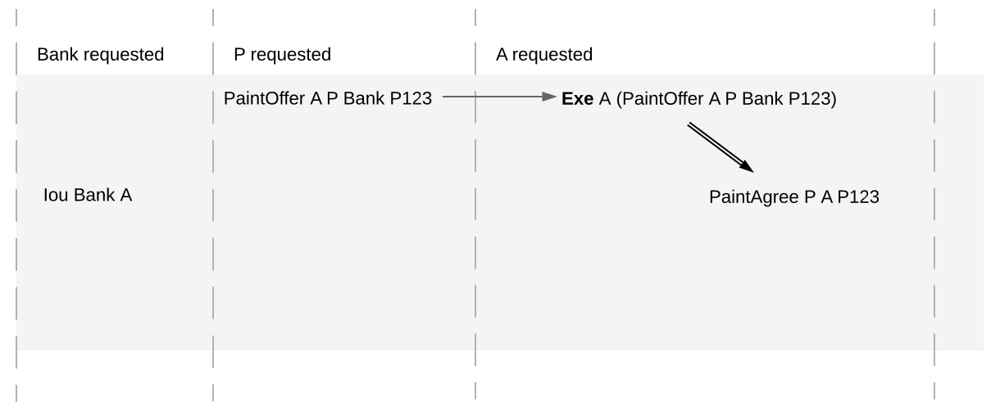
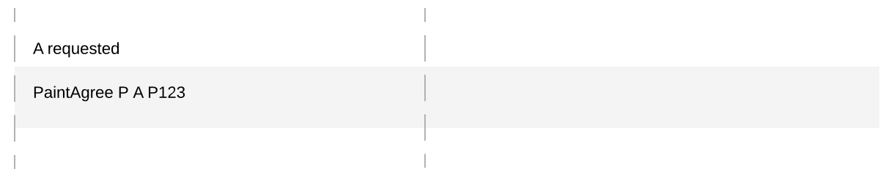
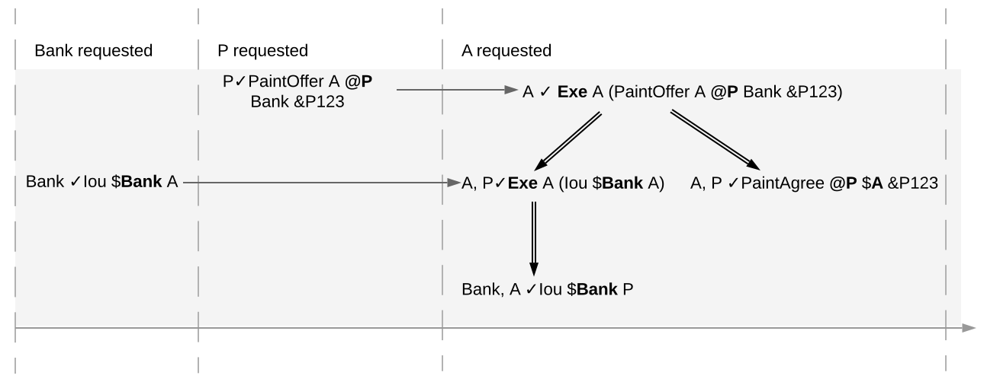
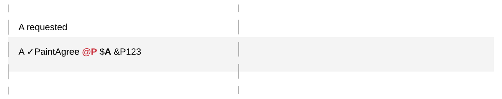
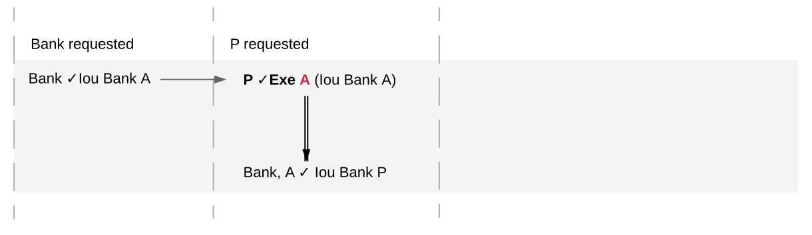

.. Copyright (c) 2023 Digital Asset (Switzerland) GmbH and/or its affiliates. All rights reserved.
.. SPDX-License-Identifier: Apache-2.0

.. _da-model-integrity:

Integrity
#########

The section on the :ref:`ledger structure <ledger-structure>` section answered the question “What does the Ledger looks like?” by introducing a hierarchical format to record the party interactions as changes.
The section on `privacy <ledger-privacy>` answered the question “Who sees which changes and data?” by introducing projections.
This section addresses the question "Who can request which changes?" by defining which ledgers are valid.

.. _da-model-validity:

Validity
********

At the core is the concept of a *valid ledger*; a change is permissible if adding the corresponding commit to the ledger results in a valid ledger.
**Valid ledgers** are those that fulfill three conditions:

* :ref:`Consistency <da-model-consistency>`:
  Exercises and fetches on inactive contracts are not allowed, i.e. contracts that have not yet been created or have already been consumed by an exercise.

* :ref:`Conformance <da-model-conformance>`:
  Only a restricted set of actions is allowed on a given contract.
  This restriction is encoded via the Daml templates that implement the smart contract logic.

* :ref:`Authorization <da-model-authorization>`:
  The parties who may request a particular change are restricted.

Later sections add further validity conditions as they increase the expressivity of the ledger model.
Intuitively, the :ref:`running example of the DvP workflow <da-dvp-ledger>` should be and actually is valid.
It is instructive to look at examples that violate some validity condition though,
even before they are defined precisely.

.. _da-model-consistency-violation:

Consistency violation example
=============================
In this example, Alice tries to transfer her asset twice ("double spend"), once to Bob and once to Charlie,
as shown in the following Daml script excerpt.
This script is expected to fail at runtime.

.. literalinclude:: ./daml/SimpleAsset.daml
   :language: daml
   :start-after: SNIPPET-double-spend-START
   :end-before: SNIPPET-double-spend-END

The corresponding Canton ledger looks as shown below.
This ledger violates the consistency condition because contract #1 is the input to two consuming exercise nodes,
one in ``TX 1`` and one in ``TX 2``.

.. https://lucid.app/lucidchart/9fb12975-8d57-4f73-9c81-0154879c3cc9/edit
.. image:: ./images/asset-double-spend.svg
   :align: center
   :width: 75%
   :alt: An inconsistent ledger where Alice double-spends her asset

Conformance violation example
=============================
         
In the second example, the last transaction ``TX 4`` omits one leg of the DvP workflow:
Bob exercises the ``Settle`` choice, but it has only one subaction, namely Alice transferring her IOU.
This violates conformance because the implementation of the ``Settle`` choice on a ``SimpleAsset`` mandates that there are two consequences.
(This situation cannot be expressed as a Daml script scenario
because Daml script ensures that all generated transactions conform to the Daml code.)

.. https://lucid.app/lucidchart/30be82bc-9d5c-4531-b7ff-3762eaa0a72d/edit
.. image:: ./images/dvp-ledger-one-leg-only.svg
   :align: center
   :width: 100%
   :alt: A non-conformant ledger where one leg of the DvP settlement is missing

Authorization violation examples
================================
         
The next three examples show different kinds of authorization violations.
First, Alice attempts to steal Bob's asset by requesting a transfer in his name.
This results in an authorization failure because for ``TX 1`` the actor of the exercise root action differs from the requester.

.. literalinclude:: ./daml/SimpleAsset.daml
   :language: daml
   :start-after: SNIPPET-steal-START
   :end-before: SNIPPET-steal-END

.. https://lucid.app/lucidchart/c26ab5f9-b2e2-4ed5-82d4-2af02fec2edc/edit
.. image:: ./images/asset-steal.svg
   :align: center
   :width: 50%
   :alt: A ledger where Alice submits a transaction where Bob exercises the transfer choice on his asset

Next, Bob wants to skip the propose-accept workflow for creating the ``SimpleDvP`` contract and instead creates it out of nowhere and immediately settles it.
This must be treated as an authorization failure, as Alice did not consent to swapping her EUR asset against Bob's USD asset.

.. literalinclude:: ./daml/SimpleDvP.daml
   :language: daml
   :start-after: SNIPPET-create-auth-error-START
   :end-before: SNIPPET-create-auth-error-END

On the ledger, the first root action of ``TX 2`` is not properly authorized
because Alice is a signatory of the contract #3 created in the first root action even though she did not request the update.

.. https://lucid.app/lucidchart/cd2cef11-6f69-4f9c-8e1e-d79488547de2/edit
.. image:: ./images/dvp-ledger-create-auth-failure.svg
   :align: center
   :width: 100%
   :alt: A ledger with an authorization violation on the creation of the DvP contract

The third example shows that authorization failures may not only happen at root actions.
Here, Alice allocates Carol's CHF asset in the DvP proposal.
When Bob tries to settle the DvP, the Exercise to transfer Carol's asset in the first leg is not properly authorized
because Carol did not agree to have her asset transferred away.

.. literalinclude:: ./daml/SimpleDvP.daml
   :language: daml
   :start-after: SNIPPET-nested-auth-error-START
   :end-before: SNIPPET-nested-auth-error-END

The ledger produced by this script has an authorization failure for the Exercise node on contract #1:
The transaction structure provides no evidence that the actor Carol has agreed to exercising the ``Transfer`` choice on her asset.

.. https://lucid.app/lucidchart/50e2ad7a-ef88-4fb8-bf62-44027034a3dd/edit
.. image:: ./images/dvp-ledger-nested-auth-error.svg
   :align: center
   :width: 100%
   :alt: A ledger with an authorization failure where Alice allocates Carol's asset to her DvP with Bob

.. _da-model-consistency:

Consistency
***********

Consistency can be summarized on one sentence:
Contracts must be created before they are used, and they cannot be used after they are consumed.
This section introduces the notions that are needed to make this precise.

Execution order
===============

The meaning of "before" and "after" is given by establishing an execution order on the nodes of a ledger.
The ledger's graph structure already defines a :ref:`happens-before order <da-ledger-definition>` on ledger commits.
The execution order extends this happens-before order to all the nodes within the commits' transactions
so that "before" and "after" are also defined for the nodes of a single transaction.
This is necessary because a contract can be created and used multiple times within a transaction.
In the ``AcceptAndSettle`` :ref:`action of the DvP example <da-dvp-propose-accept-and-settle-action>`, for example,
contract #3 is used twice (once in the non-consuming exercise at the root and once consumingly in the first consequence)
and contract #4 is created and consumed in the same action.

.. admonition:: Definiton: execution order

   For two distinct nodes `n`:sub:`1` and `n`:sub:`2` within the same action or transaction, `n`:sub:`1` **executes before** `n`:sub:`2`
   if `n`:sub:`1` appears before `n`:sub:`2` in the preorder traversal of the (trans)action, noting that the transaction is an ordered forest.
   For a ledger, every node in commit `c`:sub:`1` **executes before** every node in commit `c`:sub:`2`
   if the commit `c`:sub:`1` happens before `c`:sub:`2`.

..
   Note: This definition assumes that all nodes inside a transaction are totally ordered.
   This need to be revisited if we keep rollback nodes.
     
Diagrammatically, the execution order is given by traversing the trees from root to leaf and left to right:
the node of a parent action executes before the nodes in the subactions, and otherwise the nodes on the left precede the nodes on the right.
For example, the following diagram shows the execution order with bold green arrows for the running DvP example.
So a node `n`:sub:`1` executes before `n`:sub:`2` if and only if there is a non-empty path of green arrows from `n`:sub:`1` to `n`:sub:`2`.

.. _da-dvp-ledger-execution-order:

.. https://lucid.app/lucidchart/e3e9a609-b5bd-4faf-beb8-cd1166b160f1/edit
.. image:: ./images/dvp-ledger-execution-order.svg
   :align: center
   :width: 100%
   :alt: The execution order of the DvP ledger

The execution order is always a strict partial order.
That is, no node executes before itself (irreflexivity) and whenever node `n`:sub:`1` executes before `n`:sub:`2` and `n`:sub:`2` executes before `n`:sub:`3`, then `n`:sub:`1` also executes before `n`:sub:`3` (transitivity).
This property follows from the ledger being a directed acyclic graph of commits.

The execution order extends naturally to actions on the ledger by looking at how the action's nodes are ordered.
In particular, an action always executes before its subactions.

Internal consistency
====================

Internal consistency ensures that if several nodes act on a contract within an action, transaction, or ledger,
then those nodes execute in an appropriate order.

.. _def-contract-consistency:

.. admonition:: Definition: internal consistency

   An action, transaction, or ledger is **internally consistent for a contract** `c`
   if for any two distinct nodes `n`:sub:`1` and `n`:sub:`2` on `c` in the action, transaction, or ledger,
   all of the following hold:

   * If `n`:sub:`1` is a **Create** node, `n`:sub:`1` executes before `n`:sub:`2`.

   * If `n`:sub:`2` is a consuming **Exercise** node, then `n`:sub:`1` executes before `n`:sub:`2`.

   The action, transaction or ledger is **internally consistent for a set of contracts**
   if it is internally consistent for each contract in the set.
   It is **internally consistent** if it is internally consistent for all contracts.

For example, transaction ``TX 3`` shown above in the :ref:`execution order example <da-dvp-ledger-execution-order>` is internally consistent,
as the following analysis shows.
The nodes in the transaction involve six contracts #1 to #6.

* Contracts #1, #5, and #6 appear only in one node each, namely ⑨, ⑩, and ⑫, respectively.
  ``TX 3`` is therefore trivially consistent for these contracts.

* Contract #2 appears in the Fetch node ⑥ and the Exercise node ⑪.
  So internal consistency holds for #2 because the first condition does not apply and the second one is satisfied
  as ⑪ is consuming and ⑥ executes before ⑪.

* Contract #3 appears in the two Exercise nodes ④ and ⑤.
  Since the consuming ⑤ executes after the non-consuming ④, internal consistency holds also for #3.

* Contract #4 is created in ⑦ and consumed in ⑧.
  So both conditions require that ⑦ executes before ⑧, which is the case here.

By similar reasoning, the whole ledger consisting of ``TX 0``, ``TX 1``, ``TX 2``, and ``TX 3`` is internally consistent.

In contrast, the next diagram shows that the ledger in the :ref:`consistency violation example <da-model-consistency-violation>` is not internally consistent for contract #1.
This contract appears in nodes ①, ②, and ④.
The first condition is satisfied because the Create node ① executes before both other nodes ② and ④.
The second condition is satisfied for `n`:sub:`1` = ② and `n`:sub:`2` = ④,
but violated for `n`:sub:`1` = ④ and `n`:sub:`2` = ② as ④ does not execute before ②.

.. https://lucid.app/lucidchart/8c9a03ef-6ab0-4105-811a-161e5587cf1c/edit
.. image:: ./images/asset-double-spend-execution-order.svg
   :align: center
   :width: 75%
   :alt: The execution order of the ledger where Alice double-spends her asset

.. note::
   Internal consistency constrains the order of the commits in a Ledger via the execution order.
   In the running DvP example, ``TX 0``, ``TX 1``, and ``TX 2`` all create contracts that ``TX 3`` uses.
   Internal consistency therefore demands that these create nodes execute before the usage nodes in ``TX 3``.
   So by the definition of the execution order, ``TX 0``, ``TX 1``, and ``TX 2`` all must happen before ``TX 3``
   (although internal consistency does not impose any particular order among ``TX 0``, ``TX 1``, and ``TX 2``).

Internal consistency does not require Create nodes for all contracts that are used.
This way, internal consistency is meaningful for pieces of a ledger such as individual transactions or actions,
which may use contracts created earlier as inputs.

.. _da-model-contract-consistency:

Contract consistency
====================

Contract consistency strengthens internal consistency in that used contracts actually have been created within the action, transaction, or ledger.

.. admonition:: Definition: contract consistency

   An action, transaction, or ledger is **consistent for a contract** if all of the following hold:
   
   * It is internally consistent for the contract.
     
   * If a node uses the contract, then there is also a node that creates the contract.

   It is **consistent for a set of contracts** if it is consistent for all contracts in the set.
   It is **consistent** if it is consistent for all contracts.

For example, the above DvP ledger is consistent because it is internally consistent and all used contracts are created.

Interaction with projection
===========================

:ref:`Projections <da-model-projections>` retain the execution order and preserve (internal) consistency only to some extent.
For example, Alice's :ref:`projection of the DvP workflow <da-dvp-ledger-projections>` is not consistent
because it lacks ``TX 1`` and therefore the creation of contract #2 used in ``TX 3``.

Fortunately, consistency behaves well under projections if we look only at contracts the parties are stakeholders of.
In detail, if an action, transaction, or ledger is (internally) consistent for a set of contracts `C`
and `P` is a set of parties such that every contract in `C` has at least one stakeholder in `P`,
then the projection to `P` is also (internally) consistent for `C`.

To see this, note that the execution order of the projection of an action or transaction to `P`
is the restriction of the execution order of the unprojected action or transaction to the projection.
That is, if `n`:sub:`1` and `n`:sub:`2` are two nodes in the projection,
then `n`:sub:`1` executes before `n`:sub:`2` in the projection if and only if
`n`:sub:`1` executes before `n`:sub:`2` in the original (trans)action.
Accordingly, projections preserve internal consistency of an action or transaction too.
Moreover, the projection to `P` never removes a Create node if one of the stakeholders is in `P`.
Therefore, consistency is preserved too.
For ledgers, the same argument applies with the current simplification of totally ordered ledgers.
The :ref:`causality section <local-ledger>` relaxes the ordering requirement, but makes sure
that projections continue to preserve (internal) consistency for the parties' contracts.

From Canton's perspective, the dual property is at least as important:
If the projection of a (trans)action or ledger to a set of parties `P` is (internally) consistent for a set of contracts `C`
where each contract has at least one signatory in `P`,
then so is the (trans)action or ledger itself.
This statement can be shown with a similar argument.

Importantly, this property requires a *signatory* of the contracts in `P`, not just a stakeholder.
The following example shows that the propery does not hold if `P` contains a stakeholder, but no signatory.
To that end, we extend the ``SimpleAsset`` template with a non-consuming ``Present`` choice
so that the issuer and owner can show the asset to a choice observer ``viewer``:

.. literalinclude:: ./daml/SimpleAsset.daml
   :language: daml
   :start-after: SNIPPET-ASSET-PRESENT-START
   :end-before: SNIPPET-ASSET-PRESENT-END

In the following script, Alice transfers her EUR asset to Bob and then later the Bank wants to show Alice's EUR asset to Vivian.
Such a workflow can happen naturally when Alice submits her transfer concurrently with the Bank submitting the ``Present`` command,
and the Synchronizer happens to order Alice's submission first.

.. literalinclude:: ./daml/SimpleAsset.daml
   :language: daml
   :start-after: SNIPPET-projection-reflect-START
   :end-before: SNIPPET-projection-reflect-END

The next diagram shows the corresponding ledger and Alice's projection thereof.
The projection does not include the non-consuming Exercise ④ because Alice is not a signatory of the EUR asset #1 and therefore not an informee of ④.
Alice's projection is therefore consistent for contract #1.
In contrast, the original ledger violates internal consistency for #1, namely the second condition:
for `n`:sub:`2` as ② and `n`:sub:`1` as ④, the consuming exercise ② does not execute after ④.

.. https://lucid.app/lucidchart/d9be439e-ae1b-4226-af8d-76a43222fed0/edit
.. image:: ./images/asset-projection-reflect-consistency.svg
   :align: center
   :width: 75%
   :alt: An inconsistent ledger where Alice's projection is consistent

With signatories instead of stakeholders, this problem does not appear:
A signatory is an informee of all nodes on the contract and therefore any node relevant for consistency for the contract is present in the signatory's projection.

.. wip::

   * Key consistency (should be transaction-internal only: consistent lookups)

   * Consistency (transaction-internal and ledger-wide, contract ID and key):
     Discuss limitation of honest signatories/maintainers

   * Move the examples to valid ledgers

..
  Parking lot

  Input and output contracts
  ==========================

  The :ref:`ledger structure section <da-ledger-input-output>` already introduced the idea of input and output contracts.

.. 
  The next section discusses the criteria that rule out the above examples as
  invalid ledgers.
  
  Ledger projections do not always satisfy the definition of
  consistency, even if the ledger does. For example, in P's view, `Iou Bank A` is
  exercised without ever being created, and thus without being made
  active. Furthermore, projections can in general be
  non-conformant. However, the projection for a party `p` is always
  
  - internally consistent for all contracts,
  - consistent for all contracts on which `p` is a stakeholder, and
  - consistent for the keys that `p` is a maintainer of.
  
  In other words,
  `p` is never a stakeholder on any input contracts of its projection. Furthermore, if the
  contract model is **subaction-closed**, which
  means that for every action `act` in the model, all subactions of
  `act` are also in the model, then the projection is guaranteed to be
  conformant. As we will see shortly, Daml-based contract models are
  conformant. Lastly, as projections carry no information about the
  requesters, we cannot talk about authorization on the level of
  projections.
  

  Contract state
  ==============

  .. _def-contract-state:

  In addition to the consistency notions, the before-after relation on actions can also be used to define the notion of
  **contract state** at any point in a given transaction.
  The contract state is changed by creating the contract and by exercising it consumingly.
  At any point in a transaction, we can then define the latest state change in the obvious way.
  Then, given a point in a transaction, the contract state of `c` is:

  #. **active**, if the latest state change of `c` was a create;

  #. **archived**, if the latest state change of `c` was a consuming exercise;

  #. **inexistent**, if `c` never changed state.

  A ledger is consistent for `c` exactly if **Exercise** and **Fetch** actions on `c` happen only when `c` is active,
  and **Create** actions only when `c` is inexistent.
  The figures below visualize the state of different contracts at all points in the example ledger.

  .. https://www.lucidchart.com/documents/edit/19226d95-e8ba-423a-8546-e5bae6bd3ab7
  .. figure:: ./images/consistency-paint-offer-activeness.svg
     :align: center
     :width: 100%
     :alt: The first time sequence from above. Every action in the first and second commits is inexistent; in the third commit, Exe A (PaintOffer P A P123) is active while all the actions below it are archived.

     Activeness of the `PaintOffer` contract

  .. https://www.lucidchart.com/documents/edit/19226d95-e8ba-423a-8546-e5bae6bd3ab7
  .. figure:: ./images/consistency-alice-iou-activeness.svg
     :align: center
     :width: 100%
     :alt: The same time sequence as above, but with PaintOffer P A P123 in the second commit and Exe A (Iou Bank A) in the third commit also active.

     Activeness of the `Iou Bank A` contract

  The notion of order can be defined on all the different ledger structures: actions, transactions, updates,
  and ledgers.
  Thus, the notions of consistency, inputs and outputs, and contract state can also all be defined on all these
  structures.
  The **active contract set** of a ledger is the set of all contracts
  that are active on the ledger. For the example above, it consists
  of contracts `Iou Bank P` and `PaintAgree P A`.

  .. _def-input-contract:

  Definition »input contract«
     For an internally consistent transaction,
     a contract `c` is an **input contract** of the transaction
     if the transaction contains an **Exercise** or a **Fetch** action on `c` but not a **Create c** action.

  .. _def-output-contract:

  Definition »output contract«
     For an internally consistent transaction,
     a contract `c` is an **output contract** of the transaction
     if the transaction contains a **Create c** action, but not a consuming **Exercise** action on `c`.

  Note that
  the input and output contracts are undefined for transactions that are not
  internally consistent. The image below shows some examples of internally consistent
  and inconsistent transactions.

  .. figure:: ./images/internal-consistency-examples.svg
     :align: center
     :width: 100%
     :alt: Three transactions involving an Iou between Bank A and Bank B, as described in the caption.

     The first two transactions violate the conditions of internal consistency.
     The first transaction creates the `Iou` after exercising it consumingly, violating both conditions.
     The second transaction contains a (non-consuming) exercise on the `Iou` after a consuming one, violating the second condition.
     The last transaction is internally consistent.

.. _da-model-conformance:

Conformance
***********

The *conformance* condition constrains the actions that may occur on the
ledger. This is done by considering a **contract model** `M` (or a **model** for short),
which specifies the set of all possible actions. A ledger is **conformant to M**
(or conforms to M) if all top-level actions on the ledger are members of `M`.
Like consistency, the notion of conformance does not depend on the requesters of
a commit, so it can also be applied to transactions and lists of transactions.

For example, the set of allowed actions on IOU contracts could be
described as follows.

.. https://www.lucidchart.com/documents/edit/e181e9fc-634c-49e3-911e-a07b5da28bf8/0

The boxes in the image are templates in the sense that the contract
parameters in a box (such as
obligor or owner) can be instantiated by arbitrary values of the
appropriate type. To facilitate understanding, each box includes a label
describing the intuitive purpose of the corresponding set of actions.
As the image suggests, the transfer box imposes the
constraint that the bank must remain the same both in the exercised
IOU contract, and in the newly created IOU contract. However, the
owner can change arbitrarily. In contrast, in the settle actions, both
the bank and the owner must remain the same.
Furthermore, to be conformant, the actor of a transfer action must be the same as the owner of the contract.

Of course, the constraints on the relationship between the parameters can be
arbitrarily complex, and cannot conveniently be reproduced in this
graphical representation. This is the role of Daml -- it
provides a much more convenient way of representing contract models.
The link between Daml and contract models is explained in more detail in a :ref:`later section <da-model-daml>`.

To see the conformance criterion in action, assume that
the contract model allows only the following actions on `PaintOffer`
and `PaintAgree` contracts.

.. https://www.lucidchart.com/documents/edit/1ea6f551-c212-4620-9417-27784adccbcc

The problem with the example where Alice changes the
offer's outcome to avoid transferring the money now
becomes apparent.

`A`'s commit is not conformant to the contract model, as the model does
not contain the top-level action she is trying to commit.

.. _da-model-authorization:

Authorization
*************

The last criterion rules out the last two problematic examples,
:ref:`an obligation imposed on a painter <obligation-imposed-on-painter>`,
and :ref:`the painter stealing Alice's money <painter-stealing-ious>`.
The first of those is visualized below.

The reason why the example is intuitively impermissible is that
the `PaintAgree` contract is supposed to express that the painter has an
obligation to paint Alice's house, but he never agreed to that obligation.
On paper contracts, obligations are expressed in the body of the contract,
and imposed on the contract's *signatories*.

.. _da-signatories-maintainers:

Signatories and Maintainers
========================================

To capture these elements of real-world contracts, the **contract model**
additionally specifies, for each contract in the system:

#. A non-empty set of **signatories**, the parties bound by the
   contract.

#. If the contract is associated with a key, a non-empty set of **maintainers**,
   the parties that make sure that at most one unconsumed contract exists for the key.
   The maintainers must be a subset of the signatories and depend only on the key.
   This dependence is captured by the function `maintainers` that takes a key and returns the key's maintainers.

In the example, the contract model specifies that

#. An `Iou obligor owner` contract has only the `obligor` as a signatory.

#. A `MustPay obligor owner` contract has both the `obligor`
   and the `owner` as signatories.

#. A `PaintOffer houseOwner painter obligor refNo` contract has only the
   painter as the signatory.
   Its associated key consists of the painter and the reference number.
   The painter is the maintainer.

#. A `PaintAgree houseOwner painter refNo` contract has both the
   house owner and the painter as signat
   The key consists of the painter and the reference number.
   The painter is the only maintainer.

In the graphical representation below, signatories of a contract are indicated
with a dollar sign (as a mnemonic for an obligation) and use a bold
font. 
Maintainers are marked with `@` (as a mnemonic who enforces uniqueness).
Since maintainers are always signatories, parties marked with `@` are implicitly signatories.
For example, annotating the paint offer acceptance action with
signatories yields the image below.

.. https://www.lucidchart.com/documents/edit/4a3fdcbc-e521-4fd8-a636-1035b4d65126/0

.. _da-ledgers-authorization-rules:

Authorization Rules
===================

Signatories allow one to precisely state that the painter has an obligation.
The imposed obligation is intuitively invalid because the painter did not
agree to this obligation. In other words, the painter did not *authorize*
the creation of the obligation.

In a Daml ledger, a party can **authorize** a subaction of a commit in
either of the following ways:

* Every top-level action of the commit is authorized by all requesters
  of the commit.

* Every consequence of an exercise action `act` on a contract `c` is
  authorized by all signatories of `c` and all actors of `act`.

The second authorization rule encodes the offer-acceptance pattern,
which is a prerequisite for contract formation in contract law. The
contract `c` is effectively an offer by its signatories who act as
offerers. The exercise is an acceptance of the offer by the actors who
are the offerees. The consequences of the exercise can be interpreted
as the contract body so the authorization rules of Daml
ledgers closely model the rules for contract formation in contract
law.

.. _da-ledgers-def-well-authorized:

.. _da-ledgers-required-authorizers:

A commit is **well-authorized** if every subaction `act` of the commit is
authorized by at least all of the **required authorizers** of `act`, where:

#. the required authorizers of a **Create** action on a contract `c` are the
   signatories of `c`.

#. the required authorizers of an **Exercise** or a **Fetch** action are its actors.

#. the required authorizers of a **NoSuchKey** assertion are the maintainers of the key.

We lift this notion to ledgers, whereby a ledger is well-authorized exactly when all of its commits are.

Examples
========

An intuition for how the authorization definitions work is most easily
developed by looking at some examples. The main example, the
paint offer ledger, is intuitively legitimate. It should therefore
also be well-authorized according to our definitions,
which it is indeed.

In the visualizations below,
`Π ✓ act` denotes that the parties `Π` authorize the
action `act`. The resulting authorizations are shown below.

.. https://www.lucidchart.com/documents/edit/9df74ad9-b781-4974-bbb5-e67c7f03d196/0

In the first commit, the bank authorizes the creation of the IOU by
requesting that commit. As the bank is the sole signatory on the
IOU contract, this commit is well-authorized. Similarly, in the second
commit, the painter authorizes the creation of the paint offer contract,
and painter is the only signatory on that contract, making this commit
also well-authorized.

The third commit is more complicated. First, Alice authorizes
the exercise on the paint offer by requesting it. She is the only actor
on this exercise, so this complies with the authorization requirement.
Since the painter is the signatory of the paint offer, and Alice
the actor of the exercise, they jointly authorize all consequences
of the exercise. The first consequence is an exercise on the IOU, with
Alice as the actor, so this is permissible. 
The second consequence is the creation of the new IOU (for P) by exercising the old IOU (for A).
As the IOU was formerly signed by the bank, with Alice as the actor of the exercise, they jointly authorize this creation.
This action is permissible as the bank is the sole signatory.
The final consequence is creating the paint agreement with Alice and the painter as signatories.
Since they both authorize the action, this is also permissible.
Thus, the entire third commit is also well-authorized, and so is the ledger.

Similarly, the intuitively problematic examples
are prohibited by our authorization criterion. In the
first example, Alice forced the painter to paint her house. The
authorizations for the example are shown below.

.. https://www.lucidchart.com/documents/edit/6a05add2-7ec9-4a6a-bb9b-7103bf35390f

Alice authorizes the **Create** action on the `PaintAgree` contract by
requesting it. However, the painter is also a signatory on the
`PaintAgree` contract, but he did not authorize the **Create** action.
Thus, this ledger is indeed not well-authorized.

In the second example, the painter steals money from Alice.

.. https://www.lucidchart.com/documents/edit/e895410e-6e77-4686-9fc6-0286a064f420

The bank authorizes the creation of the IOU by requesting this action.
Similarly, the painter authorizes the exercise that transfers the IOU
to him. However, the actor of this exercise is Alice, who has not
authorized the exercise. Thus, this ledger is not
well-authorized.

Valid Ledgers, Obligations, Offers and Rights
*********************************************

Daml ledgers are designed to mimic real-world interactions between
parties, which are governed by contract law. The validity conditions
on the ledgers, and the information contained in contract models have
several subtle links to the concepts of the contract law that are
worth pointing out.

First, contracts specify implicit **on-ledger
obligations**, which result from consequences of the exercises on
contracts. For example, the `PaintOffer` contains an on-ledger
obligation for `A` to transfer her IOU in case she accepts the offer.

Second, every contract on a Daml ledger can model a real-world offer, 
whose consequences (both on- and off-ledger) are specified by the 
**Exercise** actions on the contract allowed by the contract model.

Third, in Daml ledgers, as in the real world, one person's rights are
another person's obligations. For example, `A`'s right to accept the
`PaintOffer` is `P`'s obligation to paint her house in case she
accepts.
In Daml ledgers, a party's rights according to a contract model are 
the exercise actions the party can perform, based on the authorization 
and conformance rules.

Finally, validity conditions ensure three important properties of the Daml
ledger model, that mimic the contract law.

#. **Obligations need consent**.
   Daml ledgers follow the offer-acceptance pattern of the
   contract law, and thus ensures that all ledger contracts are
   formed voluntarily. For example, the following
   ledger is not valid.

   .. https://www.lucidchart.com/documents/edit/6a05add2-7ec9-4a6a-bb9b-7103bf35390f
   .. image:: ./images/authorization-invalid-obligation.svg
     :align: center
     :width: 100%
     :alt: The time sequence for a scenario where Alice forces the painter to paint her house, explained previously in the Authorization Rules Example section.

#. **Consent is needed to take away on-ledger rights**.
   As only **Exercise** actions consume contracts, the rights cannot be taken
   away from the actors; the contract model specifies exactly who the
   actors are, and the authorization rules require them to approve the
   contract consumption.

   In the examples, Alice had the right to transfer her IOUs;
   painter's attempt to take that right away from her, by performing
   a transfer himself, was not valid.

   .. https://www.lucidchart.com/documents/edit/e895410e-6e77-4686-9fc6-0286a064f420
   .. image:: ./images/authorization-stealing-ious.svg
     :align: center
     :width: 100%
     :alt: The time sequence for a scenario where the painter steals Alice's money, explained previously in the Authorization Rules Example section.

   Parties can still **delegate** their rights to other parties. For
   example, assume that Alice, instead of accepting painter's offer,
   decides to make him a counteroffer instead. The painter can
   then accept this counteroffer, with the consequences as before:

   .. https://www.lucidchart.com/documents/edit/ba64b0d2-776a-4c94-a9be-b76948a76632
   .. image:: ./images/counteroffer-acceptance.svg
     :align: center
     :width: 60%
     :name: counteroffer-acceptance
     :alt: The original PaintAgreement flow chart, but now the topmost contract is the CounterOffer.

   Here, by creating the `CounterOffer` contract, Alice delegates
   her right to transfer the IOU contract to the painter. In case of
   delegation, prior to submission, the requester must get informed about the contracts
   that are part of the requested transaction, but where the requester
   is not a signatory. In the example above, the
   painter must learn about the existence of the IOU for Alice before
   he can request the acceptance of the `CounterOffer`. The
   concepts of observers and divulgence, introduced in the next
   section, enable such scenarios.

#. **On-ledger obligations cannot be unilaterally escaped**. Once an
   obligation is recorded on a Daml ledger, it can only be removed in
   accordance with the contract model. For example, assuming the IOU
   contract model shown earlier, if the ledger records the creation
   of a `MustPay` contract, the bank cannot later simply record an
   action that consumes this contract:

   .. https://www.lucidchart.com/documents/edit/521f4ec6-9152-447d-bda8-c0c636d7635f
   .. image:: ./images/validity-no-removal-of-obligations.svg
      :align: center
      :width: 100%
      :alt: A time sequence in which the first commit includes the creation of a MustPay contract and the second commit includes the bank consuming this contract, as described above.

   That is, this ledger is invalid, as the action above is not
   conformant to the contract model.
