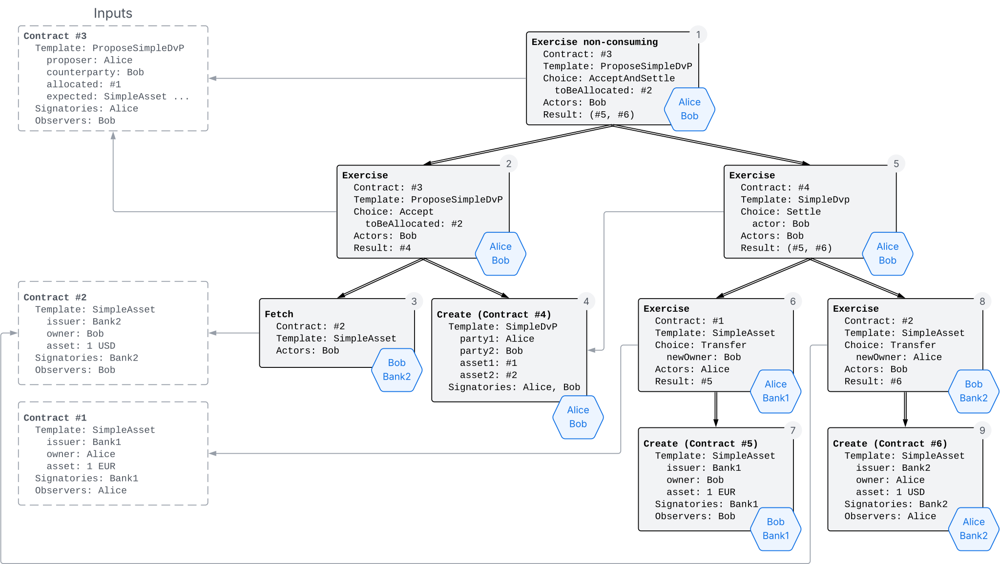
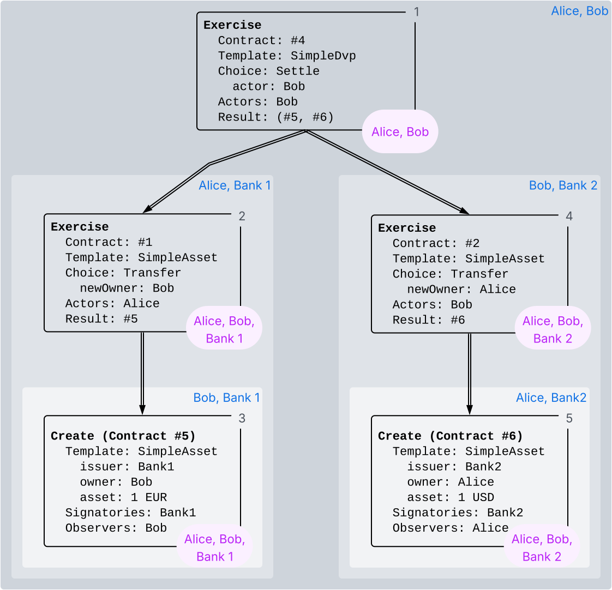
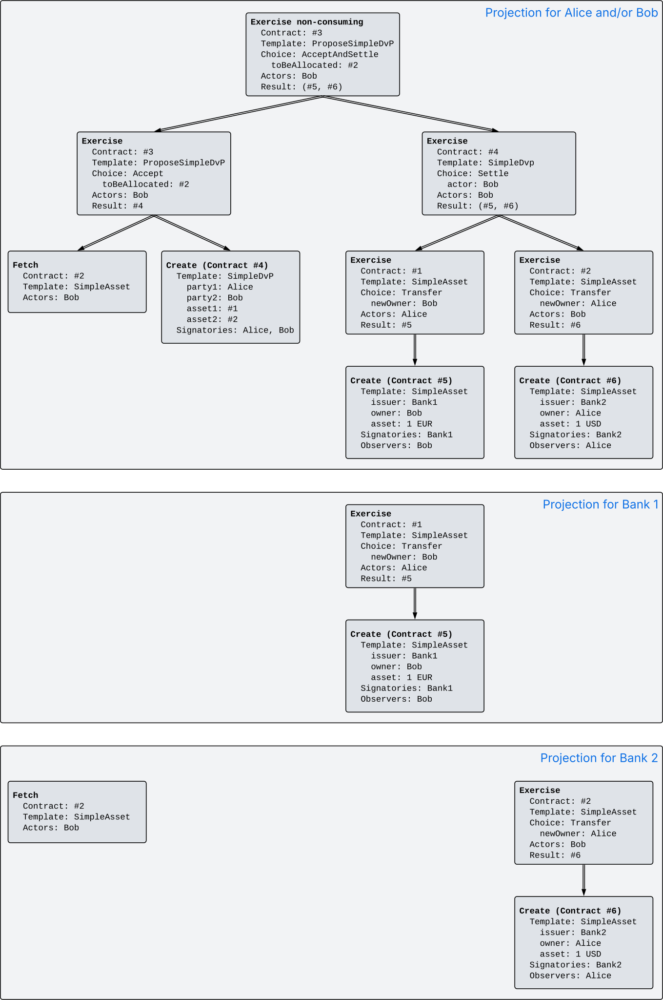
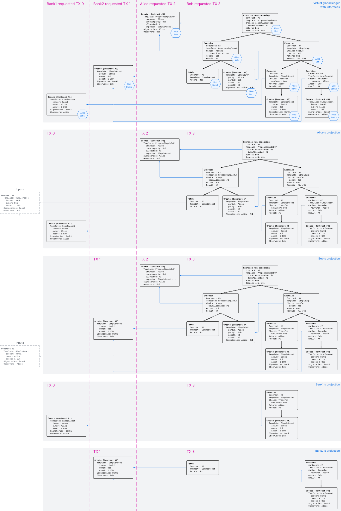

.. Copyright (c) 2023 Digital Asset (Switzerland) GmbH and/or its affiliates. All rights reserved.
.. SPDX-License-Identifier: Apache-2.0

.. _da-model-privacy:

Privacy
#######

The :ref:`ledger structure section <ledger-structure>` answered the question "What does the Ledger looks like?" by introducing a hierarchical format to record the party interactions as changes.
This section addresses the question "Who sees which changes and data?".
That is, it explains the privacy model for Canton Ledgers.

The privacy model of Canton Ledgers is based on a **need-to-know basis**,
and provides privacy **on the level of subtransactions**.
Namely, a party learns only those parts of party interactions that affect contracts in which the party has a stake,
and the consequences of those interactions.
The hierarchical structure is key here because it yields a natural notion of sub-transaction privacy.
To make the sub-transaction privacy notion precise, we introduce the concepts of *informee* and *witness*.

Informee
********

A party can take different roles in Daml templates and choices;
the party can be declared as ``signatory``, choice ``controller``, or contract or choice ``observer``.
For a contract, a party is a **stakeholder** if it is a signatory or contract observer of the contract.

* Every contract and choice ``observer`` should observe changes to the contract (creation or archival) and exercises of a choice, respectively, as the name suggests.
  
* A ``signatory`` is bound by a contract and thus has a stake in it;
  they should learn when the contract is created or used.

* An actor of an Exercise, which is the ``controller`` of the choice, has a stake in the action and should therefore see the exercise;
  they may not have a stake in the contract though.
  
These observations motivate the following definition of an **informee**, namely the set of parties that should be informed about an action.
The informees for a node are the union of the sets marked with X in the following table,

.. _def-informee:

.. list-table:: Definiton: The **informees** of a node are the union of the sets marked with X.
   :widths: 20 20 20 20 20
   :header-rows: 1

   * - Action
     - Signatories
     - Contract observers
     - Actors
     - Choice observers
   * - **Create**
     - X
     - X
     -
     -
   * - consuming **Exercise**
     - X
     - X
     - X
     - X
   * - non-consuming **Exercise**
     - X
     - 
     - X
     - X
   * - **Fetch**
     - X
     - 
     - X
     - 

For example, the informees of a **Create** node are the stakeholders of the created contract, that is, the signatories and observers.
For consuming **Exercise** node, the informees consist of the stakeholders of the consumed contract, the action's actors and choice observers.

As a design decision, a contract observer is not informed about non-consuming **Exercise** and **Fetch** actions,
unless they are explicitly among the actors or choice observers.
This is because such actions do not change the state of the contract itself.

.. note::
   Templates can declare ``preconsuming`` and ``postconsuming`` choices.
   Daml compiles such choices to a non-consuming choice whose first or last consequence exercises the ``Archive`` choice on the template.
   Accordingly, contract observers are only informees of the ``Archive`` subaction, but not of the main ``Exercise`` action itself.

To illustrate the concept of informees, we use the :ref:`running example of Alice and Bob swapping their assets <ledger-structure_running_example>`.
The nodes in the ``AcceptAndSettle`` action have the informees shown in the blue hexagons of the next figure.
For example, Alice is an informee of the root node ① because she is a signatory of the input contract #3, and Bob is an informee because he is the actor of the choice.
Similarly, Bank 2 and Bob are informees of the Fetch node ③ because Bank 2 is a signatory of the input contract #2 and Bob is the actor.
Had Bob not been the actor, he would not be an informee because contract observers are not automatically informees of non-consuming Exercises and Fetches.

.. https://lucid.app/lucidchart/3176adad-0474-4755-bfb5-e323e1a65fab/edit

The informees for an action are the informees of its root node.
Importantly, nodes cannot exist without their children on the Ledger,
as mentioned in the :ref:`ledger structure section <actions-hierarchical-structure>`;
only actions can as they are whole trees.
Accordingly, the informees of an action are entitled to see all nodes in the action,
even if they are not informees of some of the individual nodes themselves.
This discrepancy is formalized under this notion of witnesses in the next section.

Witness
*******

A single node can be part of multiple actions.
For example, the diagram below extends the :ref:`subaction diagram <da-ledger-subaction>` with the informees shown in the top right corner of the borderless box for each subaction.
Here, the Create node ③ is part of three subactions, namely those rooted at nodes ①, ②, and ③.
Accordingly, this Create node is shown to the informees of all these actions, even if they are not informees of the node itself.
Those parties are called witnesses.
Formally, for a given transaction `tx`, the **witnesses** of a node in `tx` are the union of the informees of all subactions of `tx` that contain the node.
In particular, every informee of the node is also a witness.

The diagram shows the witnesses of a subaction in purple on its root action.
For node ③, the witnesses are Alice, Bob, and Bank 1, because Bob is an informee of ① and ③; Bank 1 is an informee of ② and ③; and Alice is an informee of ① and ②.

.. https://lucid.app/lucidchart/e5ee4a5f-3dda-4eec-a773-0ab3dde2c4ff/edit

.. _da-model-projections:

Projection
**********

Informees should see the changes they are entitled to see,
but this does not mean that they are entitled to see the entirety of any transaction that includes such a change.
This is made precise through *projections* of a transaction,
which define the view that a group of parties gets on a transaction.
Intuitively, given a transaction within a commit, a group of parties sees only the subtransaction consisting of all actions on contracts
whose informees include at least one of the parties.
Equivalently, the group of parties sees only those nodes whose witnesses include at least one of the parties.
Thus, privacy is obtained on the subtransaction level.

This section first defines projections for transactions and then for ledgers.

.. _da-model-transaction-projection:

Transaction projection
======================

The next diagram gives an example for a transaction with the ``AcceptAndSettle`` Exercise action as the only root action, whose informees are shown in the diagrams above.

.. _da-dvp-acceptandsettle-projection:

.. https://lucid.app/lucidchart/9b3762db-66b4-4e72-94cb-bcefd4c1a5ea/edit

Since both Alice and Bob are informees of the root action,
namely Bob exercising the ``AcceptAndSettle`` choice on Alice's ``ProposeSimpleDvP`` contract,
the projection to either Alice or Bob or both consists of the whole Exercise action.
As an action consists of the whole subtree underneath its root node,
Alice and Bob each see all the nodes they are witnesses of.
For example, Alice's projection includes the Fetch subaction, Bob's ``Transfer`` exercise of on #2, and the creation of Bob's ``SimpleAsset`` contract #5.
Similarly, Bob's projection includes Alice's ``Transfer`` Exercise on #1 and the creation of Alice's ``SimpleAsset`` contract #6.

In contrast, the banks are *not* informees of the root action.
In fact, Bank 1 appears as an informee only in the ``Transfer`` Exercise action on #1 and its subaction, the creation of Bob's new asset #5.
Accordingly, the projection to Bank 1 consists of just this Exercise action.
Bank 2 appears as an informee of two unrelated actions in the tree: the Fetch action and the ``Transfer`` Exercise action on #2.
The projection to Bank 2 therefore consists of a transaction with these two actions as root actions.
This shows that projection can turn a single root action into a list of subactions.

.. note::
   Note the privacy implications of the banks' projections.
   While each bank learns that a ``Transfer`` has occurred from Alice to Bob or vice versa,
   each bank does *not* learn anything about *why* the transfer occurred.
   In particular, Bank 2 does not learn what happens between the Fetch and the Exercise on contract #2.
   In practice, this means that Bank 1 and Bank 2 do not learn what Alice and Bob is exchanging their asset for,
   providing privacy to Alice and Bob with respect to the banks.

The projection to both Bank 1 and Bank 2 at the bottom shows that a projection to several parties may contain strictly more information than the projections to each of the parties together.
Said differently, it is impossible to reconstruct the projection to Bank 1 and Bank 2 solely from the projection for Bank 1 and the projection for Bank 2.
Here, this is because the order of the three root actions cannot be uniquely determined from the individual projections.
For this reason, projection is defined for a set of parties.

.. _def-tx-projection:

.. admonition:: Definition: projection
                
   The **projection** of a transaction for a set `P` of parties is the
   subtransaction obtained by doing the following for each root action `act` of the transaciton.

   #. If `P` contains at least one of the informees of `act`, keep `act` as-is, including its consequences.
   #. Else, if `act` has consequences, replace `act` by the projection (for `P`) of its consequences,
      which might be empty.
   #. Else, drop `act` including its consequences.

This definition does not operate on nodes, but on actions, that is, subtrees of nodes.
Accordingly, the projection of a transaction for a set of parties `P` contains a node if and only if `P` contains at least one of the witnesses of the node.

As a projection is a transaction, it is possible to project a projection further.
The projection operation has the following **absorbtion** property:

Projection to decreasing subsets of parties is absorbing.
That is, if a set of parties `P` is a subset of `Q`, then projecting a transaction first to `Q` and then to `P` is the same as projecting it directly to `P`.
Intuitively, this property expresses the fact that a group of parties jointly learns at least as much about a transaction as any subgroup of these parties learns by themselves.
The converse is false, as the above example with projection to Banks 1 and 2 has shown.

Conversely, if `P` is not a subset of `Q`, then projecting a transaction first to `Q` and then to `P` will merely result in a subtransaction of the projection to `P`.
For example, if we project the above projection for Bank 1 to Bob, the resulting transaction consists only of the Create action for contract #5.
This is a proper subtransaction of Bob's projection.

This difference reflects that Bank 1 learns less about the Exercise node than Bob.
In particular, Bank 1 cannot infer from its projection that Bob is a witness of the Exercise node.
This is a general pattern: the informees of an action may not learn about witnesses of nodes therein.
This is crucial from a privacy perspective
as it hides who is involved in the hidden parts of the transaction.

.. _da-model-ledger-projection:

Ledger projection
=================

Finally, the **projection of a ledger** `l` for a set `P` of parties is a DAG of updates obtained as follows:

* Project the transaction of each update in `l` for `P`, but retain the update ID.

* Remove updates with empty transactions from the result.

We defer defining the edges in the projection to the :ref:`causality section <local-ledger>`.
Until then, we pretend that the ledger is totally ordered and projections retain the same ordering.

Notably, the projection of a ledger is not a ledger, but a DAG of updates.
The requesters from the commit cannot be retained because they are typically witnesses of the actions in the projection,
but not informees.
Yet, the informees of the action must not know all the witnesses.
For example, if Bank 1's projection did mention Bob as the requester of the last commit,
then Bank 1 could infer that Bob is a witness of Alice exercising the ``Transfer`` choice on contract #1.

Projecting the ledger of the complete DvP example yields the following projections for each party.

.. _da-dvp-ledger-projections:

.. https://lucid.app/lucidchart/90b7f155-aadc-4bde-9c5c-b8198b824384/edit

Examine each party's projection in turn:

#. Alice sees all of the first, thrid, and forth commit
   as she is an informee of all root actions.
   In contrast, Alice does not see anything of the second commit,
   as she is not a stakeholder of Bob's ``SimpleAsset`` of 1 USD.
   This transaction is not present in Alice's projection at all.
   Yet, the output of this transaction (contract #2) is used
   in the last commit of Alice's projection.
   Accordingly, contract #2 is shown as an input to the left, outside of the ledger.
   This effect is discussed below under :ref:`retroactive divulgence <da-model-divulgence>`.

#. Bob's projection is analogous to Alice's:
   He sees everything of the second, third, and forth commit,
   but nothing of the first commit and instead merely contract #1 as an input.

#. Banks 1 and 2 only see the commits in which they create their ``SimpleAsset`` and the ``Transfer`` Exercises on them.
   Additionally, Bank 2 sees the Fetch of the ``SimpleAsset`` in the last commit, as already discussed above for transaction projections.

The update IDs enable correlation across the different projections.
For example, Bank 1 and Bank 2 both see the update ID ``TX 3``.
They can therefore infer that their projections have happened in the same atomic transaction even though their projections do not share a single node.
   
.. note::
   A user of a Participant Node can request the Ledger projection for the user's parties via the
   :brokenref:`updates tree stream <com.daml.ledger.api.v2.UpdateService.GetUpdateTrees>`.

.. _da-model-divulgence:

Divulgence: When non-stakeholders see contracts
***********************************************

The guiding principle for the privacy model of Canton ledgers is that contracts should only be shown to their stakeholders.
However, ledger projections can cause contracts to become visible to other parties as well.
Showing contracts to non-stakeholders through ledger projections is called **divulgence**.
Divulgence is a deliberate choice in the design of Canton Ledgers and comes in two forms:

* **Immediate divulgence** refers to witnesses seeing contract creations they are not an informee of.
  In the example of :ref:`ledger projections of the DvP <da-dvp-ledger-projections>`,
  Bob is a witness of the Create action for Alice's new ``SimpleAsset`` (contract #6), but not an informee.
  Conceptually, at the instant where Bob exercises the ``Transfer`` choice,
  he also gains a temporary stake in the outcome of the ``Transfer``,
  namely to see that the asset now belongs to Alice.
  
  In general, there is no point in hiding the consequences of an action.
  Bob could anyway compute the consequences of the actions it is an informee of, because Daml is deterministic.

* **Retroactive divulgence** refers to an input contract being shown to the non-informee witnesses of a node using this contract.
  For example, the Fetch on Bob's ``SimpleAsset`` (contract #2) is visible to Alice
  and Alice's projection therefore references this contract as an input
  even though the Create action for #2 is not part of Alice's projection.

  Retroactive divulgence enables Alice to validate the transactions in her projection
  (see :ref:`da-model-consistency` for ledger integrity).
  That is, Alice can check that Bob does allocate a suitable ``SimpleAsset`` according to what she specified in her proposal.

  Retroactive divulgence does not make Alice a witness of the Create action for Bob's ``SimpleAsset`` (contract #2),
  because an input contract is not the same as its Create action.
  In the diagrams, this distinction is visualized via the dashed border for input contracts and them being placed to the left.
  
Via the Ledger API's :brokenref:`update service <com.daml.ledger.api.v2.UpdateService.GetUpdateTrees>`,
a user can see the immediately divulged contracts in the trees of the parties' projection
as these trees contain the Create nodes.
In contrast, the Ledger API currently does not offer a means for a user to look up a contract ID of a retroactive divulgence.
  

.. _da-model-disclosure:

Disclosure: When non-stakeholders use contracts
***********************************************

Divulgence from the previous section refers to parties learning about contracts they are not a stakeholder of.
Disclosure is about such parties using contracts in their own transactions.

Recall from the :ref:`running example <ledger-structure_running_example>`
that Bob uses ``submit`` with a disclosure for the exercising ``Settle`` choice.
This is because Bob (and its Participant Node) in general does not know about the ``SimpleAsset`` contract #2
that Alice has allocated to the proposal.
Disclosure means that Alice tells Bob via an off-ledger communication channel about this contract.
In the Daml script running example, the script itself is the communication channel.
In real-world contexts, Alice would offer an API for Bob to retrieve the relevant data.

It is a design decision that immediate divulgence does not entail disclosure for subsequent transactions.
For example, after the DvP has been settled, Alice creates another DvP proposal for Bob to swap the two assets again:

.. literalinclude:: ./daml/SimpleDvP.daml
   :language: daml
   :start-after: SNIPPET-REVERT-PROPOSAL-BEGIN
   :end-before: SNIPPET-REVERT-PROPOSAL-END

Then, Bob's command submission must include the disclosure of Alice's ``SimpleAsset`` even though Bob is a witness of the creation of Alice's ``SimpleAsset``.
A plain ``submit`` without disclosure does not work.

The motivation for not using immediate divulgence implicitly for disclosure is that it leads to brittle workflows.
The problem is that the non-stakeholders only learn about the creation of the contract,
but not about subsequent actions on the contract like archivals.
Accordingly, there is no general rule as to how long the non-stakeholder should long to keep the contract around.
Keeping it for too long will waste storage; and keeping it too short may break certain applications.
Instead, this rule forces the application to explicitly design for disclosure even for divulged contracts
and come up with a suitable application-specific rule.

An alternative approach to disclosure is to replace the original ``SimpleAsset`` contract by one
on which the Bob becomes a contract observer.
This requires extending the contract model with a (consuming) exercise action on the ``SimpleAsset``
that creates a new ``SimpleAsset``, with observers of Alice's choice.
In addition to the increase in actions on the Ledger,
the two approaches differ in in who learns about the parties that are informed about the contract:

* If Alice discloses her ``SimpleAsset`` to Bob via an off-ledger channel,
  only Alice and Bob need to know about this disclosure.
  So when Alice discloses the same contract to Charlie,
  Charlie does not need to know that Alice had already shown the contract to Bob,
  and Bob does not need to know that Alice is disclosing it to Charlie.

* In contrast, when Alice adds Bob as a contract observer and then subsequently adds Charlie as another observer,
  Bob as a contract observer is notified about the archival and the creation.
  Similarly, Charlie learns that Bob is an observer on the contract, too.
  That is, all stakeholders learn about each other.
  This created a privacy problem when Alice actually does not want that Bob and Charlie know of each other.

Moveover, adding parties as observers scales poorly to large numbers,
because every observer learns about every other observer:
A Create event with `N` observers appears in the projection of at least those `N` parties.
So the size of all projections together is already quadratic in `N` as an action of size at least `N` appears in `N` different projection.
If the observers are added one by one, then `N` archives and creations are needed,
which means the size of all projections together is cubic in `N`.

.. _da-privacy-shape-revealing:

Shape-revealing projection
**************************

As explained above, projections define the pieces of the ledger that a set of parties can see, 
and thereby also the pieces that they can not see.
For example, the above :ref:`transaction projection for Bank 2 <da-dvp-acceptandsettle-projection>` omits what happens between the Fetch and the Exercise on contract #2
and thereby implies that Bank 2 has no way of finding this out on their own.

In practice, this strong privacy statement assumes that Bank 2 interacts with the Ledger only via the Ledger API of their Participant Nodes.
In contrast, if Bank 2 observes the communication patterns between the Participant Nodes, Bank 2 might be able to deduce that Bank 1 was also involved in this transaction.
Similarly, if Bank 2 can inspect the on-wire data of such communication, as is for example possible to some extent on the Global Synchronizer,
then Bank 2 can infer some information about the *shape* of the original transaction and the parties involved,
beyond what is visible in the projection.
This is because the synchronizer needs this shape information for its two-phase commit protocol.

.. important::
   The contents of the transaction remain confidential even if a party inspects the messages exchanged via the synchronizer.
   The party can at most reconstruct the shape of the transactions on the ledger.

This section defines the shape that overapproximate the information that can leak via messages exchanged via the synchronizer.
Overapproximation here means that a curious party may not be able to fully reconstruct the shape of a transaction on the ledger,
for example due to optimizations in the synchronization protocol.

The synchronization protocol uses a notion of the required confirmers for a node, which are a subset of the informees.
The required confirmers are therefore part of the shape and defined as follows.

.. admonition:: Definition: required confirmers

   The **required confirmers** for a Create node are the signatories and for an Exercise or Fetch node are the signatories and actors.

The shape of a node is defined as follows:
   
.. admonition:: Definition: node shape

   The **shape** of a node consists of the following pieces of information:

   * The informees of the node.

   * The size of the encoding of the node contents and the input contract, if any.

   * The **required confirmers** for the node.

The shape-revealing projection extends the projection defined above with the shape of the omitted nodes.

.. _def-tx-projection-shape:

.. admonition:: Definition: shape-revealing projection

   The **shape-revealing projection of a transaction** for a set `P` of parties is obtained as follows for each root action `act` of the transaction:

   #. If `P` contains at least one of the informees of `act`, keep `act` as-is, including its consequences.

   #. Else, replace the node of `act` with its shape and the shape-revealing projection of the consequences of `act` becomes the children of the node shape.

   The **shape-revealing projection of a ledger** `l` for a set `P` of parties is obtained by replacing the transaction in each commit by its shape-revealing projection for `P` while retaining the update ID and the requesters.

For example, the shape-revealing projection of the :ref:`above DvP ledger <da-dvp-ledger-projections>` for Bank 2 looks as follows.
Node shapes are shown as empty boxes with a `?` inside and annotated with the informees and the required confirmers (underlined).
Importantly, the shape-revealing projection retains the requesters and the empty projected transactions, unlike for normal projections.
Conversely, the node shapes do not show the inputs and outputs.
Thus despite the shape of individual transactions being visible to all parties, 
the structure of the overall transaction graph remains private. 

.. https://lucid.app/lucidchart/1cbf8e33-4ab8-4c30-a208-5a3e8de85e5d/edit
.. image:: ./images/dvp-ledger-projection-reveal-shape.svg
   :align: center
   :width: 100%
   :name: da-ledgers-projections-example-shape
   :alt: Shape-revealing projection for Bank 2

