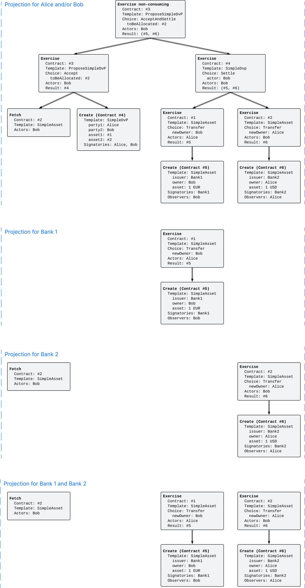

.. Copyright (c) 2023 Digital Asset (Switzerland) GmbH and/or its affiliates. All rights reserved.
.. SPDX-License-Identifier: Apache-2.0

.. _da-model-privacy:

Privacy
#######

.. wip::

   * Discuss ledger model projection with Canton projection in terms of information leakage (projection of the transaction view Merkle tree vs. as defined in here)

The :ref:`ledger structure section <ledger-structure>` answered the question "What the Ledger looks like?" by introducing a hierarchical format to record the changes.
This section addresses the question "who sees which changes and data".
That is, it explains the privacy model for Canton Ledgers.

The privacy model of Canton Ledgers is based on a **need-to-know basis**,
and provides privacy **on the level of subtransactions**.
Namely, a party learns only those parts of ledger changes that affect contracts in which the party has a stake,
and the consequences of those changes.
The hierarchical structure is key here because it yields a natural notion of sub-transaction privacy.
To make the sub-transaction privacy notion precise, we introduce the concepts of *informee* and *witness*.

Informees
*********

A party can take different roles in Daml templates and choices;
the party can be declared as contract or choice ``observer``, ``signatory`` or ``controller``.

* Every contract and choice ``observer`` should observe changes to the contract (creation or archival) and exercises of a choice, respectively, as the name suggests.
  
* A ``signatory`` is bound by a contract and thus has a stake in it;
  they should learn when the contract is created or used.

* An actor of an exercise, which is the ``controller`` of the choice, has a stake in the action and should therefore see the exercise;
  they may not have a stake in the input contract though.
  
These observations motivate the following definition of an **informee**, namely the set of parties that should be informed about the action.
The informees for an action are the union of the sets marked with X in the following table,
where a **stakeholder** of a contract is a signatory or contract observer of the contract.

.. _def-informee:

.. list-table:: Definiton: The **informees** of an action are the union of the sets marked with X.
   :widths: 20 20 20 20 20
   :header-rows: 1

   * - Action
     - Signatories
     - Contract observers
     - Actors
     - Choice observers
   * - **Create**
     - X
     - X
     -
     -
   * - consuming **Exercise**
     - X
     - X
     - X
     - X
   * - non-consuming **Exercise**
     - X
     - 
     - X
     - X
   * - **Fetch**
     - X
     - 
     - X
     - 

For example, the informees of a **Create** action are the stakeholders of the created contract, that is, the signatories and observers.
For consuming **Exercise** actions, the informees consist of the stakeholders of the consumed contract, the action's actors and choice observers.

As a design decision, a contract observer of the input contract is not informed about non-consuming **Exercise** and **Fetch** actions,
unless they are explicitly among the actors or choice observers.
This is because such actions do not change the state of the contract itself.

.. note::
   Templates can declare :externalref:`pre-consuming <preconsuming-choices>` and :externalref:`post-consuming <postconsuming-choices>` choices.
   Daml compiles such choices to a non-consuming choice whose first or last consequence exercises the ``Archive`` choice on the template.
   Accordingly, contract observers are only informees of the ``Archive`` subaction, but not of the main ``Exercise`` action itself.

To illustrate the concept of informees, we use the :ref:`running example of Alice and Bob swapping their assets <ledger-structure_running_example>`.
The ``AcceptAndSettle`` action and :ref:`its subactions <da-ledger-subaction>` have the informees shown in the blue hexagons of the next figure.
For example, Alice is an informee of the root action ① because she is a signatory of the input contract #3, and Bob is an informee because he is the actor of the choice.
Similarly, Bank 2 and Bob are informees of the **Fetch** action ③ because Bank 2 is a signatory of the input contract #2 and Bob is the actor of the action.
Had Bob not been the actor, he would not be an informee because contract observers are not automatically informees of non-consuming exercises and fetches.

.. https://lucid.app/lucidchart/3176adad-0474-4755-bfb5-e323e1a65fab/edit
.. image:: ./images/dvp-acceptandsettle-informees.svg
   :align: center
   :width: 100%
   :alt: The informees of the ``AcceptAndSettle`` action and its subactions.

.. _da-model-projections:

Projections
***********

Informees should see the changes they are interested in,
but this does not mean that they have to see the entirety of any transaction that includes such a change.
This is made precise through *projections* of a transaction,
which define the view that a group of parties gets on a transaction.
Intuitively, given a transaction within a commit, a group of parties will see only the subtransaction consisting of all actions on contracts
whose informees overlap with the parties. Thus, privacy is obtained on the subtransaction level.

The next diagram gives an example for the ``AcceptAndSettle`` with the informees shown above.

.. https://lucid.app/lucidchart/9b3762db-66b4-4e72-94cb-bcefd4c1a5ea/edit

Since both Alice and Bob are informees of the root action,
namely Bob exercising the ``AcceptAndSettle`` choice on Alice's ``ProposeSimpleDvP`` contract,
the projection to either Alice or Bob or both consists of the whole Exercise action.
As an Exercise action contains the consequences,
Alice and Bob each see all the subactions, even if they are not an informee of the subaction itself.
For example, Alice's projection includes the Fetch subaction, Bob's ``Transfer`` exercise of on #2, and the creation of Bob's ``SimpleAsset`` contract #5.
Similarly, Bob's projection includes Alice's ``Transfer`` Exercise on #1 and the creation of Alice's ``SimpleAsset`` contract #6.

In contrast, the banks are *not* informees of the root action.
In fact, Bank 1 appears as an informee only in the ``Transfer`` Exercise action on #1 and its subaction, the creation of Bob's new asset #5.
Accordingly, the projection to Bank 1 consists of just this Exercise action.
Bank 2 appears as an informee of two unrelated actions in the tree: the Fetch action and the ``Transfer`` Exercise action on #2.
The projection to Bank 2 therefore consists of a transaction with these two actions as root actions.
This shows that projection can turn a single root action into a list of subactions.

Note the privacy implications of the banks' projections.
While the banks learns that a ``Transfer`` has occurred from Alice to Bob or vice versa,
each bank does *not* learn anything about *why* the transfer occurred.
In particular, Bank 2 does not learn what happens between the Fetch and the Exercise on contract #2.
In practice, this means that Bank 1 and Bank 2 do not learn what Alice and Bob is exchanging their asset for,
providing privacy to Alice and Bob with respect to the banks.

.. _def-tx-projection:

Formally, the **projection** of a transaction `tx = act`\ :sub:`1`\ `, …, act`\ :sub:`n` for a set `P` of parties is the
subtransaction obtained by doing the following for each action `act`\ :sub:`i`:

#. If `P` overlaps with the informees of `act`\ :sub:`i`, keep `act`\ :sub:`i` as-is.
#. Else, if `act`\ :sub:`i` has consequences, replace `act`\ :sub:`i` by the projection (for `P`) of its consequences,
   which might be empty.
#. Else, drop `act`\ :sub:`i`.

.. _da-model-ledger-projection:

Finally, the **projection of a ledger** `l` for a set `P` of parties is a DAG of transactions obtained as follows:

* Project the transaction of each commit in `l` for `P`.

* Remove empty transactions from the result.

* Add an edge between two (non-empty projected) transactions `tx`:sub:`1` and `tx`:sub:`2`
  if `tx2` uses a contract created by or used in `tx`:sub:`1` whose stakeholders overlap with `P`.

Notably, the projection of a ledger is not a ledger, but a DAG of transactions.
Its edges are a subset of the edges between the commits in the original ledger.
The subtleties of this subset construction are discussed in the :ref:`causality section <local-ledger>`.
Until then, we pretend that the ledger is totally ordered and projections retain the same ordering.

Projecting the ledger of the complete DvP example yields the following projections for each
party:

.. _da-dvp-ledger-projections:

.. https://lucid.app/lucidchart/90b7f155-aadc-4bde-9c5c-b8198b824384/edit
.. image:: ./images/dvp-ledger-projections.svg
   :align: center
   :width: 100%
   :name: da-ledgers-projections-example
   :alt: Time sequences for each party's projection, explained in-depth in the numbered list below.

Examine each party's projection in turn:

#. Alice sees all of the first, thrid, and forth commit
   as she is an informee of all root actions.
   In contrast, Alice does not see anything of the second commit,
   as she is not a stakeholder of Bob's ``SimpleAsset`` of 1 USD.
   This transaction is not present in Alice's projection at all.
   Yet, the output of this transaction (contract #2) is used
   in the last commit of Alice's projection.
   Accordingly, contract #2 is shown as an input to the left, outside of the ledger.
   This effect is discussed below under :ref:`input divulgence <da-model-divulgence>`.

#. Bob's projection is analogous to Alice's:
   He sees everything of the second, third, and forth commit,
   but nothing of the first commit and instead merely contract #1 as an input.

#. Banks 1 and 2 only see the commits in which they create their ``SimpleAsset`` and the ``Transfer`` Exercises on them.
   Additionally, Bank 2 sees the Fetch of the ``SimpleAsset`` in the last commit, as already discussed above for transaction projections.

Witnesses
*********

The projection of a transaction or ledger for a set of parties `P` includes subactions whose informees are disjoint from `P`.
For example, Alice sees the Fetch action on Bob's ``SimpleAsset`` (contract #2)
because it is a consequence of Bob's ``Accept`` Exercise and Alice is an informee of this Exercise.
Such parties are called witnesses.

Formally, for a given transaction `tx`, the **witnesses** of an subaction `act` of `tx` are all the parties
whose projection of `tx` contains `act` as a subaction.
Or equivalently, the witnesses of `act` are the union of the informees of all subactions of `tx` that contain `act`.
In particular, every informee of `act` is also a witness.

In terms of privacy, the witnesses are all those parties who learn about a particular action.
Notably, the informees of an action may not learn about all its witnesses.
For example, Bank 1 is an informee of the Fetch action and Alice is a witness,
but Bank 1 cannot learn this from its projection.
This is crucial from a privacy perspective
as it hides who is involved in the hidden parts of the transaction.
In particular, this also explains why the projection of a commit is a transaction:
the requesters cannot be retained.

.. note::
   Alice is not a witness of the Create action for Bob's ``SimpleAsset`` (contract #2)
   although the contract appears as an input to Alice's projection.
   
   

.. _da-model-divulgence:

Divulgence: When non-stakeholders see contracts
***********************************************

The guiding principle for the privacy model of Canton ledgers is that contracts should only be shown to their stakeholders.
However, ledger projections can cause contracts to become visible to other parties as well.
Showing contracts to non-stakeholders through ledger projections is called **divulgence**.
Divulgence is a deliberate choice in the design of Canton Ledgers and comes in two forms:

* **Immediate divulgence** refers to witnesses seeing contract creations they are not an informee of.
  In the example of :ref:`ledger projections of the DvP <da-dvp-ledger-projections>`,
  Bob is a witness of the Create action for Alice's new ``SimpleAsset`` (contract #6), but not an informee.
  Conceptually, at the instant where Bob exercises the ``Transfer`` choice,
  he also gains a temporary stake in the outcome of the ``Transfer``,
  namely to see that the asset now belongs to Alice.
  
  In general, there is no point in hiding the consequences of an action.
  Bob could anyway compute the consequences of the actions it is an informee of, because Daml is deterministic.

* **Input divulgence** refers to an input contract being shown to the non-informee witnesses of an action using this contract.
  For example, the ``Fetch`` on Bob's ``SimpleAsset`` (contract #2) is visible to Alice
  and Alice's projection therefore references this contract as an input
  even though the Create action for #2 is not part of Alice's projection.

  Input divulgence enables Alice to validate the transactions in her projection
  (see :ref:`da-model-consistency` for ledger integrity).
  That is, Alice can check that Bob does allocate a suitable ``SimpleAsset`` according to what she specified in her proposal.  

Immediate divulgence is accessible on the Ledger API via the update tree stream.
In contrast, contracts exposed via input divulgence cannot be accessed on the Ledger API.
  

.. _da-model-disclosure:

Disclosure: When non-stakeholders use contracts
***********************************************

Divulgence from the previous section refers to parties learning about contracts they are not a stakeholder of.
Disclosure is about such parties using contracts in their own transactions.

Recall from the :ref:`running example <ledger-structure_running_example>`
that Bob uses ``submitWithDisclosures`` for the exercising ``Settle`` choice.
This is because Bob (and its Participant Node) in general does not know about the ``SimpleAsset`` contract #2
that Alice has allocated to the proposal.
Disclosure means that Alice tells Bob via an off-ledger communication channel about this contract.
In the Daml script running example, the script itself is the communication channel.
In real-world contexts, Alice would offer an API for Bob to retrieve the relevant data.

It is a design decision that immediate divulgence does not entail disclosure.
For example, after the DvP has been settled, Alice creates another DvP proposal for Bob to swap the two assets again:

.. literalinclude:: ./daml/SimpleDvP.daml
   :language: daml
   :start-after: SNIPPET-REVERT-PROPOSAL-BEGIN
   :end-before: SNIPPET-REVERT-PROPOSAL-END

Then, Bob must still disclose Alice's ``SimpleAsset`` even though Bob has witnessed the creation of Alice's ``SimpleAsset``.
A plain ``submit`` does not work.

The motivation is that using immediate divulgence implicitly for disclosure leads to brittle workflows.
The problem is that the non-stakeholders only learn about the creation of the contract,
but not about subsequent actions on the contract like archivals.
Accordingly, there is no general rule as to how long the non-stakeholder should long to keep the contract around.
Keeping it for too long will waste storage; and keeping it too short may break certain applications.
Instead, this rule forces the application to explicitly design for disclosure even for divulged contracts
and come up with a suitable application-specific rule.

An alternative approach to disclosure is to replace the original ``SimpleAsset`` contract by one
on which the Bob becomes a contract observer.
This requires extending the contract model with a (consuming) exercise action on the ``SimpleAsset``
that creates a new ``SimpleAsset``, with observers of Alice's choice.
In addition to the increase in actions on the Ledger,
the two approaches differ in in who learns about the parties that are informed about the contract:

* If Alice discloses her ``SimpleAsset`` to Bob via an off-ledger channel,
  only Alice and Bob need to know about this disclosure.
  So when Alice discloses the same contract to Charlie,
  Charlie does not need to know that Alice had already shown the contract to Bob,
  and Bob does not need to know that Alice is disclosing it to Charlie.

* In contrast, when Alice adds Bob as a contract observer and then subsequently adds Charlie as another observer,
  Bob as a contract observer is notified about the archival and the creation.
  Similarly, Charlie learns that Bob is an observer on the contract, too.
  That is, all stakeholders learn about each other.
  This created a privacy problem when Alice actually does not want that Bob and Charlie know of each other.

Moveover, adding parties as observers scales poorly to large numbers,
because every observer learns about every other observer:
A Create event with `N` observers appears in the projection of at least those `N` parties,
which is already quadratic in `N`.
If the observers are added one by one, then `N` archives and creations are needed,
which means the size of all projections together is cubic in `N`.

