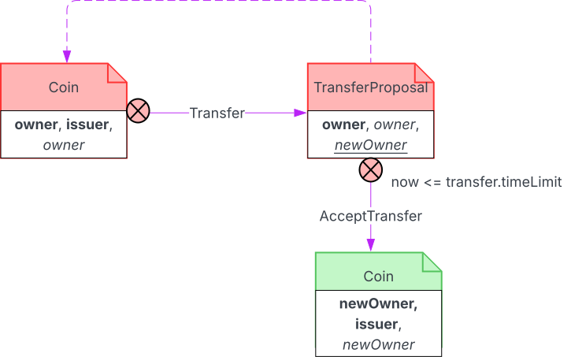

.. Copyright (c) 2023 Digital Asset (Switzerland) GmbH and/or its affiliates. All rights reserved.
.. SPDX-License-Identifier: Apache-2.0

.. _implementing-time-constraints:

How To Implement Time Constraints
#################################

How to check that a deadline is valid
*************************************

This design pattern demonstrates how to limit choices so that they must occur by a given deadline.

Here is an implementation of a simple coin transfer:

.. literalinclude:: ./daml/SimpleCoinTransfer.daml
    :language: daml
    :start-after: -- BEGIN_SIMPLE_COIN_TRANSFER
    :end-before: -- END_SIMPLE_COIN_TRANSFER

.. literalinclude:: ./daml/SimpleCoinTransfer.daml
    :language: daml
    :start-after: -- BEGIN_SIMPLE_ACCEPT_COIN_TRANSFER
    :end-before: -- END_SIMPLE_ACCEPT_COIN_TRANSFER

Transfer proposals can occur at any point in time. The following changes fix this deficiency:

TransferProposal contract
    In the TransferProposal contract, the body of the AcceptTransfer choice is modified to assert that the contract deadline is valid.

    .. literalinclude:: ./daml/LimitedTimeCoinTransfer.daml
      :language: daml
      :start-after: -- BEGIN_LIMITED_TIME_ACCEPT_COIN_TRANSFER
      :end-before: -- END_LIMITED_TIME_ACCEPT_COIN_TRANSFER

Coin contract
    In the Coin contract, the Transfer choice has an additional deadline argument, so that TransferProposal contracts can
    be given a fixed lifetime.

    .. literalinclude:: ./daml/LimitedTimeCoinTransfer.daml
      :language: daml
      :start-after: -- BEGIN_LIMITED_TIME_COIN_TRANSFER
      :end-before: -- END_LIMITED_TIME_COIN_TRANSFER

.. https://lucid.app/lucidchart/b203182f-5b3f-4162-976a-6d1ba8101acf/edit

   Time limited coin ownership transfer

How to check that a deadline has passed
***************************************

This design pattern demonstrates how to ensure choices only occur after a given deadline.

Here is an implementation of a simple coin transfer:

.. literalinclude:: ./daml/SimpleCoinTransfer.daml
    :language: daml
    :start-after: -- BEGIN_SIMPLE_COIN_TRANSFER
    :end-before: -- END_SIMPLE_COIN_TRANSFER

.. literalinclude:: ./daml/SimpleCoinTransfer.daml
    :language: daml
    :start-after: -- BEGIN_SIMPLE_ACCEPT_COIN_TRANSFER
    :end-before: -- END_SIMPLE_ACCEPT_COIN_TRANSFER

Transfer proposals can occur at any point in time. The following changes fix this deficiency:

TransferProposal contract
    In the TransferProposal contract, the body of the AcceptTransfer choice is modified to assert that the contract deadline has been exceeded or passed.

    .. literalinclude:: ./daml/LimitedTimeCoinTransfer.daml
      :language: daml
      :start-after: -- BEGIN_DELAYED_ACCEPT_COIN_TRANSFER
      :end-before: -- END_DELAYED_ACCEPT_COIN_TRANSFER

Coin contract
    In the Coin contract, the Transfer choice has an additional deadline argument, so that TransferProposal contracts can
    be given a delay.

    .. literalinclude:: ./daml/LimitedTimeCoinTransfer.daml
      :language: daml
      :start-after: -- BEGIN_DELAYED_COIN_TRANSFER
      :end-before: -- END_DELAYED_COIN_TRANSFER

.. https://lucid.app/lucidchart/3acf1391-b25b-420c-8ea3-627e9d276528/edit

.. figure:: ./images/delayedCoinTransfer.svg
   :align: center
   :width: 100%

   Delayed coin ownership transfer

Grant time-limited writes to parties
************************************

TODO: https://github.com/DACH-NY/docs-website/issues/317

Where to use getTime
********************

TODO: https://github.com/DACH-NY/docs-website/issues/328
