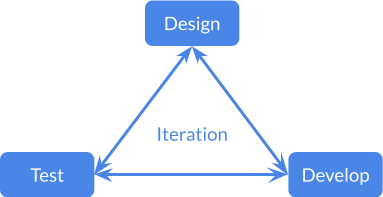
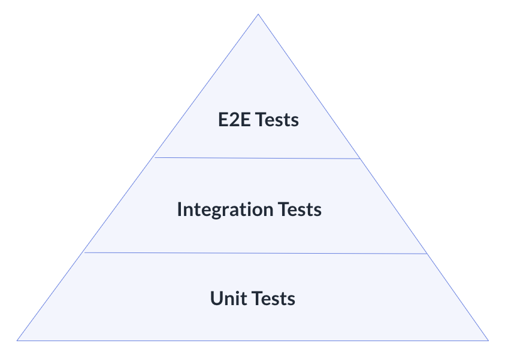

Daml Application Lifecycle: Considerations and Best Practices
#############################################################
The Software Development Lifecycle (SDLC) of a Daml application mirrors that of a Web2 or enterprise service with facets such as:

* Design
* Develop
* Test
* Deploy
* Operations Support

However, Daml applications differ significantly in architecture, as cross-organizational workflows and state are explicitly defined in Daml code. This requires specific considerations during each facet. 

Note that the SDLC of a Daml application is not linear. In particular, the design, development, and test facets are not sequential but part of a dynamic, iterative process. These facets operate in a feedback loop, where the outcomes of one facet, such as testing, frequently lead back to adjustments in design or development. This iterative approach ensures continuous refinement and validation of the solution until it satisfies the requirements.

1. Design 
=========

1.1 Daml Schema for Workflows
-----------------------------
* Daml provides a schema language for defining workflows and state.
* The implementation of this schema should be a fundamental part of the design phase.

1.2 Benefits and Trade-Offs
---------------------------

1.2.1 Benefits and Functional Characteristics
~~~~~~~~~~~~~~~~~~~~~~~~~~~~~~~~~~~~~~~~~~~~~
  1. Synchronization of Application Workflow State Across Organizational Boundaries
     Traditional state synchronization relies on messaging, often requiring manual reconciliation. Daml simplifies this with:
     * A virtual shared ledger.
     * Built-in atomic transactions across organizations and applications.
  2. Functional Characteristics
     Using Daml and Canton to facilitate cross-organization workflows offers several advantages over using a database or other distributed ledger technologies. These include:
     * Need-to-know privacy: Privacy is preserved by controlling data visibility to authorized parties.
     * Non-repudiation: All transactions are traceable and cannot be denied by participants.
     * Data sovereignty: Users retain control over their data, making Daml particularly suited for enterprise applications.

1.2.2 Trade-Offs: Performance Characteristics
~~~~~~~~~~~~~~~~~~~~~~~~~~~~~~~~~~~~~~~~~~~~~
A Daml application's virtual shared ledger resembles a traditional database while operating across multiple organizations. It introduces unique functional benefits but comes with some performance trade-offs compared to traditional database applications. Key considerations include:

* Increased latency: Transactions may take longer due to the need for consensus and synchronization across multiple organizations.
* Higher resource usage: Distributed workflows consume more computational and storage resources compared to single-trust-boundary databases.
* Mutation overhead: Modifying data in a distributed ledger introduces additional complexity and storage demands compared to traditional database transactions.

1.3 On-Ledger vs. Off-Ledger Design
-----------------------------------
Daml app design should account for performance characteristics, carefully considering on-ledger versus off-ledger implementation due to the costs associated with ledger usage compared to a traditional database. When deciding whether information should be stored on-ledger, it is helpful to distinguish between data and state.

* State: Represents essential facts in the workflow. When these facts require agreement across organizations, store them on-ledger.
* Data: Represents non-essential facts. For cost efficiency, use off-ledger Web2 technologies for sharing non-critical data.
* Workflows: Only workflows that cross organizational boundaries should be on-ledger.

1.4 Privacy by Design
---------------------
To realize Daml’s privacy benefits:

* Identify data needs for each workflow participant.
* Plan how to share and authorize data access.

1. Develop
==========

2.1 Decomposition and Compatibility
-----------------------------------
* Decompose features across application components.
* Ensure backwards compatibility to avoid disruptive “big-bang” changes. Use feature flags for incremental deployment.

2.2 Coordinating Multi-Organization Development
-----------------------------------------------
A Daml app may include :ref:`app user developed frontends and backends <arch-options>`. Lead development with early creation of Daml code as an interface description language for cross-organizational workflows.

2.3 DAR File Modularization
---------------------------
  1. Stakeholder-Oriented Modules
     Modularize workflows based on stakeholder interaction to simplify upgrades and maintain privacy, as DAR files only need to be distributed to participant nodes hosting the parties involved in the workflow.
  2. Public and Private APIs
     Daml supports backward-compatible changes like adding a choice or a new field to a template. However, some business requirements may require changes to workflow structure and flow. To accommodate these changes:
     * Minimize public workflows and store internal workflows in separate DAR files to allow more flexibility in adapting to evolving business needs.
     * Separate interface definitions in their own package for better workflow management.
  3. Test Code Separation
     Unit tests for Daml smart contract workflows are written using Daml Script, which is compiled into DAR files. These DAR files are for testing purposes only and should not be deployed to participant nodes. Ensure test code is not mixed with production code by using separate DAR files for Daml Script testing purposes.

3. Test
=======

3.1 Testing Pyramid
-------------------
Testing Daml apps is similar to testing other systems: prioritize automation and test at the lowest level for speed and efficiency. However, building robust Daml apps comes with specific recommendations.

* Unit Tests
  * Use Daml Script for white-box unit tests.
  * Mock backends and ledgers for frontend testing.
* Integration Tests
  * Backend: Use white-box integration tests for internal APIs that are only used by clients under the app provider’s control.
  * Public APIs: Use black-box behavioral tests interacting at system boundaries.
  * Test isolation: Use long-running Canton instances to avoid repeatedly paying Canton’s startup cost, and isolate tests using unique participant users and parties for each test run. One approach is appending a test run ID as a suffix to party and user names in your test harness.
* End-to-End Tests
  * Test workflows between end-users and systems across multiple participant nodes, backends, and frontends.
  * Use tools like `Selenium <https://www.selenium.dev/>`_ or `Playwright <https://playwright.dev/>`_ for browser session orchestration.
  * Test isolation: Either bootstrap the entire system for each test run or use a long-running system instance to specific tests. The latter approach supports faster test execution and quicker iterations.

3.2 Flaky Tests and Time Dependencies
-------------------------------------
* Writing robust tests for distributed systems is challenging due to data propagation delays and concurrent execution. Eliminate flaky tests (those that fail inconsistently and incorrectly) to ensure developer productivity.
* For time-sensitive workflows, use the `passTime` function in Daml and configure reduced wait times for faster CI execution. Workflows that incorporate calendar or time functions in their logic, such as bond lifecycling with coupon payments, can be tested by advancing time with `passTime`. For end-to-end tests, configure workflows to advance in milliseconds to reduce CI execution time. Pause and resume automation from the test harness to prevent race conditions.

3.3 Performance Testing
-----------------------
* Start performance testing early and continuously.
* Create separate performance tests for each relevant workflow. Incorporate additionally developed workflows into existing performance tests or create new tests specifically for these workflows.
* Test at scale with synthetic data resembling production characteristics.
* Measure performance characteristics and reset them between test runs to detect regressions.
* Perform soak testing with long-running deployments to detect bottlenecks.
* Set up alerting to monitor system failures, tuning it over time for optimal observability. Well-tuned alerts established during development can be reused in operations to detect system health issues.

1. Deploy
=========

4.1 Deployment Topology
-----------------------
* The deployment topology depends on the :doc:`app architecture <daml-app-arch-design>` and requires a pre-configured Canton infrastructure, including app provider and app users on their respective administrative domains.
* Shared DAR files must be deployed on all Canton participant nodes. Daml code defines the API for state and workflows synchronized across participant nodes, similar to `.proto` files for a gRPC server shared with gRPC client developers. It is recommended to store Daml code in a separate repo from backend and frontend code and provide app user organizations with a tarball or read-only access to this repo. This allows organizations to review and build the code to ensure confidence in the behavior or the DAR file installed on their participant nodes.

4.2 Deployment Responsibilities
-------------------------------
Some cross-organizational coordination is always required to deploy a Daml application. Each organization must set up the Canton infrastructure components and deploy the application components running within its administrative domain. Additionally, each organization must integrate its Canton participant nodes and the application components it deploys with its Identity and Access Management (IAM).

* :ref:`App provider <app-provider>` should:
  * Deploy the backend and the frontend.
  * Configure the frontend to integrate with IAM.
* :ref:`App user <app-user>` should:
  * Deploy and configure the frontend to integrate with their own IAM, whether the frontend is developed by the app provider or the user themselves.
  * Deploy the backend if developed in-house.

4.3 Cross-Organizational Coordination
-------------------------------------
* Reduce deployment complexity by minimizing components required from app users.
* Balance deployment simplicity with :ref:`architectural trade-offs <properties-summary>`.

5. Operations Support
=====================

5.1 Logging and Monitoring
--------------------------
* Standard operational considerations for Daml apps include logging and monitoring.
  * Logging: Regularly review logs during development and testing, such as by capturing logs in CI runs and using them for debugging CI failures.
  * Monitoring: Capture metrics for all components and display the golden signals – latency, traffic, errors, and saturation – on dashboards. Example dashboards for Canton components are available in `the documentation <https://docs.daml.com/canton/usermanual/monitoring.html?_gl=1*qdpp48*_gcl_au*MTQ0ODAwODc0MC4xNzM3NDQzODUw*_ga*NDg1MTgxODM0LjE3MjA2MjEzNDc.*_ga_GVK9ZHZSMR*MTczNzQ0Mzg1MC45OC4xLjE3Mzc0NDM5NjEuNjAuMC4w&_ga=2.19913016.1097062857.1737443850-485181834.1720621347#hands-on-with-the-daml-enterprise-observability-example>`_.
* Set up alerts on the metrics to monitor the application’s health during testing and development. This ensures operational reuse and integration into the long-running test instance.

5.2 Upgrading
-------------
* Bug fixes and feature rollouts for off-ledger components follow standard design and development practices, similar to Web2 apps and enterprise services.
* Rolling out changes to Daml code requires additional considerations:
  * Daml code represents shared rules, requiring coordination across multiple administrative domains during upgrade.
  * As an API definition for cross-organization workflows, changes to Daml code must be reflected in all components using that code, ideally with backward compatibility to minimize code updates in dependent systems.

1. Key Takeaways
================
The SDLC of a Daml application requires different considerations and best practices for each facet compared to Web2 and enterprise service apps, as Daml’s unique architecture necessitates a shift from conventional development approaches. To understand and implement Daml applications, it is crucial to address the challenges inherent in distributed, multi-party systems.

* Design: Define workflows and state using the Daml schema, balance the use of on- and off-ledger components, ensure privacy by design, and consider performance trade-offs when working across multiple organizations.
* Develop: Modularize features, maintain backward compatibility, coordinate multi-organization development efforts, and separate test code from production code to ensure maintainability and flexibility.
* Test: Prioritize automation and testing at various levels, including unit, integration, and end-to-end; address flaky tests, conduct performance testing, and set up system monitoring and alerting for ongoing health checks.
* Deploy: Focus on configuring deployment topologies, clearly define responsibilities between app providers and app users, and ensure that DAR files are correctly deployed across all participant nodes.
* Operations Support: Logging and monitoring the health of the application is essential, along with managing Daml code upgrades through cross-organizational coordination and ensuring backward compatibility to minimize disruption.
