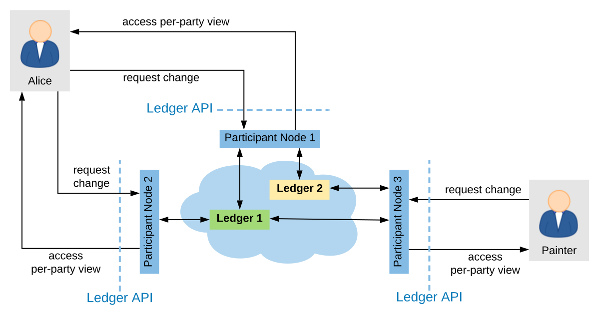
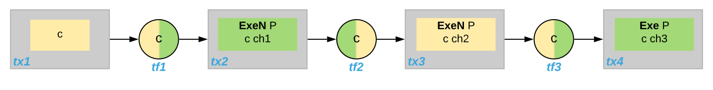
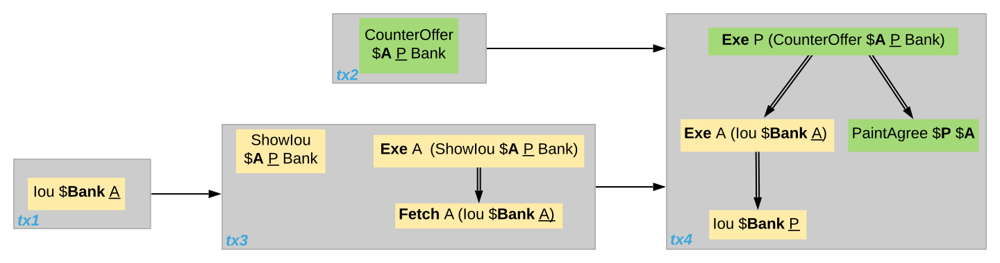
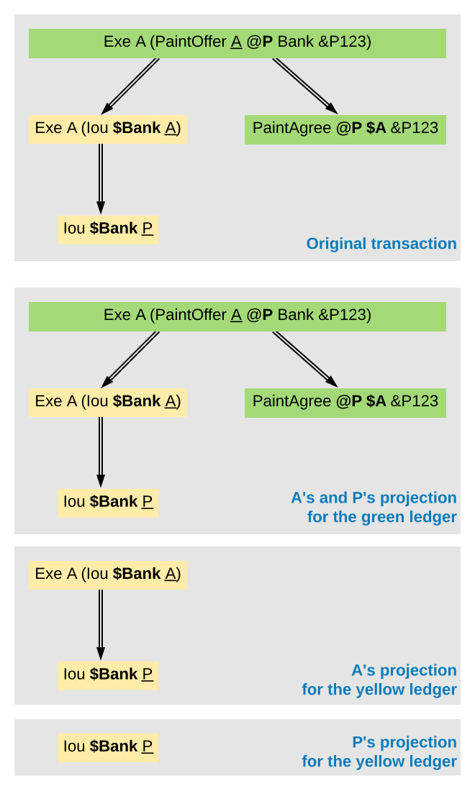
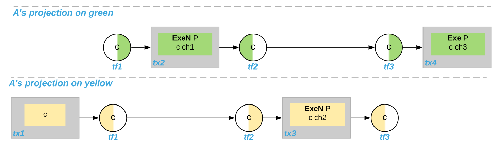

.. Copyright (c) 2022 Digital Asset (Switzerland) GmbH and/or its affiliates. All rights reserved.
.. SPDX-License-Identifier: Apache-2.0
   
.. _interoperable-ledgers:

Daml Ledger Interoperability
############################

Certain Daml ledgers can interoperate with other Daml ledgers.
That is, the contracts created on one ledger can be used and archived in transactions on other ledgers.
Some Participant Nodes can connect to multiple ledgers and provide their parties unified access to those ledgers via the :ref:`Ledger API <ledger-api-services>`.
For example, when an organization initially deploys two workflows to two Daml ledgers, it can later compose those workflows into a larger workflow that spans both ledgers.

Interoperability may limit the visibility a Participant Node has into a party's ledger projection, i.e., its :ref:`local ledger <local-ledger>`, when the party is hosted on multiple Participant Nodes.
These limitations influence what parties can observe via the Ledger API of each Participant Node.
In particular, interoperability affects which events a party observes and their order.
This document explains the visibility limitations due to interoperability and their consequences for the Transaction Service, by :ref:`example <interop-limitation-examples>` and formally by introducing interoperable versions of :ref:`causality graphs <interop-causality-graph>` and :ref:`projections <ledger-aware-projection>`.

The presentation assumes that you are familiar with the following concepts:

* The :ref:`Ledger API <ledger-api-services>`

* The :ref:`Daml Ledger Model <da-ledgers>`

* :ref:`Local ledgers and causality graphs <local-ledger>`

.. note::
   Interoperability for Daml ledgers is under active development.
   This document describes the vision for interoperability
   and gives an idea of how the Ledger API services may change and what guarantees are provided.
   The described services and guarantees may change without notice as the interoperability implementation proceeds.

.. _interop-limitation-examples:
   
Interoperability Examples
*************************
   
.. _interoperable-topology:

Topology
========

Participant Nodes connect to Daml ledgers and parties access projections of these ledgers via the Ledger API.
The following picture shows such a setup.

.. https://app.lucidchart.com/documents/edit/6b818d37-cf4c-4513-9d31-d68acddf4533

   Example topology with three interoperable ledgers

The components in this diagram are the following:

* There is a set of interoperable **Daml ledgers**: Ledger 1 (green) and Ledger 2 (yellow).

* Each **Participant Node** is connected to a subset of the Daml ledgers.
  
  - Participant Nodes 1 and 3 are connected to Ledger 1 and 2.
  - Participant Node 2 is connected to Ledger 1 only.

* Participant Nodes host parties on a subset of the Daml ledgers they are connected to.
  A Participant Node provides a party access to the Daml ledgers that it hosts the party on.

  - Participant Node 1 hosts Alice on Ledger 1 and 2.
  - Participant Node 2 hosts Alice on Ledger 1.
  - Participant Node 3 hosts the painter on Ledger 1 and 2.

.. _interoperable-aggregation:

Aggregation at the Participant
==============================

The Participant Node assembles the updates from these ledgers and outputs them via the party's Transaction Service and Active Contract Service.
When a Participant Node hosts a party only on a subset of the interoperable Daml ledgers,
then the transaction and active contract services of the Participant Node are derived only from those ledgers.

For example, in the :ref:`above topology <multiple-ledgers>`, when a transaction creates a contract with stakeholder Alice on Ledger 2,
then `P1`\ 's transaction stream for Alice will emit this transaction and report the contract as active, but Alice's stream at `P2` will not.

.. _enter-leave-event:

Enter and Leave Events
======================

With interoperability, a transaction can use a contract whose creation was recorded on a different ledger.
In the :ref:`above topology <multiple-ledgers>`, e.g., one transaction creates a contract `c1` with stakeholder Alice on Ledger 1 and another archives the contract on Ledger 2.
Then the Participant Node `P2` outputs the **Create** action as a ``CreatedEvent``, but not the **Exercise** in form of an ``ArchiveEvent`` on the transaction service
because Ledger 2 can not notify `P2` as `P2` does not host Alice on Ledger 2.
Conversely, when one transaction creates a contract `c2` with stakeholder Alice on Ledger 2 and another archives the contract on Ledger 1, then `P2` outputs the ``ArchivedEvent``, but not the ``CreatedEvent``.

To keep the transaction stream consistent, `P2` additionally outputs a **Leave** `c1` action on Alice's transaction stream.
This action signals that the Participant Node no longer outputs events concerning this contract;
in particular not when the contract is archived.
The contract is accordingly no longer reported in the active contract service and cannot be used by command submissions.

Conversely, `P2` outputs an **Enter** `c2` action some time before the ``ArchivedEvent`` on the transaction stream.
This action signals that the Participant Node starts outputting events concerning this contract.
The contract is reported in the Active Contract Service and can be used by command submission.

The actions **Enter** and **Leave** are similar to a **Create** and a consuming **Exercise** action, respectively, except that **Enter** and **Leave** may occur several times for the same contract whereas 
there should be at most one **Create** action and at most one consuming **Exercise** action for each contract.

These **Enter** and **Leave** events are generated by the underlying interoperability protocol.
This may happen as part of command submission or for other reasons, e.g., load balancing.
It is guaranteed that the **Enter** action precedes contract usage, subject to the trust assumptions of the underlying ledgers and the interoperability protocol.

A contract may enter and leave the visibility of a Participant Node several times.
For example, suppose that the painter submits the following commands and their commits end up on the given ledgers.

#. Create a contract `c` with signatories Alice and the painter on Ledger 2
#. Exercise a non-consuming choice `ch1` on `c` on Ledger 1.
#. Exercise a non-consuming choice `ch2` on `c` on Ledger 2.
#. Exercise a consuming choice `ch3` on `c` on Ledger 1.

Then, the transaction tree stream that `P2` provides for `A` contains five actions involving contract `c`: **Enter**, non-consuming **Exercise**, **Leave**, **Enter**, consuming **Exercise**.
Importantly, `P2` must not omit the **Leave** action and the subsequent **Enter**, even though they seem to cancel out.
This is because their presence indicates that `P2`\ 's event stream for Alice may miss some events in between; in this example, exercising the choice `ch2`.

The flat transaction stream by `P2` omits the non-consuming exercise choices.
It nevertheless contains the three actions **Enter**, **Leave**, **Enter** before the consuming **Exercise**.
This is because the Participant Node cannot know at the **Leave** action that there will be another **Enter** action coming.

In contrast, `P1` need not output the **Enter** and **Leave** actions at all in this example because `P1` hosts Alice on both ledgers.

.. _cross-ledger-transaction:

Cross-ledger Transactions
=========================

With interoperability, a cross-ledger transaction can be committed on several interoperable Daml ledgers simultaneously.
Such a cross-ledger transaction avoids some of the synchronization overhead of **Enter** and **Leave** actions.
When a cross-ledger transaction uses contracts from several Daml ledgers,
stakeholders may witness actions on their contracts that are actually not visible on the Participant Node.

For example, suppose that the :ref:`split paint counteroffer workflow <split-counteroffer-ledger>` from the causality examples is committed as follows:
The actions on `CounterOffer` and `PaintAgree` contracts are committed on Ledger 1.
All actions on `Iou`\ s are committed on Ledger 2, assuming that some Participant Node hosts the Bank on Ledger 2.
The last transaction is a cross-ledger transaction because the archival of the `CounterOffer` and the creation of the `PaintAgree`\ ment commits on Ledger 1 simultaneously with the transfer of Alice's `Iou` to the painter on Ledger 2.

For the last transaction, Participant Node 1 notifies Alice of the transaction tree, the two archivals and the `PaintAgree` creation via the Transaction Service as usual.
Participant Node 2 also output's the whole transaction tree on Alice's transaction tree stream, which contains the consuming **Exercise** of Alice's `Iou`.
However, it has not output the **Create** of Alice's `Iou` because `Iou` actions commit on Ledger 2, on which Participant Node 2 does not host Alice.
So Alice merely *witnesses* the archival even though she is an :ref:`informee <def-informee>` of the exercise.
The **Exercise** action is therefore marked as merely being witnessed on Participant Node 2's transaction tree stream.

In general, an action is marked as **merely being witnessed** when a party is an informee of the action, but the action is not committed on a ledger on which the Participant Node hosts the party.
Unlike **Enter** and **Leave**, such witnessed actions do not affect causality from the participant's point of view and therefore provide weaker ordering guarantees.
Such witnessed actions show up neither in the flat transaction stream nor in the Active Contracts Service.

For example, suppose that the **Create** `PaintAgree` action commits on Ledger 2 instead of Ledger 1, i.e., only the `CounterOffer` actions commit on Ledger 1.
Then, Participant Node 2 marks the **Create** `PaintAgree` action also as merely being witnessed on the transaction tree stream.
Accordingly, it does not report the contract as active nor can Alice use the contract in her submissions via Participant Node 2.

.. _interop-causality-graph:

Multi-ledger Causality Graphs
*****************************

This section generalizes :ref:`causality graphs <causality-graph>` to the interoperability setting.

Every active Daml contract resides on at most one Daml ledger.
Any use of a contract must be committed on the Daml ledger where it resides.
Initially, when the contract is created, it takes up residence on the Daml ledger on which the **Create** action is committed.
To use contracts residing on different Daml ledgers, cross-ledger transactions are committed on several Daml ledgers.

However, cross-ledger transactions incur overheads and if a contract is frequently used on a Daml ledger that is not its residence, the interoperability protocol can migrate the contract to the other Daml ledger.
The process of the contract giving up residence on the origin Daml ledger and taking up residence on the target Daml ledger is called a **contract transfer**.
The **Enter** and **Leave** events on the transaction stream originate from such contract transfers, as will be explained below.
Moreover, contract transfers are synchronization points between the origin and target Daml ledgers and therefore affect the ordering guarantees.
We therefore generalize causality graphs for interoperability.

Definition »Transfer action«
  A **transfer action** on a contract `c` is written **Transfer** `c`.
  The **informees** of the transfer actions are the stakeholders of `c`.

In the following, the term *action* refers to transaction actions (**Create**, **Exercise**, **Fetch**, and **NoSuchKey**) as well as transfer actions.
In particular, a transfer action on a contract `c` is an action on `c`.
Transfer actions do not appear in transactions though.
So a transaction action cannot have a transfer action as a consequence and transfer actions do not have consequences at all.

Definition »Multi-Ledger causality graph«
  A **multi-ledger causality graph** `G` for a set `Y` of Daml ledgers is a finite, transitively closed, directed acyclic graph.
  The vertices are either transactions or transfer actions.
  Every action is possibly annotated with an **incoming ledger** and an **outgoing ledger** from `Y` according to the following table:

  +---------------+-----------------+-----------------+
  | Action        | incoming ledger | outgoing ledger |
  +===============+=================+=================+
  | **Create**    | no              | yes             |
  +---------------+-----------------+-----------------+
  | consuming     |                 |                 |
  | **Exercise**  | yes             | no              |
  +---------------+-----------------+-----------------+
  | non-consuming |                 |                 |
  | **Exercise**  | yes             | yes             |
  +---------------+-----------------+-----------------+
  | **Fetch**     | yes             | yes             |
  +---------------+-----------------+-----------------+
  | **NoSuchKey** | no              | no              |
  +---------------+-----------------+-----------------+
  | **Transfer**  | maybe           | maybe           |
  +---------------+-----------------+-----------------+

  For non-consuming **Exercise** and **Fetch** actions, the incoming ledger must be the same as the outgoing ledger.
  **Transfer** actions must have at least one of them.
  A **transfer** action with both set represents a complete transfer.
  If only the incoming ledger is set, it represents the partial information of an **Enter** event;
  if only outgoing is set, it is the partial information of a **Leave** event.
  **Transfer** actions with missing incoming or outgoing ledger annotations referred to as **Enter** or **Leave** actions, respectively.

The :ref:`action order <def-action-order>` generalizes to multi-ledger causality graphs accordingly.

In the :ref:`example for Enter and Leave events <enter-leave-event>` where the painter exercises three choices on contract `c` with signatories Alice and the painter, the four transactions yield the following multi-ledger causality graph.
Incoming and outgoing ledgers are encoded as colors (green for Ledger 1 and yellow for Ledger 2).
**Transfer** vertices are shown as circles, where the left half is colored with the incoming ledger and the right half with the outgoing ledger.

.. https://app.lucidchart.com/documents/edit/ef1e60ac-fa1e-40be-b1e6-7b3197d4543b

.. _interoperable-causality-graph-linear:
   

   Multi-Ledger causality graph with transfer actions

.. note::
   As for ordinary causality graphs, the diagrams for multi-ledger causality graphs omit transitive edges for readability.

As an example for a cross-domain transaction, consider the :ref:`split paint counteroffer workflow with the cross-domain transaction <cross-ledger-transaction>`.
The corresponding multi-ledger causality graph is shown below.
The last transaction `tx4` is a cross-ledger transaction because its actions have more than one color.

.. https://app.lucidchart.com/documents/edit/c3b120cf-1974-4ae8-8334-435642f94eed/

.. _counteroffer-interoperable-causality-graph:
   

   Multi-Ledger causality graph for the split paint counteroffer workflow on two Daml ledgers

Consistency
===========

Definition »Ledger trace«
  A **ledger trace** is a finite list of pairs `(a`:sub:`i`\ `, b`:sub:`i`\ `)`
  such that `b`:sub:`i - 1` = `a`:sub:`i` for all `i` > 0.
  Here `a`:sub:`i` and `b`:sub:`i` identify Daml ledgers or are the special value `NONE`,
  which is different from all Daml ledger identifiers.

 
Definition »Multi-Ledger causal consistency for a contract«
  Let `G` be a multi-ledger causality graph and `X` be a set of actions from `G` on a contract in `c`.
  The graph `G` is **multi-ledger consistent for the contract** `c` on `X` if all of the following hold:

  #. If `X` is not empty, then `X` contains a **Create** or **Enter** action.
     This action precedes all other actions in `X`.

  #. `X` contains at most one **Create** action.
     If so, this action precedes all other actions in `X`.

  #. If `X` contains a consuming **Exercise** action `act`, then `act` follows all other actions in `X` in `G`\ 's action order.

  #. All **Transfer** actions in `X` are ordered with all other actions in `X`.

  #. For every maximal chain in `X` (i.e., maximal totally ordered subset of `X`), the sequence of `(`\ incoming ledger, outgoing ledger\ `)` pairs is a ledger trace, using `NONE` if the action does not have an incoming or outgoing ledger annotation.

The first three conditions mimic the conditions of :ref:`causal consistency <def-causal-consistency-contract>` for ordinary causality graphs.
They ensure that **Create** actions come first and consuming **Exercise** actions last.
An **Enter** action takes the role of a **Create** if there is no **Create**.
The fourth condition ensures that all transfer actions are synchronization points for a contract.
The last condition about ledger traces ensures that contracts reside on only one Daml ledger and all usages happen on the ledger of residence.
In particular, the next contract action after a **Leave** must be an **Enter**.

For example, the above :ref:`multi-ledger causality graph with transfer actions <interoperable-causality-graph-linear>` is multi-ledger consistent for `c`.
In particular, there is only one maximal chain in the actions on `c`, namely

  **Create** `c` -> `tf1` -> **ExeN** `B` `c` `ch1` -> `tf2` -> **ExeN** `B` `c` `ch2` -> `tf3` -> **ExeN** `B` `c` `ch3`,

and for each edge `act`:sub:`1` -> `act`:sub:`2`, the outgoing ledger color of `act`:sub:`1` is the same as the incoming ledger color of `act`:sub:`2`.
The restriction to maximal chains ensures that no node is skipped.
For example, the (non-maximal) chain

  **Create** `c` -> **ExeN** `B` `c` `ch1` -> `tf2` -> **ExeN** `B` `c` `ch2` -> `tf3` -> **Exe** `B` `c` `ch3`

is not a ledger trace because the outgoing ledger of the **Create** action (yellow) is not the same as the incoming ledger of the non-consuming **Exercise** action for `ch1` (green).
Accordingly, the subgraph without the `tf1` vertex is not multi-ledger consistent for `c` even though it is a multi-ledger causality graph.

Definition »Consistency for a multi-ledger causality graph«
  Let `X` be a subset of actions in a multi-ledger causality graph `G`.
  Then `G` is **multi-ledger consistent** for `X` (or `X`-**multi-ledger consistent**)
  if `G` is multi-ledger consistent for all contracts `c` on the set of actions on `c` in `X`.
  `G` is **multi-ledger consistent** if `G` is multi-ledger consistent on all the actions in `G`.

.. note::
   There is no multi-ledger consistency requirement for contract keys yet.
   So interoperability does not provide consistency guarantees beyond those that come from the contracts they reference.
   In particular, contract keys need not be unique and **NoSuchKey** actions do not check that the contract key is unassigned.

The :ref:`multi-ledger causality graph for the split paint counteroffer workflow <counteroffer-interoperable-causality-graph>` is multi-ledger consistent.
In particular all maximal chains of actions on a contract are ledger traces:

+-------------------------+-----------------------------------------+
| contract                | maximal chains                          |
+=========================+=========================================+
| `Iou Bank A`            | **Create** -> **Fetch** -> **Exercise** |
+-------------------------+-----------------------------------------+
| `ShowIou A P Bank`      | **Create** -> **Exercise**              |
+-------------------------+-----------------------------------------+
| `Counteroffer A P Bank` | **Create** -> **Exercise**              |
+-------------------------+-----------------------------------------+
| `Iou Bank P`            | **Create**                              |
+-------------------------+-----------------------------------------+
| `PaintAgree P A`        | **Create**                              |
+-------------------------+-----------------------------------------+
   
Minimality and Reduction
========================

When edges are added to an `X`-multi-ledger consistent causality graph such that it remains acyclic and transitively closed,
the resulting graph is again `X`-multi-ledger consistent.
The notions :ref:`minimally consistent <minimal-consistent-causality-graph>` and :ref:`reduction <def-reduction-causality-graph>` therefore generalize from ordinary causality graphs accordingly.

Definition »Minimal multi-ledger-consistent causality graph«
  An `X`-multi-ledger consistent causality graph `G` is `X`\ -**minimal** if no strict subgraph of `G` (same vertices, fewer edges) is an `X`-multi-ledger consistent causality graph.
  If `X` is the set of all actions in `G`, then `X` is omitted.

Definition »Reduction of a multi-ledger consistent causality graph«
  For an `X`\ -multi-ledger consistent causality graph `G`, there exists a unique minimal `X`\ -multi-ledger consistent causality graph `reduce`:sub:`X`\ `(G)` with the same vertices and the edges being a subset of `G`.
  `reduce`:sub:`X`\ `(G)` is called the `X`\ -**reduction** of `G`.
  As before, `X` is omitted if it contains all actions in `G`.

Since multi-ledger causality graphs are acyclic, their vertices can be sorted topologically and the resulting list is again a causality graph, where every vertex has an outgoing edge to all later vertices.
If the original causality graph is `X`\ -consistent, then so is the topological sort, as topological sorting merely adds edges.

From Multi-ledger Causality Graphs to Ledgers
=============================================

Multi-Ledger causality graphs `G` are linked to ledgers `L` in the Daml Ledger Model via topological sort and reduction.

* Given a multi-ledger causality graph `G`,
  drop the incoming and outgoing ledger annotations and all transfer vertices,
  topologically sort the transaction vertices,
  and extend the resulting list of transactions with the requesters to obtain a sequence of commits `L`.

* Given a sequence of commits `L`,
  use the transactions as vertices and add an edge from `tx1` to `tx2` whenever `tx1`\ 's commit precedes `tx2`\ 's commit in the sequence.
  Then add transfer vertices and incoming and outgoing ledger annotations as needed and connect them with edges to the transaction vertices.

This link preserves consistency only to some extent.
Namely, if a multi-ledger causality graph is multi-ledger consistent for a contract `c`, then the corresponding ledger is consistent for the contract `c`, too.
However, a multi-ledger-consistent causality graph does not yield a consistent ledger because key consistency may be violated.
Conversely, a consistent ledger does not talk about the incoming and outgoing ledger annotations and therefore cannot enforce that the annotations are consistent.

.. _ledger-aware-projection:

Ledger-aware Projection
***********************

A Participant Node maintains a local ledger for each party it hosts and the Transaction Service outputs a topological sort of this local ledger.
When the Participant Node hosts the party on several ledgers, this local ledger is an multi-ledger causality graph.
This section defines the ledger-aware projection of an multi-ledger causality graph, which yields such a local ledger.

Definition »Y-labelled action«
  An action with incoming and outgoing ledger annotations is **Y-labelled** for a set `Y`
  if its incoming or outgoing ledger annotation is an element of `Y`.

Definition »Ledger-aware projection for transactions«
  Let `Y` be a set of Daml ledgers and `tx` a transaction whose actions are annotated with incoming and outgoing ledgers.
  Let `Act` be the set of `Y`\ -labelled subactions of `tx` that the party `P` is an informee of.
  The **ledger-aware projection** of `tx` for `P` on `Y` (`P`-**projection on** `Y`) consists of all the maximal elements of `Act` (w.r.t. the subaction relation) in execution order.

.. note::
   Every action contains all its subactions.
   So if `act` is included in the `P`\ -projection on `Y` of `tx`,
   then all subactions of `act` are also part of the projection.
   Such a subaction `act'` may not be `Y`\ -labelled itself though, i.e., belong to a different ledger.
   If `P` is an informee of `act'`, the Participant Node will mark `act'` as merely being witnessed on `P`\ 's transaction stream, as explained below.

The :ref:`cross-domain transaction in the split paint counteroffer workflow <counteroffer-interoperable-causality-graph>`, for example, has the following projections for Alice and the painter on the `Iou` ledger (yellow) and the painting ledger (green).
Here, the projections on the green ledger include the actions of the yellow ledger because a projection includes the subactions.

.. https://www.lucidchart.com/documents/edit/f8ec5741-7a37-4cf5-92a9-bf7b3132ba8e

Definition »Projection for transfer actions«
  Let `act` be a transfer action annotated with an incoming ledger and/or an outgoing ledger.
  The **projection** of `act` on a set of ledgers `Y`
  removes the annotations from `act` that are not in `Y`.
  If the projection removes all annotations, it is empty.

  The **projection** of `act` to a party `P` on `Y` (`P`\ -**projection** on `Y`)
  is the projection of `act` on `Y` if `P` is a stakeholder of the contract, and empty otherwise.

Definition »Multi-Ledger consistency for a party«
  An multi-ledger causality graph `G` is **consistent for a party** `P` on a set of ledgers `Y` (`P`\ -**consistent** on `Y`)
  if `G` is multi-ledger consistent on the set of `Y`\ -labelled actions in `G` of which `P` is a stakeholder informee.

The notions of `X`-minimality and `X`-reduction extend to a party `P` on a set `Y` of ledgers accordingly.

Definition »Ledger-aware projection for multi-ledger causality graphs«
  Let `G` be a multi-ledger consistent causality graph and `Y` be a set of Daml ledgers.
  The **projection** of `G` to party `P` on `Y` (`P`\ -**projection** on `Y`) is the `P`\ -reduction on `Y` of the following causality graph `G'`, which is `P`\ -consistent on `Y`:

  * The vertices of `G'` are the vertices of `G` projected to `P` on `Y`, excluding empty projections.

  * There is an edge between two vertices `v`:sub:`1` and `v`:sub:`2` in `G'` if there is an edge from the `G`\ -vertex corresponding to `v`:sub:`1` to the `G`\ -vertex corresponding to `v`:sub:`2`.

If `G` is a multi-ledger consistent causality graph, then the `P`\ -projection on `Y` is `P`\ -consistent on `Y`, too.

For example, the :ref:`multi-ledger causality graph for the split paint counteroffer workflow <counteroffer-interoperable-causality-graph>` is projected as follows:

.. https://app.lucidchart.com/documents/edit/d788b464-d670-4029-b2c0-d537c023052f
   
.. image:: ./images/counteroffer-causality-ledgeraware-projection.svg
   :align: center
   :width: 100%
   :alt: More projections for various parties to the split paint counteroffer workflow, showing greater detail. Alice and the painter have green and yellow, just green, and just yellow projections; the bank has only a yellow projection.

The following points are worth highlighting:

* In Alice's projection on the green ledger, Alice witnesses the archival of her `Iou`.
  As explained in the :ref:`interop-ordering-guarantees` below,
  the **Exercise** action is marked as merely being witnessed
  in the transaction stream of a Participant Node that hosts Alice on the green ledger but not on the yellow ledger.
  Similarly, the Painter merely witnesses the **Create** of his `Iou` in the Painter's projection on the green ledger.

* In the Painter's projections, the `ShowIou` transaction `tx3` is unordered w.r.t. to the `CounterOffer` acceptance in `tx4`
  like in the :ref:`case of ordinary causality graphs <counteroffer-causality-projections>`.
  The edge `tx3` -> `tx4` is removed by the reduction step during projection.

The projection of transfer actions can be illustrated with the :ref:`interoperable-causality-graph-linear`.
The `A`-projections on the yellow and green ledger look as follows.
The white color indicates that a transfer action has no incoming or outgoing ledger annotation.
That is, a **Leave** action is white on the right hand side and an **Enter** action is white on the left hand side.

.. https://app.lucidchart.com/documents/edit/edbf9aaf-b7da-4e68-b9c9-9e631c3a87bb

.. _interop-ordering-guarantees:

Ledger API Ordering Guarantees
******************************

The Transaction Service and the Active Contract Service are derived from the local ledger that the Participant Node maintains for the party.
Let `Y` be the set of ledgers on which the Participant Node hosts a party.
The transaction tree stream outputs a topological sort of the party's local ledger on `Y`, with the following modifications:

#. **Transfer** actions with either an incoming or an outgoing ledger annotation are output as **Enter** and **Leave** events.
   **Transfer** actions with both incoming and outgoing ledger annotations are omitted.

#. The incoming and outgoing ledger annotations are not output.
   Transaction actions with an incoming or outgoing ledger annotation
   that is not in `Y` are marked as merely being witnessed if the
   party is an informee of the action.

#. **Fetch** nodes and **NoSuchKey** are omitted.

The flat transaction stream contains precisely the ``CreatedEvent``\ s, ``ArchivedEvent``\ s, and the **Enter** and **Leave** actions that correspond to **Create**, consuming **Exercise**, **Enter** and **Leave** actions in transaction trees on the transaction tree stream where the party is a stakeholder of the affected contract and that are not marked as merely being witnessed.

Similarly, the active contract service provides the set of contracts that are active at the returned offset according to the flat transaction stream.
That is, the contract state changes of all events from the transaction event stream are taken into account in the provided set of contracts.

The :ref:`ordering guarantees <ordering-guarantees>` for single Daml ledgers extend accordingly.
In particular, interoperability ensures that all local ledgers are projections of a virtual shared multi-ledger causality graph that connects to the Daml Ledger Model as described above.
The ledger validity guarantees therefore extend via the local ledgers to the Ledger API.
