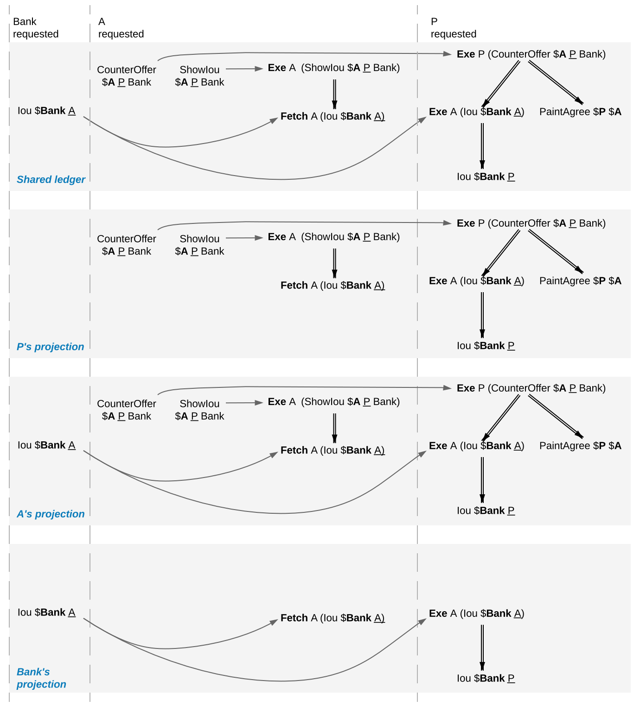
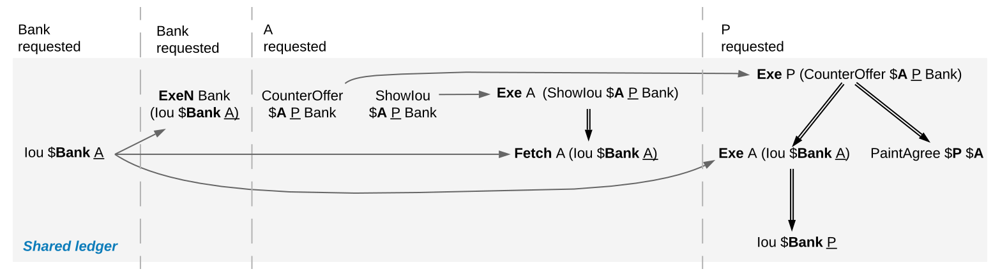
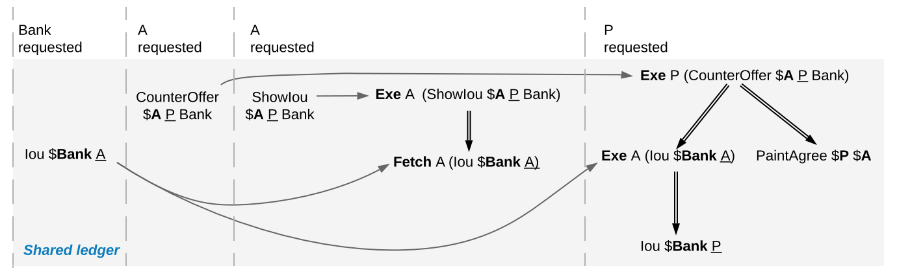
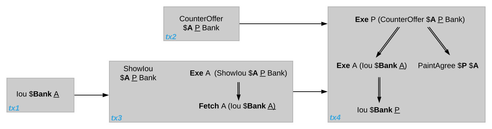
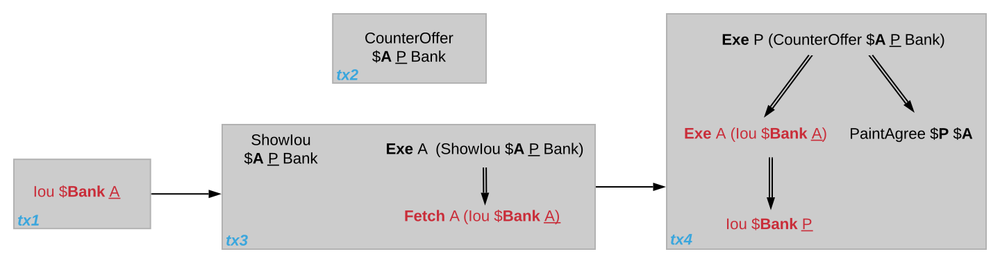
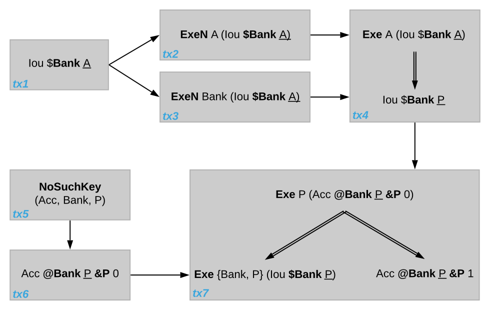
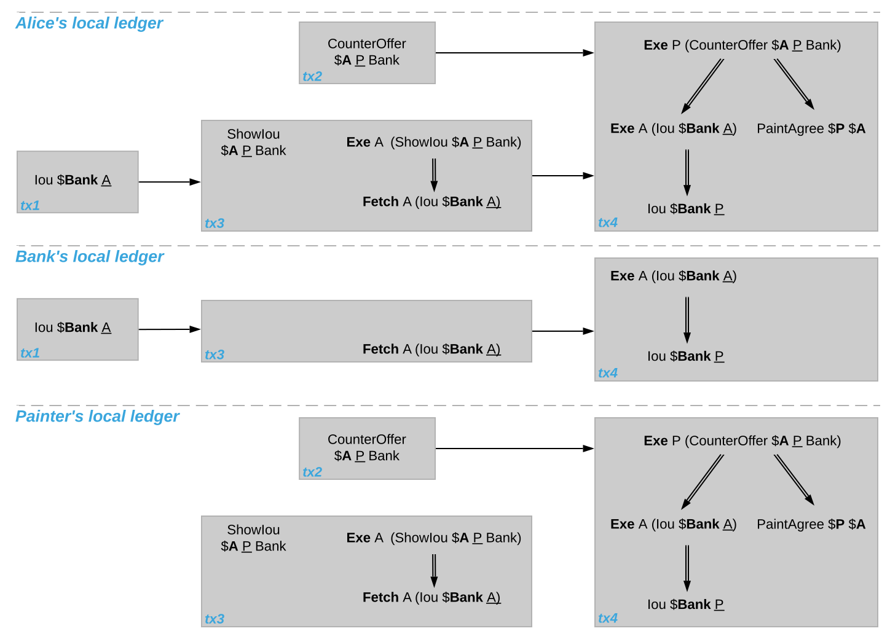

.. Copyright (c) 2022 Digital Asset (Switzerland) GmbH and/or its affiliates. All rights reserved.
.. SPDX-License-Identifier: Apache-2.0

.. _local-ledger:

Causality and Local Daml Ledgers
################################

Daml ledgers do not totally order all transactions.
So different parties may observe two transactions on different Participant Nodes in different orders via the :ref:`Ledger API <ledger-api-services>`.
Moreover, different Participant Nodes may output two transactions for the same party in different orders.
This document explains the ordering guarantees that Daml ledgers do provide, by :ref:`example <causality-examples>` and formally via the concept of :ref:`causality graphs <causality-graph>` and :ref:`local ledgers <local-ledger-structure>`.

The presentation assumes that you are familiar with the following concepts:

* The :ref:`Ledger API <ledger-api-services>`

* The :ref:`Daml Ledger Model <da-ledgers>`

.. _causality-examples:

Causality Examples
******************

A Daml Ledger need not totally order all transaction, unlike ledgers in the Daml Ledger Model.
The following examples illustrate these ordering guarantees of the Ledger API.
They are based on the paint counteroffer workflow from the Daml Ledger Model's :ref:`privacy section <da-model-privacy>`,
ignoring the total ordering coming from the Daml Ledger Model.
Recall that :ref:`the party projections <da-paint-counteroffer-example>` are as follows.

.. https://www.lucidchart.com/documents/edit/c4df0455-13ab-415f-b457-f5654c2684be

.. _causality-example-create-archive:

Stakeholders of a Contract See Creation and Archival in the Same Order
======================================================================

Every Daml Ledger orders the creation of the `CounterOffer A P Bank` before the painter exercising the consuming choice on the `CounterOffer`.
(If the **Create** was ordered after the **Exercise**, the resulting shared ledger would be inconsistent, which violates the validity guarantee of Daml ledgers.)
Accordingly, Alice will see the creation before the archival on her transaction stream and so will the painter.
This does not depend on whether they are hosted on the same Participant Node.

.. _causality-example-create-use-archive:

Signatories of a Contract and Stakeholder Actors See Usages After the Creation and Before the Archival
======================================================================================================

The `Fetch A (Iou Bank A)` action comes after the creation of the `Iou Bank A` and before its archival,
for both Alice and the Bank,
because the Bank is a signatory of the `Iou Bank A` contract and Alice is a stakeholder of the `Iou Bank A` contract and an actor on the **Fetch** action.

.. _causality-example-commit-atomic:

Commits Are Atomic
==================

Alice sees the **Create** of her `Iou` before the creation of the `CounterOffer`,
because the `CounterOffer` is created in the same commit as the **Fetch** of the `Iou`
and the **Fetch** commit comes after the **Create** of the `Iou`.

.. _causality-example-non-consuming:

Non-Consuming Usages in Different Commits May Appear in Different Orders
========================================================================

Suppose that the Bank exercises a non-consuming choice on the `Iou Bank A` without consequences while Alice creates the `CounterOffer`.
In the ledger shown below, the Bank's commit comes before Alice's commit.
   
.. https://app.lucidchart.com/documents/edit/1923969f-7bf2-45e0-a68d-6a0b2d308883/0_0
   

The Bank's projection contains the nonconsuming **Exercise** and the **Fetch** action on the `Iou`.
Yet, the **Fetch** may come before the non-consuming **Exercise** in the Bank's transaction tree stream.

.. _causality-example-out-of-band:

Out-of-Band Causality Is Not Respected
======================================

The following examples assume that Alice splits up her commit into two as follows:

.. https://www.lucidchart.com/documents/edit/05be08a6-7374-41f0-8b96-31276d2c5349/

.. _split-counteroffer-ledger:
   

   Counteroffer workflow with four commits.
   
Alice can specify in the `CounterOffer` the `Iou` that she wants to pay the painter with.
In a deployed implementation, Alice's application first observes the created `Iou` contract via the transaction service or active contract service before she requests to create the `CounterOffer`.
Such application logic does not induce an ordering between commits.
So the creation of the `CounterOffer` need not come after the creation of the `Iou`.

If Alice is hosted on several Participant Nodes, the Participant Nodes can therefore output the two creations in either order.
   
The rationale for this behaviour is that Alice could have learnt about the contract ID out of band or made it up.
The Participant Nodes therefore cannot know whether there will ever be a **Create** event for the contract.
So if Participant Nodes delayed outputting the **Create** action for the `CounterOffer` until a **Create** event for the `Iou` contract was published,
this delay might last forever and liveness is lost.
Daml ledgers therefore do not capture data flow through applications.

.. _causality-divulgence-example:

Divulged Actions Do Not Induce Order
====================================

The painter witnesses the fetching of Alice's `Iou` when the `ShowIou` contract is consumed.
The painter also witnesses the **Exercise** of the `Iou` when Alice exercises the transfer choice as a consequence of the painter accepting the `CounterOffer`.
However, as the painter is not a stakeholder of Alice's `Iou` contract, he may observe Alice's `ShowIou` commit after the archival of the `Iou` as part of accepting the `CounterOffer`.

In practice, this can happen in a setup where two Participant Nodes `N`:sub:`1` and `N`:sub:`2` host the painter.
He sees the divulged `Iou` and the created `CounterOffer` through `N`:sub:`1`\ 's transaction tree stream
and then submits the acceptance through `N`:sub:`1`.
Like in the previous example, `N`:sub:`2` does not know about the dependence of the two commits.
Accordingly, `N`:sub:`2` may output the accepting transaction *before* the `ShowIou` contract on the transaction stream.
      
Even though this may seem unexpected, it is in line with stakeholder-based ledgers:
Since the painter is not a stakeholder of the `Iou` contract, he should not care about the archivals or creates of the contract.
In fact, the divulged `Iou` contract shows up neither in the painter's active contract service nor in the flat transaction stream.
Such witnessed events are included in the transaction tree stream as a convenience:
They relieve the painter from computing the consequences of the choice and enable him to check that the action conforms to the Daml model.

Similarly, being an actor of an **Exercise** action induces order with respect to other uses of the contract only if the actor is a contract stakeholder.
This is because non-stakeholder actors of an **Exercise** action merely authorize the action, but they do not track whether the contract is active; this is what signatories and contract observers are for.
Analogously, choice observers of an **Exercise** action benefit from the ordering guarantees only if they are contract stakeholders.

.. _causality-example-depend-on-party:

The Ordering Guarantees Depend on the Party
===========================================

By the previous example, for the painter, fetching the `Iou` is not ordered before transferring the `Iou`.
For Alice, however, the **Fetch** must appear before the **Exercise** 
because Alice is a stakeholder on the `Iou` contract.
This shows that the ordering guarantees depend on the party.

.. _causality-graph:
   
Causality Graphs
****************

The above examples indicate that Daml ledgers order transactions only partially.
Daml ledgers can be represented as finite directed acyclic graphs (DAG) of transactions.

.. _def-causality-graph:

Definition »causality graph«
  A **causality graph** is a finite directed acyclic graph `G` of transactions that is transitively closed.
  Transitively closed means that whenever `v`:sub:`1` -> `v`:sub:`2` and `v`:sub:`2` -> `v`:sub:`3` are edges in `G`,
  then there is also an edge `v`:sub:`1` -> `v`:sub:`3` in `G`.

.. _def-action-order:

Definition »action order«
  For a causality graph `G`,
  the induced **action order** on the actions in the transactions combines the graph-induced order between transactions with the execution order of actions inside each transaction.
  It is the least partial order that includes the following ordering relations between two actions `act`:sub:`1` and `act`:sub:`2`:
  
  * `act`:sub:`1` and `act`:sub:`2` belong to the same transaction and `act`:sub:`1` precedes `act`:sub:`2` in the transaction.
  * `act`:sub:`1` and `act`:sub:`2` belong to different transactions in vertices `tx`:sub:`1` and `tx`:sub:`2` and there is a path in `G` from `tx`:sub:`1` to `tx`:sub:`2`.

    .. note::
       Checking for an *edge* instead of a *path* in `G` from `tx`:sub:`1` to `tx`:sub:`2` is equivalent
       because causality graphs are transitively closed.
       The definition uses *path* because the figures below omit transitive edges for readability.

The action order is a partial order on the actions in a causality graph.
For example, the following diagram shows such a causality graph for the ledger in the above :ref:`Out-of-band causality example <causality-example-out-of-band>`.
Each grey box represents one transaction and the graph edges are the solid arrows between the boxes.
Diagrams omit transitive edges for readability; in this graph the edge from `tx1` to `tx4` is not shown.
The **Create** action of Alice's `Iou` is ordered before the **Create** action of the `ShowIou` contract because there is an edge from the transaction `tx1` with the `Iou` **Create** to the transaction `tx3` with the `ShowIou` **Create**.
Moreover, the `ShowIou` **Create** action is ordered before the **Fetch** of Alice's `Iou` because the **Create** action precedes the **Fetch** action in the transaction.
In contrast, the **Create** actions of the `CounterOffer` and Alice's `Iou` are unordered: neither precedes the other because they belong to different transaction and there is no directed path between them.

.. https://app.lucidchart.com/documents/edit/44d97c43-1bb2-4d60-ac30-6b6048b5b5f5

.. _causality-graph-counteroffer-split:

   Causality graph for the :ref:`counteroffer workflow with four commits <split-counteroffer-ledger>`.

.. _causality-graph-consistency:

Consistency
===========

Consistency ensures that a causality graph sufficiently orders all the transactions.
It generalizes :ref:`ledger consistency <da-model-consistency>` from the Daml Ledger Model as :ref:`explained below <causality-consistency-ledger-model>`.

.. _def-causal-consistency-contract:

Definition »Causal consistency for a contract«
  Let `G` be a causality graph and `X` be a set of actions on a contract `c` that belong to transactions in `G`.
  The graph `G` is **causally consistent for the contract** `c` on `X` if all of the following hold:

  * If `X` is not empty, then `X` contains exactly one **Create** action.
    This action precedes all other actions in `X` in `G`\ 's action order.

  * If `X` contains a consuming **Exercise** action `act`, then `act` follows all actions in `X` other than `act` in `G`\ 's action order.

Definition »Causal consistency for a key«
  Let `G` be a causality graph and `X` be a set of actions on a key `k` that belong to transactions in `G`.
  The graph `G` is **causally consistent for the key** `k` on `X` if all of the following hold:

  * All **Create** and consuming **Exercise** actions in `X` are totally ordered in `G`\ 's action order
    and **Create**\ s and consuming **Exercise**\ s alternate, starting with **Create**.
    Every consecutive **Create**\ -**Exercise** pair acts on the same contract.

  * All **NoSuchKey** actions in `X` are action-ordered with respect to all **Create** and consuming **Exercise** actions in `X`.
    No **NoSuchKey** action is action-ordered between a **Create** action and its subsequent consuming **Exercise** action in `X`.

.. _def-consistency-causality-graph:
    
Definition »Consistency for a causality graph«
  Let `X` be a subset of the actions in a causality graph `G`.
  Then `G` is **consistent** on `X` (or `X`-**consistent**) if `G` is causally consistent for all contracts `c` on the set of actions on `c` in `X` and for all keys `k` on the set of actions on `k` in `X`.
  `G` is **consistent** if `G` is consistent on all the actions in `G`.

When edges are added to an `X`-consistent causality graph such that it remains acyclic and transitively closed,
the resulting graph is again `X`-consistent.
So it makes sense to consider minimal consistent causality graphs.

.. _minimal-consistent-causality-graph:

Definition »Minimal consistent causality graph«
  An `X`-consistent causality graph `G` is `X`\ -**minimal** if no strict subgraph of `G` (same vertices, fewer edges) is an `X`-consistent causality graph.
  If `X` is the set of all actions in `G`, then `X` is omitted.

For example, the :ref:`above causality graph for the split counteroffer workflow <causality-graph-counteroffer-split>` is consistent.
This causality graph is minimal, as the following analysis shows:

+----------------+--------------------------------------------------------------------------------------+
| Edge           | Justification                                                                        |
+================+======================================================================================+
| `tx1` -> `tx3` | Alice's `Iou` **Create** action of  must precede the **Fetch** action.               |
+----------------+--------------------------------------------------------------------------------------+
| `tx2` -> `tx4` | The `CounterOffer` **Create** action of  must precede the **Exercise** action.       |
+----------------+--------------------------------------------------------------------------------------+
| `tx3` -> `tx4` | The consuming **Exercise** action on Alice's `Iou` must follow the **Fetch** action. |
+----------------+--------------------------------------------------------------------------------------+

We can focus on parts of the causality graph by restricting the set `X`.
If `X` consists of the actions on `Iou` contracts, this causality graph is `X`\ -consistent.
Yet, it is not `X`\ -minimal since the edge `tx2` -> `tx4` can be removed without violating `X`\ -consistency: the edge is required only because of the `CounterOffer` actions, which are excluded from `X`.
The `X`\ -minimal consistent causality graph looks as follows, where the actions in `X` are highlighted in red.

.. https://app.lucidchart.com/documents/edit/4aa93018-bf32-42e1-98a1-3cc1943cdd36

.. _causality-counteroffer-Iou-minimal:
   

   Minimal consistent causality graph for the highlighted actions.

Another example of a minimal causality graph is shown below.
At the top, the transactions `tx1` to `tx4` create an `Iou` for Alice, exercise two non-consuming choices on it, and transfer the `Iou` to the painter.
At the bottom, `tx5` asserts that there is no key for an Account contract for the painter.
Then, `tx6` creates an such account with balance 0 and `tx7` deposits the painter's `Iou` from `tx4` into the account, updating the balance to 1.

.. https://app.lucidchart.com/documents/edit/b9d84f0f-e459-427c-86b8-c767662af326
   

Unlike in a linearly ordered ledger, the causality graph relates the transactions of the `Iou` transfer workflow with the `Account` creation workflow only at the end, when the `Iou` is deposited into the account.
As will be formalized below, the Bank, Alice, and the painter therefore need not observe the transactions `tx1` to `tx7` in the same order.

Moreover, transaction `tx2` and `tx3` are unordered in this causality graph even though they act on the same `Iou` contract.
However, as both actions are non-consuming, they do not interfere with each other and could therefore be parallelized, too.
Alice and the Bank accordingly may observe them in different orders.

The **NoSuchKey** action in `tx5` must be ordered with respect to the two Account **Create** actions in `tx6` and `tx7` and the consuming **Exercise** on the Account contract in `tx7`, by the key consistency conditions.
For this set of transactions, consistency allows only one such order: `tx5` comes before `tx6` because `tx7` is atomic: `tx5` cannot be interleaved with `tx7`, e.g., between the consuming **Exercise** of the `Acc Bank P P 0` and the **Create** of the updated account `Acc Bank P P 1`.

**NoSuchKey** actions are similar to non-consuming **Exercise**\ s and **Fetch**\ es of contracts when it comes to causal ordering: If there were another transaction `tx5'` with a **NoSuchKey** `(Acc, Bank, P)` action, then `tx5` and `tx5'` need not be ordered, just like `tx2` and `tx3` are unordered.

.. _causality-consistency-ledger-model:

From Causality Graphs to Ledgers
================================

Since causality graphs are acyclic, their vertices can be sorted topologically and the resulting list is again a causality graph, where every vertex has an outgoing edge to all later vertices.
If the original causality graph is `X`\ -consistent, then so is the topological sort, as topological sorting merely adds edges.
For example, the transactions on the :ref:`ledger <split-counteroffer-ledger>` in the :ref:`out-of-band causality example <causality-example-out-of-band>` are a topological sort of the :ref:`corresponding causality graph <causality-graph-counteroffer-split>`.

Conversely, we can reduce an `X`\ -consistent causality graph to only the causal dependencies that `X`\ -consistency imposes.
This gives a minimal `X`\ -consistent causality graph.

.. _def-reduction-causality-graph:

Definition »Reduction of a consistent causality graph«
  For an `X`\ -consistent causality graph `G`, there exists a unique minimal `X`\ -consistent causality graph `reduce`:sub:`X`\ `(G)` with the same vertices and the edges being a subset of `G`.
  `reduce`:sub:`X`\ `(G)` is called the `X`\ -**reduction** of `G`.
  As before, `X` is omitted if it contains all actions in `G`.

The causality graph for the split `CounterOffer` workflow is minimal and therefore its own reduction.
It is also the reduction of the topological sort, i.e., the :ref:`ledger <split-counteroffer-ledger>` in the :ref:`out-of-band causality example <causality-example-out-of-band>`.

.. note::
   The reduction `reduce`:sub:`X`\ `(G)` of an `X`\ -consistent causality graph `G` can be computed as follows:
   
   #. Set the vertices of `G'` to the vertices of `G`.
   #. The causal consistency conditions for contracts and keys demand that certain pairs of actions
      `act`:sub:`1` and `act`:sub:`2` in `X` must be action-ordered.
      For each such pair, determine the actions' ordering in `G` and add an edge to `G'` from the earlier action's transaction to the later action's transaction.
   #. `reduce`:sub:`X`\ `(G)` is the transitive closure of `G'`.

Topological sort and reduction link causality graphs `G` to the ledgers `L` from the Daml Ledger Model.
Topological sort transforms a causality graph `G` into a sequence of transactions; extending them with the requesters gives a sequence of commits, i.e., a ledger in the Daml Ledger Model.
Conversely, a sequence of commits `L` yields a causality graph `G`:sub:`L` by taking the transactions as vertices and adding an edge from `tx1` to `tx2` whenever `tx1`\ 's commit precedes `tx2`\ 's commit in the sequence.

There are now two consistency definitions:

* :ref:`Ledger Consistency <da-model-ledger-consistency>` according to Daml Ledger Model

* :ref:`Consistency of causality graph <def-consistency-causality-graph>`

Fortunately, the two definitions are equivalent:
If `G` is a consistent causality graph, then the topological sort is ledger consistent.
Conversely, if the sequence of commits `L` is ledger consistent, `G`:sub:`L` is a consistent causality graph, and so is the reduction `reduce(G`:sub:`L`\ `)`.

.. _local-ledger-structure:
   
Local Ledgers
*************

As explained in the Daml Ledger Model, parties see only a :ref:`projection <da-model-projections>` of the shared ledger for privacy reasons.
Like consistency, projection extends to causality graphs as follows.

Definition »Stakeholder informee«
  A party `P` is a **stakeholder informee** of an action `act` if all of the following holds:

  - `P` is an informee of `act`.
  - If `act` is an action on a contract then `P` is a stakeholder of the contract.

An **Exercise** and **Fetch** action acts on the input contract, a **Create** action on the created contract, and a **NoSuchKey** action does not act on a contract.
So for a **NoSuchKey** action, the stakeholder informees are the key maintainers.

Definition »Causal consistency for a party«
  A causality graph `G` is **consistent for a party** `P` (`P`\ -consistent) if `G` is consistent on all the actions that `P` is a stakeholder informee of.

The notions of `X`\ -minimality and `X`\ -reduction extend to parties accordingly.

For example, the :ref:`split counteroffer causality graph without the edge tx2 -> tx4 <causality-counteroffer-Iou-minimal>` is consistent for the Bank because the Bank is a stakeholder informee of exactly the highlighted actions.
It is also minimal Bank-consistent and the Bank-reduction of the :ref:`original split counteroffer causality graph <causality-graph-counteroffer-split>`.
  
Definition »Projection of a consistent causality graph«
  The **projection** `proj`:sub:`P`\ `(G)` of a consistent causality graph `G` to a party `P` is the `P`\ -reduction of the following causality graph `G'`:

  * The vertices of `G'` are the vertices of `G` projected to `P`, excluding empty projections.

  * There is an edge between two vertices `v`:sub:`1` and `v`:sub:`2` in `G'` if there is an edge from the `G`\ -vertex corresponding to `v`:sub:`1` to the `G`\ -vertex corresponding to `v`:sub:`2`.

For the :ref:`split counteroffer causality graph <causality-graph-counteroffer-split>`, the projections to Alice, the Bank, and the painter are as follows.

.. https://app.lucidchart.com/documents/edit/65a83eba-9b09-4003-b824-8e7bec50ce10

.. _counteroffer-causality-projections:
   

   Projections of the :ref:`split counteroffer causality graph <causality-graph-counteroffer-split>`.

Alice's projection is the same as the original minimal causality graph.
The Bank sees only actions on `Iou` contracts, so the causality graph projection does not contain `tx2` any more.
Similarly, the painter is not aware of `tx1`, where Alice's `Iou` is created.
Moreover, there is no longer an edge from `tx3` to `tx4` in the painter's local ledger.
This is because the edge is induced by the **Fetch** of Alice's `Iou` preceding the consuming **Exercise**.
However, the painter is not an informee of those two actions; he merely witnesses the **Fetch** and **Exercise** actions as part of divulgence.
Therefore no ordering is required from the painter's point of view.
This difference explains the :ref:`divulgence causality example <causality-divulgence-example>`.

.. _ordering-guarantees:

Ledger API Ordering Guarantees
==============================

The :ref:`Transaction Service <transaction-service>` provides the updates as a stream of Daml transactions
and the :ref:`Active Contract Service <active-contract-service>` summarizes all the updates up to a given point
by the contracts that are active at this point.
Conceptually, both services are derived from the local ledger that the Participant Node manages for each hosted party.
That is, the transaction tree stream for a party is a topological sort of the party's local ledger.
The flat transaction stream contains precisely the ``CreatedEvent``\ s and ``ArchivedEvent``\ s
that correspond to **Create** and consuming **Exercise** actions in transaction trees on the transaction tree stream where the party is a stakeholder of the affected contract.

.. note::
   The transaction trees of the :ref:`Transaction Service <transaction-service>` omit **Fetch** and **NoSuchKey** actions
   that are part of the transactions in the local ledger.
   The **Fetch** and **NoSuchKey** actions are thus removed before the :ref:`Transaction Service <transaction-service>` outputs the transaction trees.

Similarly, the active contract service provides the set of contracts that are active at the returned offset according to the Transaction Service streams.
That is, the contract state changes of all events from the transaction event stream are taken into account in the provided set of contracts.
In particular, an application can process all subsequent events from the flat transaction stream or the transaction tree stream without having to take events before the snapshot into account.
   
Since the topological sort of a local ledger is not unique, different Participant Nodes may pick different orders for the transaction streams of the same party.
Similarly, the transaction streams for different parties may order common transactions differently, as the party's local ledgers impose different ordering constraints.
Nevertheless, Daml ledgers ensure that all local ledgers are projections of a virtual shared causality graph that connects to the Daml Ledger Model as described above.
The ledger validity guarantees therefore extend via the local ledgers to the Ledger API.
These guarantees are subject to the deployed Daml ledger's trust assumptions.

.. note::
   The virtual shared causality graph exists only as a concept, to reason about Daml ledger guarantees.
   A deployed Daml ledger in general does not store or even construct such a shared causality graph.
   The Participant Nodes merely maintain the local ledgers for their parties.
   They synchronize these local ledgers to the extent that they remain consistent.
   That is, all the local ledgers can in theory be combined into a consistent single causality graph of which they are projections.

Explaining the Causality Examples
=================================

The :ref:`causality examples <causality-examples>` can be explained in terms of causality graphs and local ledgers as follows:

#. :ref:`causality-example-create-archive`
   Causal consistency for the contract requires that the **Create** comes before the consuming **Exercise** action on the contract.
   As all stakeholders are informees on **Create** and consuming **Exercise** actions of their contracts,
   the stakeholder's local ledgers impose this order on the actions.

#. :ref:`causality-example-create-use-archive`
   Causal consistency for the contract requires that the **Create** comes before the non-consuming **Exercise** and **Fetch** actions of a contract and that consuming **Exercise**\ s follow them.
   Since signatories and stakeholder actors are informees of **Create**, **Exercise**, and **Fetch** actions,
   the stakeholder's local ledgers impose this order on the actions.

#. :ref:`causality-example-commit-atomic`
   Local ledgers are DAGs of (projected) transactions.
   Topologically sorting such a DAG cannot interleave one transaction with another, even if the transaction consists of several top-level actions.

#. :ref:`causality-example-non-consuming`
   Causal consistency does not require ordering between non-consuming usages of a contract.
   As there is no other action in the transaction that would prescribe an ordering,
   the Participant Nodes can output them in any order.

#. :ref:`causality-example-out-of-band`
   Out-of-band data flow is not captured by causal consistency and therefore does not induce ordering.

#. :ref:`causality-divulgence-example`
   The painter is not an informee of the **Fetch** and **Exercise** actions on Alice's `Iou`;
   he merely witnesses them.
   The :ref:`painter's local ledger <counteroffer-causality-projections>` therefore does not order `tx3` before `tx4`.
   So the painter's transaction stream can output `tx4` before `tx3`.

#. :ref:`causality-example-depend-on-party`
   Alice is an informee of the **Fetch** and **Exercise** actions on her `Iou`.
   Unlike for the painter, :ref:`her local ledger <counteroffer-causality-projections>` does order `tx3` before `tx4`,
   so Alice is guaranteed to observe `tx3` before `tx4` on all Participant Nodes through which she is connect to the Daml ledger.
